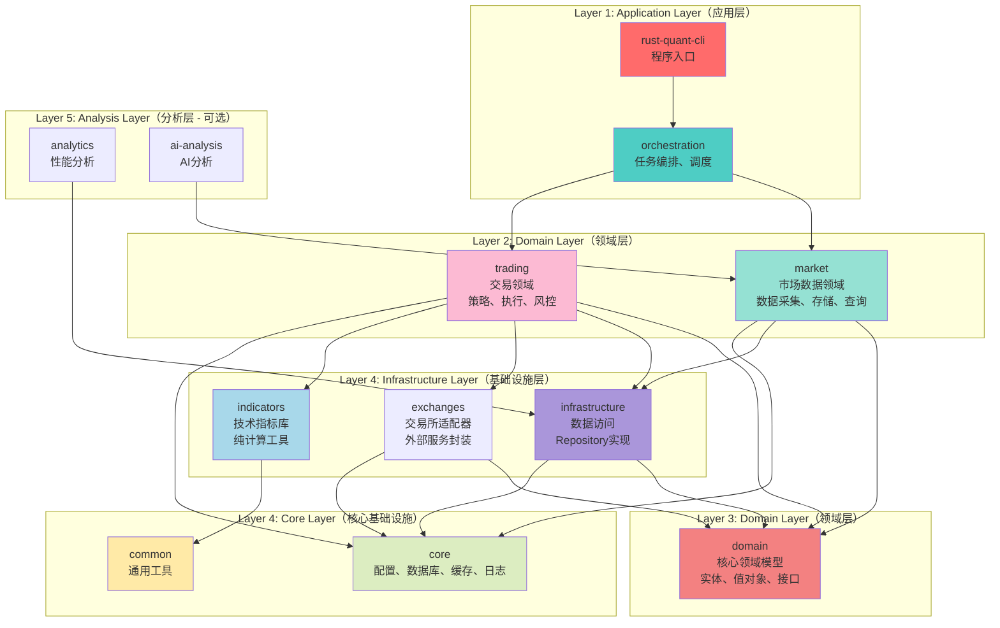
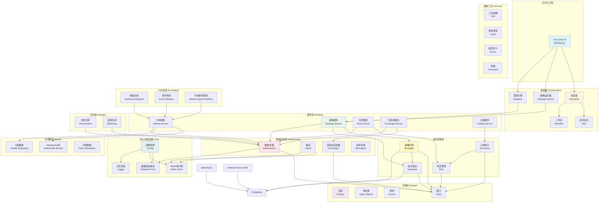
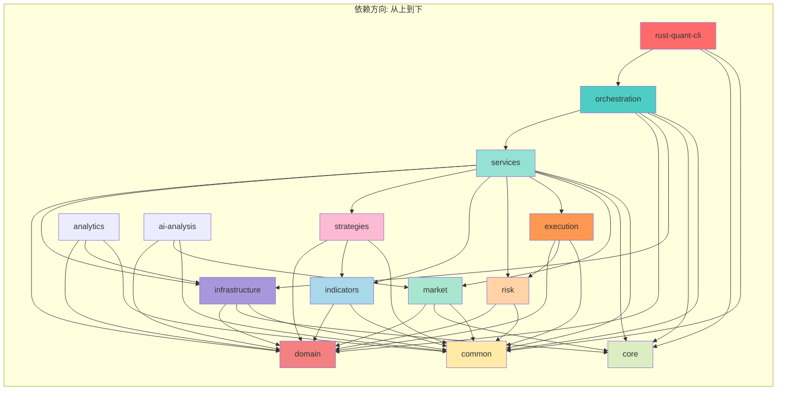
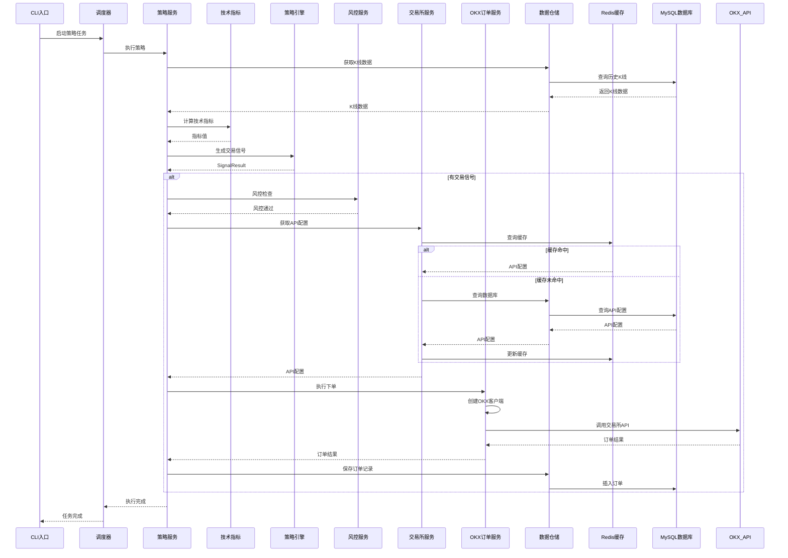
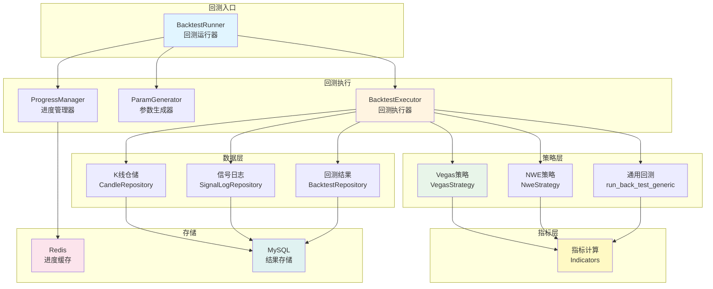
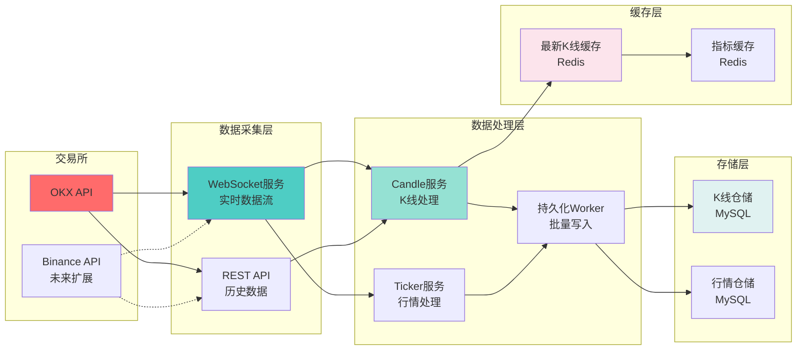
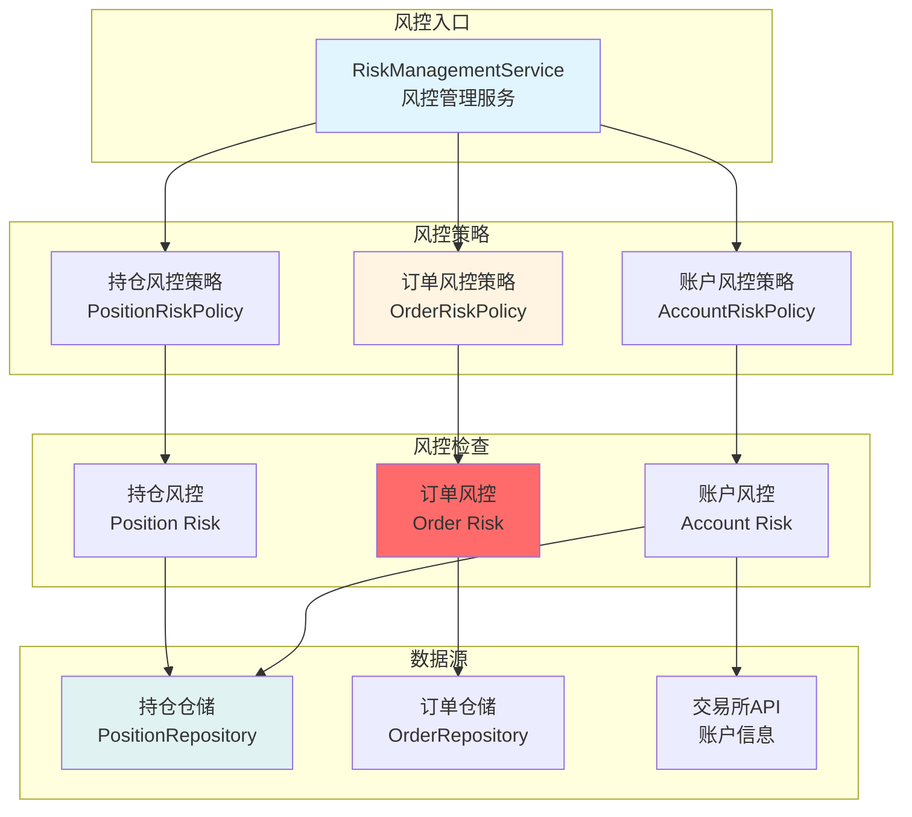
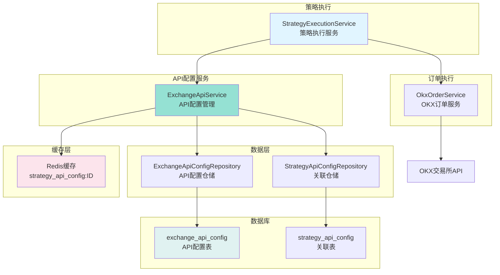

# Rust Quant 系统架构图

> **⚠️ 架构重构中**  
> 当前架构存在职责不清、依赖混乱的问题，正在重构中。  
> 详见：[架构重构方案](./ARCHITECTURE_REDESIGN.md)

## 0. 理想架构（目标）



**关键改进**：
1. **领域分离**：`market`（市场数据）和 `trading`（交易）是两个独立领域
2. **技术指标降级**：`indicators` 从业务层降级为基础设施层（纯计算工具）
3. **交易领域整合**：`strategies`、`risk`、`execution` 合并到 `trading` 领域
4. **依赖清晰**：Application → Domain → Infrastructure → Core

---

## 1. 当前架构（待重构）



## 2. 模块依赖关系图



## 3. 策略执行数据流



## 4. 回测系统架构



## 5. 市场数据流架构



## 6. 风控系统架构



## 7. 交易所API配置系统



## 8. 核心模块职责说明

### 8.1 分层职责

| 层级 | 包名 | 职责 | 依赖方向 |
|------|------|------|----------|
| **入口层** | `rust-quant-cli` | 程序入口、命令行参数解析 | → orchestration |
| **编排层** | `orchestration` | 任务调度、工作流编排、事件驱动 | → services |
| **服务层** | `services` | 业务流程协调、事务管理 | → domain + infrastructure |
| **领域层** | `domain` | 业务实体、值对象、接口定义 | 无外部依赖 |
| **业务逻辑层** | `strategies`<br/>`indicators`<br/>`risk`<br/>`execution` | 策略实现、指标计算、风控逻辑、订单执行 | → domain |
| **基础设施层** | `infrastructure` | Repository实现、缓存、交易所适配器 | → domain |
| **核心层** | `core` | 配置、数据库连接池、Redis客户端、日志 | → common |
| **通用层** | `common` | 工具函数、通用类型、常量 | 无业务依赖 |
| **市场数据层** | `market` | WebSocket流、K线数据、行情数据 | → domain + core |
| **分析层** | `analytics` | 性能分析、报表生成 | → infrastructure |
| **AI分析层** | `ai-analysis` | 情绪分析、事件检测、影响预测 | → market |

### 8.2 关键模块

#### Domain（领域层）
- **entities/**: `Order`, `Position`, `StrategyConfig`, `Candle`, `ExchangeApiConfig`
- **value_objects/**: `Price`, `Volume`, `Signal`, `Leverage`, `Percentage`
- **enums/**: `OrderSide`, `OrderStatus`, `StrategyType`, `Timeframe`
- **traits/**: `CandleRepository`, `OrderRepository`, `Strategy`, `ExchangeAccount`

#### Services（服务层）
- **strategy/**: `StrategyExecutionService`, `StrategyConfigService`
- **exchange/**: `ExchangeApiService`, `OkxOrderService`
- **risk/**: `RiskManagementService`
- **market/**: `CandleService`, `TickerService`
- **trading/**: `OrderCreationService`

#### Infrastructure（基础设施层）
- **repositories/**: `SqlxCandleRepository`, `SqlxOrderRepository`, `SqlxStrategyConfigRepository`
- **cache/**: `RedisCache`, `InMemoryCache`, `TwoLevelCache`
- **exchanges/**: `OkxAdapter`, `ExchangeFactory`

#### Strategies（策略层）
- **framework/**: 策略框架、通用回测逻辑
- **implementations/**: Vegas、NWE等具体策略实现
- **backtesting/**: 回测引擎

#### Indicators（指标层）
- **trend/**: EMA, SMA, Vegas, NWE
- **momentum/**: MACD, RSI, KDJ
- **volatility/**: ATR, Bollinger Bands
- **volume/**: Volume Indicator
- **pattern/**: Support/Resistance, Market Structure

## 9. 数据流向

### 9.1 策略执行流程
```
CLI → Orchestration → Services → Strategies → Indicators → Domain
                                                      ↓
                                              Infrastructure → Database
```

### 9.2 市场数据流程
```
Exchange API → WebSocket → Market Service → Cache (Redis) → Repository → Database (MySQL)
```

### 9.3 订单执行流程
```
Strategy Signal → Risk Check → Exchange Service → API Config (Redis) → OKX API → Order Result → Database
```

## 10. 技术栈

- **语言**: Rust
- **异步运行时**: Tokio
- **数据库**: MySQL (sqlx)
- **缓存**: Redis
- **日志**: tracing
- **配置**: TOML
- **交易所SDK**: okx (自定义)
- **WebSocket**: tokio-tungstenite

