# 🎨 Rust Quant 架构图 - Mermaid 版本

## 目录
1. [整体架构分层图](#1-整体架构分层图)
2. [包依赖关系图](#2-包依赖关系图)
3. [DDD分层架构](#3-ddd分层架构)
4. [策略执行流程](#4-策略执行流程)
5. [数据流图](#5-数据流图)
6. [技术栈架构](#6-技术栈架构)

---

## 1. 整体架构分层图

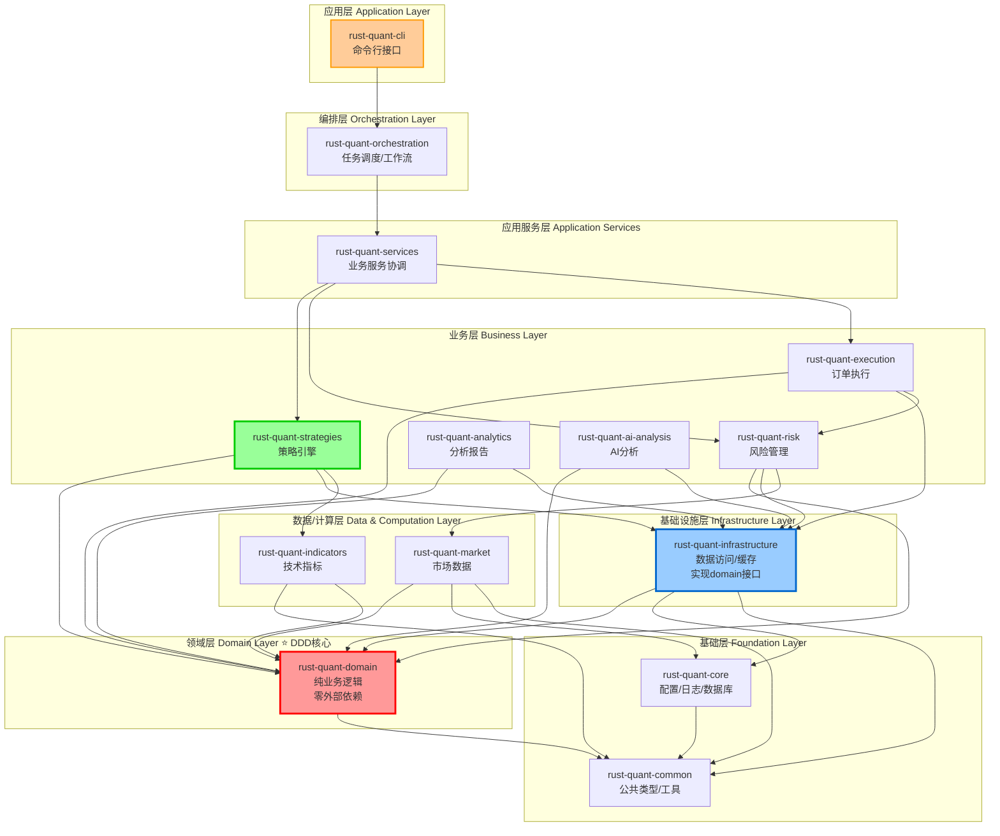

---

## 2. 包依赖关系图

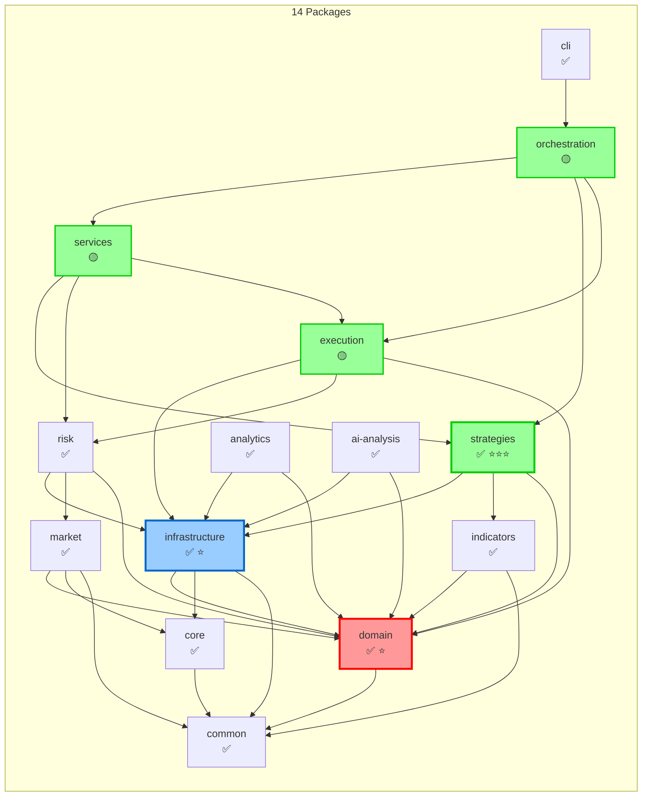

**图例**:
- ✅ = 编译通过 (14个，100% ⭐⭐⭐⭐⭐)
- ⭐ = DDD核心
- ⭐⭐⭐ = 本次重构重点

---

## 3. DDD分层架构

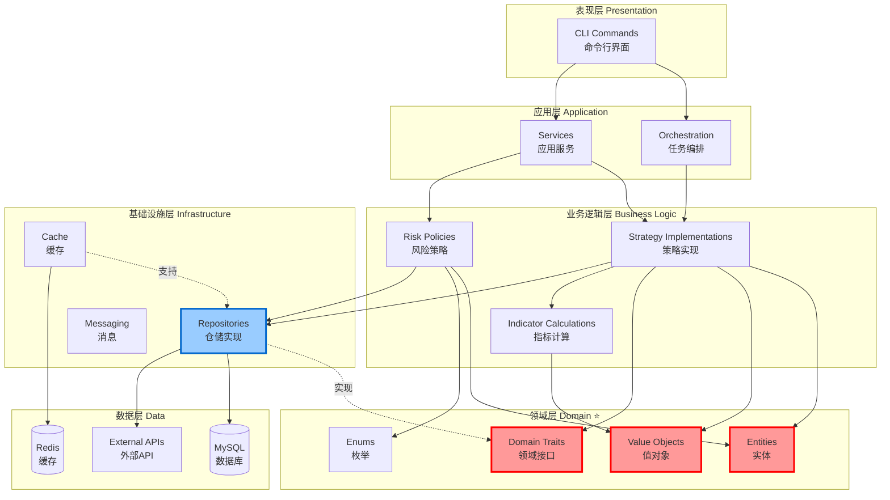

---

## 4. 策略执行流程

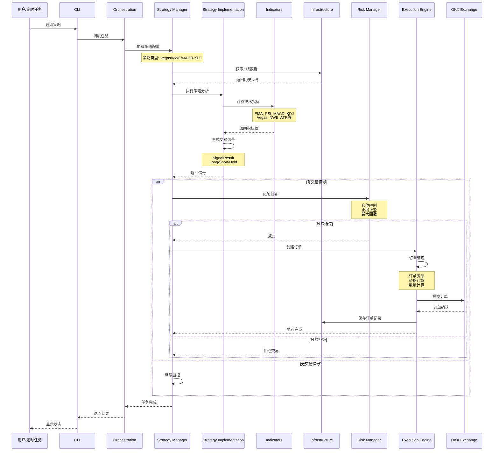

---

## 5. 数据流图

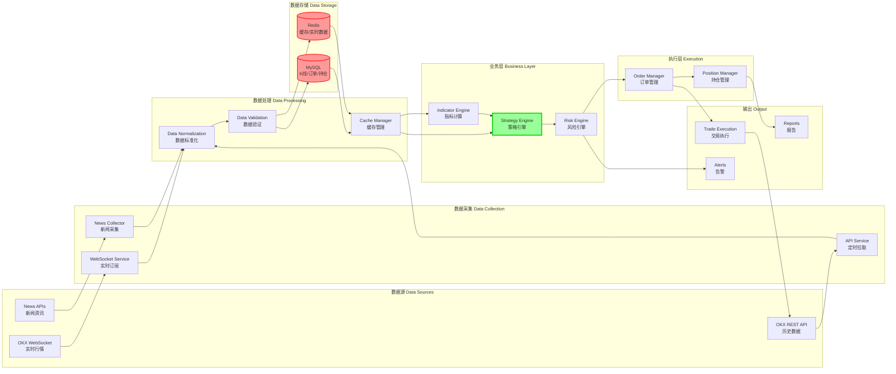

---

## 6. 技术栈架构

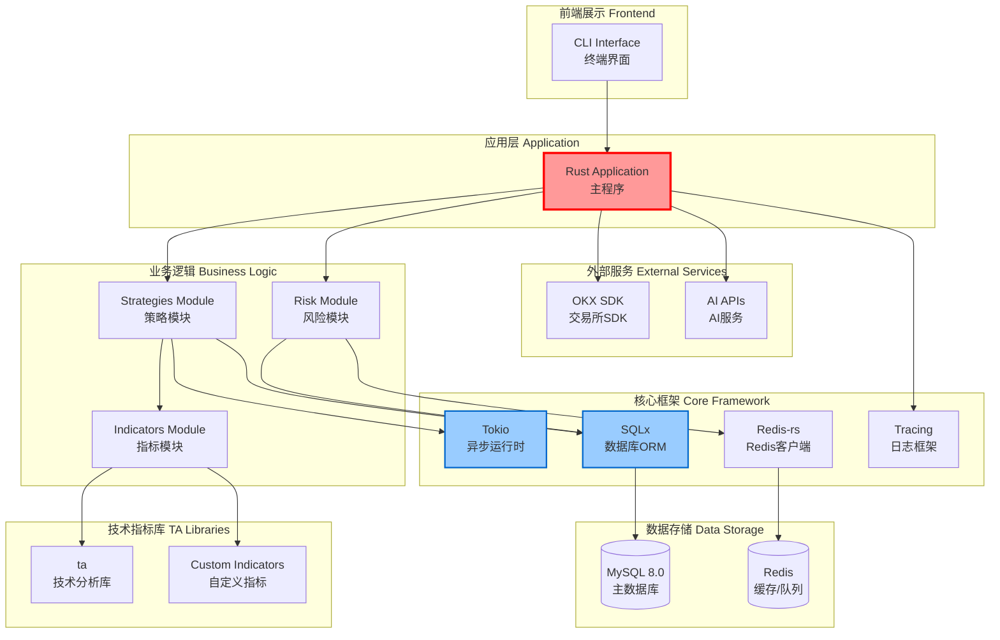

---

## 7. 核心模块详细结构

### 7.1 Strategies 包内部结构

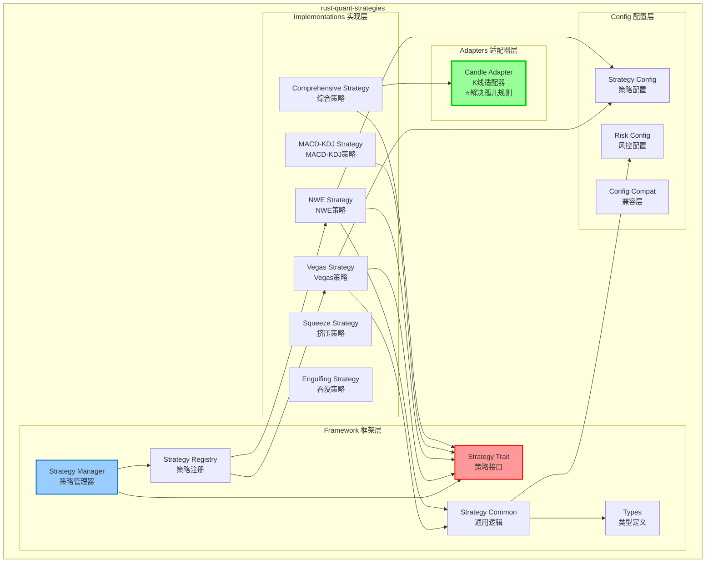

### 7.2 Indicators 包内部结构

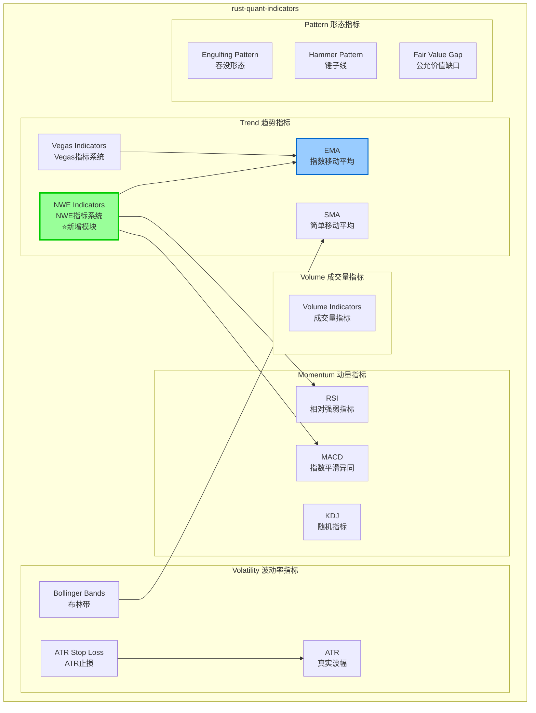

### 7.3 Infrastructure 包内部结构

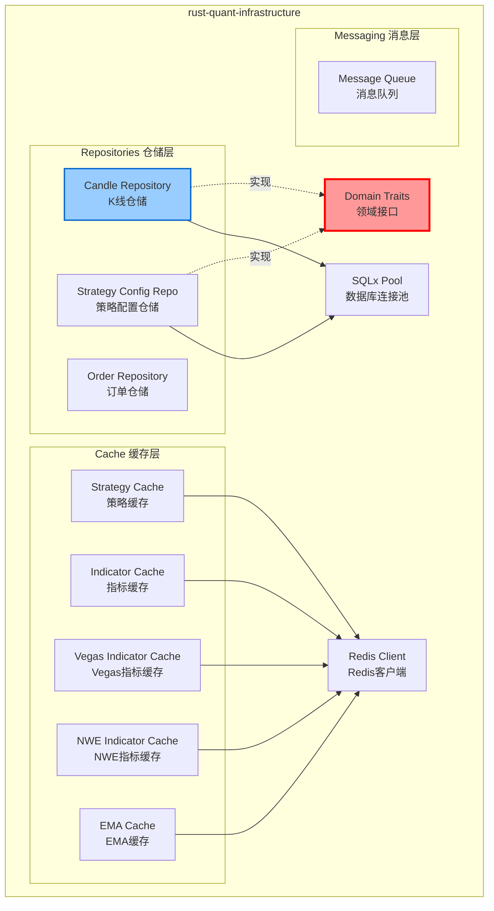

---

## 8. 回测流程

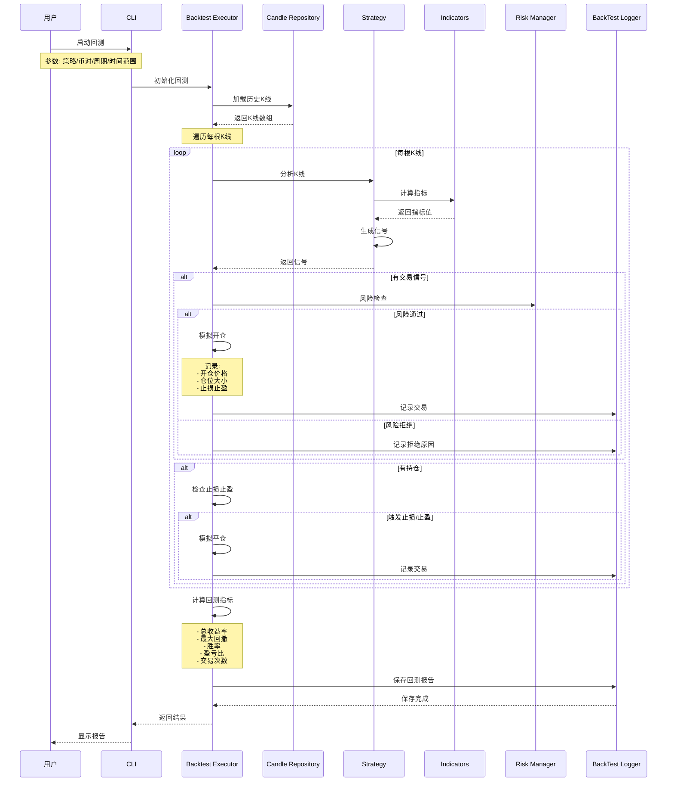

---

## 9. 风险管理流程

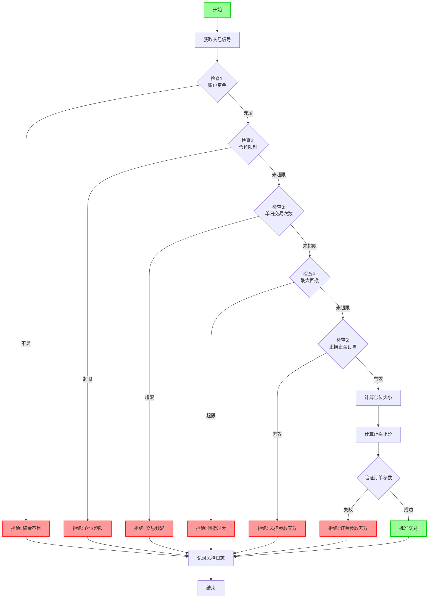

---

## 10. 适配器模式（解决孤儿规则）

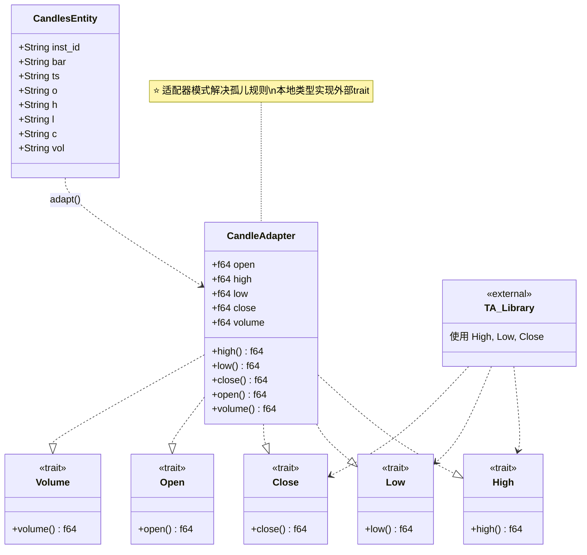

---

## 11. 配置管理流程

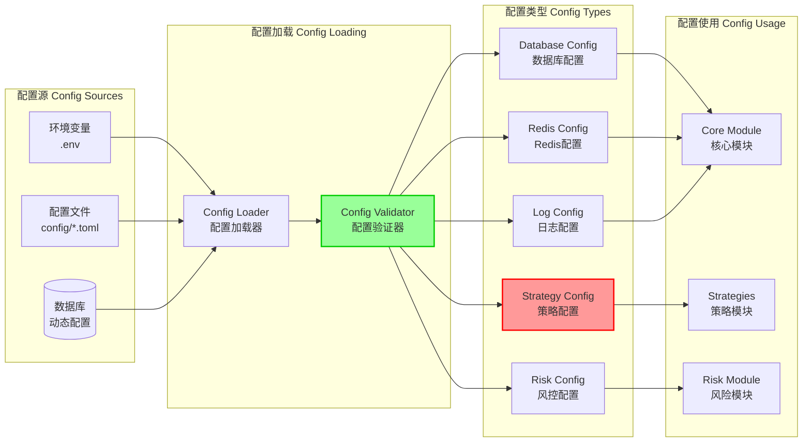

---

## 使用说明

### 如何使用这些图表

1. **在线查看**: 
   - GitHub、GitLab 会自动渲染 Mermaid 图
   - VS Code 安装 Mermaid 插件

2. **导出图片**:
   ```bash
   # 使用 mermaid-cli
   npm install -g @mermaid-js/mermaid-cli
   mmdc -i ARCHITECTURE_DIAGRAMS.md -o architecture.png
   ```

3. **在线编辑**:
   - https://mermaid.live/
   - 复制代码在线编辑和导出

### 图表说明

| 图表 | 用途 | 受众 |
|------|------|------|
| 整体架构分层图 | 了解系统整体结构 | 所有人 |
| 包依赖关系图 | 了解包之间依赖 | 开发者 |
| DDD分层架构 | 了解DDD设计 | 架构师 |
| 策略执行流程 | 了解业务流程 | 开发者/运维 |
| 数据流图 | 了解数据流向 | 开发者 |
| 技术栈架构 | 了解技术选型 | 架构师 |
| 回测流程 | 了解回测机制 | 量化研究员 |
| 风险管理流程 | 了解风控逻辑 | 风控人员 |
| 适配器模式 | 了解设计模式 | 开发者 |

---

## 架构特点总结

### ✅ 优点

1. **清晰的分层**
   - 单向依赖
   - 职责明确
   - 易于理解

2. **DDD设计**
   - domain 零外部依赖
   - infrastructure 实现接口
   - 符合Clean Architecture

3. **适配器模式**
   - 解决孤儿规则
   - 标准解决方案
   - 可复用设计

4. **可扩展性**
   - 策略可插拔
   - 指标可复用
   - 风控可配置

5. **高性能**
   - 异步IO (Tokio)
   - Redis缓存
   - 连接池管理

### 🎯 设计原则

- ✅ 单一职责 (SRP)
- ✅ 开闭原则 (OCP)
- ✅ 依赖倒置 (DIP)
- ✅ 接口隔离 (ISP)
- ✅ DRY (Don't Repeat Yourself)

---

**Rust Quant v0.3.0 - 架构可视化** 🎨

*更新时间: 2025-11-07*

