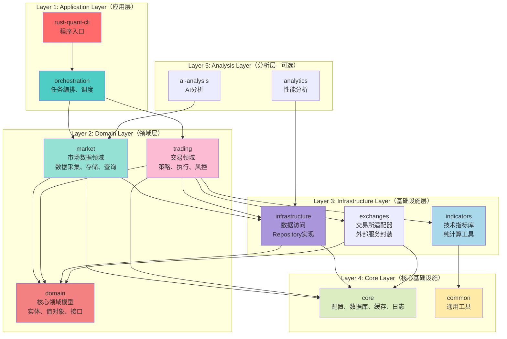
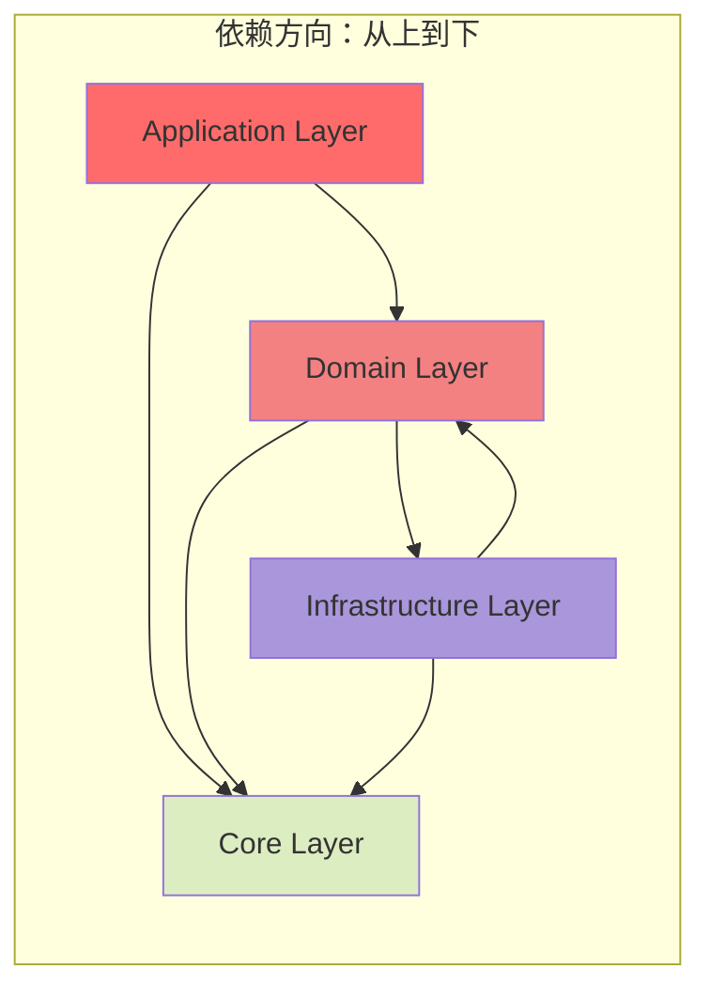

# Rust Quant 架构重构方案

## 🔍 当前架构问题分析

### 问题1：分层混乱，职责不清

**现状**：14个包，边界模糊
- `market` 是数据层还是业务层？
- `indicators` 是工具库还是业务逻辑？
- `services` 层职责模糊（协调 vs 业务逻辑）
- `strategies`、`risk`、`execution` 都是业务逻辑，但关系不清晰

**影响**：
- 新功能不知道放哪里
- 依赖方向混乱
- 代码重复

### 问题2：职责重叠

| 模块 | 重叠内容 |
|------|---------|
| `execution` vs `services/trading` | 订单执行逻辑 |
| `risk` vs `services/risk` | 风控逻辑 |
| `orchestration` vs `services` | 业务流程协调 |

### 问题3：依赖方向混乱

```
❌ 错误示例：
strategies → infrastructure  (业务逻辑依赖基础设施)
indicators → strategies      (工具依赖业务)
market → infrastructure      (领域依赖基础设施)
```

### 问题4：命名不一致

- 领域概念：`market`, `risk`
- 技术概念：`infrastructure`, `orchestration`
- 混合概念：`services`（既有领域服务，又有应用服务）

---

## 🎯 理想架构设计（五层架构）

### 核心原则

1. **领域驱动设计（DDD）**：以业务领域为核心
2. **清洁架构（Clean Architecture）**：依赖倒置，内层不依赖外层
3. **单一职责**：每个包只有一个明确的职责
4. **依赖方向清晰**：Application → Domain → Infrastructure → Core

### 架构图



### 详细设计

#### Layer 1: Application Layer（应用层）

**职责**：程序入口、任务编排、调度

| 包名 | 职责 | 依赖 |
|------|------|------|
| `rust-quant-cli` | 程序入口、命令行参数解析 | → orchestration, core |
| `orchestration` | 任务调度、工作流编排、事件驱动 | → domain, market, trading |

**关键原则**：
- 只做编排，不包含业务逻辑
- 调用领域服务，不直接操作数据

---

#### Layer 2: Domain Layer（领域层）

**职责**：业务领域模型和服务

##### 2.1 `domain` - 核心领域模型

**职责**：
- 实体（Entities）：`Order`, `Position`, `StrategyConfig`, `Candle`
- 值对象（Value Objects）：`Price`, `Volume`, `Signal`, `Leverage`
- 领域接口（Traits）：`CandleRepository`, `OrderRepository`, `Strategy`
- 枚举（Enums）：`OrderSide`, `OrderStatus`, `StrategyType`

**关键原则**：
- ✅ 零外部依赖（不依赖 sqlx, redis, tokio）
- ✅ 纯业务逻辑
- ✅ 可独立测试

##### 2.2 `market` - 市场数据领域

**职责**：
- 市场数据采集（WebSocket、REST API）
- 数据存储和查询
- 数据流管理

**内部结构**：
```
market/
├── domain/          # 市场数据领域模型
│   ├── entities/   # Candle, Ticker
│   └── services/    # CandleService, TickerService
├── infrastructure/  # 数据访问实现
│   └── repositories/
└── streams/         # WebSocket流
```

**关键原则**：
- 依赖 `domain` 核心模型
- 实现 `domain` 中定义的接口
- 不依赖 `trading` 领域

##### 2.3 `trading` - 交易领域

**职责**：
- 交易策略（Strategy）
- 订单执行（Execution）
- 风险管理（Risk）

**内部结构**：
```
trading/
├── domain/              # 交易领域模型
│   ├── entities/       # Strategy, Order, Position
│   ├── services/       # StrategyService, ExecutionService, RiskService
│   └── strategies/     # 具体策略实现（Vegas, NWE）
├── indicators/         # 技术指标（从indicators包迁移）
└── backtesting/        # 回测引擎
```

**关键原则**：
- 依赖 `domain` 和 `market`
- 不依赖 `infrastructure`（通过接口）
- 策略、执行、风控在同一领域内

---

#### Layer 3: Infrastructure Layer（基础设施层）

**职责**：技术实现、外部服务适配

##### 3.1 `infrastructure` - 数据访问

**职责**：
- Repository实现（`SqlxCandleRepository`, `SqlxOrderRepository`）
- 缓存实现（Redis, InMemory）
- 消息传递（Event Bus）

**关键原则**：
- 实现 `domain` 中定义的接口
- 可替换（MySQL → PostgreSQL）

##### 3.2 `indicators` - 技术指标库

**职责**：
- 纯计算函数（EMA, MACD, RSI等）
- 无业务逻辑
- 无状态

**关键原则**：
- ✅ 纯函数，无副作用
- ✅ 不依赖业务领域
- ✅ 可独立测试

##### 3.3 `exchanges` - 交易所适配器

**职责**：
- 交易所API封装（OKX, Binance等）
- 统一接口抽象
- 错误处理

**关键原则**：
- 实现 `domain` 中定义的 `ExchangeAccount` 接口
- 隐藏交易所特定实现

---

#### Layer 4: Core Layer（核心基础设施）

**职责**：配置、数据库、缓存、日志

| 包名 | 职责 |
|------|------|
| `core` | 配置管理、数据库连接池、Redis客户端、日志系统 |
| `common` | 工具函数、通用类型、常量 |

**关键原则**：
- 无业务逻辑
- 被所有层依赖

---

#### Layer 5: Analysis Layer（分析层）

**职责**：性能分析、AI分析

| 包名 | 职责 | 依赖 |
|------|------|------|
| `analytics` | 性能分析、报表生成 | → infrastructure |
| `ai-analysis` | 情绪分析、事件检测 | → market |

---

## 📊 依赖关系图



### 依赖规则

1. **Application → Domain**：应用层调用领域服务
2. **Domain → Infrastructure（接口）**：领域层定义接口，基础设施层实现
3. **Infrastructure → Core**：基础设施层使用核心工具
4. **禁止反向依赖**：内层不依赖外层

---

## 🔄 渐进式重构路线图

### Phase 1: 明确职责边界（1-2周）

**目标**：不改变代码结构，只明确职责

**行动**：
1. ✅ 编写架构文档，明确各层职责
2. ✅ 规范依赖方向，添加依赖检查
3. ✅ 统一命名规范

**产出**：
- 架构文档
- 依赖规则文档
- 代码放置规范

---

### Phase 2: 合并重叠模块（2-3周）

**目标**：消除职责重叠

**行动**：
1. 合并 `services/trading` → `execution`
2. 合并 `services/risk` → `risk`
3. 明确 `services` 层职责：只做业务流程协调

**影响**：
- 减少代码重复
- 职责更清晰

---

### Phase 3: 重构领域层（3-4周）

**目标**：建立清晰的领域边界

**行动**：
1. 将 `strategies`、`risk`、`execution` 合并到 `trading` 领域
2. 将 `indicators` 移到 `infrastructure` 层
3. 重构 `market` 领域，明确边界

**影响**：
- 领域边界清晰
- 依赖方向正确

---

### Phase 4: 优化基础设施层（1-2周）

**目标**：统一基础设施实现

**行动**：
1. 统一 Repository 实现模式
2. 统一缓存接口
3. 统一错误处理

**影响**：
- 代码一致性提升
- 可维护性提升

---

## 📋 当前架构 vs 理想架构对比

| 当前架构 | 理想架构 | 变化 |
|---------|---------|------|
| `services` | 保留，但职责明确 | 只做业务流程协调 |
| `strategies` | → `trading/strategies` | 合并到交易领域 |
| `risk` | → `trading/risk` | 合并到交易领域 |
| `execution` | → `trading/execution` | 合并到交易领域 |
| `indicators` | → `infrastructure/indicators` | 降级为基础设施 |
| `market` | 保留 | 明确为市场数据领域 |
| `domain` | 保留 | 核心领域模型 |
| `infrastructure` | 保留 | 数据访问实现 |
| `core` | 保留 | 核心基础设施 |
| `common` | 保留 | 通用工具 |
| `orchestration` | 保留 | 任务编排 |
| `analytics` | 保留 | 性能分析 |
| `ai-analysis` | 保留 | AI分析 |

---

## 🎯 立即行动方案（当前架构优化）

### 1. 明确各层职责文档

创建 `docs/LAYER_RESPONSIBILITIES.md`，明确：
- 每层的职责
- 每层的禁止事项
- 代码放置决策树

### 2. 依赖检查工具

创建 `scripts/check_dependencies.sh`，检查：
- 禁止的依赖关系
- 循环依赖

### 3. 统一命名规范

- 实体：`Xxx`（如 `Order`）
- 服务：`XxxService`（如 `OrderService`）
- Repository：`SqlxXxxRepository`（如 `SqlxOrderRepository`）
- 接口：`XxxRepository`（如 `OrderRepository`）

### 4. 代码审查清单

在 PR 中添加检查项：
- [ ] 代码放在正确的层？
- [ ] 依赖方向正确？
- [ ] 命名符合规范？
- [ ] 职责单一？

---

## 📝 总结

### 核心问题
1. **分层混乱**：14个包，职责不清
2. **职责重叠**：多个包做同样的事
3. **依赖混乱**：依赖方向不清晰

### 解决方案
1. **五层架构**：Application → Domain → Infrastructure → Core → Analysis
2. **领域模块化**：`market` 和 `trading` 两个独立领域
3. **渐进式重构**：分4个阶段，逐步优化

### 立即行动
1. 明确职责边界
2. 规范依赖方向
3. 统一命名规范
4. 添加代码审查清单

---

## 🔗 相关文档

- [架构图](./ARCHITECTURE_DIAGRAM.md)
- [代码放置规范](../.windsurf/rules/rustquant.md)
- [启动指南](./STARTUP_GUIDE.md)


