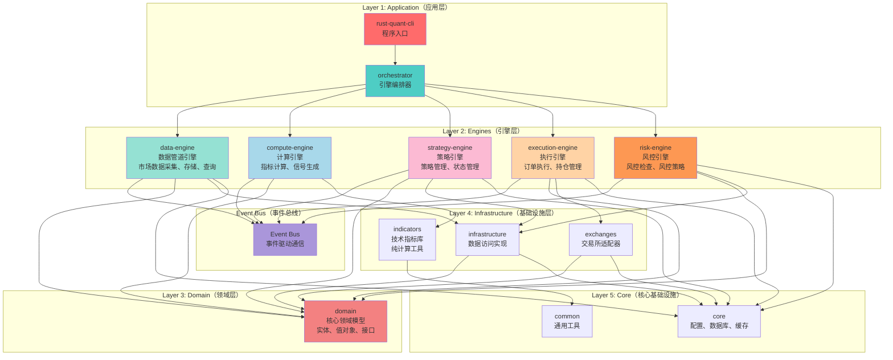

# Rust Quant 终极架构方案

## 🔍 深度分析：量化交易系统的本质

### 系统核心特征

1. **数据驱动**：系统本质是数据流处理
   ```
   市场数据 → 指标计算 → 信号生成 → 订单执行 → 持仓管理
   ```

2. **策略独立性**：每个策略应该是独立的、可插拔的模块
   - 策略有自己的配置、状态、生命周期
   - 策略可以独立开发、测试、回测

3. **实时性要求**：需要处理实时数据流和异步事件
   - WebSocket数据流
   - 异步策略执行
   - 异步订单执行

4. **回测与实盘统一**：回测和实盘应该使用相同的接口
   - 策略逻辑相同
   - 数据源不同（历史数据 vs 实时数据）
   - 执行环境不同（模拟 vs 真实）

5. **多策略并发**：需要同时运行多个策略
   - 每个策略独立运行
   - 共享市场数据
   - 独立的订单执行

---

## 🎯 终极架构：事件驱动 + 引擎模式

### 核心思想

**量化交易系统 = 数据管道 + 策略引擎 + 执行引擎**

- **数据管道**：独立的数据流处理，无业务逻辑
- **策略引擎**：策略管理和信号生成
- **执行引擎**：订单执行和持仓管理
- **事件总线**：连接各个引擎

---

## 📐 架构设计

### 整体架构图



---

## 🏗️ 详细设计

### Layer 1: Application Layer（应用层）

#### `rust-quant-cli`
- 程序入口
- 命令行参数解析
- 启动各个引擎

#### `orchestrator`
- 引擎生命周期管理
- 引擎间协调
- 事件总线管理

---

### Layer 2: Engines Layer（引擎层）

#### 2.1 `data-engine` - 数据管道引擎

**职责**：
- 市场数据采集（WebSocket、REST API）
- 数据存储和查询
- 数据流管理

**内部结构**：
```
data-engine/
├── domain/
│   ├── entities/        # Candle, Ticker
│   └── services/        # DataPipelineService
├── infrastructure/
│   ├── websocket/       # WebSocket接收
│   ├── storage/         # 数据存储
│   └── query/           # 数据查询
└── events/
    └── data_events.rs   # 数据事件定义
```

**关键特性**：
- ✅ 纯数据流，无业务逻辑
- ✅ 发布数据事件到事件总线
- ✅ 支持多个订阅者

**事件**：
- `CandleUpdated` - K线更新
- `TickerUpdated` - 行情更新

---

#### 2.2 `compute-engine` - 计算引擎

**职责**：
- 指标计算
- 信号生成（纯函数）

**内部结构**：
```
compute-engine/
├── domain/
│   ├── services/        # ComputeService
│   └── signals/         # SignalGenerator
├── infrastructure/
│   └── indicators/      # 指标计算实现
└── events/
    └── compute_events.rs # 计算事件
```

**关键特性**：
- ✅ 纯计算，无状态
- ✅ 订阅数据事件
- ✅ 发布信号事件

**事件**：
- `SignalGenerated` - 信号生成

---

#### 2.3 `strategy-engine` - 策略引擎

**职责**：
- 策略管理（加载、启动、停止）
- 策略状态管理
- 策略生命周期管理

**内部结构**：
```
strategy-engine/
├── domain/
│   ├── entities/        # Strategy, StrategyConfig
│   ├── services/        # StrategyService
│   └── strategies/      # 具体策略实现
├── infrastructure/
│   └── registry/        # 策略注册表
└── events/
    └── strategy_events.rs # 策略事件
```

**关键特性**：
- ✅ 策略是插件化的
- ✅ 每个策略独立运行
- ✅ 订阅信号事件
- ✅ 发布策略信号事件

**事件**：
- `StrategySignalGenerated` - 策略信号生成

---

#### 2.4 `execution-engine` - 执行引擎

**职责**：
- 订单执行
- 持仓管理
- 订单状态跟踪

**内部结构**：
```
execution-engine/
├── domain/
│   ├── entities/        # Order, Position
│   └── services/        # ExecutionService
├── infrastructure/
│   ├── exchanges/       # 交易所适配器
│   └── storage/         # 订单存储
└── events/
    └── execution_events.rs # 执行事件
```

**关键特性**：
- ✅ 订阅策略信号事件
- ✅ 执行订单
- ✅ 发布订单事件

**事件**：
- `OrderPlaced` - 订单已下单
- `OrderFilled` - 订单已成交
- `PositionUpdated` - 持仓更新

---

#### 2.5 `risk-engine` - 风控引擎

**职责**：
- 风控检查
- 风控策略管理

**内部结构**：
```
risk-engine/
├── domain/
│   ├── entities/        # RiskRule, RiskPolicy
│   └── services/        # RiskService
├── infrastructure/
│   └── policies/        # 风控策略实现
└── events/
    └── risk_events.rs   # 风控事件
```

**关键特性**：
- ✅ 订阅策略信号事件（前置风控）
- ✅ 订阅订单事件（后置风控）
- ✅ 发布风控结果事件

**事件**：
- `RiskCheckPassed` - 风控通过
- `RiskCheckFailed` - 风控失败

---

### Layer 3: Domain Layer（领域层）

#### `domain`
- 核心领域模型
- 实体、值对象、接口
- 事件定义

---

### Layer 4: Infrastructure Layer（基础设施层）

#### `infrastructure`
- Repository实现
- 数据访问

#### `exchanges`
- 交易所适配器
- 统一接口抽象

#### `indicators`
- 技术指标库
- 纯计算工具

---

### Layer 5: Core Layer（核心基础设施）

#### `core`
- 配置管理
- 数据库连接池
- Redis客户端
- 日志系统

#### `common`
- 通用工具

---

## 🔄 数据流和事件流

### 数据流

```
WebSocket → data-engine → Event Bus → compute-engine → Event Bus → strategy-engine
```

### 事件流

```
1. data-engine 发布 CandleUpdated 事件
   ↓
2. compute-engine 订阅 CandleUpdated，计算指标，发布 SignalGenerated
   ↓
3. strategy-engine 订阅 SignalGenerated，生成策略信号，发布 StrategySignalGenerated
   ↓
4. risk-engine 订阅 StrategySignalGenerated，检查风控，发布 RiskCheckPassed/Failed
   ↓
5. execution-engine 订阅 RiskCheckPassed，执行订单，发布 OrderPlaced
```

---

## 🎯 关键设计决策

### 1. 引擎独立性

**原则**：每个引擎是独立的，可以独立运行和测试

**实现**：
- 引擎之间通过事件总线通信
- 引擎不直接依赖其他引擎
- 引擎可以独立启动和停止

### 2. 策略插件化

**原则**：策略是插件，可以动态加载和卸载

**实现**：
- 策略实现统一的 `Strategy` trait
- 策略注册表管理策略
- 策略可以独立开发和测试

### 3. 回测与实盘统一

**原则**：回测和实盘使用相同的接口

**实现**：
- 策略逻辑相同
- 数据源不同（历史数据 vs 实时数据）
- 执行环境不同（模拟执行引擎 vs 真实执行引擎）

### 4. 事件驱动

**原则**：引擎之间通过事件通信

**实现**：
- 事件总线管理事件
- 事件是领域事件，不是技术事件
- 事件可以持久化（用于回放和调试）

---

## 📊 架构对比

| 特性 | 当前架构 | 五层架构 | 引擎架构（终极） |
|------|---------|---------|----------------|
| **分层方式** | 技术分层 | 技术分层 | 业务引擎分层 |
| **策略管理** | 分散 | 分散 | 集中（strategy-engine） |
| **数据流** | 耦合 | 耦合 | 独立（data-engine） |
| **执行流** | 耦合 | 耦合 | 独立（execution-engine） |
| **通信方式** | 直接调用 | 直接调用 | 事件驱动 |
| **可测试性** | 中等 | 中等 | 高（引擎独立） |
| **可扩展性** | 中等 | 中等 | 高（插件化） |
| **回测支持** | 需要适配 | 需要适配 | 原生支持 |

---

## 🚀 迁移路径

### Phase 1: 建立事件总线（1-2周）

1. 创建事件总线基础设施
2. 定义核心事件类型
3. 实现事件发布/订阅机制

### Phase 2: 重构数据引擎（2-3周）

1. 将 `market` 重构为 `data-engine`
2. 实现数据事件发布
3. 实现数据流管理

### Phase 3: 重构计算引擎（2-3周）

1. 将 `indicators` 重构为 `compute-engine`
2. 实现指标计算服务
3. 实现信号生成服务

### Phase 4: 重构策略引擎（3-4周）

1. 将 `strategies` 重构为 `strategy-engine`
2. 实现策略管理服务
3. 实现策略生命周期管理

### Phase 5: 重构执行引擎（2-3周）

1. 将 `execution` 重构为 `execution-engine`
2. 实现订单执行服务
3. 实现持仓管理服务

### Phase 6: 重构风控引擎（2-3周）

1. 将 `risk` 重构为 `risk-engine`
2. 实现风控检查服务
3. 实现风控策略管理

---

## 💡 优势总结

### 1. 符合量化交易系统本质

- **数据驱动**：数据管道独立，无业务逻辑
- **策略独立**：策略是插件，可以独立管理
- **实时性**：事件驱动，异步处理

### 2. 高可测试性

- 每个引擎可以独立测试
- 可以使用模拟事件进行测试
- 回测和实盘使用相同接口

### 3. 高可扩展性

- 新增策略：实现 `Strategy` trait，注册到策略引擎
- 新增指标：实现指标计算函数，注册到计算引擎
- 新增交易所：实现 `Exchange` trait，注册到执行引擎

### 4. 清晰的职责边界

- 数据引擎：只负责数据
- 计算引擎：只负责计算
- 策略引擎：只负责策略管理
- 执行引擎：只负责订单执行
- 风控引擎：只负责风控检查

---

## 🎯 总结

**终极架构 = 事件驱动 + 引擎模式**

- ✅ 符合量化交易系统的本质
- ✅ 引擎独立，易于测试和扩展
- ✅ 事件驱动，解耦各个组件
- ✅ 策略插件化，易于管理
- ✅ 回测和实盘统一接口

这是最符合量化交易系统特点的架构方案。


