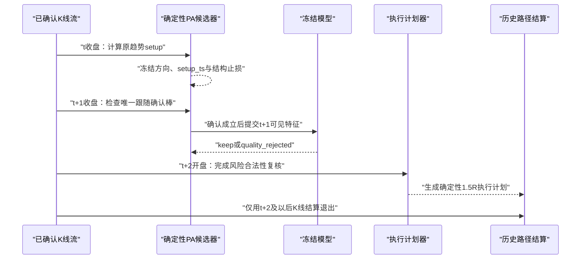
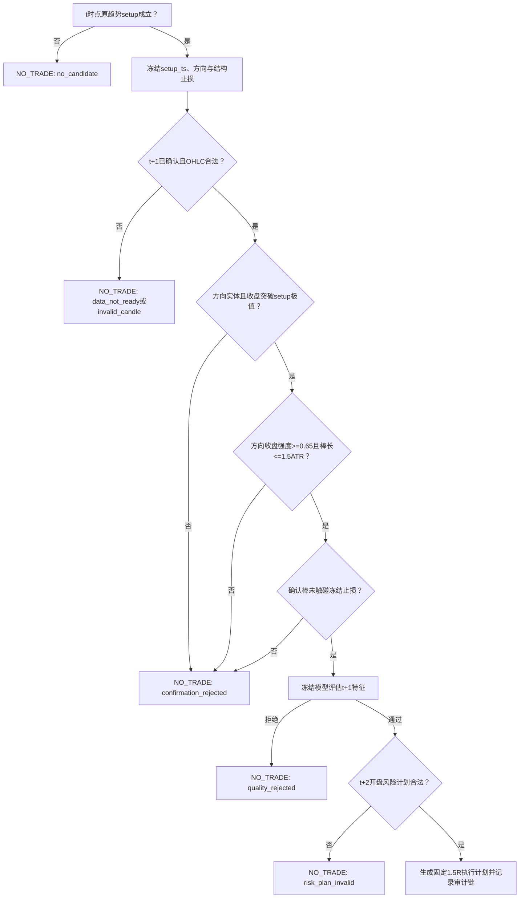
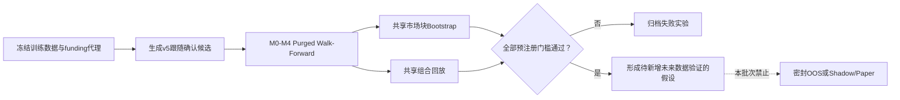

# PA Quant Tree 趋势跟随确认 v5 预注册

## 实验身份

- 训练协议：`pa-training-v5-trend-followthrough`。
- Feature Registry：`pa-feature-registry-v2`，不新增 primitive。
- 新策略标识：`pa_trend_followthrough_15m`、`pa_trend_followthrough_1h`。
- 阶段：已查看历史训练窗口上的新候选结构实验，不是密封 OOS 或 Forward Paper。
- 对照：冻结的 `pa_trend_15m`、`pa_trend_1h` v1/v4 结果；不覆盖、不重新命名旧证据。
- 成本：单边 5bps 手续费、3bps 滑点，按持仓小时累计 Hyperliquid 单一 funding 代理绝对值，并执行两倍成本压力。

## 机制假设

v4 的 15m 趋势质量模型形成弱正向筛选，但标准误大于均值、两倍成本为负，且收益集中在 SOL/BCH。当前失败可能不是继续缺少静态特征，而是原候选在 EMA 收回棒结束后立即计划下一棒开盘入场，没有要求市场给出独立的跟随证据。

v5 只检验一个结构变化：在原趋势 setup 后增加一根已确认的方向跟随棒，再于下一棒开盘入场。若该机制成立，应减少弱收回和单棒假突破，同时不能靠极少数交易、单币种或低成本假设成立。

## 冻结候选合同

### 原始 setup 棒 `t`

完全复用 v1 趋势候选，不修改公式：

1. 至少 100 根已确认且合法的 K 线。
2. EMA20 五棒斜率与收盘位置支持同一趋势方向。
3. 最近三棒至少一次触碰 EMA20。
4. setup 棒实体方向与趋势一致，且重新收回 EMA20 趋势侧。
5. 原始结构止损在 `t` 冻结：最近三棒方向极值外加 `0.1 ATR14`。

### 跟随确认棒 `t+1`

确认棒必须已经完成，且同时满足以下方向对称条件：

| 条件 | 多头 | 空头 |
| --- | --- | --- |
| 实体方向 | `close > open` | `close < open` |
| 突破 setup | `close > setup.high` | `close < setup.low` |
| 方向化收盘位置 | `(close-low)/(high-low) >= 0.65` | `(high-close)/(high-low) >= 0.65` |
| 最大棒长 | `(high-low) <= 1.5 * setup_ATR14` | 同左 |
| 止损存活 | `low > frozen_stop` | `high < frozen_stop` |

零长度、非有限 OHLC、未确认 K 线或任一条件失败都返回 `NO_TRADE`，不得延后等待第二根确认棒。

### 入场与退出

1. 新候选的决策时间是确认棒 `t+1` 的时间戳，同时保留 `setup_ts=t` 用于审计和配对分析。
2. 最早入场为 `t+2` 开盘；`t+2` 之前的任何价格不得参与是否生成候选的判断。
3. 止损继续使用 `t` 已冻结的原始结构止损，不因确认棒或后续价格向不利方向放宽。
4. 目标按 `t+2` 实际开盘与冻结止损的风险距离计算固定 `1.5R`。
5. 若 `t+2` 跳空使风险距离非正、价格非法或实际 RR 非法，则记录 `risk_plan_invalid`，不补偿入场。
6. 入场后的路径结算继续采用同棒止损优先、跳空止损按下一可成交开盘价、资金费率按持仓小时保守扣减。

## 版本合同

该实验改变候选事件和最早入场时点，因此是新策略能力，不是 `pa_trend_15m`/`pa_trend_1h` 的小版本：

| 项目 | 冻结规则 |
| --- | --- |
| `strategy_key` | 新增 `pa_trend_followthrough_15m`、`pa_trend_followthrough_1h` |
| `version` | 从 `1.0.0-research` 独立开始 |
| 旧策略 | 继续保留，不覆盖 manifest、报告或结果 |
| 默认执行器 | 不注册；只允许 research/backtest |
| Promote | 本批次始终 `promotion_eligible=false` |
| Live | 不存在自动路径，也不触发真实订单 mutation |

`RuntimeManifest`、研究样本和报告必须同时带新 `strategy_key`、版本、训练协议、Feature Registry、数据指纹、代码 revision 与 manifest hash。

## 时点时序图

## 决策树执行流程

## 研究流程

## 模型与统计协议

- M0-M4、one-standard-error、最低有效样本量、purged walk-forward、7 日共享市场块 bootstrap、Holm 校正和 Deflated Sharpe/试验账本口径保持不变。
- M2/M3/M4 只允许使用 `pa-feature-registry-v2` 已批准的 10 个特征，特征快照截止确认棒 `t+1`。
- setup、确认与入场至少跨三个时间点；purge 必须覆盖从 setup 到退出的完整标签期限。
- 15m 与 1h 独立训练、独立策略键、独立数据指纹和独立报告，不混合评分。
- 与旧趋势策略的比较只作训练期机制诊断；新候选没有冻结后的未来数据，因此不得称为独立 OOS 优势。

## 预注册成功条件

每个周期单独判断，至少同时满足：

1. walk-forward 成本后平均 R 的单侧 95% 下界大于 0。
2. 至少 100 笔验证期已结算交易，且覆盖至少三个市场；每个正向市场不少于 30 笔。
3. 胜率大于 60%，Profit Factor 大于 1.2。
4. 两倍成本后平均 R 仍大于 0。
5. 删除最大 5 笔盈利后仍为正。
6. 多数 walk-forward 窗口为正，参数邻域稳定。
7. BTC、ETH、SOL、BCH 中至少三个市场为正，不依赖单币种或单季度。
8. 共享组合最大回撤低于 15%。
9. 模型复杂度没有无必要增加；CART 位于最佳模型一个标准误内时优先 CART。

任一关键条件失败：归档本协议结果，不改阈值、不打开密封 OOS、不进入 Shadow/Paper。即使全部训练期条件通过，也只能等待新增未来数据形成冻结验证，不得直接 Promote。

## 明确排除

- 不修改 Vegas 候选、方向、入场、止损或目标。
- 不新增运行时 AI、在线训练、自然语言形态识别或 fallback。
- 不使用 symbol 专用参数，不使用资金费率作为信号特征。
- 不允许用 `t+2` 或更晚 K 线反向决定 `t+1` 是否确认。
- 不补造延迟入场，不自动注册生产执行器，不自动 Promote 到 Live。
