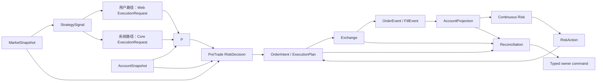

# Rust Quant 长期目标架构

- 状态：已接受
- 首次接受：2026-07-18
- 最近修订：2026-07-20
- 适用范围：中低频、多策略、多账户、多交易所的生产量化平台
- 代码放置细则：[业务代码与数据访问放置规范](business-code-and-data-access.md)
- 生产运行规范：[生产运行与恢复](production-runtime.md)
- 迁移实施计划：[架构迁移计划](migration-plan.md)

## 1. 文档目的

本文定义 `rust_quant` 的长期目标，不以当前 `services`、`orchestration`、`infrastructure`、单一 CLI 或 Web 执行任务表为目标形态。历史实现如何迁入目标架构只记录在[架构迁移计划](migration-plan.md)，不得为了兼容旧代码污染长期业务模型。

目标架构必须让开发者和 AI 在修改前明确回答：

1. 这段代码改变哪个业务事实；
2. 该事实的唯一 owner 是谁；
3. 这是业务不变量、纯政策、用例编排、外部适配、跨进程合同还是进程装配；
4. 数据库读写、事务和外部副作用在哪里实现；
5. 重复、超时、部分成交和进程重启后由谁恢复。

不能回答以上问题的需求，不得先写入 `common`、`utils`、`services`、`core` 或任意现有大文件。

## 2. 适用边界

本架构长期适用于：

- 秒、分钟、小时级策略；
- 多策略资本分配、冲突处理和仓位净额；
- 多账户、多交易所自动执行；
- backtest、paper、shadow、canary、live 生命周期；
- 事前风险审批、持续风险、保护单和 kill switch；
- 订单恢复、交易所对账、审计和运营诊断；
- 先以模块化单体交付，再按独立故障或扩缩容证据拆分进程。

以下能力需要另立 ADR，不提前放入当前设计：

- 亚毫秒级或共址 HFT；
- 多地域主动—主动实盘执行；
- 用户上传任意代码并在生产运行；
- 超大规模分布式训练或回测集群；
- 跨交易所原子事务。

## 3. 架构原则

### 3.1 模块化单体优先

业务边界先在同一 Workspace 内由 Rust crate 和可见性规则隔离。只有出现独立扩缩容、故障隔离、安全边界或发布生命周期证据时，才增加独立进程或服务。

### 3.2 业务模块与进程不是一一对应

- Portfolio 是必要业务模块，但账户无关的候选排序与账户级资本分配必须分开：前者可在信号链路完成，后者必须在获得稳定账户上下文后执行；
- 用户自动交易路径中，账户级 Portfolio 与事前 Risk 默认由消费 `ExecutionRequest` 的 `execution-worker` 同步装配，不建立 `portfolio-worker`；这只是进程装配选择，不改变 Portfolio/Risk 的业务 owner；
- 事前 Risk 是确定性政策，和账户级订单准备链路同步执行；
- 持续 Risk 初期可由 `account-worker` 装配；只有出现独立吞吐或隔离需求时才增加 `risk-worker`；
- 每个策略默认是 Strategy 内的 module，不是独立 crate、Worker 或服务。

### 3.3 目标状态与实际状态分离

- Strategy 产生预测和信号；
- Portfolio 将多个信号转成资本分配与目标仓位；
- Account 保存交易所实际余额、持仓、保证金和 PnL 投影；
- Risk 判断是否允许从实际状态变化到目标状态；
- Execution 将批准后的变化转成订单并维护 OMS、成交和保护状态。

### 3.4 Ports 与 Adapters

业务模块定义自己需要的 Port，Adapter 实现 Port。业务 model、policy 和 use case 不直接依赖 SQLx、Redis、HTTP Client、交易所 SDK、环境变量、Wire DTO 或数据库 Row。

### 3.5 App 是组合根

只有 `apps/*` 可以读取进程配置、创建连接池、选择 Adapter、完成 Contract 映射、装配 use case、管理循环与关闭。App 不实现交易业务规则。

### 3.6 控制面与数据面分离

控制面管理版本、配置、发布、暂停和 kill switch。数据面处理行情、策略、组合、风险、订单和成交。交易热路径只使用已发布的不可变快照，不同步依赖管理 API。

### 3.7 至少一次、幂等和最终对账

外部 mutation 前必须先持久化稳定业务身份。超时是 `Unknown`，不是失败；重试沿用原身份并先查询或对账。系统不宣称跨数据库与交易所的全局 exactly-once。

## 4. 目标物理目录

```text
rust_quant/
├── apps/
│   ├── control-api/                 # Core 控制面与 internal API
│   ├── market-worker/               # 参考数据、行情、质量和快照
│   ├── signal-worker/               # MarketSnapshot -> StrategySignal
│   ├── account-worker/              # 余额、持仓、成交和持续风险投影
│   ├── execution-worker/            # ExecutionRequest -> 账户级 Portfolio/Risk -> OMS
│   ├── reconciliation-worker/       # 对账、恢复任务和人工升级
│   ├── schema-tool/                 # migration 与 schema 检查
│   └── quant-lab/                   # 薄研究与回测入口
│
├── crates/
│   ├── domains/
│   │   ├── market/
│   │   ├── strategy/
│   │   ├── portfolio/
│   │   ├── account/
│   │   ├── risk/
│   │   ├── execution/
│   │   ├── reconciliation/
│   │   └── research/                 # Experiment、BacktestRun、Evidence
│   │
│   ├── quant/
│   │   ├── math/
│   │   ├── indicators/
│   │   ├── backtest/
│   │   └── analytics/
│   │
│   ├── contracts/                   # 一个 crate，内部按 owner/version 分模块
│   │   └── src/{market,strategy,portfolio,account,risk,execution,reconciliation,research}/v1/
│   │
│   ├── adapters/
│   │   ├── postgres/                # 一个 crate，内部按 owner 分模块
│   │   │   └── src/{market,strategy,portfolio,account,risk,execution,reconciliation,research}/
│   │   ├── exchange-gateway/        # 封装 crypto_exc_all，不复制 SDK
│   │   ├── quant-web-client/        # 只调用 quant_web owner API
│   │   ├── redis/
│   │   ├── object-storage/
│   │   └── notification/
│   │
│   └── platform/
│       ├── kernel/                   # ID、Clock 等极小稳定基础
│       ├── messaging/
│       ├── lifecycle/
│       ├── observability/
│       ├── security/
│       └── testkit/                  # 只允许测试依赖
│
├── migrations/                      # 单一有序 SQLx migration 流
├── tests/
│   ├── architecture/
│   ├── contracts/
│   ├── parity/
│   ├── recovery/
│   └── e2e/
├── templates/
│   ├── command-slice/
│   ├── query-slice/
│   └── event-consumer/
├── docs/architecture/
└── xtask/                            # cargo xtask arch-check
```

这是一张目标地图，不要求提前创建空目录或空 crate：

- `contracts` 和 `postgres` 默认各保持一个 crate，通过内部 owner module 隔离；
- 只有真实编译隔离、重依赖、独立 owner 或发布需求出现时，才拆成更多 crate；
- `risk-worker`、`portfolio-worker` 不是默认目录，只有运行证据支持时再增加；
- Migration 保持一个 SQLx 可确定排序的目录，不按 owner 建立相互独立的迁移序列。

`quant` 只保存 owner 无关的确定性机制：

- `math`、`indicators` 是生产 Domain 可依赖的纯计算基础；
- `backtest` 只包含 Deterministic Clock、Event Scheduler、Replay、撮合、费用、滑点和资金费模型；
- `analytics` 只对权益、成交和事件序列计算指标；
- `quant/*` 不依赖任何业务 Domain、Adapter、数据库或环境变量。

Experiment、BacktestRun、Checkpoint、DatasetManifest、SimulationProfile 和 ResearchEvidence 有独立生命周期，归 `domains/research`。Research 是终端离线 Domain，通过稳定 API 编排 Market、Strategy、Portfolio、Risk、Execution 与 Quant Kernel；生产 Domain 不依赖 Research。详细规则见[依赖与代码归属规则](dependency-rules.md)和 [ADR-0009](adr/0009-research-domain-and-tiered-simulation.md)。

## 5. 业务模块职责

| 模块 | 拥有的事实与规则 | 明确不负责 |
| --- | --- | --- |
| Market | instrument、symbol、精度、交易能力、K 线、tick、盘口、资金费率、数据质量和市场快照 | 策略结论、资本分配、下单 |
| Strategy | Strategy Definition、evaluator、registry、评估状态、信号、预测、置信度和证据截止时间 | 资金分配、账户读取、真实下单 |
| Portfolio | 资本预算、策略组合、目标仓位、目标权重、冲突处理和净额合并 | 实际持仓、风险放行、订单协议 |
| Account | 实际余额、持仓、敞口、保证金、PnL 和数据新鲜度 | 目标仓位、策略判断、订单提交 |
| Risk | 事前审批、持续敞口、回撤、保证金、保护要求、熔断和 RiskAction | 策略预测、交易所协议、订单持久化 |
| Execution | OrderIntent、ExecutionPlan、OMS、订单、成交、撤单、保护单和执行状态机 | 策略计算、资本分配、风险政策 |
| Reconciliation | 交易所差异、恢复任务、补偿编排和处置证据 | 绕过 owner 修改订单、账户或风险状态 |
| Research | Experiment、BacktestRun、DatasetManifest、SimulationProfile、Checkpoint、ResearchEvidence 和证据发布 | 原始行情事实、Strategy Definition、生产订单/账户事实、live promote |

`Reconciliation` 取代含义过宽的 `Operations`。日志、指标、审计传输和通知等通用技术能力属于 Platform 或 Adapter；运行恢复命令仍回到对应 domain owner，避免 Reconciliation 变成新的杂物筐。

## 6. Domain 内部标准结构

每个 Domain 默认使用同一种导航结构：

```text
crates/domains/execution/src/
├── model/                           # 实体、值对象、状态机和不变量
├── policies/                        # 纯决策规则，不执行 I/O
├── use_cases/
│   ├── commands/                    # 改变状态的业务动作
│   ├── queries/                     # 只读业务查询
│   └── consumers/                   # 消费事件后调用 command/query
├── ports/                           # 本 Domain 需要的外部能力 Trait
├── api/                             # 允许其他 Domain 使用的稳定进程内 API
└── lib.rs                           # 只重导出 api 与必要稳定类型
```

放置判断：

- “任何情况下都必须成立”放 `model`；
- “基于输入作出可替换的纯决策”放 `policies`；
- “按顺序读取、判断、写入、发事件”放 `use_cases`；
- “需要数据库、交易所、HTTP、时钟或消息能力”先在 `ports` 表达；
- SQLx、Reqwest、Redis 和 SDK 实现放 `adapters`；
- HTTP/消息 DTO 到用例 Input 的映射放 App 或入站 Adapter。

详细 CRUD、事务和代码示例见[业务代码与数据访问放置规范](business-code-and-data-access.md)。

## 7. 进程内与跨进程边界

### 7.1 同进程跨 Domain

只允许依赖上游 Domain 的 `api` 或稳定公开类型。禁止访问其他 Domain 的私有 module、Repository Port、数据库 Row 或表。

### 7.2 跨进程或跨仓库

使用 owner 明确、带版本的 Contract 和 owner service API/Event：

- Core 不能直连 `quant_web` 数据库；
- Web/Admin 不能直写 `quant_core`；
- Exchange 协议只经 `exchange-gateway -> crypto_exc_all`；
- News 只能提供情报事实，不能直接生成可执行订单。

### 7.3 Web `execution_tasks` 的目标语义

迁移期间，`quant_web.execution_tasks` 继续由 Web 拥有，但只表示“商业授权、订阅和凭证门禁后的执行请求/交接任务”，不是 OMS 订单事实。

目标边界为：

1. Web 根据会员、`strategy x symbol` combo、凭证和产品资格创建 `ExecutionRequest`；
2. Web 将用户风险配置冻结成带版本引用或不可变授权约束；Web 不计算最终下单金额，也不生成 Core `RiskDecision`；
3. Core 通过版本化 Contract 接收请求，为目标账户执行 Portfolio、Pre-trade Risk，并创建自己的 `OrderIntent`；
4. Order、Fill、Protection 和 Reconciliation 的唯一事实源位于 Core；
5. Web 只保存 Core 结果的用户展示投影，不再把 `exchange_order_results` 作为交易事实源；
6. 迁移完成前，Core 对 Web 状态的更新必须调用 Web owner API，不得直接写 Web 表。

`ExecutionRequest` 使用稳定 `execution_request_id`、`strategy_signal_id`、`execution_account_ref`、`credential_reference`、combo identity、`risk_profile_ref`、`risk_profile_version` 与 correlation/idempotency identity；如果携带授权约束，必须是创建请求时冻结的不可变快照。所有 ID 必须是 Contract 中有明确 owner 的类型；禁止使用 email、展示名称或可变 slug 推断交易账户身份，明文凭证不得进入 Contract。

## 8. 标准交易链路



固定业务对象顺序：

```text
MarketSnapshot
  -> StrategySignal
  -> ExecutionRequest（用户路径由 Web 授权；系统路径由 Core 运行配置产生）
  -> PortfolioTarget
  -> PreTradeSnapshot
  -> RiskDecision
  -> OrderIntent
  -> ExecutionPlan
  -> OrderEvent / FillEvent
  -> AccountProjection
  -> ContinuousRiskAction
  -> ReconciliationResult
```

- `PortfolioTarget` 表达目标，不代表允许交易；
- `RiskDecision` 固定本次审批输入、版本、边界、原因和过期时间；
- `OrderIntent` 只能由有效审批生成；
- `ExecutionPlan` 固定拆单、顺序、时效、交易所能力和保护方案；
- `AccountProjection` 只由交易所余额、仓位、成交和资金事件更新；
- `Reconciliation` 只能发送 typed command 请求 owner 恢复。

## 9. 策略定义、研究证据与发布分离

原“Strategy Manifest”拆为五个明确对象，并分配给两个 owner，避免把可变生命周期写进不可变定义：

| 对象 | 可变性 | 内容 |
| --- | --- | --- |
| `StrategyDefinition` | 不可变 | strategy key/version、输入要求、参数 schema、输出语义、支持范围、执行与保护能力 |
| `StrategyArtifact` | 不可变 | 代码 revision、构建/模型 artifact hash、参数 schema 与运行兼容能力 |
| `ResearchEvidence` | 不可变 | Experiment/Run、DatasetManifest、样本、成本、模拟精度、回测和验证证据 |
| `StrategyRelease` | 显式状态迁移 | Research、Paper、Shadow、Canary、Live、Retired 与批准/回滚记录 |
| `StrategyRuntimeSnapshot` | 发布后不可变 | 某次运行实际使用的 definition、参数、portfolio/risk 版本和 release generation |

Strategy 拥有 Definition、StrategyArtifact、Release 和 RuntimeSnapshot；Research 拥有 Experiment、Run、DatasetManifest、Checkpoint 和 ResearchEvidence。已有对象不得覆盖。Promote 只引用已完成 Evidence，回滚、停用只改变 Release 或创建新 Runtime Snapshot，不修改历史事实。

Strategy evaluator、Portfolio policy 和 Risk policy 必须确定性可重放；backtest、paper、shadow、canary 和 live 复用同一业务实现，只替换 Market、Account 和 Exchange Adapter。

### 9.1 策略评估状态

有滚动指标或增量窗口的策略必须显式拥有 `StrategyEvaluationState`，不能依赖进程全局 Map 或仅由 `symbol + period + strategy_type` 拼出的缓存键。

```text
StrategyEvaluationStateKey
  = EvaluationScopeId
  + StrategyRuntimeSnapshotId
  + MarketStreamPartition（instrument + timeframe + data source/version）
```

- Runtime Snapshot 变化必须创建新的评估状态，禁止新旧参数共用指标缓存；
- backtest 的 EvaluationScopeId 是 BacktestRunId；live 使用 release/deployment generation；并行实验不得共享可变状态；
- Market 负责 confirmed、sequence、去重、缺口和新鲜度；Strategy 只负责 evaluator checkpoint、滚动指标和最后已处理市场版本；
- live 可使用 Redis/Postgres Adapter 保存 checkpoint，backtest 使用内存 Adapter，但二者调用相同状态迁移；
- 状态恢复后必须验证 Runtime Snapshot、数据流版本和最后证据时间，无法证明连续时重新预热或 fail-closed。
- Evaluation State 是 StrategyEvaluator 的内部输入输出，不是 Signal 后面的独立交易阶段。

### 9.2 Research 控制流程

```text
quant-lab
  -> Research::StartBacktestRun
  -> 冻结 DatasetManifest、RuntimeSnapshot、Policy 版本、SimulationProfile 和 Seed
  -> Research::ExecuteBacktest
  -> checkpoint / complete / fail
  -> Evidence 原子可见发布
```

Market 拥有历史行情事实；Research 拥有 point-in-time 选择、universe membership、数据指纹和 Run 生命周期。长期或多币种数据通过确定性 historical event stream 读取，不要求把全部行情一次性装入内存。

### 9.3 ResearchBar 事件循环

```text
同一 decision_time 的全部 HistoricalMarketEvent
  -> 更新 SimulationLedger 的估值、资金费和可用资金
  -> StrategyEvaluator 更新内部 EvaluationState
  -> 收集全部 StrategySignal
  -> decision-time barrier
  -> Portfolio 统一排序、净额与容量选择
  -> PreTrade RiskDecision
  -> OrderIntent / OrderPlan
  -> candle/tick fill model
  -> SimulationLedger 应用模拟成交
  -> Continuous Risk
  -> 下一事件
```

`SimulationLedger` 是 Research 模拟事实，不是 AccountProjection。它只产生 Portfolio/Risk 可消费的模拟 AccountSnapshot read model，所有身份带 BacktestRunId，禁止写入生产 Order/Fill/Account 表。

### 9.4 分级模拟与 Parity

- `ResearchBar`：现有 Vegas/NWE 参数回测；精确复用 Strategy、Portfolio、Risk 和 OrderPlan，成交/PnL 由显式撮合模型决定；
- `PaperEvent`：模拟 Ack、PartialFill、Reject、Cancel、Protection 和延迟，复用 Execution 纯状态迁移；
- `RecoveryHarness`：验证 lease、outbox、Unknown、重复、乱序、崩溃、保护缺失和 Reconciliation，不参与参数搜索或收益证明。

Signal、PortfolioTarget、RiskDecision、OrderIntent/OrderPlan 在相同输入下必须逐层 parity；Fill/PnL 只能在相同 SimulationProfile 下重放一致，不能宣称与真实交易所完全相同。完整分配见 [Vegas 与现有回测主链迁移实战](vegas-backtest-migration.md)。

### 9.5 Evidence 发布

对象存储与 Postgres 不宣称全局原子：先以内容哈希幂等上传不可变大对象，再由 Research owner 单一数据库事务发布 EvidenceManifest、指标、引用、幂等记录和 Completed 状态。只有 Completed Evidence 可被查询或 Strategy Release 引用；孤立对象由 GC 清理。

## 10. 数据、时间和数值

- 指标与统计内部可以使用 `f64`；价格、数量、费用、保证金和订单参数使用 Decimal 或交易所固定精度类型；
- 策略时间来自注入的 Clock 和 MarketSnapshot，不读取系统当前时间；
- Market 数据必须经过标准化、序号、去重、乱序、缺口和新鲜度检查；
- 订单、成交、余额和持仓保留 source、exchange timestamp 与 observed timestamp；
- 研究产物记录数据指纹、样本区间、费用、滑点、资金费、代码 revision 和所有政策版本；
- 高频查询必须有索引、扫描范围、容量和退化证据；
- 大体积历史行情和研究产物经 Port 使用合适存储，不把存储技术泄漏进 Domain。

## 11. 执行保护与恢复底线

- 开仓前必须有经过验证的保护计划；没有保护性止损计划不得提交；
- 优先使用交易所原生 attached stop；交易所只支持成交后保护时，必须定义最大未保护窗口和自动 Reduce/Close 行为；
- 部分成交后保护数量必须跟随真实已成交敞口，不能只等待全部成交；
- 撤单与成交竞态、保护单超时、用户流断线和 `Unknown` 状态必须先查询/对账；
- 无法在规定时间证明保护有效时，停止同账户新开仓并触发显式 RiskAction；
- 所有恢复操作沿用原订单身份、状态机、lease 和审计链路。

详细状态与时序见[生产运行与恢复](production-runtime.md)。

## 12. AI 与 CI 必须执行的边界

- 新增代码前先写“owner 与放置声明”；
- 新功能从 command、query 或 event-consumer 三种垂直切片模板开始；
- 禁止新增泛型 `Repository<T>`、`BaseService`、`update_by_id`、`save_json` 或跨 owner SQL；
- `cargo xtask arch-check` 采用渐进 ratchet：先禁止新增违规，再逐步清理 legacy，不能一次让全仓 CI 永久变红；
- 静态门禁之外，业务不变量由单元测试，SQL/事务由集成测试，跨进程兼容由 contract test，故障恢复由 recovery test 证明；
- 子目录 `AGENTS.md` 只记录相对本目录的增量规则，并链接本目录权威文档，禁止复制整套规则造成漂移。

完整规则见 [AI 编码与架构防腐护栏](ai-coding-guardrails.md)。

## 13. 完成标准

- 新策略只修改 Strategy、Definition、Registry、StrategyArtifact 和测试；研究结论由 ResearchEvidence 记录；
- 新分配方法只修改 Portfolio，不修改 Strategy 或 Exchange Adapter；
- 新交易所只修改 `crypto_exc_all`、exchange-gateway、能力合同和适配测试；
- 数据库 CRUD 的业务意图、Port、SQL 与事务位置可被唯一定位；
- Web 的商业执行请求与 Core 的订单事实不再混淆；
- 成交能够幂等更新 Account 并触发持续 Risk；
- 部分成交、保护缺失、撤单竞态和未知结果有确定恢复协议；
- 控制面不可用不会产生无版本交易；
- CI 能拒绝新增非法依赖、跨 owner SQL、未版本化 Contract 和 testkit 生产依赖；
- golden vertical slice 经 shadow/parity/recovery 验证后再迁移下一切片；
- Vegas 在相同 DatasetManifest、RuntimeSnapshot、Portfolio/Risk 版本、SimulationProfile 和 Seed 下可确定重放；
- 多币种回测改变 symbol 输入顺序后，Portfolio/资金结果必须字节一致；
- ResearchBar、PaperEvent 与 RecoveryHarness 不互相夸大覆盖范围；
- Strategy evaluator 不接收账户风险配置，`position_leverage` 等历史混合字段完成语义拆分。

## 14. 相关决策

- [ADR-0001：模块化单体与五类物理目录](adr/0001-modular-monolith-and-business-modules.md)
- [ADR-0002：分离策略定义、研究证据、发布与合同](adr/0002-versioned-strategy-manifest-and-contracts.md)
- [ADR-0003：明确运行入口与组合根](adr/0003-explicit-runtime-composition-roots.md)
- [ADR-0004：分离 Strategy、Portfolio、Account、Risk 与 Execution](adr/0004-portfolio-and-trading-domain-boundaries.md)
- [ADR-0005：分离控制面与交易数据面](adr/0005-control-plane-and-data-plane.md)
- [ADR-0006：至少一次交付、保护闭环与恢复](adr/0006-at-least-once-idempotency-and-recovery.md)
- [ADR-0007：Owner-scoped 数据访问与事务边界](adr/0007-owner-scoped-persistence-and-transaction-boundaries.md)
- [ADR-0008：回测复用 Domain API 的双层 Quant 依赖（已被取代）](adr/0008-backtest-reuses-domain-apis.md)
- [ADR-0009：Research Domain、纯 Backtest Kernel 与分级模拟](adr/0009-research-domain-and-tiered-simulation.md)
