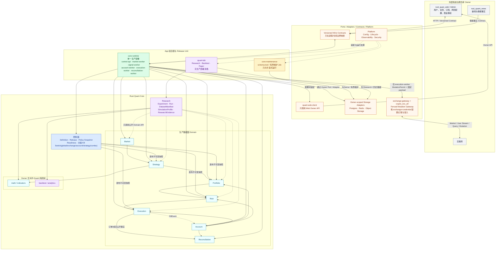

# Rust Quant 长期目标架构

- 状态：已接受
- 首次接受：2026-07-18
- 最近修订：2026-07-24
- 适用范围：中低频、多策略、多账户、多交易所的生产量化平台
- 代码放置细则：[业务代码与数据访问放置规范](business-code-and-data-access.md)
- 生产运行规范：[生产运行与恢复](production-runtime.md)
- 迁移实施计划：[架构迁移计划](migration-plan.md)

## 1. 文档目的

本文定义 `rust_quant` 的长期目标，不以当前 `services`、`orchestration`、`infrastructure`、单一 CLI 或 Web 执行任务表为目标形态。历史实现如何迁入目标架构只记录在[架构迁移计划](migration-plan.md)，不得为了兼容旧代码污染长期业务模型。

目标架构必须让开发者和 AI 在修改前明确回答：

1. 这段代码改变哪个业务事实；
2. 该事实的唯一 owner 是谁；
3. 这是业务不变量、纯政策、用例编排、外部适配、跨进程合同还是进程装配；
4. 数据库读写、事务和外部副作用在哪里实现；
5. 重复、超时、部分成交和进程重启后由谁恢复。

不能回答以上问题的需求，不得先写入 `common`、`utils`、`services`、`core` 或任意现有大文件。

## 2. 适用边界

本架构长期适用于：

- 秒、分钟、小时级策略；
- 多策略资本分配、冲突处理和仓位净额；
- 多账户、多交易所自动执行；
- backtest、paper、shadow、canary、live 生命周期；
- 事前风险审批、持续风险、保护单和 kill switch；
- 订单恢复、交易所对账、审计和运营诊断；
- 先以模块化单体交付，再按独立故障或扩缩容证据拆分进程。

以下能力需要另立 ADR，不提前放入当前设计：

- 亚毫秒级或共址 HFT；
- 多地域主动—主动实盘执行；
- 用户上传任意代码并在生产运行；
- 超大规模分布式训练或回测集群；
- 跨交易所原子事务；
- 同一账户多个独立开仓意图并发时的 Risk Reservation 协议。

## 3. 架构原则

### 3.1 模块化单体优先

业务边界先在同一 Workspace 内由 Rust crate 和可见性规则隔离。只有出现独立扩缩容、故障隔离、安全边界或发布生命周期证据时，才增加独立进程或服务。

### 3.2 业务模块与进程不是一一对应

- Portfolio 是必要业务模块，但账户无关的候选排序与账户级资本分配必须分开：前者可在信号链路完成，后者必须在获得稳定账户上下文后执行；
- 用户自动交易路径中，账户级 Portfolio 与事前 Risk 默认由消费 `ExecutionRequest` 的 `execution-worker` 同步装配，不建立 `portfolio-worker`；这只是进程装配选择，不改变 Portfolio/Risk 的业务 owner；
- 事前 Risk 是确定性政策，和账户级订单准备链路同步执行；
- 持续 Risk 初期可由 `account-worker` 装配；只有出现独立吞吐或隔离需求时才增加 `risk-worker`；
- 每个策略默认是 Strategy 内的 module，不是独立 crate、Worker 或服务。

业务边界、Rust crate、运行进程和 CI/CD Release Unit 是四个不同概念：

- 先用 Domain module/crate 隔离业务 owner，不因新增策略或回测能力默认拆微服务；
- `signal-worker`、`execution-worker` 等生产 App 不得依赖 `strategy-candidates`、`domains/research`、`quant/backtest`、`quant/analytics` 或 `quant-lab`；
- Research 与生产 App 都依赖同一份 Strategy、Portfolio、Risk 和 Execution 公开业务实现，Research 不能反向提供“实盘依赖的业务包”；
- 六个生产角色各自使用独立 App Cargo package，但继续打入同一个 `core-runtime` 镜像；`schema-tool` 属于 `core-maintenance`，Research/Backtest/Analytics/Paper 研究入口属于 `quant-lab`，不是生产镜像内容；
- 只修改 `domains/research`、`quant/backtest`、`quant/analytics`、`strategy-candidates` 或 `apps/quant-lab` 时，目标 CI 只构建研究单元且不得触发生产部署；修改共享的 Strategy、Portfolio、Risk、Execution、Market、Contract 或生产 Adapter 时，必须按 Cargo 反向传递依赖触发受影响生产构建与 parity 回归；
- 如果“新增尚未发布的候选策略”频繁导致生产 App 无意义重建，可在 Strategy owner 内按发布生命周期拆成 `strategy-api`、`strategy-released` 与 `strategy-candidates` 三个 workspace package：`quant-lab` 可以依赖 released + candidates，生产 `signal-worker` 只能依赖 api + released；这是编译/发布隔离，不是新增微服务；
- 每个候选策略仍默认是 `strategy-candidates` 内的 module，不按策略建立服务或 crate。候选晋级 live 时必须进入 released catalog，冻结新的 Artifact/Release/RuntimeSnapshot，并重新通过生产构建与 parity；不能让 live App 在运行时依赖 Research 或直接加载候选目录；
- 是否增加独立服务只由扩缩容、故障隔离、安全边界或独立发布生命周期决定，不能用服务拆分掩盖错误的 crate 依赖。

### 3.3 目标状态与实际状态分离

- Strategy 产生预测和信号；
- Portfolio 将多个信号转成资本分配与目标仓位；
- Account 保存交易所实际余额、持仓、保证金和 PnL 投影；
- Risk 判断是否允许从实际状态变化到目标状态；
- Execution 将批准后的变化转成订单并维护 OMS、成交和保护状态。

### 3.4 Ports 与 Adapters

业务模块定义自己需要的 Port，Adapter 实现 Port。业务 model、policy 和 use case 不直接依赖 SQLx、Redis、HTTP Client、交易所 SDK、环境变量、Wire DTO 或数据库 Row。

### 3.5 App 是组合根

只有 `apps/*` 可以读取进程配置、创建连接池、选择 Adapter、完成 Contract 映射、装配 use case、管理循环与关闭。App 不实现交易业务规则。

### 3.6 控制面与数据面分离

控制面管理版本、配置、发布、暂停和 kill switch。数据面处理行情、策略、组合、风险、订单和成交。交易热路径只使用已发布的不可变快照，不同步依赖管理 API。

### 3.7 至少一次、幂等和最终对账

外部 mutation 前，Risk owner 先按 `risk_evaluation_id` 持久化不可变审批；Execution 在固定完整 `OrderIntent`、`ExecutionPlan` 与 `ProtectionPlan` 后，以单一 owner 事务取得持久 `AccountOpeningSlot`，并原子提交首个持久状态 `SubmitPending`、幂等和 Outbox。事务提交后，Dispatcher 以 aggregate version/`send_claim`/fence 记录 attempt 并签发短期 `MutationPermit`；只有 Fenced Exchange Mutation Gateway 在网络 I/O 边界原子消费 current permit 后，才可在事务外调用 raw SDK。超时是 `Unknown`，不是失败；只有交易所能力可证明 `DefinitivelyAbsent`、不存在仍可发送的 permit，且 recovery transaction 新建提交 Outbox 时才沿原身份重试。系统不宣称跨 owner 数据库事务，也不宣称数据库与交易所之间的全局 exactly-once。完整顺序以 [ADR-0006](adr/0006-at-least-once-idempotency-and-recovery.md) 为唯一权威，事务实现边界见 [ADR-0007](adr/0007-owner-scoped-persistence-and-transaction-boundaries.md)。

### 3.8 Kill Switch 是分级作用域，不是单一开关

生产实盘的熔断在真实运维中至少有五个作用域，粒度不同、owner 不同、优先级不同：

- `global`：全平台停止新开仓，最高优先级，覆盖一切下级恢复；
- `exchange`：某交易所故障或维护时停止该交易所的新 mutation；
- `account`：单账户风控、欠费、凭证失效或用户主动停用；
- `strategy`：某 `strategy_key@version` 行为异常时停止其下所有信号转执行；
- `combo`：单个 `strategy × symbol` 订阅粒度停用。

规则：

- Kill Switch 状态是控制面拥有、**版本化、可被数据面本地读取的已发布快照**，不是同步管理 API；控制面不可用时，数据面必须能读到最近一次已发布的 kill 状态并据此 fail-closed，不得因读不到控制面而放行；
- 生效判定取“任一命中作用域为停用即停用”，上级停用不可被下级恢复覆盖；`global`/`exchange` 停用期间，`account`/`strategy`/`combo` 的恢复不得放行新开仓；
- 触发与解除都是显式 owner 命令并留审计：`global`/`exchange` 由运营控制面触发，`account`/`strategy`/`combo` 可由 Risk owner 的 RiskAction 触发；
- Kill Switch 只阻断新增风险（开仓、加仓），不阻断 reduce-only 的保护、减仓和紧急平仓；后者仍走执行状态机与恢复协议。

### 3.9 交易所配额是跨 App 的受管资源

同一 `exchange × credential` 的 REST 权重、下单频率和 WS 订阅数是交易所侧的**共享全局预算**。market-worker 拉行情、execution-worker 下单/查单、reconciliation-worker 拉 open orders/positions/fills、account-worker 拉余额会同时消耗同一个桶：

- 交易所配额是一等受管资源，owner 是 `exchange-gateway` Adapter，按 `exchange × credential` 维度记账与准入，不是各 App 进程内各自为政的 backpressure；
- 热路径 mutation（下单、撤单、保护单）在配额紧张时优先于只读拉取（对账、行情补齐、余额刷新）；只读侧达到配额上限时降级或退避，绝不挤占 mutation 预算；
- 配额准入失败属于可恢复门禁，使用持久 `next_eligible_at`/事件触发重新唤醒，不制造进程内热重试；
- 单一 App 无法独占或耗尽共享凭证的全部配额而使其他角色饿死；分配策略与优先级由 gateway 显式声明，不隐藏在调用点。

## 4. 目标架构总览与物理目录

### 4.1 逻辑、运行与工件总览


```mermaid
flowchart TB
    subgraph EXT["外部系统与跨仓库 Owner"]
        direction LR
        WEB["rust_quan_web / Admin<br/>用户、会员、订阅、风险配置、商业授权"]
        NEWS["rust_quant_news<br/>新闻与情报事实"]
        EXCHANGE["交易所"]
    end

    subgraph APPS["App 组合根与 Release Unit"]
        direction LR
        RUNTIME["core-runtime<br/>单一生产镜像<br/>control-api · market-worker · signal-worker<br/>account-worker · execution-worker · reconciliation-worker"]
        MAINT["core-maintenance<br/>schema-tool / 有界维护 Job<br/>只允许显式运行"]
        LAB["quant-lab<br/>Research · Backtest · Paper<br/>无生产部署资格"]
    end

    subgraph CORE["Rust Quant Core"]
        direction TB

        CONTROL["控制面<br/>Definition · Release · Policy Snapshot<br/>Readiness · 分级 Kill Switch(global/exchange/account/strategy/combo)"]

        subgraph DATA["生产数据面 Domain"]
            direction LR
            MARKET["Market"] --> STRATEGY["Strategy"] --> PORTFOLIO["Portfolio"] --> RISK["Risk"] --> EXECUTION["Execution"] -->|"订单/成交公开事实"| RECON["Reconciliation"]
            ACCOUNT["Account"] --> PORTFOLIO
            ACCOUNT --> RISK
            ACCOUNT --> EXECUTION
            EXECUTION -. "FillEvent" .-> ACCOUNT
            ACCOUNT --> RECON
        end

        RESEARCH["Research<br/>Experiment · Run · DatasetManifest<br/>SimulationProfile · ResearchEvidence"]

        subgraph QUANT["Owner 无关的 Quant 纯机制"]
            direction LR
            QMI["math / indicators"]
            QBA["backtest / analytics"]
        end
    end

    subgraph BOUNDARY["Ports / Adapters / Contracts / Platform"]
        direction LR
        CONTRACTS["Versioned Wire Contracts<br/>只在进程/仓库边界映射"]
        WEBCLIENT["quant-web-client<br/>只调用 Web Owner API"]
        STORAGE["Owner-scoped Storage Adapters<br/>Postgres · Redis · Object Storage"]
        GATEWAY["exchange-gateway + crypto_exc_all<br/>Fenced Mutation Gateway<br/>每 exchange×credential 配额记账与准入"]
        PLATFORM["Platform<br/>Config · Lifecycle · Observability · Security"]
    end

    WEB <-->|"HTTP / Versioned Contract"| CONTRACTS
    NEWS -->|"情报事实 Contract"| CONTRACTS
    CONTRACTS <--> RUNTIME

    RUNTIME --> CONTROL
    RUNTIME --> MARKET
    RUNTIME --> STRATEGY
    RUNTIME --> ACCOUNT
    RUNTIME --> PORTFOLIO
    RUNTIME --> RISK
    RUNTIME --> EXECUTION
    RUNTIME --> RECON

    CONTROL -->|"发布不可变快照"| STRATEGY
    CONTROL -->|"发布不可变快照"| PORTFOLIO
    CONTROL -->|"发布不可变快照"| RISK
    CONTROL -->|"发布不可变快照"| EXECUTION

    LAB --> RESEARCH
    RESEARCH -. "只调用公开 Domain API" .-> MARKET
    RESEARCH -.-> STRATEGY
    RESEARCH -.-> PORTFOLIO
    RESEARCH -.-> RISK
    RESEARCH -.-> EXECUTION

    STRATEGY --> QMI
    RESEARCH --> QMI
    RESEARCH --> QBA

    RUNTIME -->|"需要时装配"| WEBCLIENT
    WEBCLIENT -->|"Owner API"| WEB
    RUNTIME -->|"通过 Owner Port / Adapter"| STORAGE
    MAINT -->|"Schema / 有界维护"| STORAGE
    LAB -->|"仅 Research / 历史数据"| STORAGE
    RUNTIME -->|"仅 execution-worker：MutationPermit + 固定 payload"| GATEWAY
    GATEWAY <-->|"Market / User Stream / Query / Mutation"| EXCHANGE
    PLATFORM -. "装配与运行支撑" .-> RUNTIME
    PLATFORM -.-> MAINT
    PLATFORM -.-> LAB

    classDef external fill:#f3f4f6,stroke:#64748b,color:#0f172a;
    classDef runtime fill:#dcfce7,stroke:#15803d,color:#14532d;
    classDef maintenance fill:#fef3c7,stroke:#b45309,color:#78350f;
    classDef research fill:#f3e8ff,stroke:#7e22ce,color:#581c87;
    classDef control fill:#dbeafe,stroke:#1d4ed8,color:#1e3a8a;
    classDef domain fill:#ecfeff,stroke:#0e7490,color:#164e63;
    classDef boundary fill:#fff7ed,stroke:#c2410c,color:#7c2d12;

    class WEB,NEWS,EXCHANGE external;
    class RUNTIME runtime;
    class MAINT maintenance;
    class LAB,RESEARCH,QBA research;
    class CONTROL control;
    class MARKET,STRATEGY,PORTFOLIO,RISK,EXECUTION,RECON,ACCOUNT,QMI domain;
    class CONTRACTS,WEBCLIENT,STORAGE,GATEWAY,PLATFORM boundary;
```

读图规则：

- 本图表达长期目标，不代表当前总 CLI、legacy crate 或现有生产镜像已经完成迁移；
- 箭头表达业务流、公开 API 调用或边界交互，不表示每个 Domain 都是独立服务；
- `core-runtime`、`core-maintenance`、`quant-lab` 是工件边界，不是业务 owner；六个生产 App 是独立 Cargo package，但共享一个生产镜像；
- 生产 Domain 不依赖 Research、`quant/backtest` 或 `quant/analytics`；Research 只能通过稳定公开 API 复用生产业务实现；
- Strategy、Portfolio、Risk、Execution 分别拥有自己的 Policy Snapshot 内容和校验；控制面只管理版本、生命周期、激活指针与 kill switch；
- Domain 定义所需 Port，App 装配 Adapter；图中的 Storage/Gateway 连线不授权 App 或 Domain 绕过 Port 直接访问 SQL/SDK；
- Web/Admin 与 Core 只通过版本化 Contract 和 owner API 协作，不共享数据库或 ORM；
- 只有 `execution-worker` 可以把已持久化的 MutationPermit 和固定 payload 交给 Fenced Mutation Gateway；其他 App 不可达 raw mutation SDK；
- `exchange-gateway` 同时是 `exchange × credential` 交易所配额的记账与准入 owner，mutation 优先于只读拉取；控制面的分级 Kill Switch 以已发布快照下发，数据面本地读取并 fail-closed；
- `quant-lab` 的存储访问仅限 Research owner 事实、历史数据和 Evidence，不写生产 Order、Fill 或 Account 事实表，也没有生产部署和实盘 mutation 资格。

### 4.2 目标物理目录

```text
rust_quant/
├── apps/
│   ├── control-api/                 # Core 控制面与 internal API
│   ├── market-worker/               # 参考数据(fail-closed)与实时行情流(可降级),质量和快照
│   ├── signal-worker/               # MarketSnapshot -> StrategySignal；含雷达 handoff 消费与订阅扇出
│   ├── account-worker/              # 余额、持仓、成交、持续风险投影与 ExchangeSession readiness
│   ├── execution-worker/            # ExecutionRequest -> 账户级 Portfolio/Risk -> OMS
│   ├── reconciliation-worker/       # 对账、恢复任务和人工升级
│   ├── schema-tool/                 # migration 与 schema 检查
│   └── quant-lab/                   # 薄研究与回测入口
│
├── crates/
│   ├── domains/
│   │   ├── control/                  # 控制面 owner:Release/激活指针、Readiness、分级 Kill Switch 已发布快照
│   │   ├── market/                   # 内部 module 分 reference/(参考数据,fail-closed) 与 stream/(实时行情流,可降级)
│   │   ├── strategy/                 # 含 signal 分发职责:匹配订阅 -> 扇出 ExecutionRequest(经 quant-web-client)
│   │   ├── portfolio/
│   │   ├── account/                  # 含 ExchangeSession 子职责(会话 readiness 语义与 fail-closed 判定)
│   │   ├── risk/
│   │   ├── execution/
│   │   ├── reconciliation/
│   │   └── research/                 # Experiment、BacktestRun、Evidence
│   │
│   ├── quant/
│   │   ├── math/
│   │   ├── indicators/
│   │   ├── backtest/
│   │   └── analytics/
│   │
│   ├── contracts/                   # 一个 crate，内部按 owner/version 分模块
│   │   └── src/{control,market,strategy,portfolio,account,risk,execution,reconciliation,research}/v1/
│   │
│   ├── adapters/
│   │   ├── postgres/                # 一个 crate，内部按 owner 分模块
│   │   │   └── src/{control,market,strategy,portfolio,account,risk,execution,reconciliation,research}/
│   │   ├── exchange-gateway/        # 封装 crypto_exc_all；Fenced Gateway 独占 mutation capability；私有流连接生命周期/listenKey + 每 exchange×credential 配额记账
│   │   ├── quant-web-client/        # 只调用 quant_web owner API
│   │   ├── redis/
│   │   ├── object-storage/
│   │   └── notification/
│   │
│   └── platform/
│       ├── kernel/                   # ID、Clock 等极小稳定基础
│       ├── messaging/
│       ├── lifecycle/
│       ├── observability/
│       ├── security/
│       └── testkit/                  # 只允许测试依赖
│
├── release-units/                   # core-runtime/core-maintenance/quant-lab 机器可读清单
├── migrations/                      # 单一有序 SQLx migration 流
├── tests/
│   ├── architecture/
│   ├── contracts/
│   ├── parity/
│   ├── recovery/
│   └── e2e/
├── templates/
│   ├── command-slice/
│   ├── query-slice/
│   └── event-consumer/
├── docs/architecture/
└── xtask/                            # cargo xtask arch-check
```

这是一张目标地图，不要求提前创建空目录或空 crate：

- `contracts` 和 `postgres` 默认各保持一个 crate，通过内部 owner module 隔离；
- Strategy 默认保持一个 crate；只有候选与已发布策略已经出现独立编译和发布生命周期证据时，才按第 3.2 节拆成 api/released/candidates 三个 catalog 级 package，不按单个策略拆包；
- 只有真实编译隔离、重依赖、独立 owner 或发布需求出现时，才拆成更多 crate；
- `risk-worker`、`portfolio-worker` 不是默认目录，只有运行证据支持时再增加；
- `domains/market` 内部必须区分 `reference`(参考数据,fail-closed)与 `stream`(实时行情流,可降级)两个 module,各自独立的新鲜度阈值与 readiness,不得共用一个健康判定(见 §5 表注);现阶段用 module 隔离即可,不拆 crate;
- 雷达信号的"匹配订阅用户并扇出 ExecutionRequest"(§8.2 B1)是明确的编排职责,归 Strategy owner 的 signal 分发子职责,由 `signal-worker` 装配;它经 `quant-web-client` 调 Web owner API 查订阅与提交请求,不直连 Web 库,也不与 Strategy 的信号评估纯逻辑混在同一 module;
- `ExchangeSession` 是 `domains/account` 内的子职责(会话 readiness 语义与 fail-closed 判定),底层连接/listenKey/配额机制复用 `adapters/exchange-gateway`,不拆独立 crate 或 worker(见 §5 表注与 [ADR-0012](adr/0012-multi-tenant-private-stream-management.md));ExchangeSession 的运行时状态(healthy/stale、最后消息墙钟时间、水位闭合时间、重连次数)是高频易变的运行时事实,持久化落 `adapters/redis`,进程重启后靠重连 + 快照闭合重建,不进 Postgres 事实表;
- 雷达候选信号的 handoff 中转表归 **Strategy owner** 的持久化事实(信号候选是 Strategy 的事实,表名 `market_velocity_live_handoff` 只是历史命名),落 `adapters/postgres/strategy` 模块与单一 migration 流;`signal-worker` 消费它并经 `quant-web-client` 扇出;
- `control` 是控制面 owner,拥有 Release/激活指针、Readiness 与分级 Kill Switch 已发布快照;它有独立的 `domains/control`、`adapters/postgres/control` 与 `contracts/control` 落点。控制面事实是数据面只读的已发布快照(§3.6),数据面本地读取并 fail-closed,不在热路径同步调用控制面 API;
- `release-units/*.toml` 是 CI、镜像和部署合同的共同输入；生产镜像的 binary 集合必须与 allowlist 完全一致；
- Migration 保持一个 SQLx 可确定排序的目录，不按 owner 建立相互独立的迁移序列。这一条以**当前单一 owner database 前提**成立；一旦某 owner（如 Market 海量 K 线）因容量、保留期或独立扩缩容出现拆分独立存储的实证需求，须另立 ADR 定义该 owner 的独立 migration 序列与切分边界，届时才解除本约束，而不是把单一 migration 流当作永久教条。

`quant` 只保存 owner 无关的确定性机制：

- `math`、`indicators` 是生产 Domain 可依赖的纯计算基础；
- `backtest` 只包含 Deterministic Clock、Event Scheduler、Replay、撮合、费用、滑点和资金费模型；
- `analytics` 只对权益、成交和事件序列计算指标；
- `quant/*` 不依赖任何业务 Domain、Adapter、数据库或环境变量。

Experiment、BacktestRun、Checkpoint、DatasetManifest、SimulationProfile 和 ResearchEvidence 有独立生命周期，归 `domains/research`。Research 是终端离线 Domain，通过稳定 API 编排 Market、Strategy、Portfolio、Risk、Execution 与 Quant Kernel；生产 Domain 不依赖 Research。详细规则见[依赖与代码归属规则](dependency-rules.md)和 [ADR-0009](adr/0009-research-domain-and-tiered-simulation.md)。

## 5. 业务模块职责

| 模块 | 拥有的事实与规则 | 明确不负责 |
| --- | --- | --- |
| Market | instrument、symbol、精度、交易能力、K 线、tick、盘口、资金费率、数据质量和市场快照 | 策略结论、资本分配、下单 |
| Strategy | Strategy Definition、evaluator、registry、评估状态、信号、预测、置信度、证据截止时间，以及 signal 分发子职责（雷达候选信号的 handoff 持久化、匹配订阅用户并扇出 ExecutionRequest，经 quant-web-client 调 Web API） | 资金分配、账户读取、真实下单、直连 Web 库 |
| Portfolio | 资本预算、策略组合、目标仓位、目标权重、冲突处理和净额合并 | 实际持仓、风险放行、订单协议 |
| Account | 实际余额、持仓、敞口、保证金、PnL、手续费/返佣/资金费现金流事件、账户投影数据新鲜度，以及 `ExchangeSession` 运行时 readiness（每 `exchange × credential` 的签名可用性、交易所冻结状态、User Stream 存活、signed preflight 结论与 fail-closed 判定） | 目标仓位、策略判断、订单提交、用户 API Key 的商业配置、底层连接/listenKey/配额机制 |
| Risk | risk evaluation/decision、PreTradeSnapshot(下单前冻结的市场/账户/组合/规格证据)、事前审批、持续敞口、回撤、保证金、保护要求、熔断和 RiskAction | 策略预测、交易所协议、订单持久化 |
| Execution | AccountOpeningSlot、ExecutionDecisionContextSnapshot、OrderIntent、ExecutionPlan、mutation attempt/permit、Outbox、OMS、订单、成交、撤单、保护单和执行状态机 | 策略计算、资本分配、风险政策 |
| Reconciliation | 交易所差异、恢复任务、补偿编排和处置证据 | 绕过 owner 修改订单、账户或风险状态 |
| Research | Experiment、BacktestRun、DatasetManifest、SimulationProfile 配置实例、模拟账户初态、SimulationLedger(模拟事实,带 BacktestRunId,非 AccountProjection)、Checkpoint、ResearchEvidence 和证据发布 | 原始行情事实、Strategy Definition、生产订单/账户事实、模拟成交算法本身(归 quant/backtest)、live promote |

`Reconciliation` 取代含义过宽的 `Operations`。日志、指标、审计传输和通知等通用技术能力属于 Platform 或 Adapter；运行恢复命令仍回到对应 domain owner，避免 Reconciliation 变成新的杂物筐。

关于表内几个易混淆的边界：

- Market 内含两类新鲜度与故障策略完全不同的子职责：**参考数据**（instrument、精度、tick size、最小下单量、上下架、交易能力）低频强一致，错误直接导致下单精度/数量算错，必须 fail-closed；**实时行情流**（tick、盘口、K 线）高吞吐可降级，延迟只影响信号质量。两者共用 Market owner 但必须有各自的新鲜度阈值与 readiness，不得用同一个健康判定覆盖；
- `ExchangeSession` 是一等运行时事实，owner 归 **Account domain**，粒度是每 `exchange × credential` 一份，与 Account 的账户投影新鲜度**正交**（会话可在无任何持仓/余额变动时独立劣化，如 listenKey 过期或 Key 被冻结；余额也可在会话正常时因拉取滞后而 stale）。三方边界定死：
  - **Web** 拥有用户 API Key 的**商业配置态**（§7.4 的 `credential_reference`、产品资格、启停），不拥有运行时健康；
  - **`exchange-gateway` Adapter** 拥有**底层机制**——连接/listenKey 维护、签名探测、冻结错误归一、以及 §3.9 的配额记账（与 ExchangeSession 同挂 `exchange × credential` 维度）；
  - **Account domain** 拥有**会话 readiness 语义与 fail-closed 决策**：聚合 gateway 上报的底层事实，判定某账户当前是否可安全新开仓；签名失效、交易所冻结、User Stream 断线或 preflight 未过时，依赖该账户的新开仓 fail-closed，不临时探测后放行；
  - `ExchangeSession` 不拆独立 crate 或 worker：无独立扩缩容/发布证据，拆进程只会制造分布式会话状态一致性问题；它是 Account domain 内的子职责，底层机制复用 gateway；多租户私有连接的容量分阶段、分片/lease、降级态与恢复见 [ADR-0012](adr/0012-multi-tenant-private-stream-management.md) 与 [生产运行 §10.2](production-runtime.md)；
- Portfolio 对用户 `strategy × symbol` combo 账户通常退化为“单目标直通”（一个 combo 对应一个仓位，净额/冲突/资本分配为恒等），完整的净额合并与资本预算主要服务自营/多策略共享账户；两种形态走同一 Portfolio API，不得因用户账户简单而绕过该阶段，也不必为其运行多策略资本分配算法；
- 交易所配额记账（§3.9）归 `exchange-gateway` Adapter，不是某个 Domain 的业务事实，也不属于任何单个 worker。

## 6. Domain 内部标准结构

每个 Domain 默认使用同一种导航结构：

```text
crates/domains/execution/src/
├── model/                           # 实体、值对象、状态机和不变量
├── policies/                        # 纯决策规则，不执行 I/O
├── use_cases/
│   ├── commands/                    # 改变状态的业务动作
│   ├── queries/                     # 只读业务查询
│   └── consumers/                   # 消费事件后调用 command/query
├── ports/                           # 本 Domain 需要的外部能力 Trait
├── api/                             # 允许其他 Domain 使用的稳定进程内 API
└── lib.rs                           # 只重导出 api 与必要稳定类型
```

放置判断：

- “任何情况下都必须成立”放 `model`；
- “基于输入作出可替换的纯决策”放 `policies`；
- “按顺序读取、判断、写入、发事件”放 `use_cases`；
- “需要数据库、交易所、HTTP、时钟或消息能力”先在 `ports` 表达；
- SQLx、Reqwest、Redis 和 SDK 实现放 `adapters`；
- HTTP/消息 DTO 到用例 Input 的映射放 App 或入站 Adapter。

详细 CRUD、事务和代码示例见[业务代码与数据访问放置规范](business-code-and-data-access.md)。

### 6.1 Rust 业务代码形态

Rust 不采用“所有业务逻辑都包装成 Service 对象”的 Java 式分层。先确定事实 owner，再根据身份、状态、不变量、纯度和 I/O 选择代码形态：

| 业务特征 | 代码形态 | 约束 |
| --- | --- | --- |
| 有稳定身份、生命周期或跨字段不变量 | Entity/Aggregate：`struct`/`enum` + `impl` | 关键字段不得被调用方任意修改；状态变化使用业务动词并返回显式错误/事件 |
| 无身份但有单位、范围或组合合法性 | Value Object：不可变 `struct`/`enum` | 构造时校验；不读取 I/O 或全局配置 |
| 完整输入到输出的无状态确定性计算 | module 内自由纯函数 | 所有输入显式传入；不创建零字段 `*Calculator`/`*Service` 充当命名空间 |
| 多个纯决策共享不可变、带版本配置 | Policy 对象：配置快照 + `evaluate`/`plan` | 不持有可变全局状态，不执行 I/O |
| 跨事件维护滚动或生命周期状态 | 显式状态对象或纯 transition | 状态 identity 完整；backtest/live 调用同一 transition |
| 编排读取、判断、持久化和事件 | Use Case 对象 | 只持有所需 Port；不承载数据库/SDK 实现 |
| 数据库、HTTP、Redis、交易所技术状态 | Adapter 对象 | 实现消费方定义的 Port，不作业务决策 |
| 存在真实多实现、进程内稳定 API 或测试替身 | Trait | 不为单一实现或“以后可能扩展”创建基类式 Trait |

`impl` 只在“数据与行为必须一起保护语义”或“对象需要持有依赖/配置”时使用。仅为了 `Type::function()` 语法创建的零状态结构体应改为 module + function；一个函数同时修改 Strategy、Portfolio、Risk、Execution、Research 多个 owner 状态时，也不能通过移动进某个 `impl` 伪装成 Aggregate。

一个 Domain 内部允许再按子领域切 module,以承载 SLA/职责显著不同的子部分,而不必立刻拆成独立 crate:

- `domains/market` 内部分 `reference/`(参考数据,fail-closed)与 `stream/`(实时行情流,可降级),两者各自的 model/policies/ports,共享 domain 的 `api`;
- `domains/account` 内部含 `exchange_session`(会话 readiness 语义)子领域,与账户投影正交;
- `domains/strategy` 内部含 signal 分发子领域(handoff 消费、订阅匹配扇出),与信号评估纯逻辑分开 module,不混在同一处。

子领域 module 只是 domain 内部组织,不改变"对外只暴露 domain `api`、跨 domain 不碰对方私有 module"的约束(§7.1);出现独立编译、重依赖或独立发布证据时,才升级为独立 crate。

详细判定、代码示例和禁止模式见[业务代码与数据访问放置规范](business-code-and-data-access.md)。

## 7. 进程内与跨进程边界

### 7.1 同进程跨 Domain

只允许依赖上游 Domain 的 `api` 或稳定公开类型。禁止访问其他 Domain 的私有 module、Repository Port、数据库 Row 或表。

控制面依赖是一种特殊形态,要与"同步调 domain api"区分:数据面对 `control` owner 的依赖是**读取已发布的不可变快照**(Policy Snapshot、分级 Kill Switch),这些快照在交易热路径本地读取(§3.6),不是在热路径同步调用控制面的 api。数据面不得在下单热路径同步依赖控制面管理 API 的可用性;控制面不可用时,数据面按最近已发布快照运行或 fail-closed。

### 7.2 跨进程或跨仓库

使用 owner 明确、带版本的 Contract 和 owner service API/Event：

- Core 不能直连 `quant_web` 数据库；
- Web/Admin 不能直写 `quant_core`；
- Exchange 协议只经 `exchange-gateway -> crypto_exc_all`；
- News 只能提供情报事实，不能直接生成可执行订单。

跨仓库的雷达信号协作(§8.2)必须通过 Web internal API 完成：

- **Core → Web 查询订阅**:`POST /api/commerce/internal/query-subscriptions`,传 `(strategy_slug, symbol)`,Web 返回订阅用户列表(包含 `credential_reference`、`risk_profile_ref` 等授权引用);Core 不直连 Web 订阅表;
- **Core → Web 提交执行请求**:`POST /api/commerce/internal/execution-requests`,批量提交 `ExecutionRequest[]`,Web 写入 `execution_tasks` 并返回确认;Core 不直写 Web 表;
- **News → Web 推送情报信号**:`POST /api/commerce/internal/news-signals`,带 `TRADE_SIGNAL_INTERNAL_SECRET` 鉴权,Web 同步查订阅、生成请求、写表、返回匹配结果;News 不直连 Web 或 Core 数据库。

所有 internal API 必须带内部密钥鉴权,只允许 owner service 间调用,不对外暴露。

### 7.3 同仓库异步跨进程(持久化中间媒介)

除同进程直接调 `api`(§7.1)和跨仓库 HTTP Contract(§7.2)外,还有第三种边界:同一仓库、同一镜像内,两个进程通过**持久化中间媒介**异步通信——典型是雷达 handoff 中转表(生产进程写、消费进程读)、Execution 的 Outbox(owner 事务写、Dispatcher 读)。判断标准仍是"能否一起编译":写入方与读取方是不同进程、灰度期可能运行不同版本,所以它们之间不是同进程 `api`,而是一种 Contract。

- 这类持久化媒介的 schema 必须版本化、向后兼容(N/N-1),按 owner 归属(handoff 归 Strategy owner、Outbox 归 Execution owner),写入单一 migration 流;
- 写入方不得假设读取方与自己同版本;新增字段用可选/带默认,删除字段先经兼容窗口;
- 消费方必须幂等(至少一次投递,重复/乱序可发生),并按 §8/§11 的恢复规则处理;
- 不得用它绕过 owner:handoff/Outbox 只是同 owner 内部或明确 owner 的异步通道,不是跨 owner 直写他人事实表的后门。

### 7.4 Web `execution_tasks` 的目标语义

迁移期间，`quant_web.execution_tasks` 继续由 Web 拥有，但只表示“商业授权、订阅和凭证门禁后的执行请求/交接任务”，不是 OMS 订单事实。

目标边界为：

1. Web 根据会员、`strategy x symbol` combo、凭证和产品资格创建 `ExecutionRequest`；
2. Web 将用户风险配置冻结成精确 `risk_profile_ref + version` 或不可变授权约束；它是来源与授权引用，不是可直接执行的 Core 风险政策；
3. Core 通过 quant-web-client/版本化 owner Contract 取得精确版本，由 Risk 校验单位、范围、默认值和账户/产品兼容性，幂等解析为不可变 `RiskPolicySnapshot`；缺失、撤销或不兼容时 Blocked，不直连 Web 数据库、不猜测“最新版本”或回退默认风险；
4. Core 解析其余已发布政策，由 Execution 原子持久化 `ExecutionDecisionContextSnapshot` 与请求幂等身份，再为目标账户执行 Portfolio、Pre-trade Risk 并创建自己的 `OrderIntent`；
5. Order、Fill、Protection 和 Reconciliation 的唯一事实源位于 Core；
6. Web 只保存 Core 结果的用户展示投影，不再把 `exchange_order_results` 作为交易事实源；
7. 迁移完成前，Core 对 Web 状态的更新必须调用 Web owner API，不得直接写 Web 表。

`ExecutionRequest` 使用稳定 `execution_request_id`、`strategy_signal_id`、`execution_account_ref`、`credential_reference`、combo identity、`risk_profile_ref`、`risk_profile_version` 与 correlation/idempotency identity；如果携带授权约束，必须是创建请求时冻结的不可变快照。所有 ID 必须是 Contract 中有明确 owner 的类型；禁止使用 email、展示名称或可变 slug 推断交易账户身份，明文凭证不得进入 Contract。

## 8. 标准交易链路


```mermaid
flowchart LR
    M["MarketSnapshot"] --> S["StrategySignal"]
    S --> W["用户路径：Web ExecutionRequest"]
    S --> C["系统路径：Core ExecutionRequest"]
    W --> CTX["ExecutionDecisionContextSnapshot"]
    C --> CTX
    CTX --> P["PortfolioTarget"]
    A["AccountSnapshot"] --> P
    P --> R["Risk owner 持久化 RiskDecision"]
    M --> R
    A --> R
    R --> O["OrderIntent / ExecutionPlan / ProtectionPlan"]
    O --> Q["Execution 原子取得 OpeningSlot / 提交 SubmitPending / Idempotency / Outbox"]
    Q --> D["Dispatcher / Final Gate / Attempt + MutationPermit"]
    D --> G["Fenced Gateway / Consume Current Permit"]
    G --> X["Exchange"]
    X --> E["OrderEvent / FillEvent"]
    E --> A2["AccountProjection"]
    A2 --> CR["Continuous Risk"]
    CR --> RA["RiskAction"]
    RA --> O
    Q --> RC["Reconciliation"]
    A2 --> RC
    X --> RC
    RC --> CMD["Typed owner command"]
```

固定业务对象顺序：

```text
MarketSnapshot
  -> StrategySignal
  -> ExecutionRequest（用户路径由 Web 授权；系统路径由 Core 运行配置产生）
  -> ExecutionDecisionContextSnapshot（绑定四个已发布 Policy Snapshot）
  -> PortfolioTarget
  -> PreTradeSnapshot
  -> RiskDecision（Risk owner 按 risk_evaluation_id 已持久化）
  -> OrderIntent + ExecutionPlan + ProtectionPlan（Execution 内不可变准备）
  -> AccountOpeningSlot + SubmitPending + Idempotency + Outbox（Execution owner 原子提交）
  -> Dispatcher 最终门禁 + SubmissionAttemptStarted + MutationPermit(Issued)
  -> Fenced Gateway 原子消费 current permit
  -> 事务外 Exchange mutation
  -> OrderEvent / FillEvent
  -> AccountProjection
  -> ContinuousRiskAction
  -> ReconciliationResult
```

- `ExecutionDecisionContextSnapshot` 由 Execution 拥有，只绑定各 owner 已发布且不可变的 Strategy、Portfolio、Risk、Execution planning 快照，不接管其政策内容；后续决策和恢复都引用同一 `context_id + context_hash`；
- `PortfolioTarget` 表达目标，不代表允许交易；
- `PreTradeSnapshot` 由 Risk owner 在评估前固定(冻结市场/账户/组合/instrument 规格证据),是 RiskDecision 的确定性输入,归 Risk;它是动态 Evidence 快照,不是可放宽的配置；
- `RiskDecision` 由 Risk owner 按 Context hash、PortfolioTarget/PreTradeSnapshot hash、Market/Account/Instrument evidence 与 generation 固定 evaluation identity；同一 evaluation 幂等，新评估使用新 generation；Execution 只保存不可变引用与审批证据；
- `OrderIntent` 只能由有效审批生成；
- `ExecutionPlan` 固定拆单、顺序、时效和交易所能力，`ProtectionPlan` 固定保护方式、数量语义、最大未保护窗口和失败动作；两者必须与 `SubmitPending`、幂等和提交 Outbox 一起持久化，不能只留在内存；
- `SubmitPending` 表示可恢复的持久提交任务，不表示已向交易所发送；Dispatcher 不得静默重算数量、价格、保护方案或 client identity；
- worker lease 不替代业务唯一约束；未有 Risk Reservation ADR 前，同账户独立开仓由持久 opening slot 串行，slot 等 permit/attempt、Account watermark、最终 cumulative fill 与保护闭合后才释放；
- Submit/Cancel/Protect mutation event、attempt 和 permit 绑定 `mutation_event_id`/`mutation_generation`/`expected_aggregate_version`；Dispatcher 只有三字段、空 send claim/current fence 条件更新成功，attempt 与短期 permit 原子提交后，才可请求 Fenced Gateway；Gateway 只有原子消费 attempt、三个 mutation 授权字段、fence/payload hash/expiry 均匹配的 current permit 后才可调用 raw SDK，其他 App 物理不可达该 SDK；
- 当前 delivery 已确认或 aggregate version 已推进但 mutation 仍需重试时，owner transaction 必须 rollover 到新 generation 的 delayed Outbox/RetrySchedule；Scheduler 不能复用旧 event 或直接 claim；
- 未完成 attempt 恢复时必须先进入 `Unknown` 查询原 identity；Unknown outcome 禁止直接生成同 kind mutation Outbox。只有在持久 DefinitivelyAbsent/RecoveryAuthorized、无可发送 permit，且同一 recovery transaction supersede 旧 generation、保持原 mutation kind/identity/目标/payload hash，并按 Submit/Cancel/Protect kind 写入对应新 Outbox 后，才能产生下一 attempt；旧 delivery 只 ack/no-op；不具备该能力的交易所/订单类型 live 必须 Unsupported；
- `AccountProjection` 只由交易所余额、仓位、成交和资金事件更新；
- `Reconciliation` 只能发送 typed command 请求 owner 恢复。

### 8.2 多信号源触发与汇流

上述标准交易链路支持三种触发源,它们在信号产生方式与用户匹配时机上不同,但从 `ExecutionRequest` 开始都汇入同一套执行链路(Account → Risk → Execution):

#### 触发源 A:用户订阅定期触发

- **触发方式**:用户在 Web 订阅了 `strategy × symbol` combo,Core 按订阅清单定期评估策略;
- **信号产生**:Strategy owner 对已知订阅的 combo 生成 `StrategySignal`;
- **用户绑定时机**:触发时已知"这是给订阅此 combo 的用户的";
- **ExecutionRequest 生成**:Web 根据订阅关系、会员资格、API Key 配置,为每个订阅用户生成独立的 `ExecutionRequest`,写入 `execution_tasks`;
- **特点**:信号与用户在评估时已绑定,一对一生成请求,无需事后匹配。

#### 触发源 B1:Market Velocity 动量雷达(Core 内部广播)

- **触发方式**:Core 的 `signal-worker` 运行 `market-velocity-live-handoff`,广播式扫描全市场(或指定币种列表),对每个币种评估动量/反转策略;
- **信号产生**:Strategy owner 生成候选信号 `(strategy_slug, symbol, direction, confidence, ...)`,写入 Core 自己库的 handoff 中转表(归 Strategy owner 持久化,`adapters/postgres/strategy`);
- **用户绑定时机**:信号产生时**不知道给谁**,由 handoff 消费侧事后查询订阅并匹配;
- **消费与匹配**(Core handoff 消费循环):
  1. 轮询 handoff 表,读出候选信号;
  2. 调用 **Web internal API** `POST /internal/query-subscriptions`,传 `(strategy_slug, symbol)`,查询"谁订阅了这个 combo";
  3. Web 返回订阅用户列表 `[{user_id, credential_reference, risk_profile_ref, execution_account_ref, ...}]`;
  4. Core 对每个订阅用户,组装信号 + Web 返回的授权引用,生成独立的 `ExecutionRequest`;
  5. Core 调用 **Web internal API** `POST /internal/execution-requests`,批量提交请求;Web 写入 `execution_tasks`,返回"已接收 N 个";
  6. Core 标记 handoff 信号为"已处理"。
- **特点**:信号广播产生 → 事后匹配订阅用户 → 扇出 N 个请求。Core 不直连 Web 数据库,只通过 Web owner API 查询商业授权事实并提交请求。

#### 触发源 B2:News 新闻雷达(跨仓库推送)

- **触发方式**:`rust_quant_news` 的 `scheduler` 抓取新闻、MiniMax AI 分析,判断可执行信号;
- **信号产生**:News owner 生成信号 `{symbol, direction, confidence, news_id, analysis, ...}`;
- **用户绑定时机**:信号产生时**不知道给谁**,由 Web 接收侧匹配;
- **推送与匹配**(News → Web):
  1. News 调用 **Web internal API** `POST /internal/news-signals`,带 `TRADE_SIGNAL_INTERNAL_SECRET` 鉴权,推送信号;
  2. Web 在同一 HTTP 请求的处理流程里(同步):
     - 查询自己的订阅表,找出"订阅了此策略×币种 combo 且会员有效、API Key 已配置"的用户;
     - 对每个订阅用户,生成独立的 `ExecutionRequest`,写入 `execution_tasks`;
     - 返回 News 一个确认 `{received: true, matched_users: N, execution_requests_created: N}`;
  3. News 收到确认后,标记信号为"已提交",后续不再管。
- **特点**:News 只负责情报信号,不拥有"谁订阅了什么"的商业事实。信号经 Web(商业事实 owner)匹配订阅、生成请求。News 不直连 Web 或 Core 数据库。

#### 汇流点:`execution_tasks` → 统一执行链路

三种触发源无论通过何种路径,最终都把 `ExecutionRequest` 写入 Web 的 `execution_tasks` 表。从这一刻起,后续链路完全一致:

- `execution-worker` 轮询 `execution_tasks`,拿到请求;
- 根据 `credential_reference` 和 `execution_account_ref` 读取 Account 投影(第 4 站);
- 解析 `risk_profile_ref` 为不可变 `RiskPolicySnapshot`,冻结 `ExecutionDecisionContextSnapshot`,进入 Risk 审批(第 5 站);
- 批准后进入 Execution 下单/保护/回流(第 6 站)。

**execution-worker 不知道、也不关心这个请求是"用户订阅定期触发的"、"动量雷达扫出来的"、还是"新闻 AI 推的"**——它只看:有一个合法的 `ExecutionRequest`,带授权引用,走标准链路。

#### 边界约束与 owner API

- **Core 不直连 Web 数据库**:动量雷达消费侧查订阅、提交请求,都通过 Web internal API,不跨库直连 `quant_web.strategy_symbol_subscriptions` 或 `quant_web.execution_tasks`;
- **News 不直连 Web 或 Core 数据库**:新闻信号只推给 Web API,由 Web 自己查自己的订阅表、写自己的 `execution_tasks`;
- **Web 的"订阅匹配"是商业事实的唯一 owner**:无论谁问"这个 combo 谁订阅了",答案只能来自 Web,其他服务不能绕过 Web 自己猜或自己查;
- **三种触发源都不跳过 Risk 审批**:`ExecutionRequest` 只是"授权请求",不是"已批准订单"。后续 Account 新鲜度、ExchangeSession readiness、分级 Kill Switch、事前 Risk 门禁一样都不能少。

## 9. 策略定义、研究证据与发布分离

原“Strategy Manifest”拆为五个明确对象，并分配给两个 owner，避免把可变生命周期写进不可变定义：

| 对象 | 可变性 | 内容 |
| --- | --- | --- |
| `StrategyDefinition` | 不可变 | strategy key/version、输入要求、entry/exit 参数 schema、输出语义、支持范围、执行与保护能力 |
| `StrategyArtifact` | 不可变 | 代码 revision、构建/模型 artifact hash、参数 schema 与运行兼容能力 |
| `ResearchEvidence` | 不可变 | Experiment/Run、DatasetManifest、样本、成本、模拟精度、回测和验证证据 |
| `StrategyRelease` | 显式状态迁移 | Research、Paper、Shadow、Canary、Live、Retired 与批准/回滚记录 |
| `StrategyRuntimeSnapshot` | 发布后不可变 | definition/artifact/release generation、entry/exit 参数、evaluator state schema、输入要求与策略能力 |

Strategy 拥有 Definition、StrategyArtifact、Release 和 RuntimeSnapshot；Research 拥有 Experiment、Run、DatasetManifest、Checkpoint 和 ResearchEvidence。已有对象不得覆盖。Promote 只引用已完成 Evidence，回滚、停用只改变 Release 或创建新 Runtime Snapshot，不修改历史事实。

**版本演进 vs 新策略的判定规则(不可绕过)**:已上线或已有准生产证据的策略默认禁止原地覆盖,任何改动按影响面二选一:

- **保留 `strategy_key`、新增独立 `version`**:仅当改动不改变策略家族与执行/风控契约——即新增/调整过滤、阈值、指标参数,而入场/出场语义、风险模型、信号 payload 含义、支持交易对/周期、执行门禁、用户可见产品语义全部不变;
- **视为新策略(新增 `strategy_key`/`strategy_slug` 或等价标识)**:只要改动影响入场/出场语义、风险模型、信号 payload 含义、支持范围、执行门禁或用户可见产品语义之一;新策略必须先在 backtest/paper/read-only shadow 运行并取得 Evidence,显式 promote 后才 live;
- 两种情况都**绝不允许写回 `default` 或任何丢失版本标识的路径**。判定存疑时按"新策略"处理(更保守)。

此判定与 [根仓库 CLAUDE.md 的策略版本纪律] 一致,是同一条红线在架构文档中的权威表述。

Strategy evaluator、Portfolio policy 和 Risk policy 必须确定性可重放；backtest、paper、shadow、canary 和 live 复用同一业务实现，只替换 Market、Account 和 Exchange Adapter。

“同一业务实现”不是“两个实现读取相同 JSON”或“最后 PnL 接近”，而是：

- Strategy evaluator/exit policy、Portfolio policy、Risk policy/final-stop constraint 和 Execution planning 在所有运行模式下解析为同一 Rust symbol/API；
- Strategy、Portfolio、Risk、Execution 分别发布自己拥有的强类型 Policy Snapshot；运行入口不得把同一 JSON 分别反序列化成语义重叠的 backtest/live 配置；
- Strategy 输出候选失效价、退出意图/候选止盈计划和解释证据；Risk 使用冻结政策选择不可放宽的最终止损与风险边界并批准/缩减数量，不替 Strategy 发明盈利目标；Execution 把 Strategy exit intent 与 RiskDecision 合并为可执行且可恢复的 `OrderPlan`/`ProtectionPlan`；
- `trade_fee`、slippage、funding 和 candle 内路径属于 `SimulationProfile`，不能混入账户风险配置；账户资金比例属于 Portfolio，真实 leverage/margin mode 由 Risk 审批、Execution 实现；`SimulationProfile` 有两层归属:**配置实例**(具体 fee/slippage/funding/latency 参数值)归 Research owner,是 ResearchRunSpec 的一部分;**模拟成交/撮合/费用/滑点/资金费的算法机制**归 `quant/backtest`(owner 无关的确定性纯机制),Research 引用它但不重写；
- live、shadow 和 Research 的差异只能来自显式 Adapter 输入或 SimulationProfile，不能来自 `if live`/`if backtest` 业务分支、环境变量或第二套 Calculator/Service。

### 9.1 分层运行快照与完整决策上下文

“完整运行配置”不是一个万能 Strategy 对象，而是以下三层不可变声明：

```text
Domain Policy Snapshots
  StrategyRuntimeSnapshot
  PortfolioPolicySnapshot
  RiskPolicySnapshot
  ExecutionPlanningPolicySnapshot

ExecutionDecisionContextSnapshot
  = 某个 ExecutionRequest 对四个 Published Policy Snapshot 的稳定绑定

ResearchRunSpec
  = DatasetManifest + 四个 Policy Snapshot + SimulationProfile
    + 模拟账户初态 + Clock/Seed
```

- Strategy 只拥有策略定义、entry/exit 参数、状态 schema、输入要求和能力，不拥有用户账户、凭证或 risk profile；
- Portfolio 拥有 allocation、净额、容量和冲突政策；Risk 拥有账户风险、最大损失、敞口、leverage/margin、final-stop 与保护要求；Execution 拥有订单、TIF、拆单、价格保护、部分成交和 ProtectionPlan 生成政策；
- Web 的 risk profile 是来源和授权引用，必须先由 Core Risk 解析成不可变 `RiskPolicySnapshot`；
- Execution 在 owner transaction 中把 Context 与请求 intake/幂等身份一同持久化；`RiskDecision`、`OrderIntent`、`ExecutionPlan`、`ProtectionPlan`、attempt 与恢复事件都引用同一 `context_id + context_hash`；
- MarketSnapshot、AccountSnapshot、InstrumentRulesSnapshot 和 observed time 是动态 Evidence，不是配置；相同 Context 在不同账户事实下产生不同 RiskDecision 属于正确行为；
- 所有 Snapshot、Context 和 RunSpec 必须有 schema version、单位、默认值展开、规范排序、Decimal scale、内容 hash 与 N/N-1 兼容测试；价格、数量、费用和保证金不得以未量化 `f64` 参与 hash。

完整字段、更新、撤销与 exact parity 语义以 [ADR-0011](adr/0011-layered-runtime-snapshots-and-decision-context.md) 为准。

### 9.2 策略评估状态

有滚动指标或增量窗口的策略必须显式拥有 `StrategyEvaluationState`，不能依赖进程全局 Map 或仅由 `symbol + period + strategy_type` 拼出的缓存键。

```text
StrategyEvaluationStateKey
  = EvaluationScopeId
  + StrategyRuntimeSnapshotId
  + MarketStreamPartition（instrument + timeframe + data source/version）
```

- Runtime Snapshot 变化必须创建新的评估状态，禁止新旧参数共用指标缓存；
- backtest 的 EvaluationScopeId 是 BacktestRunId；live 使用 release/deployment generation；并行实验不得共享可变状态；
- Market 负责 confirmed、sequence、去重、缺口和新鲜度；Strategy 只负责 evaluator checkpoint、滚动指标和最后已处理市场版本；
- live 策略 checkpoint 是高频易变的运行时状态,落 `adapters/redis`(与 ExchangeSession 运行时状态同类,不进 Postgres 事实表);backtest 使用内存 Adapter;二者调用相同状态迁移;
- 状态恢复后必须验证 Runtime Snapshot、数据流版本和最后证据时间，无法证明连续时重新预热或 fail-closed。
- Evaluation State 是 StrategyEvaluator 的内部输入输出，不是 Signal 后面的独立交易阶段。

### 9.3 Research 控制流程

```text
quant-lab
  -> Research::StartBacktestRun
  -> 冻结 ResearchRunSpec
  -> 为每个模拟账户/请求构造 ExecutionDecisionContextSnapshot
  -> Research::ExecuteBacktest
  -> checkpoint / complete / fail
  -> Evidence 原子可见发布
```

Market 拥有历史行情事实；Research 拥有 point-in-time 选择、universe membership、数据指纹和 Run 生命周期。长期或多币种数据通过确定性 historical event stream 读取，不要求把全部行情一次性装入内存。

### 9.4 ResearchBar 事件循环

```text
同一 decision_time 的全部 HistoricalMarketEvent
  -> 更新 SimulationLedger 的估值、资金费和可用资金
  -> StrategyEvaluator 更新内部 EvaluationState
  -> 收集全部 StrategySignal
  -> decision-time barrier
  -> Portfolio 统一排序、净额与容量选择
  -> PreTrade RiskDecision
  -> OrderIntent / OrderPlan
  -> candle/tick fill model
  -> SimulationLedger 应用模拟成交
  -> Continuous Risk
  -> 下一事件
```

`SimulationLedger` 是 Research 模拟事实，不是 AccountProjection。它只产生 Portfolio/Risk 可消费的模拟 AccountSnapshot read model，所有身份带 BacktestRunId，禁止写入生产 Order/Fill/Account 表。

### 9.5 分级模拟与 Parity

- `ResearchBar`：现有 Vegas/NWE 参数回测；精确复用 Strategy、Portfolio、Risk 和 OrderPlan，成交/PnL 由显式撮合模型决定；
- `PaperEvent`：模拟 Ack、PartialFill、Reject、Cancel、Protection 和延迟，复用 Execution 纯状态迁移；
- `RecoveryHarness`：验证 lease、outbox、Unknown、重复、乱序、崩溃、保护缺失和 Reconciliation，不参与参数搜索或收益证明。

Signal、PortfolioTarget、RiskDecision、OrderIntent/OrderPlan 在相同输入下必须逐层 parity；Fill/PnL 只能在相同 SimulationProfile 下重放一致，不能宣称与真实交易所完全相同。完整分配见 [Vegas 与现有回测主链迁移实战](vegas-backtest-migration.md)。

Parity fixture 必须冻结并记录：

```text
ResearchRunSpec
ExecutionDecisionContextSnapshot
MarketSnapshotRef / AccountSnapshotRef / InstrumentRulesSnapshotRef
StrategyEvaluationState before
SimulationProfile（仅模拟成交相关）
Clock / Seed
```

同一 fixture 至少生成可规范序列化和比较的 `StrategySignal`、`StrategyEvaluationState after`、`PortfolioTarget`、`RiskDecision`、`OrderIntent`、`OrderPlan`、`ProtectionPlan` 与决策 trace。任一层首次出现差异时在该层失败，禁止继续用最终成交或 PnL 抵消前序差异。

只有四个 Policy Snapshot hash、Context hash、动态 Evidence、EvaluationState before、Clock 与业务 API 全部相同时，才称为 exact business parity；否则只是 scenario comparison。`SimulationProfile` 变化不得改变 Signal、Target、RiskDecision、ExecutionPlan 或 ProtectionPlan。

### 9.6 Evidence 发布

对象存储与 Postgres 不宣称全局原子：先以内容哈希幂等上传不可变大对象，再由 Research owner 单一数据库事务发布 EvidenceManifest、指标、引用、幂等记录和 Completed 状态。只有 Completed Evidence 可被查询或 Strategy Release 引用；孤立对象由 GC 清理。

## 10. 数据、时间和数值

- 指标与统计内部可以使用 `f64`；价格、数量、费用、保证金、盈亏和订单参数使用 Decimal 或交易所固定精度类型。金额类型必须**在 Domain 实体/值对象层就用 Decimal 定义**，不得让实体用 `f64` 定义金额再向 Risk/Execution 蔓延成 f64↔Decimal 混用带；止损价、下单数量、保证金率等进入真实挂单的计算全程 Decimal，禁止 f64 中间态引入累积误差；
- 系统区分两个时间源，不得互相混用：`DecisionTime` 来自注入 Clock 和 MarketSnapshot 的事件时间，用于策略决策、评估状态与 parity，绝不读取系统当前时间；`WallClock` 是运行时真实墙钟，用于 lease/`MutationPermit` 过期、最大未保护窗口、Account stale 判定和对账调度，绝不接注入 Clock，也不参与 parity hash；
- 手续费、返佣和永续资金费是 Account 的持续现金流事件，直接影响 PnL 与持续 Risk 的保证金判定，必须作为 AccountProjection 的一类输入投影，与回测侧 `SimulationProfile` 的 fee/funding 模型职责对称但互不替代；
- Market 数据必须经过标准化、序号、去重、乱序、缺口和新鲜度检查；
- 订单、成交、余额和持仓保留 source、exchange timestamp 与 observed timestamp；
- 研究产物记录数据指纹、样本区间、费用、滑点、资金费、代码 revision 和所有政策版本；
- 高频查询必须有索引、扫描范围、容量和退化证据；
- 大体积历史行情和研究产物经 Port 使用合适存储，不把存储技术泄漏进 Domain。

### 10.1 类型边界:无类型 JSON 与 SDK DTO 只活在 Adapter

无类型 blob 和外部协议类型是迭代中最易穿透全层的坏味道(legacy 里 domain 端口直接返回 `serde_json::Value`、`okx::dto::*` 一路穿到 execution/market),必须在边界收敛:

- **Domain 的 Port trait 不得以 `serde_json::Value` 作为入参/返回/字段**表达业务数据；Port 用领域类型(Decimal 金额、值对象、枚举)命名业务动作。无类型 JSON 只允许出现在 Adapter 内部解析与 Contract 的 wire 层;
- **交易所 SDK DTO(`okx::dto::*`、`crypto_exc_all` 的 raw 类型)禁止跨出 Adapter**;`exchange-gateway` Adapter 负责把 SDK DTO 映射为 Domain 类型,业务 crate(Strategy/Risk/Execution/Portfolio/Account)不得直接 `use` SDK DTO,否则换交易所要重写业务层;
- **数据库 Row 类型不出 Adapter**;Postgres Adapter 把 Row 映射为 Domain model,Domain/Use Case 不见 sqlx Row;
- Domain 实体确需保留原始载荷时(如审计取证),用明确命名的不可变 `raw_payload` 字段并注明"仅存证、不参与决策",不得让决策逻辑从 `Value` 里按字符串 key 取业务字段。

### 10.2 错误处理:失败必须显式,不得压平或在热路径 panic

- **交易/执行/风控热路径禁止 `.unwrap()`/`.expect()`/`panic!`**;下单数量、订单 key、止损价、保证金等计算的 `Result`/`Option` 必须显式处理并返回错误,实盘路径任何 panic 都是资金安全事故;
- **禁止用 `unwrap_or_default()`/`.ok()` 压平业务错误**:失败的余额/持仓/金额解析变成 `0.0`/空集合会让 Risk 误判"无仓位无敞口"而放行;金额与仓位相关的 Result 必须向上传播,由 Use Case 决定 fail-closed;
- 未支持的交易所/分支用显式 `Err` 表达并 fail-closed,不用 `panic!` 表达"不该走到这";
- 后台任务(scheduler/worker)的关停信号发送与 join 结果不得 `let _ =` 静默丢弃,任务 panic/失败必须被感知并记录。

### 10.3 数据、迁移、配置与凭证纪律

以下是 legacy 里最伤数据一致性、可复现构建和密钥安全的坏习惯,新架构与迁移期一并堵住:

- **单一 schema 真相来源**:表结构只由 `migrations/` 定义,禁止运行时 DDL(代码里 `CREATE TABLE IF NOT EXISTS`/`ALTER`)与旁路整库脚本(`sql/*.sql` 一次性建库)并存;分表用声明式分区或统一注册器,不在首次访问时即时建表。legacy 里迁移(40 表)/ schema_ensure 脚本(44 表)/ 运行时 DDL 三套并存且已不一致,靠 contract test `.contains()` 硬顶,必须收敛为一处;
- **迁移严格 append-only + 可回放 + 可回滚**:已应用的迁移禁止事后改写(sqlx checksum 会崩、环境间静默漂移);迁移必须能在空库从零重放(清理 MySQL 语法等不可移植遗留);破坏性变更提供回滚路径或明确的前向修复迁移;新表新列必须有数据库原生 COMMENT;
- **一表一行模型一归属**:同一张表的 `FromRow` 结构只在其 owner 的 Postgres Adapter 定义一次,禁止多个 crate 各自定义(legacy 里 `SwapOrderEntity` 定义 3 次);表名用集中常量,不散落字面量,不留旧名别名(如 `strategy_config` vs `strategy_configs`);
- **SQL 纪律**:禁止 `SELECT *`(列随迁移漂移即出错)、无 WHERE 的 UPDATE/DELETE、字符串拼接列值;分表名拼接必须走集中的白名单校验;多步写(建表+COMMENT、审计+状态更新)包在单一事务里;
- **集中类型化配置**:配置由 App/Platform 层集中解析为强类型 Config 并注入,业务 crate 不散读 `std::env::var`;每个配置项单一登记处、单一默认值;提供配置清单(`.env.example`);legacy 里 616 次 env 读散落 163 文件,默认值各异,是隐藏必需变量的温床;
- **凭证是受保护类型,不是普通字符串**:api_key/secret/passphrase 用 redacting 包装类型(自定义 `Debug` 脱敏、禁默认 `Serialize`),不得裸 `String` + `derive(Debug, Serialize)`;凭证不进 Domain 实体与 Contract(只传 `credential_reference`);内部鉴权 secret 无安全默认值(禁 `local-dev-secret` 之类进部署产物),缺失即 fail-closed。

## 11. 执行保护与恢复底线

- 开仓前必须有经过验证的保护计划；没有保护性止损计划不得提交；
- 优先使用交易所原生 attached stop；交易所只支持成交后保护时，必须定义最大未保护窗口和自动 Reduce/Close 行为；
- 部分成交后保护数量必须跟随真实已成交敞口，不能只等待全部成交；
- 撤单与成交竞态、保护单超时、用户流断线和 `Unknown` 状态必须先查询/对账；
- startup 必须先订阅并缓冲 User Stream，再合并 signed snapshot/query watermark 并补 gap；闭合前 NotReady 且 Dispatcher 禁用；
- 风险降低旁路必须可证明 reduce-only，并先冻结风险增加 claim、处理已有开仓订单和迟到 Fill；
- 无法在规定时间证明保护有效时，停止同账户新开仓并触发显式 RiskAction；
- Account owner 的 `ExchangeSession` readiness 失败（签名失效、交易所冻结、User Stream 断线、preflight 未过）时，依赖该账户的新开仓 fail-closed，不得临时探测后放行；
- 开仓前必须核对 §3.8 的分级 Kill Switch 已发布快照，任一命中作用域停用即拒绝新开仓；控制面不可用时按最近已发布快照 fail-closed；
- 所有恢复操作沿用原订单身份、状态机、lease 和审计链路。

详细状态与时序见[生产运行与恢复](production-runtime.md)。

## 12. AI 与 CI 必须执行的边界

- 新增代码前先写“owner 与放置声明”；
- 新功能从 command、query 或 event-consumer 三种垂直切片模板开始；
- 禁止新增泛型 `Repository<T>`、`BaseService`、`update_by_id`、`save_json` 或跨 owner SQL；
- 禁止跨仓库直连数据库:Core 不得连接 `quant_web`/`quant_news`,News/Web 不得连接 `quant_core`;跨仓库读写只走 owner internal API + quant-web-client 等 Adapter(§7.2、§8.2);历史跨库直连只能作为标记的待迁移 legacy,不得新增或扩展;
- 禁止在 Strategy evaluator、Portfolio/Risk/Execution planning 等决策纯逻辑里读取系统当前时间(`SystemTime::now`/`Utc::now`/`Instant::now`)或随机源;`DecisionTime` 必须来自注入 Clock,`WallClock` 只允许出现在运行时时效路径(lease/permit/心跳/stale/调度),不进决策与 parity(§10);
- 禁止 Domain 层出现 `serde_json::Value` 业务字段/端口签名,禁止业务 crate `use` 交易所 SDK DTO(`okx::*`)或 sqlx Row 类型,类型映射只在 Adapter 边界(§10.1);
- 交易/执行/风控热路径禁止 `.unwrap()`/`.expect()`/`panic!` 与金额相关的 `unwrap_or_default()`/`.ok()` 压平(§10.2);金额类型在 Domain 层用 Decimal 定义,禁止 f64 定义金额字段(§10);
- 默认收敛可见性:Domain/业务 crate 对外只经 `api`/`lib.rs` 重导出稳定类型,内部 module 用 `pub(crate)` 或私有,禁止 `pub mod` 全敞开 + 大面积 `pub use` glob re-export 制造隐式耦合;
- 测试必须确定性且带断言:禁止把参数扫描/研究脚本塞进 `#[test]` 再 `#[ignore]` 沉淀,禁止只 `println!` 无断言的"假测试";依赖真实交易所/网络/生产 DB 的测试归 integration 且不作为默认 CI 门禁;
- 决策开关必须是带规范 hash 的显式配置输入,禁止在热路径读 `std::env::var`(见 §10 与坏味道防线);交易标的范围、风控阈值等业务规则走配置,不硬编码进逻辑常量;
- 表结构只由 `migrations/` 定义(禁运行时 DDL 与旁路整库脚本并存),迁移 append-only、可空库重放、新表新列带 COMMENT,一表一 `FromRow` 归属;禁 `SELECT *` 与拼接列值 SQL(§10.3);
- 凭证用 redacting 包装类型,禁裸 `String` + `derive(Debug, Serialize)`,不进 Domain/Contract;内部鉴权 secret 无安全默认值,缺失 fail-closed(§10.3);
- 后台任务经统一 supervisor(JoinSet/结构化并发)管理,禁裸 `tokio::spawn` 丢弃 JoinHandle 的 fire-and-forget;关停走 graceful shutdown,`process::exit` 只在单一顶层退出点;
- 跨进程/跨仓库 internal API 显式版本化(`/v1/` 或 apiVersion 字段),可选字段带 `#[serde(default)]` 兼容,版本不混进业务字符串;handoff/Outbox schema 按 §7.3 版本化 N/N-1;
- 关键路径(下单、成交、对账、lease、readiness)必须有 metrics 埋点、贯穿式 tracing span 与标准 `/health` 端点;错误统一分类 `Retryable`/`Fatal`;重试/退避/幂等去重复用统一封装,不各处手写;
- 依赖版本纪律:workspace 内统一 `workspace = true`,git 依赖钉 `rev`,不引入不可复现的浮动版本;
- `cargo xtask arch-check` 采用渐进 ratchet：先禁止新增违规，再逐步清理 legacy，不能一次让全仓 CI 永久变红；
- 静态门禁之外，业务不变量由单元测试，SQL/事务由集成测试，跨进程兼容由 contract test，故障恢复由 recovery test 证明；
- 子目录 `AGENTS.md` 只记录相对本目录的增量规则，并链接本目录权威文档，禁止复制整套规则造成漂移。

完整规则见 [AI 编码与架构防腐护栏](ai-coding-guardrails.md)。

## 13. 完成标准

- 新候选策略只修改 Strategy candidates catalog、策略测试和 Research Experiment；研究结论由 ResearchEvidence 记录，不进入生产 App 依赖图；
- 候选策略晋级时才进入 Strategy released catalog，并创建/冻结 Definition、Artifact、Release、RuntimeSnapshot，触发生产构建与 parity；
- 新分配方法只修改 Portfolio，不修改 Strategy 或 Exchange Adapter；
- 新交易所只修改 `crypto_exc_all`、exchange-gateway、能力合同和适配测试；
- 数据库 CRUD 的业务意图、Port、SQL 与事务位置可被唯一定位；
- Web 的商业执行请求与 Core 的订单事实不再混淆；
- 成交能够幂等更新 Account 并触发持续 Risk；
- 部分成交、保护缺失、撤单竞态和未知结果有确定恢复协议；
- live 开仓路径经测试证明:没有经过验证的保护/止损计划时必被拒绝,不存在裸单路径(§11、根 CLAUDE.md 实盘安全);
- 分级 Kill Switch 经测试证明:任一命中作用域停用即拒绝新开仓,控制面不可用时数据面按最近已发布快照 fail-closed,上级停用不被下级恢复覆盖(§3.8);
- Account owner 的 `ExchangeSession` readiness 失败(签名失效、交易所冻结、User Stream 断线、preflight 未过)时,依赖该账户的新开仓经测试证明 fail-closed,不临时探测后放行(§5、§11、ADR-0012);
- 控制面不可用不会产生无版本交易；
- CI 能拒绝新增非法依赖、跨 owner SQL、未版本化 Contract 和 testkit 生产依赖；
- `core-runtime`、`core-maintenance`、`quant-lab` 有独立 Release Unit Manifest；生产镜像只包含六个生产 App binary，Research-only 变更不能获得生产部署资格；
- golden vertical slice 经 shadow/parity/recovery 验证后再迁移下一切片；
- Vegas 在相同 ResearchRunSpec、ExecutionDecisionContext、动态 Evidence 与 EvaluationState before 下可逐层确定重放；
- 多币种回测改变 symbol 输入顺序后，Portfolio/资金结果必须字节一致；
- ResearchBar、PaperEvent 与 RecoveryHarness 不互相夸大覆盖范围；
- Strategy evaluator 不接收账户风险配置，`position_leverage` 等历史混合字段完成语义拆分。
- backtest、paper、shadow、canary、live 的策略 entry/exit、组合、风险/final-stop 和 OrderPlan 指向同一业务实现；exact parity 必须同时证明四个 Policy Snapshot、Context 与动态 Evidence identity 一致；
- 新增仅 Research 使用的实验编排或模拟机制不会进入生产 App 依赖图；共享 Domain 规则变化仍会触发生产构建和 parity 门禁；
- 新增代码能够按身份、状态、不变量、纯度和 I/O 唯一选择 Entity/Value Object、纯函数、Policy、Use Case、Port 或 Adapter，不新增零状态万能 Service/Calculator。

## 14. 相关决策

- [ADR-0001：模块化单体与五类物理目录](adr/0001-modular-monolith-and-business-modules.md)
- [ADR-0002：分离策略定义、研究证据、发布与合同](adr/0002-versioned-strategy-manifest-and-contracts.md)
- [ADR-0003：明确运行入口与组合根](adr/0003-explicit-runtime-composition-roots.md)
- [ADR-0004：分离 Strategy、Portfolio、Account、Risk 与 Execution](adr/0004-portfolio-and-trading-domain-boundaries.md)
- [ADR-0005：分离控制面与交易数据面](adr/0005-control-plane-and-data-plane.md)
- [ADR-0006：至少一次交付、保护闭环与恢复](adr/0006-at-least-once-idempotency-and-recovery.md)
- [ADR-0007：Owner-scoped 数据访问与事务边界](adr/0007-owner-scoped-persistence-and-transaction-boundaries.md)
- [ADR-0008：回测复用 Domain API 的双层 Quant 依赖（已被取代）](adr/0008-backtest-reuses-domain-apis.md)
- [ADR-0009：Research Domain、纯 Backtest Kernel 与分级模拟](adr/0009-research-domain-and-tiered-simulation.md)
- [ADR-0010：基于依赖图的构建影响与生产工件隔离](adr/0010-build-impact-and-artifact-isolation.md)
- [ADR-0011：分层运行快照与完整决策上下文](adr/0011-layered-runtime-snapshots-and-decision-context.md)
- [ADR-0012：多租户私有流连接管理与容量分阶段](adr/0012-multi-tenant-private-stream-management.md)
