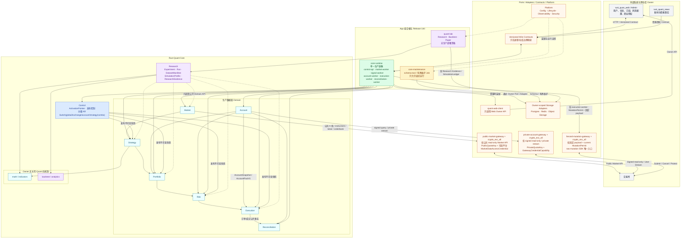
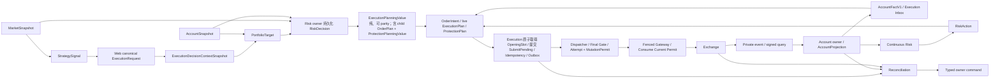

# Rust Quant 长期目标架构

- 状态：已接受
- 首次接受：2026-07-18
- 最近修订：2026-07-29
- 适用范围：中低频、多策略、多账户、多交易所的生产量化平台
- 代码放置细则：[业务代码与数据访问放置规范](business-code-and-data-access.md)
- 生产运行规范：[生产运行与恢复](production-runtime.md)
- 迁移实施计划：[架构迁移计划](migration-plan.md)

## 1. 文档目的

本文定义 Rust Quant Core 的长期目标，不以当前 `rust_quant` 中的 `services`、`orchestration`、`infrastructure`、单一 CLI 或 Web 执行任务表为目标形态。`rust_quant` 是迁移前 legacy 来源与过渡期治理基线，目标实现仓库是 `rust_quant_alpha`；仓库边界以 [ADR-0014](adr/0014-greenfield-target-repository-migration.md) 为准。历史实现如何迁入目标架构只记录在[架构迁移计划](migration-plan.md)，不得为了兼容旧代码污染长期业务模型。

目标架构必须让开发者和 AI 在修改前明确回答：

1. 这段代码改变哪个业务事实；
2. 该事实的唯一 owner 是谁；
3. 这是业务不变量、纯政策、用例编排、外部适配、跨进程合同还是进程装配；
4. 数据库读写、事务和外部副作用在哪里实现；
5. 重复、超时、部分成交和进程重启后由谁恢复。

不能回答以上问题的需求，不得先写入 `common`、`utils`、`services`、`core` 或任意现有大文件。

## 2. 适用边界

本架构长期适用于：

- 秒、分钟、小时级策略；
- 多策略资本分配、冲突处理和仓位净额；
- 多账户、多交易所自动执行；
- backtest、paper、shadow、canary、live 生命周期；
- 事前风险审批、持续风险、保护单和 kill switch；
- 订单恢复、交易所对账、审计和运营诊断；
- 先以模块化单体交付，再按独立故障或扩缩容证据拆分进程。

以下能力需要另立 ADR，不提前放入当前设计：

- 亚毫秒级或共址 HFT；
- 多地域主动—主动实盘执行；
- 用户上传任意代码并在生产运行；
- 超大规模分布式训练或回测集群；
- 跨交易所原子事务；
- 超越当前单账户 opening slot 基线的、同一账户多个独立开仓意图并发时的 Risk Reservation 协议（当前基线与升级触发条件见 §8.1）。

## 3. 架构原则

### 3.1 模块化单体优先

业务边界先在同一 Workspace 内由 Rust crate 和可见性规则隔离。只有出现独立扩缩容、故障隔离、安全边界或发布生命周期证据时，才增加独立进程或服务。

### 3.2 业务模块与进程不是一一对应

- Portfolio 是必要业务模块，但账户无关的候选排序与账户级资本分配必须分开：前者可在信号链路完成，后者必须在获得稳定账户上下文后执行；
- 用户自动交易路径中，账户级 Portfolio 与事前 Risk 默认由消费 `ExecutionRequest` 的 `execution-worker` 同步装配，不建立 `portfolio-worker`；这只是进程装配选择，不改变 Portfolio/Risk 的业务 owner；
- 事前 Risk 是确定性政策，和账户级订单准备链路同步执行；
- 持续 Risk 初期可由 `account-worker` 装配；只有出现独立吞吐或隔离需求时才增加 `risk-worker`；
- 每个策略默认是 Strategy 内的 module，不是独立 crate、Worker 或服务。

业务边界、Rust crate、运行进程和 CI/CD Release Unit 是四个不同概念：

- 先用 Domain module/crate 隔离业务 owner，不因新增策略或回测能力默认拆微服务；
- `signal-worker`、`execution-worker` 等生产 App 不得依赖 `strategy-candidates`、`domains/research`、`quant/backtest`、`quant/analytics` 或 `quant-lab`；
- Research 与生产 App 都依赖同一份 Strategy、Portfolio、Risk 和 Execution 公开业务实现，Research 不能反向提供“实盘依赖的业务包”；
- 六个生产角色各自使用独立 App Cargo package，但继续打入同一个 `core-runtime` 镜像；`schema-tool` 属于 `core-maintenance`，Research/Backtest/Analytics/Paper 研究入口属于 `quant-lab`，不是生产镜像内容；
- 只修改 `domains/research`、`quant/backtest`、`quant/analytics`、`strategy-candidates` 或 `apps/quant-lab` 时，目标 CI 只构建研究单元且不得触发生产部署；修改共享的 Strategy、Portfolio、Risk、Execution、Market、Contract 或生产 Adapter 时，必须按 Cargo 反向传递依赖触发受影响生产构建与 parity 回归；
- 如果“新增尚未发布的候选策略”频繁导致生产 App 无意义重建，可在 Strategy owner 内按发布生命周期拆成 `strategy-api`、`strategy-released` 与 `strategy-candidates` 三个 workspace package：`quant-lab` 可以依赖 released + candidates，生产 `signal-worker` 只能依赖 api + released；这是编译/发布隔离，不是新增微服务；
- 每个候选策略仍默认是 `strategy-candidates` 内的 module，不按策略建立服务或 crate。候选晋级 live 时必须进入 released catalog，冻结新的 Artifact/Release/RuntimeSnapshot，并重新通过生产构建与 parity；不能让 live App 在运行时依赖 Research 或直接加载候选目录；
- 是否增加独立服务只由扩缩容、故障隔离、安全边界或独立发布生命周期决定，不能用服务拆分掩盖错误的 crate 依赖。

### 3.3 目标状态与实际状态分离

- Strategy 产生预测和信号；
- Portfolio 将多个信号转成资本分配与目标仓位；
- Account 保存交易所实际余额、持仓、保证金和 PnL 投影；
- Risk 判断是否允许从实际状态变化到目标状态；
- Execution 将批准后的变化先转成纯 `ExecutionPlanningValue`，仅在 live transaction 中初始化 OMS 订单/保护 aggregate，并维护成交和保护状态。

### 3.4 Ports 与 Adapters

业务模块定义自己需要的 Port，Adapter 实现 Port。业务 model、policy 和 use case 不直接依赖 SQLx、Redis、HTTP Client、交易所 SDK、环境变量、Wire DTO 或数据库 Row。

### 3.5 App 是组合根

只有 `apps/*` 可以读取进程配置、创建连接池、选择 Adapter、完成 Contract 映射、装配 use case、管理循环与关闭。App 不实现交易业务规则。

### 3.6 控制面与数据面分离

控制面管理 ActivationPointer、发布控制、暂停语义和 Kill Switch，并协调各 owner 已发布版本/配置的分发；它不接管 StrategyRelease 或其他 Domain Policy 的事实。Market、Account 与 Execution 分别发布自己的动态决策 readiness 证据；Control 只能分发或聚合只读诊断，不能替这些 owner 判断“现在可否新增风险”。数据面处理行情、策略、组合、风险、订单和成交。交易热路径只使用已发布的不可变快照和 owner 的动态证据，不同步依赖管理 API。

### 3.7 至少一次、幂等和最终对账

外部 mutation 前，Risk owner 先按 `risk_evaluation_id` 持久化不可变审批；Execution 先生成纯、可审计的 `ExecutionPlanningValue`（含 child `OrderPlan` 与 `ProtectionPlanningValue`），再在单一 live owner transaction 中以其 hash 初始化 `OrderIntent`、持久 `ExecutionPlan` 与 `ProtectionPlan`，取得持久 `AccountOpeningSlot`，并原子提交首个持久状态 `SubmitPending`、幂等和 Outbox。事务提交后，Dispatcher 以 aggregate version/`send_claim`/fence 记录 attempt 并签发短期 `MutationPermit`；只有 Fenced Exchange Mutation Gateway 在网络 I/O 边界原子消费 current permit 后，才可在事务外调用 raw SDK。超时是 `Unknown`，不是失败；只有交易所能力可证明 `DefinitivelyAbsent`、不存在仍可发送的 permit，且 recovery transaction 新建提交 Outbox 时才沿原身份重试。系统不宣称跨 owner 数据库事务，也不宣称数据库与交易所之间的全局 exactly-once。完整顺序以 [ADR-0006](adr/0006-at-least-once-idempotency-and-recovery.md) 为唯一权威，事务实现边界见 [ADR-0007](adr/0007-owner-scoped-persistence-and-transaction-boundaries.md)。

### 3.8 Control 的激活指针与 Kill Switch 是两类分级控制事实

`StrategyRelease` 的生命周期与“当前是否选用某个发布物”不是同一事实：Strategy 是 `StrategyDefinition`、`StrategyArtifact`、`StrategyRelease` 和不可变 `StrategyRuntimeSnapshot` 的唯一 owner；Control 是可变 `ActivationPointer` 和 `KillSwitchSnapshot` 的唯一 owner。Control 只能指向已发布的 Strategy Runtime Snapshot，不能原地修改 Release 或 Snapshot；Strategy 也不能通过写 Release 自行激活。

`ActivationPointer` 的 scope 是明确的发布通道/运行范围（例如 `strategy_key + deployment_channel`）。每次指针变更递增该 scope 的单调 `activation_generation`；它只解决“选用哪个已发布 Snapshot”，不等于运行时 readiness，也不等于熔断。

“已发布”不足以成为激活条件。Strategy owner 必须为每个不可变 `StrategyRuntimeSnapshot` 发布可消费的 `ActivationEligibilityV1`，至少绑定 `runtime_snapshot_id/hash`、`strategy_release_id/generation`、Completed Evidence 引用、允许的 deployment channel、eligibility generation 与撤销状态；Control 只校验并记录这份 Strategy owner 资格，不能自行根据可变 Release 状态猜测可否激活。

| StrategyRelease stage | 允许 ActivationPointer channel | 约束 |
| --- | --- | --- |
| `Research` | 无 | Research 只经 `quant-lab`/ResearchRun 运行，不可被生产或 paper Pointer 选用 |
| `Paper` | `paper` | 无真实交易所 mutation 资格 |
| `Shadow` | `shadow` | 只观察/对照，不创建外部 mutation |
| `Canary` | `canary` | 仅通过明确的 canary 范围与额外授权 |
| `Live` | `live` | 必须满足 live Evidence、保护、readiness 与授权门禁 |
| `Retired` | 无 | Strategy owner 发布 revoked eligibility；Control 必须使现有 Pointer 失效 |

Pointer 写入必须同时记录所消费的 `ActivationEligibilityV1` identity/hash/generation；资格撤销、channel 不匹配、Evidence 不完整或目标 stage 不允许时拒绝写入。Control 接收到撤销后发布新的 catalog generation，不得保留可被数据面继续消费的旧 Pointer。

Kill Switch 的 scope 与写入 owner 固定如下：

| Scope | Scope key | 状态 owner | 合法请求来源 |
| --- | --- | --- | --- |
| `global` | 平台 | Control | 运营控制命令 |
| `exchange` | exchange | Control | 运营控制命令、Market/Account/Risk 的 typed 请求 |
| `account` | `execution_account_ref` | Control | Web 授权停用、Account/Risk 的 typed 请求 |
| `strategy` | `strategy_key@version` | Control | Strategy/Risk 的 typed 请求 |
| `combo` | Web combo identity | Control | Web 商业停用、Risk 的 typed 请求 |

规则：

- Control 维护全局单调的 `kill_switch_catalog_generation`，并为每个 `scope_key` 维护独立单调 `scope_generation`；二者都必须进入发布快照和审计。不得用一个无 scope 的 generation 同时表达所有停用与恢复；
- Kill Switch 状态是 Control 拥有、版本化、可被数据面本地读取的已发布快照，不是同步管理 API。RiskAction、账户凭证失效和 Web 停用只是发起 typed request，不能绕过 Control 直接写开关；
- 生效判定取“任一命中作用域为停用即停用”，上级停用不可被下级恢复覆盖；`global`/`exchange` 停用期间，`account`/`strategy`/`combo` 的恢复不得放行新开仓；
- 请求、批准、发布与解除都留审计。Dispatcher 在最终门禁重新读取最新已发布 catalog，并记录 preparation 时的 catalog/scope generation；Control 不替 Market、Account 或 Execution 宣布 readiness；
- Kill Switch 只阻断新增风险（开仓、加仓），不阻断 reduce-only 的保护、减仓和紧急平仓；后者仍走 Execution 状态机与恢复协议。

### 3.9 交易所配额是跨 App 的受管资源

交易所配额按访问性质分成两个绝不混用的预算：

- **私有账户预算**：`PrivateQuotaKey(exchange, credential_reference, endpoint_group)`，只用于用户已授权的 signed read-only、私有流、下单/撤单/保护和账户对账；
- **公共市场预算**：`PublicQuotaKey(exchange, endpoint_group, egress_identity, market_data_source_profile_id)`，只用于 Market 的公开 K 线、ticker、盘口和公开 instrument API。profile 可关联可缺失的非敏感 `MarketDataAccessCredentialRef`：有些交易所公开 API 不需要 Key，或仅用 Key 提升公共配额。

原始受保护配置统一称 `MarketDataAccessCredential`，只允许在 Market App/Gateway 的受保护配置或 Vault resolver 中以内存态使用；`MarketDataAccessCredentialRef` 与 `market_data_source_profile_id` 是可出现在公共配额、Evidence 或必要公共 Market Contract 中的非敏感标识。它们都不是 Web 用户 `credential_reference`，不代表交易权限，不可用于 Account `ExchangeSession`、signed preflight、Risk、`ExecutionRequest`、任何 Decision Context、MutationPermit 或私有流；Market worker 也不得用用户凭证采集公共行情。反过来，用户 credential 不得借“市场数据”名义绕过 Gateway 的私有能力门禁。

`exchange-gateway` 可以保持一个 Adapter crate，但必须暴露三个不可互换的 capability boundary：`public-market-gateway` 只调用公开 read-only endpoint 并可选使用平台 `MarketDataAccessCredential`；`private-account-gateway` 只处理用户 capability 解出的 signed read-only/private stream；`fenced-mutation-gateway` 只接受 Execution 的固定 payload + current `MutationPermit`。三者不得共享 credential material、quota key、调用入口或 raw mutation client。

- 交易所配额是一等受管资源，owner 是 `exchange-gateway` Adapter；它按上述两类 key、操作类别、优先级、成本和有效期记账与准入，不是各 App 进程内各自为政的 backpressure；
- 热路径 mutation（下单、撤单、保护单）在**同一私有账户预算**紧张时优先于只读对账；公共行情预算只能影响 Market 降级/退避，绝不与用户 mutation 争用同一 credential 桶；
- 配额准入失败属于可恢复门禁，使用持久 `next_eligible_at`/事件触发重新唤醒，不制造进程内热重试；
- 单一 App 无法独占或耗尽共享 key 的全部配额而使同类角色饿死；分配策略与优先级由 Gateway 显式声明，不隐藏在调用点。

共享配额不能只靠进程内 `Mutex`、本地 token bucket 或“调用方自觉退避”实现。首个会让同一 key 被多个 App/实例并发使用的切片之前，`exchange-gateway` 必须提供 `ExchangeQuotaAdmissionPort`，并接入跨进程原子协调器：Redis 的脚本化 token bucket/lease，或具有等价原子语义与过期恢复规则的 Postgres 实现。协调记录至少包含 quota key 类型、操作类别、优先级、成本和有效期；进程重启必须复用未过期的协调状态，协调器不可用时不得为 live mutation 发放准入，只能以带 `next_eligible_at` 的 Blocked/Retryable 结果回到 owner 的持久重试流程。该协调状态是 Adapter 技术状态，不把配额政策或账户风险判断塞进 Domain。

## 4. 目标架构总览与物理目录

### 4.1 逻辑、运行与工件总览


```mermaid
flowchart TB
    subgraph EXT["外部系统与跨仓库 Owner"]
        direction LR
        WEB["rust_quan_web / Admin<br/>用户、会员、订阅、风险配置、商业授权"]
        NEWS["rust_quant_news<br/>新闻与情报事实"]
        EXCHANGE["交易所"]
    end

    subgraph APPS["App 组合根与 Release Unit"]
        direction LR
        RUNTIME["core-runtime<br/>单一生产镜像<br/>control-api · market-worker · signal-worker<br/>account-worker · execution-worker · reconciliation-worker"]
        MAINT["core-maintenance<br/>schema-tool / 有界维护 Job<br/>只允许显式运行"]
        LAB["quant-lab<br/>Research · Backtest · Paper<br/>无生产部署资格"]
    end

    subgraph CORE["Rust Quant Core"]
        direction TB

        CONTROL["Control<br/>ActivationPointer · 发布控制<br/>分级 Kill Switch(global/exchange/account/strategy/combo)"]

        subgraph DATA["生产数据面 Domain"]
            direction LR
            MARKET["Market"] --> STRATEGY["Strategy"] --> PORTFOLIO["Portfolio"] --> RISK["Risk"] --> EXECUTION["Execution"] -->|"订单/成交公开事实"| RECON["Reconciliation"]
            ACCOUNT["Account"] --> PORTFOLIO
            ACCOUNT --> RISK
            ACCOUNT -->|"AccountSnapshot / AccountFactV1"| EXECUTION
            ACCOUNT --> RECON
        end

        RESEARCH["Research<br/>Experiment · Run · DatasetManifest<br/>SimulationProfile · ResearchEvidence"]

        subgraph QUANT["Owner 无关的 Quant 纯机制"]
            direction LR
            QMI["math / indicators"]
            QBA["backtest / analytics"]
        end
    end

    subgraph BOUNDARY["Ports / Adapters / Contracts / Platform"]
        direction LR
        CONTRACTS["Versioned Wire Contracts<br/>只在进程/仓库边界映射"]
        WEBCLIENT["quant-web-client<br/>只调用 Web Owner API"]
        STORAGE["Owner-scoped Storage Adapters<br/>Postgres · Redis · Object Storage"]
        PUBLIC_GATEWAY["public-market-gateway + crypto_exc_all<br/>仅公共 read-only Market API<br/>PublicQuotaKey + 可选平台 MarketDataAccessCredential"]
        PRIVATE_GATEWAY["private-account-gateway + crypto_exc_all<br/>仅 signed read-only / private stream<br/>PrivateQuotaKey + GatewayCredentialCapability"]
        MUTATION_GATEWAY["fenced-mutation-gateway + crypto_exc_all<br/>仅固定 payload + current MutationPermit<br/>raw mutation SDK 唯一入口"]
        PLATFORM["Platform<br/>Config · Lifecycle · Observability · Security"]
    end

    WEB <-->|"HTTP / Versioned Contract"| CONTRACTS
    NEWS -->|"情报事实 Contract"| CONTRACTS
    CONTRACTS <--> RUNTIME

    RUNTIME --> CONTROL
    RUNTIME --> MARKET
    RUNTIME --> STRATEGY
    RUNTIME --> ACCOUNT
    RUNTIME --> PORTFOLIO
    RUNTIME --> RISK
    RUNTIME --> EXECUTION
    RUNTIME --> RECON

    CONTROL -->|"发布不可变快照"| STRATEGY
    CONTROL -->|"发布不可变快照"| PORTFOLIO
    CONTROL -->|"发布不可变快照"| RISK
    CONTROL -->|"发布不可变快照"| EXECUTION

    LAB --> RESEARCH
    RESEARCH -. "只调用公开 Domain API" .-> MARKET
    RESEARCH -.-> STRATEGY
    RESEARCH -.-> PORTFOLIO
    RESEARCH -.-> RISK
    RESEARCH -.-> EXECUTION

    STRATEGY --> QMI
    RESEARCH --> QMI
    RESEARCH --> QBA

    RUNTIME -->|"需要时装配"| WEBCLIENT
    WEBCLIENT -->|"Owner API"| WEB
    RUNTIME -->|"通过 Owner Port / Adapter"| STORAGE
    MAINT -->|"Schema / 有界维护"| STORAGE
    LAB -->|"仅 Research Evidence / SimulationLedger"| STORAGE
    MARKET -->|"公共 K 线 / instrument / ticker / orderbook"| PUBLIC_GATEWAY
    ACCOUNT -->|"signed query / private stream"| PRIVATE_GATEWAY
    RUNTIME -->|"仅 execution-worker：MutationPermit + 固定 payload"| MUTATION_GATEWAY
    PUBLIC_GATEWAY <-->|"Public Market API"| EXCHANGE
    PRIVATE_GATEWAY <-->|"Signed read-only / User Stream"| EXCHANGE
    MUTATION_GATEWAY <-->|"Submit / Cancel / Protect"| EXCHANGE
    PLATFORM -. "装配与运行支撑" .-> RUNTIME
    PLATFORM -.-> MAINT
    PLATFORM -.-> LAB

    classDef external fill:#f3f4f6,stroke:#64748b,color:#0f172a;
    classDef runtime fill:#dcfce7,stroke:#15803d,color:#14532d;
    classDef maintenance fill:#fef3c7,stroke:#b45309,color:#78350f;
    classDef research fill:#f3e8ff,stroke:#7e22ce,color:#581c87;
    classDef control fill:#dbeafe,stroke:#1d4ed8,color:#1e3a8a;
    classDef domain fill:#ecfeff,stroke:#0e7490,color:#164e63;
    classDef boundary fill:#fff7ed,stroke:#c2410c,color:#7c2d12;

    class WEB,NEWS,EXCHANGE external;
    class RUNTIME runtime;
    class MAINT maintenance;
    class LAB,RESEARCH,QBA research;
    class CONTROL control;
    class MARKET,STRATEGY,PORTFOLIO,RISK,EXECUTION,RECON,ACCOUNT,QMI domain;
    class CONTRACTS,WEBCLIENT,STORAGE,PUBLIC_GATEWAY,PRIVATE_GATEWAY,MUTATION_GATEWAY,PLATFORM boundary;
```

读图规则：

- 本图表达长期目标，不代表当前总 CLI、legacy crate 或现有生产镜像已经完成迁移；
- 箭头表达业务流、公开 API 调用或边界交互，不表示每个 Domain 都是独立服务；
- `core-runtime`、`core-maintenance`、`quant-lab` 是工件边界，不是业务 owner；六个生产 App 是独立 Cargo package，但共享一个生产镜像；
- 生产 Domain 不依赖 Research、`quant/backtest` 或 `quant/analytics`；Research 只能通过稳定公开 API 复用生产业务实现；
- Strategy、Portfolio、Risk、Execution 分别拥有自己的 Policy Snapshot 内容和校验；Strategy 管理 Release 生命周期，Control 只管理 ActivationPointer、分级 Kill Switch 与发布控制，不能接管其他 owner 的版本内容或 lifecycle；
- Domain 定义所需 Port，App 装配 Adapter；图中的 Storage/Gateway 连线不授权 App 或 Domain 绕过 Port 直接访问 SQL/SDK；
- Web/Admin 与 Core 只通过版本化 Contract 和 owner API 协作，不共享数据库或 ORM；
- 只有 `execution-worker` 可以把已持久化的 MutationPermit 和固定 payload 交给 Fenced Mutation Gateway；其他 App 不可达 raw mutation SDK；
- `exchange-gateway` 在同一 Adapter crate 中按 capability boundary 分成 `public-market-gateway`、`private-account-gateway` 与 `fenced-mutation-gateway`：前者只拥有公共 Market 配额和可选平台 Key；中者只拥有用户 signed read-only/private stream 配额与 capability 解析；后者是唯一 raw mutation SDK 入口。私有 mutation 优先于同账户只读拉取，公共行情不与用户 mutation 共用 credential 桶；Control 的分级 Kill Switch 以已发布快照下发，数据面本地读取并 fail-closed；
- `quant-lab` 的存储访问仅限 Research owner 的 Scenario、Run、SimulationLedger 与 Evidence；历史 Market 数据只能通过 Market 的稳定 historical API/Contract 读取，不能直连 Market Storage、触发 backfill 或持有 `MarketDataAccessCredential`。它不写生产 Order、Fill 或 Account 事实表，也没有生产部署和实盘 mutation 资格。

### 4.2 目标物理目录

```text
rust_quant/
├── apps/
│   ├── control-api/                 # Core 控制面与 internal API
│   ├── market-worker/               # 参考数据(fail-closed)与实时行情流(可降级),质量和快照
│   ├── signal-worker/               # MarketSnapshot -> StrategySignal；含雷达 handoff 消费和向 Web 提交信号
│   ├── account-worker/              # 余额、持仓、成交、持续风险投影与 ExchangeSession readiness
│   ├── execution-worker/            # ExecutionRequest -> 账户级 Portfolio/Risk -> OMS
│   ├── reconciliation-worker/       # 对账、恢复任务和人工升级
│   ├── schema-tool/                 # migration 与 schema 检查
│   └── quant-lab/                   # 薄研究与回测入口
│
├── crates/
│   ├── domains/
│   │   ├── control/                  # 控制面 owner:ActivationPointer、发布控制、分级 KillSwitchSnapshot
│   │   ├── market/                   # 内部 module 分 reference/(参考数据,fail-closed) 与 stream/(实时行情流,可降级)
│   │   ├── strategy/                 # 含 signal handoff/提交职责:向 Web 提交 StrategySignal（不匹配订阅、不创建商业请求）
│   │   ├── portfolio/
│   │   ├── account/                  # 含 ExchangeSession 子职责(会话 readiness 语义与 fail-closed 判定)
│   │   ├── risk/
│   │   ├── execution/
│   │   ├── reconciliation/
│   │   └── research/                 # Experiment、BacktestRun、Evidence
│   │
│   ├── quant/
│   │   ├── math/
│   │   ├── indicators/
│   │   ├── backtest/
│   │   └── analytics/
│   │
│   ├── contracts/                   # 仅 Core owner 的业务 Contract + owner-neutral Envelope primitives
│   │   └── src/{envelope,control,market,strategy,portfolio,account,risk,execution,reconciliation,research}/v1/
│   │
│   ├── adapters/
│   │   ├── postgres/                # 一个 crate，内部按 owner 分模块
│   │   │   └── src/{control,market,strategy,portfolio,account,risk,execution,reconciliation,research}/
│   │   ├── exchange-gateway/        # 封装 crypto_exc_all；内部拆 public-market / private-account / fenced-mutation capability boundary
│   │   ├── quant-web-client/        # 只调用 quant_web owner API
│   │   ├── redis/
│   │   ├── object-storage/
│   │   └── notification/
│   │
│   └── platform/
│       ├── kernel/                   # ID、Clock 等极小稳定基础
│       ├── messaging/
│       ├── lifecycle/
│       ├── observability/
│       ├── security/
│       └── testkit/                  # 只允许测试依赖
│
├── release-units/                   # core-runtime/core-maintenance/quant-lab 机器可读清单
├── migrations/                      # 单一有序 SQLx migration 流
├── tests/
│   ├── architecture/
│   ├── contracts/
│   ├── parity/
│   ├── recovery/
│   └── e2e/
├── templates/
│   ├── command-slice/
│   ├── query-slice/
│   └── event-consumer/
├── docs/architecture/
└── xtask/                            # cargo xtask arch-check
```

这是一张目标地图，不要求提前创建空目录或空 crate：

- `contracts` 和 `postgres` 默认各保持一个 crate，通过内部 owner module 隔离；
- 跨仓库业务 payload 必须随其事实/command owner 的仓库发布：Core `crates/contracts` 只定义 Core owner payload，不复制 Web 或 News 的业务 DTO；`quant-web-client`、News ingress 等 Adapter 使用 owner 发布的版本化绑定。唯一可跨 owner 共享的是无业务字段的 `ContractEnvelopeV1` wire primitive，Envelope 与业务 payload 分离，二者各自执行 N/N-1 解析与快照测试；
- Strategy 默认保持一个 crate；只有候选与已发布策略已经出现独立编译和发布生命周期证据时，才按第 3.2 节拆成 api/released/candidates 三个 catalog 级 package，不按单个策略拆包；
- 只有真实编译隔离、重依赖、独立 owner 或发布需求出现时，才拆成更多 crate；
- `risk-worker`、`portfolio-worker` 不是默认目录，只有运行证据支持时再增加；
- `domains/market` 内部必须区分 `reference`(参考数据,fail-closed)与 `stream`(实时行情流,可降级)两个 module,各自独立的新鲜度阈值与 readiness,不得共用一个健康判定(见 §5 表注);现阶段用 module 隔离即可,不拆 crate;
- 雷达候选信号的 handoff/提交是 Strategy owner 的编排子职责,由 `signal-worker` 装配;它经 `quant-web-client` 调用 Web owner API 的 `CreateExecutionRequestFromSignalV1`，只提交版本化 `StrategySignal` 与幂等身份。订阅匹配、用户/凭证/风险配置读取、canonical `ExecutionRequest` 创建和扇出全部留在 Web；Core 不直连 Web 库，也不与 Strategy 的信号评估纯逻辑混在同一 module;
- `ExchangeSession` 是 `domains/account` 内的子职责(会话 readiness 语义与 fail-closed 判定),底层连接/listenKey/配额机制复用 `adapters/exchange-gateway`,不拆独立 crate 或 worker(见 §5 表注与 [ADR-0012](adr/0012-multi-tenant-private-stream-management.md));ExchangeSession 的运行时状态(healthy/stale、最后消息墙钟时间、水位闭合时间、重连次数)是高频易变的运行时事实,持久化落 `adapters/redis`,进程重启后靠重连 + 快照闭合重建,不进 Postgres 事实表;
- 雷达候选信号的 handoff 中转表归 **Strategy owner** 的持久化事实(信号候选是 Strategy 的事实,表名 `market_velocity_live_handoff` 只是历史命名),落 `adapters/postgres/strategy` 模块与单一 migration 流;`signal-worker` 消费它并经 `quant-web-client` 提交信号，收到 Web 的幂等 receipt 后才标记 handoff 完成;
- `control` 是控制面 owner，只拥有 ActivationPointer、发布控制与分级 KillSwitchSnapshot 已发布快照；StrategyRelease/RuntimeSnapshot 仍属于 Strategy。Market、Account、Execution 分别拥有各自数据新鲜度、ExchangeSession 和执行可用性证据。Control 可以聚合它们的只读诊断视图，但不得把聚合视图写成这些 owner 的 readiness 事实，也不得替它们在热路径作放行判断;
- `release-units/*.toml` 是 CI、镜像和部署合同的共同输入；生产镜像的 binary 集合必须与 allowlist 完全一致；
- Migration 保持一个 SQLx 可确定排序的目录，不按 owner 建立相互独立的迁移序列。这一条以**当前单一 owner database 前提**成立；一旦某 owner（如 Market 海量 K 线）因容量、保留期或独立扩缩容出现拆分独立存储的实证需求，须另立 ADR 定义该 owner 的独立 migration 序列与切分边界，届时才解除本约束，而不是把单一 migration 流当作永久教条。

`quant` 只保存 owner 无关的确定性机制：

- `math`、`indicators` 是生产 Domain 可依赖的纯计算基础；
- `backtest` 只包含 Deterministic Clock、Event Scheduler、Replay、撮合、费用、滑点和资金费模型；
- `analytics` 只对权益、成交和事件序列计算指标；
- `quant/*` 不依赖任何业务 Domain、Adapter、数据库或环境变量。

Experiment、BacktestRun、Checkpoint、DatasetManifest、SimulationProfile 和 ResearchEvidence 有独立生命周期，归 `domains/research`。Research 是终端离线 Domain：历史 K 线、instrument 与数据指纹只通过 Market 的稳定 historical API/Contract 读取；它再通过稳定 API 编排 Strategy、Portfolio、Risk、Execution 的纯规划能力与 Quant Kernel。Research 不直连 Market Storage、不触发 backfill、不持有平台公共 Market 凭证；生产 Domain 不依赖 Research。详细规则见[依赖与代码归属规则](dependency-rules.md)和 [ADR-0009](adr/0009-research-domain-and-tiered-simulation.md)。

## 5. 业务模块职责

| 模块 | 拥有的事实与规则 | 明确不负责 |
| --- | --- | --- |
| Control | `ActivationPointer`、`activation_generation`、`KillSwitchSnapshot`、`kill_switch_catalog_generation`、scope generation、发布控制与审计 | StrategyRelease 生命周期、Market/Account/Execution readiness 事实、直接交易所调用 |
| Market | instrument、symbol、精度、交易能力、K 线、tick、盘口、资金费率、数据质量、市场快照、`MarketDecisionReadiness` 与已解析市场证据集合 | 策略结论、资本分配、下单 |
| Strategy | Strategy Definition、evaluator、registry、评估状态、信号、预测、置信度、证据截止时间，以及 signal handoff/提交子职责（雷达候选信号持久化、向 Web 提交版本化 `StrategySignal` 并处理 receipt） | 资金分配、账户读取、真实下单、订阅匹配、用户/凭证/风险配置读取、创建 Web 商业请求、直连 Web 库 |
| Portfolio | 资本预算、策略组合、目标仓位、目标权重、冲突处理和净额合并 | 实际持仓、风险放行、订单协议 |
| Account | 实际余额、持仓、敞口、保证金、PnL、手续费/返佣/资金费现金流事件、账户投影数据新鲜度、`ExchangeSession` 运行时 readiness，以及对 Web 账户绑定的 `AccountAdmissionEvidenceV1` | 目标仓位、策略判断、订单提交、用户 API Key 的商业配置、底层连接/listenKey/配额机制 |
| Risk | risk evaluation/decision、PreTradeSnapshot(下单前冻结的市场/账户/组合/规格证据)、事前审批、持续敞口、回撤、保证金、保护要求、RiskAction 与 Kill Switch typed request | 策略预测、交易所协议、KillSwitchSnapshot 事实、订单持久化 |
| Execution | 纯 `ExecutionPlanningValue`、AccountOpeningSlot、ExecutionDecisionContextSnapshot、OrderIntent、live `ExecutionPlan`、mutation attempt/permit、Outbox，以及由 Gateway result、`AccountFactV1` 和 Reconciliation evidence 推进的 OMS 订单/累计成交/撤单/保护状态机 | 原始交易所私有流/查询事实、AccountProjection、策略计算、资本分配、风险政策 |
| Reconciliation | 交易所差异、恢复任务、补偿编排和处置证据 | 绕过 owner 修改订单、账户或风险状态 |
| Research | Experiment、BacktestRun、DatasetManifest、SimulationProfile 配置实例、模拟账户初态、SimulationLedger(模拟事实,带 BacktestRunId,非 AccountProjection)、Checkpoint、ResearchEvidence 和证据发布 | 原始行情事实、Strategy Definition、生产订单/账户事实、模拟成交算法本身(归 quant/backtest)、live promote |

`Reconciliation` 取代含义过宽的 `Operations`。日志、指标、审计传输和通知等通用技术能力属于 Platform 或 Adapter；运行恢复命令仍回到对应 domain owner，避免 Reconciliation 变成新的杂物筐。

关于表内几个易混淆的边界：

- Market 内含两类新鲜度与故障策略完全不同的子职责：**参考数据**（instrument、精度、tick size、最小下单量、上下架、交易能力）低频强一致，错误直接导致下单精度/数量算错，必须 fail-closed；**实时行情流**（tick、盘口、K 线）高吞吐，可对观测/展示降级。两者共用 Market owner 但必须有各自的新鲜度阈值与 readiness，不得用同一个健康判定覆盖；
- 对“能否新增风险”不能只写“流可降级”。Market 必须为每个 `exchange + instrument + timeframe + market_data_source_profile_id` 发布动态 Domain value `MarketDecisionReadiness`（跨 Owner wire Contract 为 `MarketDecisionReadinessV1`），至少带 reference readiness、最后 confirmed event time、observed wall-clock、continuity/gap generation、质量/数据源 identity、`fresh_until_wall_clock` 与 `ReadyForNewRisk / StaleOrGapped / ReferenceInvalid / Unknown` 状态。它是动态 Evidence，不属于 Control、不可变 Policy Snapshot 或 Decision Context。
  - Strategy owner 在不可变 RuntimeSnapshot 中声明版本化 `RequiredMarketEvidenceV1`：按稳定排序的需求集合至少包含 market role、具体或由执行账户绑定解析的 `exchange + instrument`、timeframe、`market_data_source_profile_id`、最大年龄/连续性规则与 bar finality（`confirmed_close` 或已显式批准的 `intrabar`）。Strategy 拥有“需要什么”的声明；Market 拥有每一项 readiness 和解析结果。
  - 对一次具体决策，Market 把该声明解析为 `ResolvedMarketEvidenceSetV1`，记录每一项实际 key、source profile、confirmed event time、sequence/gap generation、finality、readiness identity/hash 与集合 aggregate hash。多周期策略必须列出全部周期；未完成的 4H/1D bar 不得被当成已 confirmed 的 bar 使用。允许 intrabar 的策略也必须在 Snapshot 中显式声明，并把当时 sequence/observed time 固定为证据，禁止以后续收盘 K 线补造当时判断。
  - 新增风险的 aggregate 只有在**所有** RequiredMarketEvidence 都在该 `DecisionTime` 满足已声明的 finality/连续性、并在 `prepared_at` 满足新鲜度时才是 `ReadyForNewRisk`；任何一项 `StaleOrGapped`、`ReferenceInvalid` 或 `Unknown` 都 fail-closed。数据源 fallback 只能由 Snapshot 中明确的有序等价 profile 规则选择，Market 必须把最终选择的 profile 和理由写入集合；不得以“任一一项 Ready”或隐式换源放行。
  - Risk 的 `PreTradeSnapshot` 冻结整个 `ResolvedMarketEvidenceSetV1` 及 aggregate hash；Dispatcher 最终门禁重新核验仍然有效的 Market readiness，但不得重算策略输入或将单项 Ready 代替集合。保护、减仓、紧急平仓只能使用已声明的可证明 mark/fallback 路径，不能借“行情降级”放宽风险；
- `ExchangeSession` 是一等运行时事实，owner 归 **Account domain**，每个稳定 `ExchangeAccountRef` 只有一个逻辑会话身份，与 Account 的账户投影新鲜度**正交**（会话可在无任何持仓/余额变动时独立劣化，如 listenKey 过期或 Key 被冻结；余额也可在会话正常时因拉取滞后而 stale）。credential revision/revocation generation 只是 capability/Evidence 版本；轮换必须递增 session generation 并重新闭合水位，不能创建第二个物理账户会话、lease、shard 或 opening slot。三方边界定死：
  - **Web** 拥有用户 API Key 的**商业配置态**（§7.4 的 `credential_reference`、产品资格、启停），不拥有运行时健康；
  - **`exchange-gateway` Adapter** 拥有**底层机制**——连接/listenKey 维护、签名探测、冻结错误归一、以及 §3.9 的私有账户配额记账；
  - **Account domain** 拥有**会话 readiness 语义与 fail-closed 决策**：聚合 gateway 上报的底层事实，判定某账户当前是否可安全新开仓；签名失效、交易所冻结、User Stream 断线或 preflight 未过时，依赖该账户的新开仓 fail-closed，不临时探测后放行；
  - 用户 `credential_reference` 只是一条 Web owner 授权引用。只有 Fenced Gateway 可以调用 Web owner 的 `IssueGatewayCredentialCapabilityV1` 请求 audience-bound、一次性或短 TTL 的不透明 `GatewayCredentialCapability`，并仅在内存中经 `CredentialMaterialResolverPort` 解析为签名材料；它必须绑定 exchange、`execution_account_ref`、`ExchangeAccountRef`、binding version、credential revision/revocation generation 与允许操作（signed read-only/private stream/mutation，mutation 还绑定 current permit）。Domain、Dispatcher、Outbox、普通 Contract、日志和持久化都不得包含原始材料；能力失效、撤销、过期或 resolver 不可用时 fail-closed；
  - 平台固定的原始 `MarketDataAccessCredential` 只由 Market App/Gateway 在公共 read-only Market API 上可选、内存态使用；公共配额/证据/必要 Market Contract 只可传其非敏感 `MarketDataAccessCredentialRef` 或 `market_data_source_profile_id`。二者均不能触发或维持 ExchangeSession，不能被提升为 GatewayCredentialCapability，也不得进入任何执行或用户授权对象；
  - `ExchangeSession` 不拆独立 crate 或 worker：无独立扩缩容/发布证据，拆进程只会制造分布式会话状态一致性问题；它是 Account domain 内的子职责，底层机制复用 gateway；多租户私有连接的容量分阶段、分片/lease、降级态与恢复见 [ADR-0012](adr/0012-multi-tenant-private-stream-management.md) 与 [生产运行 §10.2](production-runtime.md)；
- **Web-owned `ExecutionAccountBindingV1` 与 Account-owned `AccountAdmissionEvidenceV1`** 必须把商业授权、稳定账户身份和运行时观察分开：
  - Web 为每个可执行用户账户发布版本化 `ExecutionAccountBindingV1`，它拥有稳定的 `execution_account_ref`、不透明稳定的 `ExchangeAccountRef`、exchange、产品/账户作用域、`credential_reference`、credential revision/revocation generation、binding version 与商业启停状态。`ExchangeAccountRef` 不是交易所展示名称、原始外部 account id 或 credential；同一外部账户的 credential rotation 保持该 ref、递增 credential/binding version，而 exchange 或外部账户变更必须创建新的 ref。产品、保证金或持仓模式等会影响执行语义的变更至少创建新的 binding version；
  - Account 不拥有该商业绑定，也不持有秘密。它只依据 Gateway 的 signed preflight、ExchangeSession、账户投影和交易所返回事实发布动态 `AccountAdmissionEvidenceV1`，并绑定 `execution_account_ref`、`ExchangeAccountRef`、binding version、credential revision/revocation generation、非敏感 observed account fingerprint hash、exchange/product、保证金/持仓模式、能力/权限结论、projection watermark 与 `valid_until_wall_clock`；
  - `ExecutionRequest` 必须冻结 binding identity/version，Account admission 只有在所有这些绑定字段与当前 request/Gateway capability 一致、且证据未过期时才可为新风险返回 Ready。credential rotation、撤销、外部账户不一致、模式变化或 preflight/session/projection 不满足时，旧 Evidence 立即不能为新开仓放行；这只是验证 Web 用户账户绑定，不产生 Core 自营账户或系统执行请求路径；
- Portfolio 对单个用户 `strategy × symbol` combo 通常退化为“单目标直通”（一个 combo 对应一个仓位，净额/冲突/资本分配为恒等）；当同一**已授权用户执行账户**同时启用多个 combo 时，才使用完整的净额合并与资本预算。两种形态走同一 Portfolio API，不得因单 combo 简单而绕过该阶段，也不得新增脱离用户授权的账户路径；
- 交易所配额记账（§3.9）归 `exchange-gateway` Adapter，不是某个 Domain 的业务事实，也不属于任何单个 worker。

## 6. Domain 内部标准结构

每个 Domain 默认使用同一种导航结构：

```text
crates/domains/execution/src/
├── model/                           # 实体、值对象、状态机和不变量
├── policies/                        # 纯决策规则，不执行 I/O
├── use_cases/
│   ├── commands/                    # 改变状态的业务动作
│   ├── queries/                     # 只读业务查询
│   └── consumers/                   # 消费事件后调用 command/query
├── ports/                           # 本 Domain 需要的外部能力 Trait
├── api/                             # 允许其他 Domain 使用的稳定进程内 API
└── lib.rs                           # 只重导出 api 与必要稳定类型
```

放置判断：

- “任何情况下都必须成立”放 `model`；
- “基于输入作出可替换的纯决策”放 `policies`；
- “按顺序读取、判断、写入、发事件”放 `use_cases`；
- “需要数据库、交易所、HTTP、时钟或消息能力”先在 `ports` 表达；
- SQLx、Reqwest、Redis 和 SDK 实现放 `adapters`；
- HTTP/消息 DTO 到用例 Input 的映射放 App 或入站 Adapter。

详细 CRUD、事务和代码示例见[业务代码与数据访问放置规范](business-code-and-data-access.md)。

### 6.1 Rust 业务代码形态

Rust 不采用“所有业务逻辑都包装成 Service 对象”的 Java 式分层。先确定事实 owner，再根据身份、状态、不变量、纯度和 I/O 选择代码形态：

| 业务特征 | 代码形态 | 约束 |
| --- | --- | --- |
| 有稳定身份、生命周期或跨字段不变量 | Entity/Aggregate：`struct`/`enum` + `impl` | 关键字段不得被调用方任意修改；状态变化使用业务动词并返回显式错误/事件 |
| 无身份但有单位、范围或组合合法性 | Value Object：不可变 `struct`/`enum` | 构造时校验；不读取 I/O 或全局配置 |
| 完整输入到输出的无状态确定性计算 | module 内自由纯函数 | 所有输入显式传入；不创建零字段 `*Calculator`/`*Service` 充当命名空间 |
| 多个纯决策共享不可变、带版本配置 | Policy 对象：配置快照 + `evaluate`/`plan` | 不持有可变全局状态，不执行 I/O |
| 跨事件维护滚动或生命周期状态 | 显式状态对象或纯 transition | 状态 identity 完整；backtest/live 调用同一 transition |
| 编排读取、判断、持久化和事件 | Use Case 对象 | 只持有所需 Port；不承载数据库/SDK 实现 |
| 数据库、HTTP、Redis、交易所技术状态 | Adapter 对象 | 实现消费方定义的 Port，不作业务决策 |
| 存在真实多实现、进程内稳定 API 或测试替身 | Trait | 不为单一实现或“以后可能扩展”创建基类式 Trait |

`impl` 只在“数据与行为必须一起保护语义”或“对象需要持有依赖/配置”时使用。仅为了 `Type::function()` 语法创建的零状态结构体应改为 module + function；一个函数同时修改 Strategy、Portfolio、Risk、Execution、Research 多个 owner 状态时，也不能通过移动进某个 `impl` 伪装成 Aggregate。

一个 Domain 内部允许再按子领域切 module,以承载 SLA/职责显著不同的子部分,而不必立刻拆成独立 crate:

- `domains/market` 内部分 `reference/`(参考数据,fail-closed)与 `stream/`(实时行情流,可降级),两者各自的 model/policies/ports,共享 domain 的 `api`;
- `domains/account` 内部含 `exchange_session`(会话 readiness 语义)子领域,与账户投影正交;
- `domains/strategy` 内部含 signal handoff/提交子领域(handoff 消费、向 Web 提交 `StrategySignal`、处理幂等 receipt),与信号评估纯逻辑分开 module,不混在同一处；订阅匹配和 `ExecutionRequest` 扇出仍是 Web 内部业务。

子领域 module 只是 domain 内部组织,不改变"对外只暴露 domain `api`、跨 domain 不碰对方私有 module"的约束(§7.1);出现独立编译、重依赖或独立发布证据时,才升级为独立 crate。

详细判定、代码示例和禁止模式见[业务代码与数据访问放置规范](business-code-and-data-access.md)。

## 7. 进程内与跨进程边界

### 7.1 同进程跨 Domain

只允许依赖上游 Domain 的 `api` 或稳定公开类型。禁止访问其他 Domain 的私有 module、Repository Port、数据库 Row 或表。

控制面依赖是一种特殊形态,要与"同步调 domain api"区分:数据面对 `control` owner 的依赖是**读取已发布的不可变快照**(Policy Snapshot、分级 Kill Switch),这些快照在交易热路径本地读取(§3.6),不是在热路径同步调用控制面的 api。数据面不得在下单热路径同步依赖控制面管理 API 的可用性;控制面不可用时,数据面按最近已发布快照运行或 fail-closed。

### 7.2 跨进程或跨仓库

使用 owner 明确、带版本的 Contract 和 owner service API/Event：

- Core 不能直连 `quant_web` 数据库；
- Web/Admin 不能直写 `quant_core`；
- Exchange 协议只经 `exchange-gateway -> crypto_exc_all`；
- News 只能提供情报事实，不能直接生成可执行订单。

跨仓库 Contract 的 source of truth 固定如下：业务 payload 随事实或 command 的唯一 owner 仓库发布，producer 与 consumer 固定引用该 owner 发布的版本；Core `crates/contracts` 只保存 Core owner payload，不镜像 Web/News 的 DTO。所有消息/HTTP body 都由 `ContractEnvelopeV1` 与 owner payload 组成：Envelope 只含 `contract_name/version`、message/correlation/causation/idempotency、aggregate/sequence、partition 和 transport time 等中性 wire identity；业务字段只在 payload。Envelope 不能承载用户 credential、风险配置、订单或 owner 业务字段，也不能借共享 Envelope 改变 payload owner。Envelope 和 payload 各自有 schema、golden serialization、N/N-1 解析与 producer/consumer 兼容测试。

跨仓库协作必须以 owner command/contract 为边界：

- **Core Strategy → Web**：`POST /api/commerce/internal/v1/execution-requests/from-strategy-signal`，Contract 名为 `CreateExecutionRequestFromSignalV1`。请求只携带 `strategy_signal_id`、策略 identity/version、instrument/timeframe、方向、evidence cutoff、correlation/idempotency identity 与允许展示的信号证据；不得携带用户、订阅、credential、risk profile 或已组装的 `ExecutionRequest[]`。Web 在自己的事务中匹配当前商业资格并创建 canonical `ExecutionRequest`/`execution_tasks`，返回可幂等处理的 receipt；
- **Web → Core Strategy**：订阅型定期评估由 Web 发出版本化 `EvaluateAuthorizedComboV1`（combo identity、策略/标的和幂等身份，不是执行授权），或消费已有 StrategySignal；Core 只负责评估并返回/提交 `StrategySignal`，不读取订阅表；
- **Web → Core Execution**：`execution-worker` 只能通过 Web owner 的 `ClaimExecutionRequestV1`、`RenewExecutionRequestClaimV1`、`ReleaseExecutionRequestClaimV1` 与 `ReportExecutionRequestOutcomeV1` 取得并回写 execution task。Claim 在 Web 自己事务内原子选取 Ready 请求、写入单调 `claim_fence`/`claim_expires_at` 并返回 `ClaimExecutionRequestReceiptV1`；Core 不读取、轮询或更新 Web 表。live Context、batch/source mapping、Risk approval、planning/OMS、attempt 与 permit 必须保存该 current receipt 的规范引用/hash；Dispatcher 最终门禁和 Gateway capability issuance 必须向 Web 复核 request/claim/current fence/expiry，permit/capability TTL 不得越过最早 claim expiry。Release/Outcome 带原 claim id/current fence，由 Web CAS 接受，旧 claimant 只能被幂等拒绝。该 Web claim 只负责跨仓库交接，不替代 Core 的 `AccountOpeningSlot`、worker lease 或 OMS 幂等；
- **Fenced Gateway → Web credential owner**：只有 Gateway 的受限服务身份可调用 `IssueGatewayCredentialCapabilityV1`。请求绑定 `credential_reference`、exchange、`execution_account_ref`、operation、credential revision/revocation generation 与（对 mutation）current `MutationPermit`；响应仅为 Gateway 可消费的短期不透明 capability，其他 Core App 不能调用、转发、持久化或解析它；
- **News → Core Strategy ingress**：News 只能提交带来源、`published_at`、不可变 `available_at`、模型/版本、置信度和证据引用的 `NewsInsightV1`。`available_at` 是该 insight 首次可被 Strategy 消费的时间，不得用 source `published_at` 或后续回填时间替代；Strategy 只可在 `available_at <= DecisionTime` 时把它与当时已完成的 Market 事实评估为 `StrategySignal`。News 不向 Web 发送“可执行信号”，也不创建或触发 `ExecutionRequest`。

所有 internal API 必须带内部密钥鉴权,只允许 owner service 间调用,不对外暴露。

### 7.3 同仓库异步跨进程(持久化中间媒介)

除同进程直接调 `api`(§7.1)和跨仓库 HTTP Contract(§7.2)外,还有第三种边界:同一仓库、同一镜像内,两个进程通过**持久化中间媒介**异步通信——典型是雷达 handoff 中转表(生产进程写、消费进程读)、Execution 的 Outbox(owner 事务写、Dispatcher 读)。判断标准仍是"能否一起编译":写入方与读取方是不同进程、灰度期可能运行不同版本,所以它们之间不是同进程 `api`,而是一种 Contract。

- 这类持久化媒介的 schema 必须版本化、向后兼容(N/N-1),按 owner 归属(handoff 归 Strategy owner、Outbox 归 Execution owner),写入单一 migration 流;
- 写入方不得假设读取方与自己同版本;新增字段用可选/带默认,删除字段先经兼容窗口;
- 消费方必须幂等(至少一次投递,重复/乱序可发生),并按 §8/§11 的恢复规则处理;
- 不得用它绕过 owner:handoff/Outbox 只是同 owner 内部或明确 owner 的异步通道,不是跨 owner 直写他人事实表的后门。

### 7.4 Web `execution_tasks` 的目标语义

迁移期间，`quant_web.execution_tasks` 继续由 Web 拥有，但只表示“商业授权、订阅和凭证门禁后的执行请求/交接任务”，不是 OMS 订单事实。

目标边界为：

1. Web 根据会员、`strategy x symbol` combo、凭证和产品资格创建 `ExecutionRequest`；
2. Web 将用户风险配置冻结成精确 `risk_profile_ref + version` 或不可变授权约束；它是来源与授权引用，不是可直接执行的 Core 风险政策；
3. Web 同时冻结其 owner Contract `ExecutionAccountBindingV1` 的 identity/version：它包含稳定不透明的 `ExchangeAccountRef`、exchange/产品作用域、`credential_reference` 及 credential revision/revocation generation；这些均是授权引用，不含原始凭证。Core 只消费该冻结 binding，不能用展示名称、可变 slug 或“当前最新 credential”重新推断账户；
4. Core 周期性调用 `ClaimExecutionRequestV1`，而非轮询 `quant_web.execution_tasks`。Web 在自己的事务内完成 eligibility 再核验并签发 `ClaimExecutionRequestReceiptV1`；Core 仅处理 request/claim/current `claim_fence`/`claim_expires_at` 仍有效的请求，并在长流程调用 `RenewExecutionRequestClaimV1`；
5. Core 放弃、被阻塞或完成时，必须使用 `ReleaseExecutionRequestClaimV1` 或 `ReportExecutionRequestOutcomeV1` 带回原 claim id、current fence、幂等 identity、结构化 blocker/outcome 与可重试时间。Web 根据自己的状态机以 CAS 处理重复、过期和迟到结果；跨仓库两侧不共享事务；
6. Core 通过 quant-web-client/版本化 owner Contract 取得精确的 risk profile 版本，由 Risk 校验单位、范围、默认值和账户/产品兼容性，幂等解析为不可变 `RiskPolicySnapshot`；缺失、撤销或不兼容时 Blocked，不直连 Web 数据库、不猜测“最新版本”或回退默认风险；
7. Account 以同一 binding identity/version、`ExchangeAccountRef` 与 credential revision/revocation generation 发布 `AccountAdmissionEvidenceV1`。Execution 只有在该动态 Evidence、current `ClaimExecutionRequestReceiptV1` 与 Gateway capability 均匹配且未过期时，才可为新风险进入 Portfolio/PreTrade；不匹配、撤销、外部账户变化、signed preflight/Session/projection 失败时 fail-closed；
8. Core 解析其余已发布政策，由 Execution 原子持久化 `ExecutionDecisionContextSnapshot`、current claim receipt ref/hash 与请求 intake/幂等身份，再为目标账户执行 Portfolio、Pre-trade Risk，先生成纯 `ExecutionPlanningValue`，随后在同一 live transaction 创建自己的 `OrderIntent`、`ExecutionPlan` 与 `ProtectionPlan`；
9. Order、Fill、Protection 和 Reconciliation 的唯一事实源位于 Core；Web 只保存 Core 结果的用户展示投影，不再把 `exchange_order_results` 作为交易事实源；
10. 迁移完成前，Core 对 Web 状态的更新必须调用 Web owner API，不得直接写 Web 表。

已由 Web 请求触发、且已签发可能发送的 Submit permit、观察到成交/敞口，或仍有保护、Unknown、撤单/对账责任的交易，Execution 必须从原 `ExecutionRequest`、live Context、Order/Protection identity 持久派生 `SafetyObligation`。它是既有风险的安全收敛责任，不是第二种请求、不是 Core 自营入口，也不授权新开仓/加仓；会员、订阅或 claim 到期只能冻结新风险，不能删除该责任。

Execution 必须通过 Outbox 发布唯一 schema 的 `SafetyMonitoringV1 { safety_obligation_id, execution_account_ref, exchange_account_ref, operation, monitoring_fence, obligation_generation, managed_order_exposure_summary, required_fact_kinds, minimum_account_session_generation, minimum_projection_watermark, reason, issued_at, idempotency_key, causation_id }`；Account 以 Inbox 持久化最大 current fence，并回发绑定同一 operation/fence、session generation 与 projection watermark 的 `SafetyMonitoringAckV1`。Add/Update 在任何 mutation permit 可消费前都必须已被 Account 确认；Remove 只有在严格闭合谓词成立且 current-fence Ack 到达后才允许账户退出监测集合。漏收、重启或 fence 间隙必须用版本化全量 snapshot/replay 修复，并在无法证明无 obligation 时保守保留会话。

用户 credential 被删除/撤销或安全 capability 无法解析时，冻结新风险并进入可审计 `SafetyBlocked`；默认阻止 Web 最终确认删除、保留 obligation 并发送用户/运营通知证据。只有产品显式批准“最小受限安全 capability 保留至收敛”或进入带责任人、通知 receipt、确认期限和 SLA 的 `ManualSafetyIntervention`，才能离开该状态；禁止借用平台公共数据 Key、缓存 secret、默认账户或其他用户 credential。

只有可追溯到该来源链且仍有关联 obligation 的 `ManagedExposure` 可在原始证据、Gateway capability、permit/fence 和 reduce-only（或等价安全证明）齐备时执行 Query、Reconciliation、Cancel、Protect、Reduce 或 Close。`ObservedExternalPosition`/`UnknownOrigin` 只能读取、告警、诊断和请求人工处置；没有 Web 单独创建的版本化、可撤销账户管理授权 Contract 时，禁止自动 mutation。但它们仍必须进入 `AccountSnapshot`、`PreTradeSnapshot` 与 `RiskValuationSnapshotV1`，占用净敞口、保证金、可用权益、杠杆和风险预算；无法估值或与新请求冲突时默认阻塞新增风险，不能因“不自动接管”而从风险计算中消失。完整授权边界见 [ADR-0013](adr/0013-user-execution-request-and-public-market-data-credentials.md)，保护、Unknown 与恢复时序见 [生产运行与恢复](production-runtime.md)。

`ExecutionRequest` 使用稳定 `execution_request_id`、`strategy_signal_id`、`execution_account_ref`、冻结的 `ExecutionAccountBindingV1` identity/version、combo identity、`risk_profile_ref`、`risk_profile_version` 与 correlation/idempotency identity；稳定 `ExchangeAccountRef`、credential reference/revision/revocation generation 只从该 binding 解析，不在 request 或 claim receipt 复制第二份可漂移事实。如果携带其他授权约束，必须是创建请求时冻结的不可变快照。所有 ID 必须是 Contract 中有明确 owner 的类型；禁止使用 email、展示名称或可变 slug 推断交易账户身份，明文凭证、`GatewayCredentialCapability` 和 `MarketDataAccessCredentialRef` 均不得进入**此 ExecutionRequest Contract**。binding 中的 `credential_reference` 只能被 Fenced Gateway 按 §5 的短期 capability 机制解析，不能被 Dispatcher、Risk、Context 或普通 Core Adapter 当作秘密材料读取。

## 8. 标准交易链路


```mermaid
flowchart LR
    M["MarketSnapshot"] --> S["StrategySignal"]
    S --> W["Web canonical ExecutionRequest"]
    W --> CTX["ExecutionDecisionContextSnapshot"]
    CTX --> P["PortfolioTarget"]
    A["AccountSnapshot"] --> P
    P --> R["Risk owner 持久化 RiskDecision"]
    M --> R
    A --> R
    R --> PV["ExecutionPlanningValue<br/>纯、可 parity；含 child OrderPlan + ProtectionPlanningValue"]
    PV --> O["OrderIntent / live ExecutionPlan / ProtectionPlan"]
    O --> Q["Execution 原子取得 OpeningSlot / 提交 SubmitPending / Idempotency / Outbox"]
    Q --> D["Dispatcher / Final Gate / Attempt + MutationPermit"]
    D --> G["Fenced Gateway / Consume Current Permit"]
    G --> X["Exchange"]
    X --> E["Private event / signed query"]
    E --> A2["Account owner / AccountProjection"]
    A2 --> AF["AccountFactV1 / Execution Inbox"]
    AF --> O
    A2 --> CR["Continuous Risk"]
    CR --> RA["RiskAction"]
    RA --> O
    Q --> RC["Reconciliation"]
    A2 --> RC
    X --> RC
    RC --> CMD["Typed owner command"]
```

固定业务对象顺序：

```text
MarketSnapshot
  -> StrategySignal
  -> ExecutionRequest（仅由 Web 的用户商业授权创建）
  -> ExecutionDecisionContextSnapshot（绑定四个已发布 Policy Snapshot）
  -> PortfolioTarget
  -> PreTradeSnapshot
  -> RiskDecision（Risk owner 按 risk_evaluation_id 已持久化）
  -> ExecutionPlanningValue（纯、规范可序列化的规划结果，含 child OrderPlan + ProtectionPlanningValue）
  -> OrderIntent + live ExecutionPlan + ProtectionPlan（Execution 内不可变 aggregate 准备）
  -> AccountOpeningSlot + SubmitPending + Idempotency + Outbox（Execution owner 原子提交）
  -> Dispatcher 最终门禁 + SubmissionAttemptStarted + MutationPermit(Issued)
  -> Fenced Gateway 原子消费 current permit
  -> 事务外 Exchange mutation
  -> Account owner 消费 private event / signed query
  -> AccountProjection
  -> AccountFactV1（Execution Inbox 幂等推进 OMS）
  -> ContinuousRiskAction
  -> ReconciliationResult
```

- `ExecutionDecisionContextSnapshot` 由 Execution 拥有，只为 Web canonical `ExecutionRequest` 建立 live binding，并绑定各 owner 已发布且不可变的 Strategy、Portfolio、Risk、Execution planning 快照，不接管其政策内容；其 `subject_binding_hash` 必须覆盖冻结的 ExecutionAccountBinding identity/version、`ExchangeAccountRef`、credential revision/revocation generation、request identity 与 current `ClaimExecutionRequestReceiptV1` ref/hash；Research 使用独立的 `ResearchDecisionContextSnapshot`/`ResearchScenarioRef`，不得伪造 `ExecutionRequest`；后续 live 决策和恢复都引用同一 `context_id + context_hash + subject_binding_hash`；
- `PortfolioTarget` 表达目标，不代表允许交易；
- `PreTradeSnapshot` 由 Risk owner 在评估前固定：冻结市场/账户/组合/instrument 规格证据、完整 `ResolvedMarketEvidenceSetV1`、`RequiredMarketEvidenceV1` hash 与 aggregate readiness/hash，而不是只引用一个 `MarketDecisionReadiness` identity。它是 RiskDecision 的确定性动态 Evidence 输入，不是可放宽的配置；任一 required market evidence 非 `ReadyForNewRisk`、finality 不符或 binding/profile 解析不符时，新增风险审批必须失败；
- `RiskDecision` 由 Risk owner 按 Context hash、PortfolioTarget/PreTradeSnapshot hash、Market/Account/Instrument evidence 与 generation 固定 `risk_evaluation_id`；同一 evaluation 幂等，新评估使用新 generation；Execution 只保存不可变引用与审批证据。持续风险的每个 `RiskAction` 另有稳定 `risk_action_decision_id = subject_binding_hash + trigger_event/evidence_hash + risk_policy_snapshot_hash + action_generation`，同一 identity 只能产生一次同语义 action/outcome，避免 mark、Fill 或重放重复减仓；
- `ExecutionPlanningValue` 是 Execution planning API 产生的纯、不可变、规范可序列化规划值：固定拆单、顺序、时效、交易所能力与 `ProtectionPlanningValue`，并包含一个或多个有序 child `OrderPlan`（side、quantity、price/TIF、stable `plan_item_id` 与 client identity）。Research 只比较和持久化该值及其 hash 到自己的 SimulationLedger/Evidence；Paper 也以它作为 parity 对象，并可在 simulated store 验证 live aggregate 的初始化/状态迁移。二者都不写生产 Execution 事实；该值本身不带 Web request、permit、Outbox、OMS 状态或生产表 identity；
- `OrderIntent` 只能由有效审批生成。live `ExecutionPlan` 是 Execution owner 的持久 OMS aggregate：在单一事务中从已批准的 `ExecutionPlanningValue` 初始化，保存原 planning value/hash、parent `OrderIntent`、有序 child snapshot 与 `ProtectionPlan`，并同 `SubmitPending`、幂等和提交 Outbox 一起持久化。`OrderPlan` 既没有独立生命周期、表或跨进程 Contract，也不会被 Research 伪装成 OMS aggregate；每个后续持久 `Order`/attempt/protection item 必须以 `execution_plan_id + plan_item_id` 关联该不可变 child，供恢复和“全部 child 已终结”判定使用；
- `SubmitPending` 表示可恢复的持久提交任务，不表示已向交易所发送；Dispatcher 不得静默重算数量、价格、保护方案或 client identity；
- worker lease 不替代业务唯一约束；未有 Risk Reservation ADR 前，同账户独立开仓由持久 opening slot 串行，slot 等 permit/attempt、Account watermark、最终 cumulative fill 与保护闭合后才释放；
- Submit/Cancel/Protect mutation event、attempt 和 permit 绑定 `mutation_event_id`/`mutation_generation`/`expected_aggregate_version` 以及 source `ClaimExecutionRequestReceiptV1` ref/hash；Dispatcher 只有三字段、空 send claim/current fence/current Web claim 条件更新成功，attempt 与不越过最早 `claim_expires_at` 的短期 permit 原子提交后，才可请求 Fenced Gateway；Gateway 只有再次验证 current request/claim/fence/expiry，并原子消费 attempt、三个 mutation 授权字段、fence/payload hash/expiry 均匹配的 current permit 后才可调用 raw SDK，其他 App 物理不可达该 SDK；
- 当前 delivery 已确认或 aggregate version 已推进但 mutation 仍需重试时，owner transaction 必须 rollover 到新 generation 的 delayed Outbox/RetrySchedule；Scheduler 不能复用旧 event 或直接 claim；
- 未完成 attempt 恢复时必须先进入 `Unknown` 查询原 identity；Unknown outcome 禁止直接生成同 kind mutation Outbox。只有在持久 DefinitivelyAbsent/RecoveryAuthorized、无可发送 permit，且同一 recovery transaction supersede 旧 generation、保持原 mutation kind/identity/目标/payload hash，并按 Submit/Cancel/Protect kind 写入对应新 Outbox 后，才能产生下一 attempt；旧 delivery 只 ack/no-op；不具备该能力的交易所/订单类型 live 必须 Unsupported；
- `AccountProjection` 只由交易所余额、仓位、成交和资金事件更新；
- 原始 private event/signed query 只由 Account owner 消费；Account 必须先以 current session generation 更新投影，再发布带 source cursor/comparator、generation、projection revision 与 watermark 的 `AccountFactV1`。Execution 只经 Inbox 消费该事实推进 OMS，不直接持有 User Stream 或重建 AccountProjection；
- `Reconciliation` 只能发送 typed command 请求 owner 恢复。

### 8.1 单账户 opening slot 的产品/SLO 与 Risk Reservation 升级条件

当前基线是每个稳定 `ExchangeAccountRef` 同时最多一个**独立新增风险**意图：在 Portfolio 已完成同窗口净额后，`AccountOpeningSlot` 以该 ref 为唯一键串行 `Open`/`Increase` 的 live 初始化、提交、账户水位闭合与必需保护就绪；credential rotation 或多个 Web `execution_account_ref` 指向同一物理账户时不得产生第二把 slot。它不阻断已有 `SafetyObligation` 的 Query、Cancel、Protect、Reduce、Close、对账或其他可证明 reduce-only 动作。没有 Risk Reservation ADR 前，任何第二个独立开仓不得通过进程内队列、第二把 slot 或“先下单后补记账”绕过该约束。

这是明确的产品与容量 SLO，而非隐藏的 worker 偶然行为：同一执行账户的 `max_concurrent_independent_new_risk = 1`。被 slot 占用阻塞的 Web request 必须获得结构化 `Deferred`/`Blocked` outcome（含 `OpeningSlotOccupied`、可重试时间或请求失效原因），不能无限持有 Web claim，也不能向用户承诺同账户多个 combo 会并行开仓；具体最大排队年龄和信号失效规则必须来自冻结的 Policy Snapshot 并由 Web 展示为相同口径。

只有出现以下可验证证据时，才为并发 Risk Reservation 新立 ADR：已授权请求因 slot 等待持续超过产品 SLO 或频繁过期；同一账户的独立可执行策略无法通过同窗口净额/容量分配满足；交易所、保证金与持仓模式确实允许可隔离的并发风险；且业务需要的并发度不能由独立授权的 `ExchangeAccountRef`/子账户拆分表达。ADR 必须定义 reservation 的唯一 owner、风险金额/敞口 identity、原子 CAS、TTL、RiskDecision/PlanningValue 绑定、取消/claim 失效/拒单/部分成交/Unknown/保护失败的释放与恢复，以及并发、恢复和安全尾部 Evidence；没有这些，不升级当前安全串行基线。

### 8.2 多信号源触发与汇流

上述标准交易链路支持三种触发源,它们在信号产生方式与用户匹配时机上不同,但从 `ExecutionRequest` 开始都汇入同一套执行链路(Account → Risk → Execution):

#### 触发源 A:用户订阅定期触发

- **触发方式**:Web 根据当前 `strategy × symbol` combo、会员、凭证和产品资格选择可评估的 combo，并以 `EvaluateAuthorizedComboV1` 请求 Core Strategy 评估；
- **信号产生**:Strategy owner 只基于 Strategy/Market 证据生成 `StrategySignal`，不接受账户余额、用户风险配置或最终下单数量；
- **商业绑定与请求生成**:Web 收到/消费该信号后，按当前 combo 资格在自己的事务中创建一个 canonical `ExecutionRequest`，写入 `execution_tasks`；
- **特点**:Core 看见的是受限的评估请求与信号，不拥有订阅清单或商业授权事实。即使评估请求带 combo identity，它也不等同于执行授权。

#### 触发源 B1:Market Velocity 动量雷达(Core 内部广播)

- **触发方式**:Core 的 `signal-worker` 运行 `market-velocity-live-handoff`,广播式扫描全市场(或指定币种列表),对每个币种评估动量/反转策略;
- **信号产生**:Strategy owner 生成候选信号 `(strategy_slug, symbol, direction, confidence, ...)`,写入 Core 自己库的 handoff 中转表(归 Strategy owner 持久化,`adapters/postgres/strategy`);
- **用户绑定时机**:信号产生时**不知道给谁**；
- **提交与匹配**(Core handoff 消费循环):
  1. 轮询 handoff 表，读出候选 `StrategySignal`；
  2. 调用 Web internal API `CreateExecutionRequestFromSignalV1`，提交信号和稳定幂等身份；
  3. Web 在自己的事务中查询订阅、会员、产品资格和 verified active credential，按每个合格用户创建独立 `ExecutionRequest` 并写入 `execution_tasks`；
  4. Web 返回 receipt（接收/去重/阻塞摘要），Core 仅据此标记 handoff 已处理或可重试。
- **特点**:信号广播产生 → Web 以商业事实匹配并扇出请求。Core 不读取订阅、用户、credential 或 risk profile，也不构造 Web 的 canonical `ExecutionRequest`。

#### 触发源 B2:News 新闻雷达(跨仓库推送)

- **触发方式**:`rust_quant_news` 的 scheduler 抓取新闻并产生情报分析；
- **情报输入**:News owner 生成 `NewsInsightV1 { source, published_at, available_at, news_id, model/version, confidence, analysis/evidence_ref, ... }`，其中 `available_at` 是 News 完成可供消费处理、首次发布给 Strategy 的不可变时刻；它不是策略信号、更不是订单；
- **进入策略**:News 通过 Core Strategy ingress 提交 `NewsInsightV1`。没有发布且明确声明该输入的 Strategy evaluator 时，情报只供展示/研究，不进入交易链路；
- **后续路径**:符合输入契约的 Strategy evaluator 仅在 `available_at <= DecisionTime` 时，用 NewsInsight 与当时已完成的 Market 证据生成版本化 `StrategySignal`，再按 B1 的 `CreateExecutionRequestFromSignalV1` 交由 Web 匹配并创建请求；
- **特点**:News 只拥有情报事实及其可追溯性；Strategy 才拥有交易语义，Web 才拥有用户商业授权和 `ExecutionRequest`。News 不直连 Web/Core 数据库，也不直接调用 Web 的执行请求入口。

#### 汇流点:`execution_tasks` → 统一执行链路

三种触发源无论通过何种路径，最终都由 Web 把 `ExecutionRequest` 写入其 `execution_tasks`。从这一刻起，Core 与 Web 的交接使用同一 owner Contract，而非共享表访问：

- `execution-worker` 周期性调用 `ClaimExecutionRequestV1`，只处理 Web 原子签发且尚未过期的 claim；
- 长流程以 `RenewExecutionRequestClaimV1` 保活；放弃或暂时阻塞通过 `ReleaseExecutionRequestClaimV1` 归还，终态/可见 blocker 通过 `ReportExecutionRequestOutcomeV1` 回写；
- 根据 claim 中冻结的 `execution_account_ref`、`ExecutionAccountBindingV1` identity/version、`ExchangeAccountRef` 与 credential revision/revocation generation 读取 Account 投影和匹配的 `AccountAdmissionEvidenceV1`；`credential_reference` 只保留为 Gateway capability 的授权引用，Gateway 才能在最终边界按短期 capability 解析签名材料；
- 解析 `risk_profile_ref` 为不可变 `RiskPolicySnapshot`，冻结 `ExecutionDecisionContextSnapshot`，进入 Risk 审批；
- 批准后进入 Execution 下单/保护/回流。Core 的 worker lease、OpeningSlot、OMS 幂等仍由 Core 独立持久化，不能拿 Web claim 代替。

**execution-worker 不知道、也不关心这个请求是"用户订阅定期触发的"、"动量雷达扫出来的"、还是"新闻 AI 推的"**——它只看:有一个合法的 `ExecutionRequest`,带授权引用,走标准链路。

#### 边界约束与 owner API

- **Core 不直连或轮询 Web 数据库，也不在信号生成/handoff 阶段读取 Web 商业明细**:该阶段只提交 `StrategySignal` 给 Web 的 owner command；不得读取 `quant_web.strategy_symbol_subscriptions`、`execution_tasks`，取得候选用户/credential/risk profile 列表或自行组装 `ExecutionRequest`。只有 Web 已创建 canonical `ExecutionRequest` 并以 `ClaimExecutionRequestV1` 交接后，execution-worker 才能消费其中稳定的 `execution_account_ref`、`execution_account_binding_ref` 和 `risk_profile_ref + version`；credential 只由 Fenced Gateway 从冻结 binding 的引用解析，并按 §7.4 继续通过 owner Contract 校验；
- **News 不直连 Web 或 Core 数据库，也不直达执行入口**:News 只向 Core Strategy ingress 提交 `NewsInsightV1`；没有 Strategy 的可审计评估，新闻不得成为可执行请求;
- **Web 的"订阅匹配"是商业事实的唯一 owner**:无论谁问"这个 combo 谁订阅了",答案只能来自 Web,其他服务不能绕过 Web 自己猜或自己查;
- **三种触发源都不跳过 Risk 审批**:`ExecutionRequest` 只是"授权请求",不是"已批准订单"。后续 Account 新鲜度、ExchangeSession readiness、分级 Kill Switch、事前 Risk 门禁一样都不能少。

## 9. 策略定义、研究证据与发布分离

原“Strategy Manifest”拆为六个明确对象，并分配给 Strategy、Research、Control 三个 owner，避免把可变生命周期、激活选择和不可变定义混在一起：

| 对象 | 可变性 | 内容 |
| --- | --- | --- |
| `StrategyDefinition` | 不可变 | strategy key/version、输入要求、entry/exit 参数 schema、输出语义、支持范围、执行与保护能力 |
| `StrategyArtifact` | 不可变 | 代码 revision、构建/模型 artifact hash、参数 schema 与运行兼容能力 |
| `ResearchEvidence` | 不可变 | Experiment/Run、DatasetManifest、样本、成本、模拟精度、回测和验证证据 |
| `StrategyRelease` | 显式状态迁移 | Research、Paper、Shadow、Canary、Live、Retired 与批准/回滚记录 |
| `StrategyRuntimeSnapshot` | 发布后不可变 | definition/artifact/release generation、entry/exit 参数、evaluator state schema、输入要求与策略能力 |
| `ActivationPointer` | 显式状态迁移 | Control 选择某个已发布 RuntimeSnapshot 的 activation scope、`activation_generation`、操作审计 |

Strategy 拥有 Definition、StrategyArtifact、Release 和 RuntimeSnapshot；Research 拥有 Experiment、Run、DatasetManifest、Checkpoint 和 ResearchEvidence；Control 拥有 ActivationPointer 与 KillSwitchSnapshot。已有对象不得覆盖。Promote 只引用已完成 Evidence；Strategy 的 rollback/retire 只改变 Release 或创建新 Runtime Snapshot，Control 的 activation/kill 只改变自己的 pointer/snapshot，均不修改历史事实。

**版本演进 vs 新策略的判定规则(不可绕过)**:已上线或已有准生产证据的策略默认禁止原地覆盖,任何改动按影响面二选一:

- **保留 `strategy_key`、新增独立 `version`**:仅当改动不改变策略家族与执行/风控契约——即新增/调整过滤、阈值、指标参数,而入场/出场语义、风险模型、信号 payload 含义、支持交易对/周期、执行门禁、用户可见产品语义全部不变;
- **视为新策略(新增 `strategy_key`/`strategy_slug` 或等价标识)**:只要改动影响入场/出场语义、风险模型、信号 payload 含义、支持范围、执行门禁或用户可见产品语义之一;新策略必须先在 backtest/paper/read-only shadow 运行并取得 Evidence,显式 promote 后才 live;
- 两种情况都**绝不允许写回 `default` 或任何丢失版本标识的路径**。判定存疑时按"新策略"处理(更保守)。

此判定与 [根仓库 CLAUDE.md 的策略版本纪律] 一致,是同一条红线在架构文档中的权威表述。

Strategy evaluator、Portfolio policy 和 Risk policy 必须确定性可重放；backtest、paper、shadow、canary 和 live 复用同一业务实现，只替换 Market、Account 和 Exchange Adapter。

“同一业务实现”不是“两个实现读取相同 JSON”或“最后 PnL 接近”，而是：

- Strategy evaluator/exit policy、Portfolio policy、Risk policy/final-stop constraint 和 Execution planning 在所有运行模式下解析为同一 Rust symbol/API；
- Strategy、Portfolio、Risk、Execution 分别发布自己拥有的强类型 Policy Snapshot；运行入口不得把同一 JSON 分别反序列化成语义重叠的 backtest/live 配置；
- Strategy 输出候选失效价、退出意图/候选止盈计划和解释证据；Risk 使用冻结政策选择不可放宽的最终止损与风险边界并批准/缩减数量，不替 Strategy 发明盈利目标；Execution 先把 Strategy exit intent 与 RiskDecision 合并为纯 `ExecutionPlanningValue`（含无独立生命周期的 child `OrderPlan`）与 `ProtectionPlanningValue`，仅 live intake 再无损初始化可恢复的 aggregate `ExecutionPlan` 与 `ProtectionPlan`；
- `trade_fee`、slippage、funding 和 candle 内路径属于 `SimulationProfile`，不能混入账户风险配置；账户资金比例属于 Portfolio，真实 leverage/margin mode 由 Risk 审批、Execution 实现；`SimulationProfile` 有两层归属:**配置实例**(具体 fee/slippage/funding/latency 参数值)归 Research owner,是 ResearchRunSpec 的一部分;**模拟成交/撮合/费用/滑点/资金费的算法机制**归 `quant/backtest`(owner 无关的确定性纯机制),Research 引用它但不重写；
- live、shadow 和 Research 的差异只能来自显式 Adapter 输入或 SimulationProfile，不能来自 `if live`/`if backtest` 业务分支、环境变量或第二套 Calculator/Service。

### 9.1 分层运行快照与完整决策上下文

“完整运行配置”不是一个万能 Strategy 对象，而是以下三层不可变声明：

```text
Domain Policy Snapshots
  StrategyRuntimeSnapshot
  PortfolioPolicySnapshot
  RiskPolicySnapshot
  ExecutionPlanningPolicySnapshot

DecisionContextCoreV1
  = 不含用户执行字段的四个 Published Policy Snapshot 语义绑定

ExecutionDecisionContextSnapshot
  = Web canonical ExecutionRequest 的 live binding（含 ExecutionRequest subject）

ResearchDecisionContextSnapshot
  = ResearchScenario 的离线 binding（不伪造 ExecutionRequest）

ResearchRunSpec
  = DatasetManifest + 四个 Policy Snapshot + SimulationProfile
    + 模拟账户初态 + Clock/Seed
```

- Strategy 只拥有策略定义、entry/exit 参数、状态 schema、输入要求和能力，不拥有用户账户、凭证或 risk profile；
- Portfolio 拥有 allocation、净额、容量和冲突政策；Risk 拥有账户风险、最大损失、敞口、leverage/margin、final-stop 与保护要求；Execution 拥有订单、TIF、拆单、价格保护、部分成交和 ProtectionPlan 生成政策；
- Web 的 risk profile 是来源和授权引用，必须先由 Core Risk 解析成不可变 `RiskPolicySnapshot`；
- Execution 在 owner transaction 中把 live Context 与请求 intake/幂等身份一同持久化；`RiskDecision`、`OrderIntent`、`ExecutionPlan`、`ProtectionPlan`、attempt 与恢复事件都引用同一 `context_id + context_hash + subject_binding_hash`；Research 只持久化自己的 `ResearchDecisionContextSnapshot` 和 `ResearchScenarioRef`；
- MarketSnapshot、AccountSnapshot、InstrumentRulesSnapshot 和 observed time 是动态 Evidence，不是配置；相同 Context 在不同账户事实下产生不同 RiskDecision 属于正确行为；
- 所有 Snapshot、Context 和 RunSpec 必须有 schema version、单位、默认值展开、规范排序、Decimal scale、内容 hash 与 N/N-1 兼容测试；价格、数量、费用和保证金不得以未量化 `f64` 参与 hash。

完整字段、更新、撤销与 exact parity 语义以 [ADR-0011](adr/0011-layered-runtime-snapshots-and-decision-context.md) 为准。

### 9.2 策略评估状态

有滚动指标或增量窗口的策略必须显式拥有 `StrategyEvaluationState`，不能依赖进程全局 Map 或仅由 `symbol + period + strategy_type` 拼出的缓存键。

```text
StrategyEvaluationStateKey
  = EvaluationScopeId
  + StrategyRuntimeSnapshotId
  + MarketStreamPartition（instrument + timeframe + data source/version）
```

- Runtime Snapshot 变化必须创建新的评估状态，禁止新旧参数共用指标缓存；
- backtest 的 EvaluationScopeId 是 BacktestRunId；live 使用 release/deployment generation；并行实验不得共享可变状态；
- Market 负责 confirmed、sequence、去重、缺口和新鲜度；Strategy 只负责 evaluator checkpoint、滚动指标和最后已处理市场版本；
- live 策略 checkpoint 是高频易变的运行时状态,落 `adapters/redis`(与 ExchangeSession 运行时状态同类,不进 Postgres 事实表);backtest 使用内存 Adapter;二者调用相同状态迁移;
- 状态恢复后必须验证 Runtime Snapshot、数据流版本和最后证据时间，无法证明连续时重新预热或 fail-closed。
- Evaluation State 是 StrategyEvaluator 的内部输入输出，不是 Signal 后面的独立交易阶段。

### 9.3 Research 控制流程

```text
quant-lab
  -> Research::StartBacktestRun
  -> 冻结 ResearchRunSpec
  -> 为每个模拟账户/场景构造 ResearchDecisionContextSnapshot + ResearchScenarioRef
  -> Research::ExecuteBacktest
  -> checkpoint / complete / fail
  -> Evidence 原子可见发布
```

Market 拥有历史行情事实；Research 拥有 point-in-time 选择、universe membership、数据指纹和 Run 生命周期。Research 只能经 Market 的版本化 historical API/Contract 取得确定性 historical event stream，不直连 Market Storage、触发 K 线 backfill 或持有 `MarketDataAccessCredential`；长期或多币种数据不要求一次性装入内存。

### 9.4 ResearchBar 事件循环

```text
同一 decision_time 的全部 HistoricalMarketEvent
  -> 先按 SimulationProfile 结算已生效 ProtectionPlan 的触发和已有 working order 的成交
  -> 更新 SimulationLedger 的估值、资金费、可用资金与模拟 AccountSnapshot
  -> ContinuousRisk（带稳定 risk_action_decision_id）
  -> 若有 KillSwitch / Close / Reduce：只生成 reduce-only ExecutionPlanningValue
       -> fill model -> SimulationLedger -> 重评 ContinuousRisk，直至 stable
  -> 仅在没有更严格 RiskAction 且模拟账户允许新增风险时：StrategyEvaluator 更新 EvaluationState
  -> 收集全部 StrategySignal
  -> decision-time barrier
  -> Portfolio 统一排序、净额与容量选择
  -> PreTrade RiskDecision
  -> ExecutionPlanningValue（含 child OrderPlan）
  -> candle/tick fill model
  -> SimulationLedger 应用模拟成交
  -> ContinuousRisk，重复上述 reduce-only 闭环至 stable
  -> 下一事件
```

`SimulationLedger` 是 Research 模拟事实，不是 AccountProjection。它只产生 Portfolio/Risk 可消费的模拟 AccountSnapshot read model，所有身份带 BacktestRunId，禁止写入生产 Order/Fill/Account 表。

ContinuousRisk 不是循环末尾的观察指标：每次 mark、资金费、成交或保护状态变化后都要按 `risk_action_decision_id` 产生可审计的 `RiskAction`；动作只能创建 reduce-only 的后续 `ExecutionPlanningValue`，经同一 fill model 回写 `SimulationLedger` 后再评估，直至无动作才进入下一事件。Research 中的 `KillSwitch` 只写入 Research-owned `SimulationNewRiskBlock`/Evidence，绝不向 Control 发 typed request；它阻断后续模拟新增风险，但不阻断可证明 reduce-only 的保护、减仓或平仓。已生效 ProtectionPlan 优先于 RiskAction，随后 KillSwitch/Close/Reduce 优先于 Strategy exit intent 和任何新开/加仓；同方向 exit 只能净额合并，不能二次平仓。RiskAction 不能静默撤销保护、放宽风险或重新打开风险。

### 9.5 分级模拟与 Parity

- `ResearchBar`：现有 Vegas/NWE 参数回测；精确复用 Strategy、Portfolio、Risk 与纯 `ExecutionPlanningValue`（含 child `OrderPlan`），成交/PnL 由显式撮合模型决定，不创建 live `ExecutionPlan` aggregate；
- `PaperEvent`：模拟 Ack、PartialFill、Reject、Cancel、Protection 和延迟，复用 Execution 纯状态迁移；
- `RecoveryHarness`：验证 lease、outbox、Unknown、重复、乱序、崩溃、保护缺失和 Reconciliation，不参与参数搜索或收益证明。

Signal、PortfolioTarget、RiskDecision、`ExecutionPlanningValue` 在相同输入下必须逐层 parity；live intake 另以集成/Recovery fixture 证明该 planning value 无损初始化 `OrderIntent + ExecutionPlan + ProtectionPlan` aggregate。PaperEvent 再验证模拟 store 中的 Execution aggregate 状态迁移；Fill/PnL 只能在相同 SimulationProfile 下重放一致，不能宣称与真实交易所完全相同。完整分配见 [Vegas 与现有回测主链迁移实战](vegas-backtest-migration.md)。

Parity fixture 必须冻结并记录：

```text
ResearchRunSpec
ResearchDecisionContextSnapshot
MarketSnapshotRef / AccountSnapshotRef / InstrumentRulesSnapshotRef
StrategyEvaluationState before
SimulationProfile（仅模拟成交相关）
Clock / Seed
```

同一 Research fixture 至少生成可规范序列化和比较的 `StrategySignal`、`StrategyEvaluationState after`、`PortfolioTarget`、`RiskDecision`、`ExecutionPlanningValue`（含 child `OrderPlan`）、`ProtectionPlanningValue` 与决策 trace。live/Paper fixture 额外比较由相同 planning value 初始化的 `OrderIntent`、`ExecutionPlan`、`ProtectionPlan` 与状态迁移。任一层首次出现差异时在该层失败，禁止继续用最终成交或 PnL 抵消前序差异。

只有四个 Policy Snapshot hash、`DecisionContextCoreV1.context_hash`、动态 `decision_evidence_hash`/DecisionTime、EvaluationState before、Clock 与业务 API 全部相同时，才称为 exact business parity；否则只是 scenario comparison。若比较同一 live request，还必须匹配 `subject_binding_hash`；`SimulationProfile` 变化不得改变 Signal、Target、RiskDecision、`ExecutionPlanningValue` 或 `ProtectionPlanningValue`，也不得改变它们初始化出的 live aggregate 语义 hash。

### 9.6 Evidence 发布

对象存储与 Postgres 不宣称全局原子：先以内容哈希幂等上传不可变大对象，再由 Research owner 单一数据库事务发布 EvidenceManifest、指标、引用、幂等记录和 Completed 状态。只有 Completed Evidence 可被查询或 Strategy Release 引用；孤立对象由 GC 清理。

## 10. 数据、时间和数值

- 指标与统计内部可以使用 `f64`；价格、数量、费用、保证金、盈亏和订单参数使用 Decimal 或交易所固定精度类型。金额类型必须**在 Domain 实体/值对象层就用 Decimal 定义**，不得让实体用 `f64` 定义金额再向 Risk/Execution 蔓延成 f64↔Decimal 混用带；止损价、下单数量、保证金率等进入真实挂单的计算全程 Decimal，禁止 f64 中间态引入累积误差；
- 系统区分 `DecisionTime`、`WallClock`、TTL 规则与 hash，四者不得混写：`DecisionTime` 来自注入 Clock 与已确认 MarketSnapshot 的事件时间，用于策略决策、评估状态和动态 Evidence hash；`WallClock` 是运行时真实墙钟，只用于 claim/lease/`MutationPermit`、Account stale、`MarketDecisionReadiness.fresh_until_wall_clock`、对账调度及记录 `prepared_at`；绝不接注入 Clock，也不参与 Policy/DecisionContext 的语义 hash。绝对 `valid_until_wall_clock` 是运行时 liveness 记录，不进入语义 hash；其相对 TTL/最大信号年龄**规则**属于对应已发布 Policy Snapshot，因而通过 Snapshot hash 参与语义。完整拆分以 ADR-0011 为准；
- 手续费、返佣和永续资金费是 Account 的持续现金流事件，直接影响 PnL 与持续 Risk 的保证金判定，必须作为 AccountProjection 的一类输入投影，与回测侧 `SimulationProfile` 的 fee/funding 模型职责对称但互不替代；
- Market 数据必须经过标准化、序号、去重、乱序、缺口和新鲜度检查；
- 订单、成交、余额和持仓保留 source、exchange timestamp 与 observed timestamp；
- 研究产物记录数据指纹、样本区间、费用、滑点、资金费、代码 revision 和所有政策版本；
- 高频查询必须有索引、扫描范围、容量和退化证据；
- 大体积历史行情和研究产物经 Port 使用合适存储，不把存储技术泄漏进 Domain。

### 10.1 类型边界:无类型 JSON 与 SDK DTO 只活在 Adapter

无类型 blob 和外部协议类型是迭代中最易穿透全层的坏味道(legacy 里 domain 端口直接返回 `serde_json::Value`、`okx::dto::*` 一路穿到 execution/market),必须在边界收敛:

- **Domain 的 Port trait 不得以 `serde_json::Value` 作为入参/返回/字段**表达业务数据；Port 用领域类型(Decimal 金额、值对象、枚举)命名业务动作。无类型 JSON 只允许出现在 Adapter 内部解析与 Contract 的 wire 层;
- **交易所 SDK DTO(`okx::dto::*`、`crypto_exc_all` 的 raw 类型)禁止跨出 Adapter**;`exchange-gateway` Adapter 负责把 SDK DTO 映射为 Domain 类型,业务 crate(Strategy/Risk/Execution/Portfolio/Account)不得直接 `use` SDK DTO,否则换交易所要重写业务层;
- **数据库 Row 类型不出 Adapter**;Postgres Adapter 把 Row 映射为 Domain model,Domain/Use Case 不见 sqlx Row;
- Domain 实体确需保留原始载荷时(如审计取证),用明确命名的不可变 `raw_payload` 字段并注明"仅存证、不参与决策",不得让决策逻辑从 `Value` 里按字符串 key 取业务字段。

### 10.2 错误处理:失败必须显式,不得压平或在热路径 panic

- **交易/执行/风控热路径禁止 `.unwrap()`/`.expect()`/`panic!`**;下单数量、订单 key、止损价、保证金等计算的 `Result`/`Option` 必须显式处理并返回错误,实盘路径任何 panic 都是资金安全事故;
- **禁止用 `unwrap_or_default()`/`.ok()` 压平业务错误**:失败的余额/持仓/金额解析变成 `0.0`/空集合会让 Risk 误判"无仓位无敞口"而放行;金额与仓位相关的 Result 必须向上传播,由 Use Case 决定 fail-closed;
- 未支持的交易所/分支用显式 `Err` 表达并 fail-closed,不用 `panic!` 表达"不该走到这";
- 后台任务(scheduler/worker)的关停信号发送与 join 结果不得 `let _ =` 静默丢弃,任务 panic/失败必须被感知并记录。

### 10.3 数据、迁移、配置与凭证纪律

以下是 legacy 里最伤数据一致性、可复现构建和密钥安全的坏习惯,新架构与迁移期一并堵住:

- **单一 schema 真相来源**:表结构只由 `migrations/` 定义,禁止运行时 DDL(代码里 `CREATE TABLE IF NOT EXISTS`/`ALTER`)与旁路整库脚本(`sql/*.sql` 一次性建库)并存;分表用声明式分区或统一注册器,不在首次访问时即时建表。legacy 里迁移(40 表)/ schema_ensure 脚本(44 表)/ 运行时 DDL 三套并存且已不一致,靠 contract test `.contains()` 硬顶,必须收敛为一处;
- **迁移严格 append-only + 可回放 + 可回滚**:已应用的迁移禁止事后改写(sqlx checksum 会崩、环境间静默漂移);迁移必须能在空库从零重放(清理 MySQL 语法等不可移植遗留);破坏性变更提供回滚路径或明确的前向修复迁移;新表新列必须有数据库原生 COMMENT;
- **一表一行模型一归属**:同一张表的 `FromRow` 结构只在其 owner 的 Postgres Adapter 定义一次,禁止多个 crate 各自定义(legacy 里 `SwapOrderEntity` 定义 3 次);表名用集中常量,不散落字面量,不留旧名别名(如 `strategy_config` vs `strategy_configs`);
- **SQL 纪律**:禁止 `SELECT *`(列随迁移漂移即出错)、无 WHERE 的 UPDATE/DELETE、字符串拼接列值;分表名拼接必须走集中的白名单校验;多步写(建表+COMMENT、审计+状态更新)包在单一事务里;
- **集中类型化配置**:配置由 App/Platform 层集中解析为强类型 Config 并注入,业务 crate 不散读 `std::env::var`;每个配置项单一登记处、单一默认值;提供配置清单(`.env.example`);legacy 里 616 次 env 读散落 163 文件,默认值各异,是隐藏必需变量的温床;
- **凭证是受保护类型,不是普通字符串**:api_key/secret/passphrase 用 redacting 包装类型(自定义 `Debug` 脱敏、禁默认 `Serialize`),不得裸 `String` + `derive(Debug, Serialize)`;用户凭证不进 Domain 实体与 Contract（只传 Web `credential_reference`），只能由 Fenced Gateway 持有短期、audience-bound `GatewayCredentialCapability` 并在内存解析；内部鉴权 secret 无安全默认值(禁 `local-dev-secret` 之类进部署产物),缺失即 fail-closed。平台原始 `MarketDataAccessCredential` 仅在 Market/Gateway 公共 read-only 配置内存态使用；公共配额/证据/必要 Market Contract 只能使用 `MarketDataAccessCredentialRef` 或 `market_data_source_profile_id`，不能进入 Execution、Account、Risk、Context 或 mutation 能力路径。

## 11. 执行保护与恢复底线

- 开仓前必须有经过验证的保护计划；没有保护性止损计划不得提交；
- 优先使用交易所原生 attached stop；交易所只支持成交后保护时，必须定义最大未保护窗口和自动 Reduce/Close 行为；
- 部分成交后保护数量必须跟随真实已成交敞口，不能只等待全部成交；
- 撤单与成交竞态、保护单超时、用户流断线和 `Unknown` 状态必须先查询/对账；
- Account startup 必须先订阅并缓冲 User Stream，再合并 signed snapshot/query watermark 并补 gap；闭合前 Account 发布 NotReady，Execution Dispatcher 对该账户禁用；
- 风险降低旁路必须可证明 reduce-only，并先冻结风险增加 claim、处理已有开仓订单和迟到 Fill；
- 无法在规定时间证明保护有效时，停止同账户新开仓并触发显式 RiskAction；
- Account owner 的 `ExchangeSession` readiness 失败（签名失效、交易所冻结、User Stream 断线、preflight 未过）时，依赖该账户的新开仓 fail-closed，不得临时探测后放行；
- Market owner 的 `MarketDecisionReadiness` 为 `StaleOrGapped`、`ReferenceInvalid` 或 `Unknown` 时，依赖该市场证据的新开仓/加仓 fail-closed；保护、减仓、紧急平仓只能走声明过的 mark/fallback 与 reduce-only 路径；
- 开仓前必须核对 §3.8 的分级 Kill Switch 已发布快照，任一命中作用域停用即拒绝新开仓；控制面不可用时按最近已发布快照 fail-closed；
- 所有恢复操作沿用原订单身份、状态机、lease 和审计链路。

详细状态与时序见[生产运行与恢复](production-runtime.md)。

## 12. AI 与 CI 必须执行的边界

- 新增代码前先写“owner 与放置声明”；
- 新功能从 command、query 或 event-consumer 三种垂直切片模板开始；
- 禁止新增泛型 `Repository<T>`、`BaseService`、`update_by_id`、`save_json` 或跨 owner SQL；
- 禁止跨仓库直连数据库:Core 不得连接 `quant_web`/`quant_news`,News/Web 不得连接 `quant_core`;跨仓库读写只走 owner internal API + quant-web-client 等 Adapter(§7.2、§8.2);历史跨库直连只能作为标记的待迁移 legacy,不得新增或扩展;
- 禁止在 Strategy evaluator、Portfolio/Risk/Execution planning 等决策纯逻辑里读取系统当前时间(`SystemTime::now`/`Utc::now`/`Instant::now`)或随机源;`DecisionTime` 必须来自注入 Clock,`WallClock` 只允许出现在运行时时效路径(lease/permit/心跳/stale/调度),不进决策与 parity(§10);
- 禁止 Domain 层出现 `serde_json::Value` 业务字段/端口签名,禁止业务 crate `use` 交易所 SDK DTO(`okx::*`)或 sqlx Row 类型,类型映射只在 Adapter 边界(§10.1);
- 交易/执行/风控热路径禁止 `.unwrap()`/`.expect()`/`panic!` 与金额相关的 `unwrap_or_default()`/`.ok()` 压平(§10.2);金额类型在 Domain 层用 Decimal 定义,禁止 f64 定义金额字段(§10);
- 默认收敛可见性:Domain/业务 crate 对外只经 `api`/`lib.rs` 重导出稳定类型,内部 module 用 `pub(crate)` 或私有,禁止 `pub mod` 全敞开 + 大面积 `pub use` glob re-export 制造隐式耦合;
- 测试必须确定性且带断言:禁止把参数扫描/研究脚本塞进 `#[test]` 再 `#[ignore]` 沉淀,禁止只 `println!` 无断言的"假测试";依赖真实交易所/网络/生产 DB 的测试归 integration 且不作为默认 CI 门禁;
- 决策开关必须是带规范 hash 的显式配置输入,禁止在热路径读 `std::env::var`(见 §10 与坏味道防线);交易标的范围、风控阈值等业务规则走配置,不硬编码进逻辑常量;
- 表结构只由 `migrations/` 定义(禁运行时 DDL 与旁路整库脚本并存),迁移 append-only、可空库重放、新表新列带 COMMENT,一表一 `FromRow` 归属;禁 `SELECT *` 与拼接列值 SQL(§10.3);
- 用户凭证用 redacting 包装类型,禁裸 `String` + `derive(Debug, Serialize)`,不进 Domain/Contract;只能由 Fenced Gateway 通过短期 `GatewayCredentialCapability` 内存解析；原始 `MarketDataAccessCredential` 只在 Market/Gateway 公共 read-only 配置中内存使用，公共配额/证据/必要 Market Contract 只能使用其 `MarketDataAccessCredentialRef` 或 `market_data_source_profile_id`，禁止进入任何执行 Context/私有流/mutation 路径；内部鉴权 secret 无安全默认值,缺失 fail-closed(§10.3);
- `exchange-gateway` 内的 public-market、private-account、fenced-mutation capability boundary 不得共享用户材料、平台公共 Key、quota key、调用入口或 raw mutation client；Research 只经 Market historical API/Contract 取数，不直连 Market Storage、不触发 backfill、不持有公共 Key；
- Research/Backtest/Paper 只产生 `ExecutionPlanningValue`/`ProtectionPlanningValue` 与 Research SimulationLedger/Evidence；`ExecutionPlan` 是仅 live 的持久 OMS aggregate，必须从同 hash 的 planning value 初始化，`OrderPlan` 始终是无独立表/生命周期/Contract 的 child；
- `ActivationPointer` 只能消费 Strategy owner 发布且未撤销的 `ActivationEligibilityV1`，并满足 deployment channel×Release stage；Control 不得通过“已发布”或可变状态自行推断资格；
- 后台任务经统一 supervisor(JoinSet/结构化并发)管理,禁裸 `tokio::spawn` 丢弃 JoinHandle 的 fire-and-forget;关停走 graceful shutdown,`process::exit` 只在单一顶层退出点;
- 跨进程/跨仓库 internal API 显式版本化(`/v1/` 或 apiVersion 字段),可选字段带 `#[serde(default)]` 兼容,版本不混进业务字符串;handoff/Outbox schema 按 §7.3 版本化 N/N-1;
- 关键路径(下单、成交、对账、lease、readiness)必须有 metrics 埋点、贯穿式 tracing span 与标准 `/health` 端点;错误统一分类 `Retryable`/`Fatal`;重试/退避/幂等去重复用统一封装,不各处手写;
- 依赖版本纪律:workspace 内统一 `workspace = true`,git 依赖钉 `rev`,不引入不可复现的浮动版本;
- `cargo xtask arch-check` 只承担静态 ratchet、目录/依赖/Manifest 完整性和必需测试/Evidence 注册检查；完整 gate owner 与执行方式以 AI 护栏中的 gate matrix 为准，不能把跨仓库 Contract、事务、Recovery、运行时 readiness 或显式授权伪装为单一静态命令结果；
- 静态门禁之外，业务不变量由单元测试，SQL/事务由集成测试，跨进程兼容由 contract test，Research safety order/parity 由 deterministic parity test，故障恢复由 recovery test，cutover/live mutation 由显式授权 Evidence 证明；
- 子目录 `AGENTS.md` 只记录相对本目录的增量规则，并链接本目录权威文档，禁止复制整套规则造成漂移。

完整规则见 [AI 编码与架构防腐护栏](ai-coding-guardrails.md)。

## 13. 完成标准

- 新候选策略只修改 Strategy candidates catalog、策略测试和 Research Experiment；研究结论由 ResearchEvidence 记录，不进入生产 App 依赖图；
- 候选策略晋级时才进入 Strategy released catalog，并创建/冻结 Definition、Artifact、Release、RuntimeSnapshot，触发生产构建与 parity；
- 新分配方法只修改 Portfolio，不修改 Strategy 或 Exchange Adapter；
- 新交易所只修改 `crypto_exc_all`、exchange-gateway、能力合同和适配测试；
- 数据库 CRUD 的业务意图、Port、SQL 与事务位置可被唯一定位；
- Web 的商业执行请求与 Core 的订单事实不再混淆；
- 成交能够幂等更新 Account 并触发持续 Risk；
- 部分成交、保护缺失、撤单竞态和未知结果有确定恢复协议；
- live 开仓路径经测试证明:没有经过验证的保护/止损计划时必被拒绝,不存在裸单路径(§11、根 CLAUDE.md 实盘安全);
- 分级 Kill Switch 经测试证明:任一命中作用域停用即拒绝新开仓,控制面不可用时数据面按最近已发布快照 fail-closed,上级停用不被下级恢复覆盖(§3.8);
- Account owner 的 `ExchangeSession` readiness 失败(签名失效、交易所冻结、User Stream 断线、preflight 未过)时,依赖该账户的新开仓经测试证明 fail-closed,不临时探测后放行(§5、§11、ADR-0012);
- `ExecutionAccountBindingV1`、`AccountAdmissionEvidenceV1`、Gateway capability 与 `ExecutionRequest` 的 binding/version、`ExchangeAccountRef`、credential revision/revocation generation 任一不匹配或过期时，新风险经 contract/integration test 证明 fail-closed；credential rotation 不得让旧 Evidence 继续放行；
- Market owner 的 `MarketDecisionReadiness` 非 `ReadyForNewRisk` 时，新增风险经测试证明 fail-closed，且 reduce-only 路径不借此放宽保护或风险；
- 多周期 `RequiredMarketEvidenceV1` 经 deterministic/contract test 证明：任一 required timeframe/profile 的 stale、gap、错误 bar finality 或未声明 fallback 都拒绝新增风险，且不能用后续已收盘 K 线改写当时决策；
- ActivationPointer 经 contract/integration test 证明只接受当前 `ActivationEligibilityV1` 允许的 channel×stage，Research/Retired Snapshot 永不能被 live Pointer 激活；
- 单账户 opening slot 经 integration/recovery test 证明：第二个独立新增风险只能得到 `Deferred`/`Blocked`，不影响 reduce-only safety tail；只有新的 Risk Reservation ADR 与对应 Evidence 才可改变该产品/SLO 基线；
- 控制面不可用不会产生无版本交易；
- CI 能拒绝新增非法依赖、跨 owner SQL、未版本化 Contract 和 testkit 生产依赖；
- `core-runtime`、`core-maintenance`、`quant-lab` 有独立 Release Unit Manifest；生产镜像只包含六个生产 App binary，Research-only 变更不能获得生产部署资格；
- golden vertical slice 经 shadow/parity/recovery 验证后再迁移下一切片；
- Vegas 在相同 `ResearchRunSpec`、`ResearchDecisionContextSnapshot`、动态 Evidence 与 EvaluationState before 下可逐层确定重放；
- 多币种回测改变 symbol 输入顺序后，Portfolio/资金结果必须字节一致；
- ResearchBar、PaperEvent 与 RecoveryHarness 不互相夸大覆盖范围；
- ResearchBar 经 deterministic fixture 证明 Protection → RiskAction → reduce-only 稳定闭环先于任何新 entry，且 Research `KillSwitch` 只形成 SimulationNewRiskBlock/Evidence，不触发 live Control；
- Strategy evaluator 不接收账户风险配置，`position_leverage` 等历史混合字段完成语义拆分。
- backtest、paper、shadow、canary、live 的策略 entry/exit、组合、风险/final-stop 和纯 `ExecutionPlanningValue`（含 child OrderPlan）指向同一业务实现；live `ExecutionPlan` aggregate 只验证由该值无损初始化及恢复，Research 不创建 OMS aggregate；exact parity 必须同时证明四个 Policy Snapshot、Context 与动态 Evidence identity 一致；
- 新增仅 Research 使用的实验编排或模拟机制不会进入生产 App 依赖图；共享 Domain 规则变化仍会触发生产构建和 parity 门禁；
- 新增代码能够按身份、状态、不变量、纯度和 I/O 唯一选择 Entity/Value Object、纯函数、Policy、Use Case、Port 或 Adapter，不新增零状态万能 Service/Calculator。

## 14. 相关决策

- [ADR-0001：模块化单体与五类物理目录](adr/0001-modular-monolith-and-business-modules.md)
- [ADR-0002：分离策略定义、研究证据、发布与合同](adr/0002-versioned-strategy-manifest-and-contracts.md)
- [ADR-0003：明确运行入口与组合根](adr/0003-explicit-runtime-composition-roots.md)
- [ADR-0004：分离 Strategy、Portfolio、Account、Risk 与 Execution](adr/0004-portfolio-and-trading-domain-boundaries.md)
- [ADR-0005：分离控制面与交易数据面](adr/0005-control-plane-and-data-plane.md)
- [ADR-0006：至少一次交付、保护闭环与恢复](adr/0006-at-least-once-idempotency-and-recovery.md)
- [ADR-0007：Owner-scoped 数据访问与事务边界](adr/0007-owner-scoped-persistence-and-transaction-boundaries.md)
- [ADR-0008：回测复用 Domain API 的双层 Quant 依赖（已被取代）](adr/0008-backtest-reuses-domain-apis.md)
- [ADR-0009：Research Domain、纯 Backtest Kernel 与分级模拟](adr/0009-research-domain-and-tiered-simulation.md)
- [ADR-0010：基于依赖图的构建影响与生产工件隔离](adr/0010-build-impact-and-artifact-isolation.md)
- [ADR-0011：分层运行快照与完整决策上下文](adr/0011-layered-runtime-snapshots-and-decision-context.md)
- [ADR-0012：多租户私有流连接管理与容量分阶段](adr/0012-multi-tenant-private-stream-management.md)
