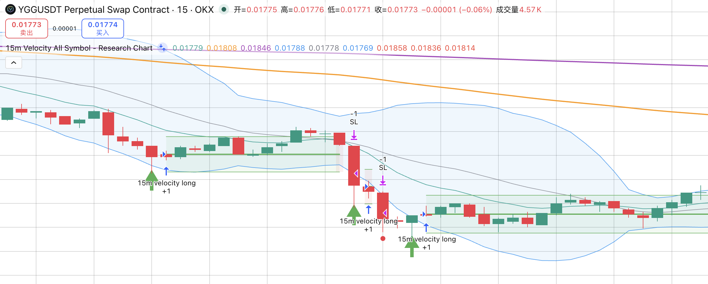
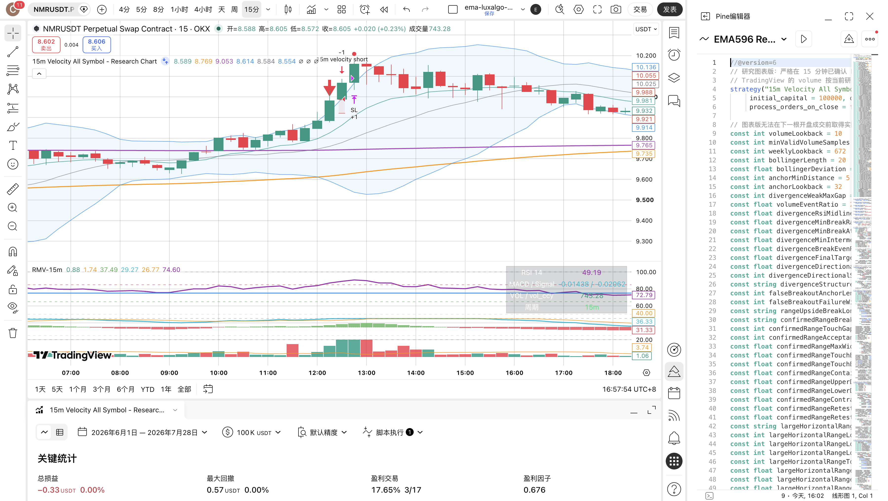
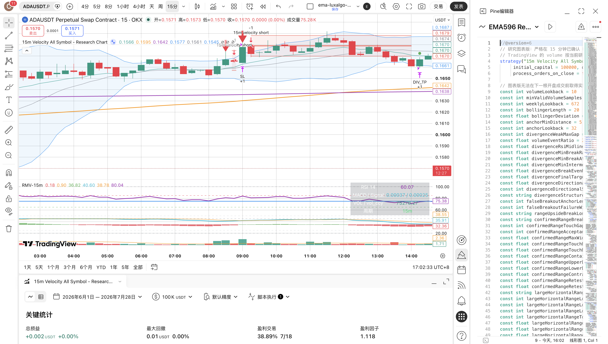
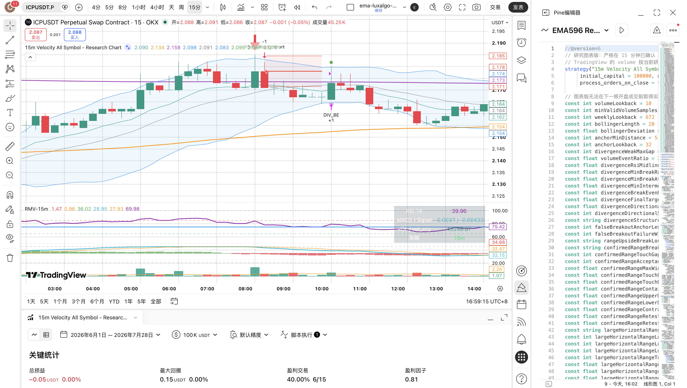
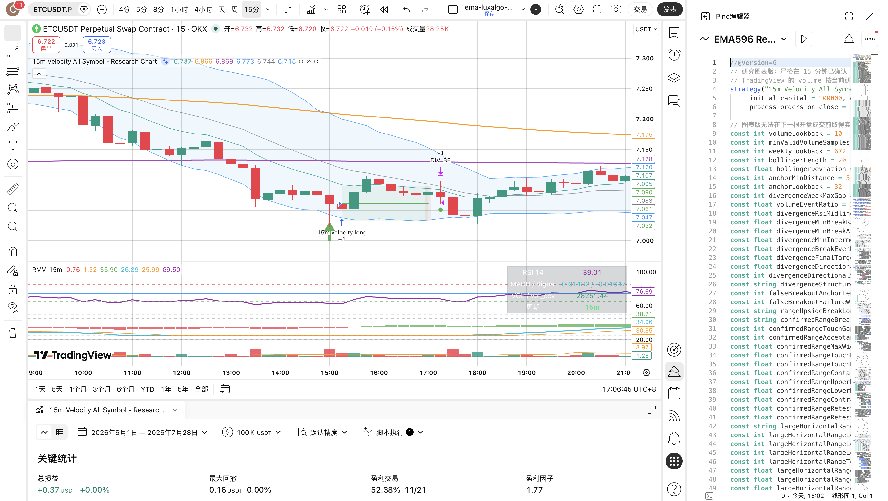
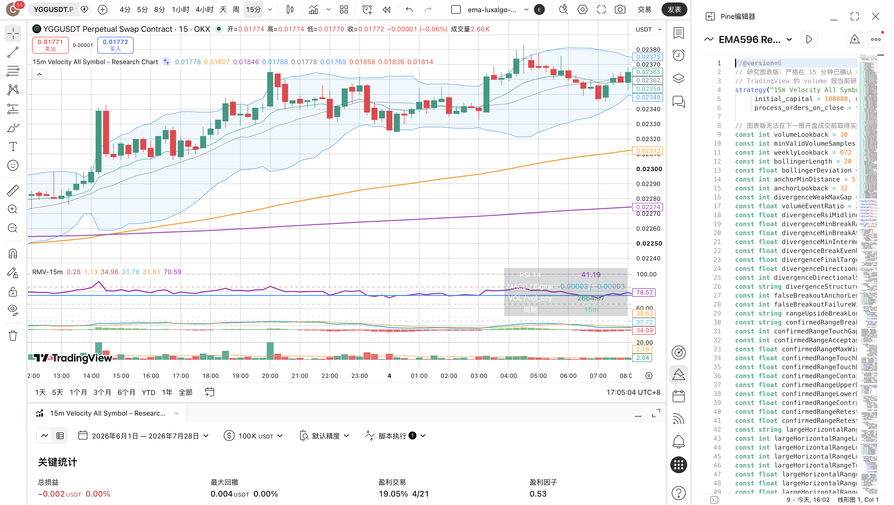

# TradingView Velocity V4 RSI 背离亏损审计

> 日期：2026-07-28  
> 范围：冻结 Top60、15m、V3 schema 2 与 V4 正式报告  
> 状态：只读诊断，未修改 Pine/Rust 策略，未启动新的参数回测，未晋级 Paper/Live

## 一、四层认知框架

### 已知的已知

- V4 RSI底背离共 460 笔，压力成本后为 `-114.68R`。
- V4 RSI顶背离共 502 笔，压力成本后为 `-75.82R`。
- 底背离 286 笔压力亏损中，244 笔是零成本也亏损的真亏损，42 笔只是被成本打成亏损。
- 顶背离 318 笔压力亏损中，253 笔是真亏损，65 笔只是被成本打成亏损。
- 顶背离 V3/V4 共同存在的 462 笔交易，从 `-38.17R` 恶化到 `-75.23R`，主要变化来自退出路径。

### 已知的未知

- V4 同时混合了方向 K 线门禁、1R移动保护和 fresh 近/远结构目标，不能把结果变化归因给单一规则。
- 当前正式报告没有逐笔保存背离锚点间隔、信号棒影线比例、首次达到 1R 的方式和结构破位状态，下一轮消融前需要补齐这些审计字段。
- ETH 不在冻结60成员中，本报告不能外推 ETH。

### 未知的已知

- 顶背离恶化的主因不是统一 K 线形态门禁。被门禁移除的157笔顶背离压力成本合计为 `-3.89R`，移除它们反而略有帮助。
- 逆势顶背离空在 V3 中具备右尾优势：263 笔压力成本 `+26.31R`；中性/过渡顶背离则为 `-71.05R`。把两者统一管理会掩盖方向和市场状态差异。
- 逆势底背离多使用1R保护后只是“少亏”，没有转成正期望；因此不能因为局部改善就晋级。
- 多个最大亏损簇来自同一时间的全市场冲击，不是彼此独立的背离机会。

### 未知的未知

- 固定每边8bps压力成本不能完全代表每个币种当时的真实点差和冲击成本。
- 单仓顺序和持仓占用会产生级联缺失，单笔门禁变化可能改变后续交易集合。
- 当前冻结币种池仍有幸存者边界；任何新规则都必须继续使用同一 manifest 做严格对照。

## 二、全部亏损信号

完整逐笔清单：

- [RSI底背离压力亏损 286 笔](./rsi_bullish_divergence_v4_stress_losses_20260728.csv)
- [RSI顶背离压力亏损 318 笔](./rsi_bearish_divergence_v4_stress_losses_20260728.csv)
- [分桶汇总 JSON](./rsi_divergence_v4_stress_loss_summary_20260728.json)

压力成本计算口径：

```text
stress_net_r =
  [gross_pnl - (entry_price + exit_price) × 0.0008] / initial_risk
```

| 家族 | 压力亏损 | 真亏损 | 仅成本转亏 | 直接止损 |
|---|---:|---:|---:|---:|
| RSI底背离多 | 286 | 244 / `-278.82R` | 42 / `-6.43R` | 241 / `-278.17R` |
| RSI顶背离空 | 318 | 253 / `-291.71R` | 65 / `-8.37R` | 249 / `-289.68R` |

最差单笔和优先复核样本：

| 方向 | 信号时间（Asia/Shanghai） | 结果 | 类型 |
|---|---|---:|---|
| 多 IOST | 2026-03-23 02:30 | `-1.393R` | 底背离真失败 |
| 多 KSM | 2026-04-05 13:30 | `-1.383R` | 底背离真失败 |
| 多 BTC | 2026-02-16 01:45 | `-1.288R` | 18币同步抄底簇 |
| 空 TRX | 2026-01-10 04:00 | `-1.810R` | 顶背离真失败 |
| 空 TRX | 2025-12-18 22:00 | `-1.650R` | 顶背离真失败 |
| 空 LTC | 2026-04-29 11:15 | `-1.525R` | 顶背离真失败 |
| 空 BTC | 2025-09-10 20:30 | `-1.463R` | 放量突破延续中逆势 |
| 空 BCH | 2025-09-18 11:45 | V3 `+7.55R` → V4 `+0.79R` | 追踪截断 |
| 空 BTC | 2025-07-14 15:30 | V3 `+5.73R` → V4 `+1.45R` | 追踪截断 |
| 空 BTC | 2025-09-30 08:45 | 毛 `+0.20R` → 压力 `-0.37R` | 成本型亏损 |
| 空 EIGEN | 2026-04-08 13:45 | V3 `+10.88R`，V4无信号 | 门禁误删赢家 |
| 空 TRX | 2026-03-14 08:00 | V3压力 `-1.68R`，V4无信号 | 门禁正确过滤 |

明显的同步失败簇：

- 底背离：2025-07-24 04:15～04:30，20 笔合计 `-21.90R`。
- 底背离：2026-02-16 01:45，18 笔合计 `-17.97R`。
- 顶背离：2026-01-02 05:30～08:00，9 笔合计 `-8.64R`。

## 三、为什么统一1R保护对顶背离空单过严

顶背离 V3→V4 的变化拆分：

| 变化来源 | 压力R变化 |
|---|---:|
| 462笔共同交易 | `-38.17R → -75.23R`，恶化 `-37.06R` |
| 157笔被K线门禁移除 | V3本身合计 `-3.89R` |
| V4新增40笔 | `-0.59R` |

共同交易内部：

- 33 笔原本达到结构止盈的空单被1R追踪提前截断，少赚 `83.32R`。
- 31 笔原本最终止损的空单被追踪救回，多保留 `52.08R`。
- 两者净损失约 `31.24R`。
- 另有32笔虽仍止盈，但 fresh 近边目标缩短，再损失 `9.20R`。

原因不是“空单天然不能移动止盈”，而是这些逆势顶背离具有右尾收益结构：多数交易只能小赚、小亏，但少数真正顶部会经历“首次下跌 → 正常回测 → 第二段主跌”。达到1R后立即把保护线紧贴最低点上方1R，恰好会在正常回测中退出，丢掉少数决定总期望的大赢家。

底背离路径不同：

- 57 笔后来止损的多单被保护救回，增加 `89.47R`。
- 28 笔结构赢家被截断，减少 `56.27R`。
- 净改善约 `33.21R`，但家族整体仍为负。

因此需要按“方向 × EMA市场状态 × 结构确认”分场景，不能统一使用一套保护。

## 四、TradingView 图表复核

当前 TradingView 客户端只加载了 2026-07-03～07-28 的可见历史。以下6个近期样本完成了图表目检；更早样本只引用冻结回放数据，不宣称完成图表目检。

### 1. YGG 2026-07-08 09:30 底背离真失败



- 价格位于 EMA12、EMA144、EMA696 下方，三条均线整体向下。
- 信号只是下降中继里的小幅横盘，没有站回 EMA12，也没有破坏前一段下跌结构。
- 入场后连续长阴再次扩张，说明问题是“把动量减弱误判为趋势反转”，不是止损过小。
- 优化方向：严格空头排列下的底背离必须增加价格收回确认；中性/过渡状态直接不做纯 RSI 多单。

### 2. NMR 2026-07-14 12:15 顶背离真失败



- 信号位于向上扩张段，EMA12上行，价格持续站在中轨和短均线上方。
- 当根及前序 K 线表现为市场接受突破，不是扫高后跌回结构。
- 下一根继续创新高并触发止损，属于第一轮顶背离过早反手。
- 优化方向：中性/多头延续状态必须先跌回信号棒低点、EMA12或冻结突破线，或者等待第二次扫高收回。

### 3. ADA 2026-07-18 07:30 顶背离真失败



- 第一次空单仍处于抬高低点、扩张上轨的上行结构。
- 没有先收回箱体/前高，也没有收盘跌破 EMA12；随后放量阳线直接止损。
- 后面真正回落发生在再次扫高和结构走弱以后，说明“顶背离出现”与“允许立即开空”应分开。

### 4. ICP 2026-07-19 08:00 顶背离成本型亏损



- 方向判断并非完全错误，入场后价格曾出现足够的有利波动。
- 最终裸保本附近退出，毛收益约 `+0.10R`，双边压力成本约 `0.35R`，结果转为 `-0.25R`。
- 这是净保本价格和目标距离问题，不应通过收紧入场 K 线形态解决。

### 5. ETC 2026-07-05 15:00 底背离成本型亏损



- 价格确实从布林下轨附近反弹，交易方向成立。
- 保护退出使用裸开仓价附近，而不是覆盖费用和滑点的净保本价。
- 毛收益 `+0.023R`，压力成本后 `-0.239R`；属于目标/保护不足以覆盖成本。

### 6. YGG 2026-07-03 20:00 顶背离追踪截断



- 冻结回放中，V3结构目标为 `+2.762R`，压力后 `+2.584R`。
- V4在首次下跌后的正常回抽中触发1R追踪，只保留 `+0.571R`，压力后 `+0.392R`。
- 该价格路径展示了“先跌、回测、再走向远结构目标”的典型顶背离右尾形态。
- 当前 Pine 图在该时刻没有绘出独立信号标记，因此本截图只作为价格路径目检，不作为 Pine/Rust逐笔标记一致性的证明。

## 五、建议预注册的互斥场景

### 场景 A：纯 RSI 顶背离空 + 严格逆势

定义：`EMA12 > EMA144 > EMA696`，空单与多头排列相反。

- 保留 V3 顶背离资格和 V3 冻结远结构目标。
- 不使用 V4 达到1R即启动的紧追踪。
- 只有在收盘跌破前摆动低点、EMA12或冻结箱体下沿后，才允许把止损移动到“成本调整后的净保本”。
- 达到2R或结构确认后，再使用前摆动高点或 `1.5～2 ATR` 的宽追踪。
- 没有有效远结构目标，或者目标不低于成交价，不交易。

### 场景 B：纯 RSI 顶背离空 + 中性/过渡

定义：既不是严格多头排列，也不是严格空头排列。

- 不交易。
- V3该桶348笔压力成本 `-71.05R`，共同样本没有显示可保留的优势。

### 场景 C：纯 RSI 顶背离空 + 严格顺势空

定义：`EMA12 < EMA144 < EMA696`。

- RSI只作为独立趋势空单家族的辅助标签，不单独开仓。
- 当前纯 RSI Fixed 样本过少，不能据此建立独立规则。

### 场景 D：纯 RSI 底背离多 + 严格逆势

定义：`EMA12 < EMA144 < EMA696`，多单与空头排列相反。

- 这是唯一可以继续研究1R保护的桶，但当前仍为负期望，不能晋级。
- 保留三根 MACD 死叉阻断和方向 K 线门禁。
- 增加“收回锚点低点/布林下轨”与“收盘站回 EMA12 或下一根确认”二选一确认。
- 第一轮消融继续使用 V3 远结构目标，不与 fresh 目标同时测试。

### 场景 E：纯 RSI 底背离多 + 中性/过渡或严格顺势多

- 中性/过渡不交易。
- 严格顺势多只把 RSI 当作趋势多单家族的辅助证据，不单独开仓。

### 场景 F：成本型亏损

- 净保本价必须覆盖双边手续费和滑点，不再使用裸开仓价加减一个 tick。
- 冻结目标扣除成本后的预期收益必须至少为 `1.0R`；同时预注册 `0.8R / 1.0R / 1.2R` 邻域做稳健性检查，不根据结果临时挑值。
- 若目标距离不足，直接不交易，而不是继续收紧 K 线门禁。

### 场景 G：全市场同步冲击

- 同一小时、同方向、高相关市场簇只允许选择信号质量最高的1～3个候选。
- 该规则必须使用信号时点可见的固定排序和相关簇定义，不能事后挑盈利币种。

## 六、最小消融顺序

1. A：只恢复严格逆势顶背离的 V3 远目标和退出，不改其他桶。
2. B：只对严格逆势底背离保留方向确认与1R保护，目标仍用 V3。
3. C：fresh 近/远目标单独测试，并按多空分别报告。
4. D：净成本门槛与相关簇限额分别测试。

每轮固定报告：交易数、压力成本 EV/PF、净R、前后半段、月份/币种覆盖、共同交易迁移、最大单币/市场簇贡献。任何单项在 BTC、冻结Top60和不同时间窗口没有一致改善时，不组合、不晋级。

## 当前结论

- 顶背离 V4 恶化的首要原因是逆势空单右尾利润被1R紧追踪截断，不是统一 K 线门禁本身。
- 底背离的主要问题仍是入场质量和系统性下跌中同步抄底；1R保护只能少亏，不能创造优势。
- 604笔压力亏损必须分成“真止损、追踪截断、成本型亏损”三类处理，不能再用一条统一规则修复。
- 当前最值得做的是 A/B/C 独立消融，而不是继续围绕几个截图调影线、RSI或ATR阈值。
