# 15分钟多信号交易策略规范

> 本文把参数、公式和边界定义放在流程图之外。流程图只表达控制流，避免实现时从长文本节点中反推规则。

> Rust 等价审计的冻结基线为 `tradingview_velocity_parity_15m_research_v1`，对应快照
> `15min_velocity_all_symbol_strategy_research_66d3937e.pine`。当前 TradingView Research
> 主文件为 `15min_velocity_all_symbol_strategy_research.pine`，编辑器行数 `1914`、
> JavaScript UTF-16 长度 `113685`、FNV-1a 32 为 `26058470`。第13～20节保留策略演进与
> 历史消融证据；当历史表述与第21节之后的当前汇总冲突时，以第21节之后为准。
> 当前状态是 `research_only_not_promoted_cross_symbol_failure`，没有注册到 Paper、Live 或生产默认入口。

## 1. 时间与数据口径

- 所有 OHLCV 数据均使用已完成的 15 分钟 K 线。
- `t`：当前已完成的 15 分钟 K 线，也是本轮信号汇总与下单决策时点。
- 成交量、EMA、普通 K 线形态以及这些分支使用的 RSI 均读取当前 K 线 `t`。
- `q`：距 `t` 5～32 根的已完成 K 线中，时间上最近且通过其自身完整量能门槛的 K 线；窗口包含 `t-32` 和 `t-5`，`t-1`～`t-4` 不具备锚点资格。
- RSI/MACD 背离都直接比较 `t` 与同一个量能锚点 `q` 的价格和指标值，并检查 `q+1`～`t-1` 的 RSI 是否始终位于对应的 50 中轴一侧。RSI 背离还要求中间价格形成独立反向摆动、当前极值具备最小创新幅度；当 `q/t` 只相隔5～7根时属于弱背离，信号棒必须收回锚点极值；相隔8～32根的完整背离允许不在当棒收回。不再构造价格枢轴，也不读取右侧确认 K 线。
- ATR 读取当前 K 线 `t` 的收盘确认值；全部候选信号在 `t` 收盘后统一汇总，最早在 `t+1` 的开盘可成交时点执行。
- 不允许使用完整的 `t` 成交量、价格或指标值后，把成交时间回填到 `t` 收盘价；这会产生执行层未来数据偏差。
- 任一指标未预热完成、K 线数据不完整或数据非法时，本轮均为无信号。

### 放量事件锚点

对任意已完成 K 线 `x`，以它自己时点之前可见的 10 根和 672 根历史数据计算过滤后量比与周 P90：

```text
volume_event[x] =
    filtered_volume_ratio[x] >= 2.5
    && volume_ccy[x] >= weekly_volume_ccy_p90[x]
```

- `q = max { x | x ∈ [t-32, t-5] && volume_event[x] }`，即只在合格距离内选择最近一次完整量能事件，不选择量比最大的一根。
- 先排除 `t-1`～`t-4`，再选择 `q`；第 5 根和第 32 根均包含。`q` 的选择不使用 RSI 或 DIF 条件；合格窗口内中性 RSI、DIF 在零轴另一侧或最终没有形成背离的放量 K 线，仍会成为新的 `q`，不得跳过它向前选择更有利的旧锚点。
- 最近 `q` 的 RSI 未达到对应方向极值时，本次 RSI/MACD 背离直接判定为假：顶背离要求 `RSI[q] >= 70`，底背离要求 `RSI[q] <= 30`。
- 顶背离要求 `q+1`～`t-1` 的 RSI 全部 `>= 50`；底背离要求中间 RSI 全部 `<= 50`。任一中间 K 线穿越到 50 的错误一侧，已选 `q` 对该方向立即失效，且不得回退到更早锚点。
- 找不到 `q`、`q` 或 `t` 的任一量能数据缺失、非法或未通过自身门槛时，RSI/MACD 背离条件均为假。

## 2. 参数

### 2.1 已确定参数

| 参数 | 取值 |
|---|---:|
| K线周期 | 15分钟 |
| 成交量历史窗口 | 10根 |
| 过滤后最少有效成交量样本 | 5根 |
| 放量阈值 | 2.5倍 |
| 长周期基础成交量窗口 | 前672根已完成15分钟K线（7天） |
| 长周期高基础成交量阈值 | 同币种最近一周 `vol_ccy` 第90百分位（P90） |
| RSI | `RSI(close, 14)` |
| RSI超买 | `RSI >= 70` |
| RSI超卖 | `RSI <= 30` |
| 背离当前点 `t` 顶部 RSI 门槛 | `RSI[t] > 60` |
| 背离当前点 `t` 底部 RSI 门槛 | `RSI[t] < 40` |
| 背离锚点 `q` 顶部 RSI 门槛 | `RSI[q] >= 70` |
| 背离锚点 `q` 底部 RSI 门槛 | `RSI[q] <= 30` |
| 背离路径 RSI 中轴 | `50`；顶背离中间值不得低于50，底背离中间值不得高于50 |
| RSI背离最小中间反向摆动 | `1.0 × max(ATR[t], ATR[q])` |
| RSI背离最小价格创新比例 | 锚点价格的 `0.35%` |
| RSI背离最小ATR创新幅度 | `0.5 × max(ATR[t], ATR[q])` |
| RSI背离收回状态 | 相隔5～7根的弱底背离必须 `close[t] > low[q]`，弱顶背离必须 `close[t] < high[q]`；相隔8～32根的完整背离仅诊断 |
| DIF | `EMA(close, 12) - EMA(close, 26)` |
| 放量锚点最小间隔 | 5根（包含第5根） |
| 放量锚点最大回看窗口 | 32根（包含第32根） |
| RSI/MACD背离确认 | 当前完成K线即时确认；不使用价格枢轴或右侧确认 |
| 既有放量趋势EMA | `EMA(close, 12/144/696)` |
| 压缩扩张研究EMA | `EMA(close, 12/144/596)` |
| 放量上破锚定区间 | 突破棒之前20根已完成K线的最高价与最低价 |
| 放量上破失败观察窗 | 突破棒之后第1～8根已完成K线 |
| 大型上升三角候选窗口 | 突破棒之前 `96 / 120 / 144 / 168 / 192` 根已完成K线；取最长有效窗口 |
| 大型三角水平阻力 | 窗口三等分后的三段最高价极差不超过阻力的 `0.5%` |
| 大型三角独立触碰 | 上沿至少3组，相邻两组至少间隔8根；触碰带为 `max(阻力×0.3%, 0.5 ATR)` |
| 大型三角低点抬高 | 三段最低价逐段至少抬高 `0.25 ATR`，首末合计至少抬高 `1 ATR` |
| 大型三角收敛 | `(阻力-末段低点)/(阻力-首段低点) <= 70%` |
| 大型三角突破动量 | `RSI[t-1] < 70` 且 `70 <= RSI[t] <= 80` |
| 逆势横盘确认长度 | 连续8根已完成K线 |
| 逆势横盘搜索窗口 | `t-1`～`t-48` |
| 逆势横盘最大宽度 | `(上沿-下沿)/下沿 <= 3%` |
| 横盘边界触碰带 | 区间高度的10%，最低2个价格tick |
| 横盘独立触碰 | 上下沿各至少2组，相邻两组至少间隔2根K线 |
| ATR | `ATR(14, RMA, 15分钟)` |
| 非形态信号初始止损距离 | `1.5 ATR` |
| 正式组合回测目标风险 | 每笔账户权益 `1%`；当前 Pine 与 Rust parity 为固定1单位，尚未实现账户仓位归一化 |
| 大实体占振幅下限 | 60% |
| 大实体占开盘价下限 | 1%（严格大于） |
| 温和大实体占开盘价上限 | 3%（严格小于） |
| 长影线占振幅下限 | 60% |
| 十字星实体占振幅上限 | 10% |

### 2.2 必须通过15分钟历史回测确定的参数

| 参数 | 符号 | 约束 | 用途 |
|---|---|---:|---|
| DIF零轴缓冲系数 | `Z` | `Z > 0` | 定义 `Z × ATR` 零轴缓冲区 |
| 最小归一化DIF改善幅度 | `D_min` | `D_min > 0` | 排除仅由微小差异形成的伪背离 |

- `Z` 和 `D_min` 不设置拍脑袋默认值，必须使用15分钟历史数据完成样本内、样本外及滚动回测后确定。
- 回测、模拟盘和实盘必须使用同一组已发布参数，禁止根据当前结果临时改变阈值。
- 任一参数尚未配置时，MACD背离分支默认关闭，不产生多空候选信号。

## 3. 成交量与长期基础成交量定义

### 3.1 过滤后量比

历史放量标记按时间正序计算，标记某根历史 K 线 `j` 时使用其前 10 根原始成交量，不递归排除更早的放量 K 线：

```text
raw_average_volume[j] = mean(volume[j-10 ... j-1])

is_volume_spike[j] =
    raw_average_volume[j] > 0
    && volume[j] >= 2.5 * raw_average_volume[j]
```

以下公式对任意候选 K 线 `x` 都成立；当前信号 K 线取 `x = t`，历史锚点资格取 `x = q`。当前 K 线 `t` 的过滤后成交量基准为：

```text
valid_history[x] = {
    j | j ∈ [x-10, x-1] && is_volume_spike[j] == false
}

valid_history[x] 的样本数 < 5          => 无信号
baseline[x] = mean(volume[valid_history[x]])
baseline[x] <= 0                   => 无信号
filtered_volume_ratio[x] = volume[x] / baseline[x]
filtered_volume_ratio[x] < 2.5     => 无信号
```

候选 K 线 `x` 永远不进入自己的成交量基准分母。为了标记 `[x-10, x-1]` 中的历史 K 线，至少还需要更早 10 根 K 线作为预热数据。

### 3.2 同币种最近一周 `vol_ccy` P90

`volume_ccy[x]` 直接读取当前交易对 15 分钟分表已经保存的 `vol_ccy`。该字段只在同一币种自己的时间序列内计算百分位，不用于跨币种绝对值比较，也不再读取或补抓 `volCcyQuote`。字段缺失或非法时，本轮为无信号。以下公式同样对任意候选 K 线 `x` 成立；当前信号 K 线取 `x = t`，锚点资格取 `x = q`。

候选 K 线 `x` 不进入自身的长期百分位样本。长期样本固定使用它之前连续672根已完成15分钟K线：

```text
weekly_volume_ccy_history[x] = {
    volume_ccy[j] | j ∈ [x-672, x-1]
}

样本必须正好包含672个连续、有效且已完成的值
任一值缺失、非有限数或小于0             => 无信号

sorted_volume_ccy[x] = sort_ascending(weekly_volume_ccy_history[x])
rank = ceil(0.90 * 672) = 605
weekly_volume_ccy_p90[x] = sorted_volume_ccy[x][rank - 1]

weekly_high_volume_ccy[x] =
    is_finite(volume_ccy[x])
    && volume_ccy[x] > 0
    && volume_ccy[x] >= weekly_volume_ccy_p90[x]
```

百分位采用 nearest-rank（最近秩）算法，`rank` 从1开始，因此实现中读取升序数组下标604。候选 K 线的 `vol_ccy[x]` 等于自己的P90时也视为通过。

### 3.3 最终成交量门槛

过滤后量比和同币种最近一周高基础成交量必须同时满足。对当前信号 K 线 `t` 和历史锚点 K 线 `q`，都按各自时点独立计算，不能用 `t` 时点的基准倒算 `q`：

```text
volume_event[x] =
    filtered_volume_ratio[x] >= 2.5
    && weekly_high_volume_ccy[x]
```

当前 `t` 不通过 `volume_event[t]` 时，既有 RSI、EMA696、MACD 三个即时指标分支均不再计算。`q` 不通过自己的 `volume_event[q]` 时，不得充当 RSI/MACD 背离锚点。第13节的失败观察与第22节的确认箱体接受 V2 可以共享同一根原始放量上破棒 `b`：在 `b` 收盘冻结 `volume_event[b]` 与此前20根区间，启动8根失败观察；若该区间同时满足确认箱体质量和趋势门禁，只建立最多3根的接受 setup，`b` 本身不立即做多。随后市场接受确认棒 `t` 不要求再次放量，失败确认棒 `f` 同样不要求再次放量。大型水平箱体与大型上升三角分支在自己的突破棒 `t` 使用同一 `volume_event[t]` 与量比不低于3的ATR止盈档位，但独立识别长期结构，不复用20根区间身份。第14节的 EMA12/144/596 压缩扩张是独立的非量能研究分支，不以当前量比作为入场门槛。非逆势交易中，即时放量和长期箱体/三角分支读取当前信号棒量比；确认箱体接受 V2 冻结 `b` 的量比；第13节失败分支同样冻结 `b` 的量比。第10.4节定义的逆势交易改用冻结横盘边界并禁止回退到 ATR。

## 4. K线形态定义

本节普通 K 线形态默认计算当前 K 线 `t`；吞没形态同时使用前一根 K 线 `t-1`。

先校验：

```text
high >= max(open, close)
low  <= min(open, close)
high > low
open > 0
```

校验失败时，所有 K 线形态条件均为假。

```text
range = high - low
body = abs(close - open)
body_range_ratio = body / range
body_open_ratio = body / open

upper_shadow = high - max(open, close)
lower_shadow = min(open, close) - low
upper_shadow_ratio = upper_shadow / range
lower_shadow_ratio = lower_shadow / range
```

### 实体与影线

```text
大实体 = body_range_ratio >= 0.60 && body_open_ratio > 0.01

温和大实体 = 大实体 && body_open_ratio < 0.03

十字星 = body_range_ratio <= 0.10

长上影线 =
    !十字星
    && upper_shadow_ratio >= 0.60
    && upper_shadow > lower_shadow

长下影线 =
    !十字星
    && lower_shadow_ratio >= 0.60
    && lower_shadow > upper_shadow
```

### 吞没

```text
看涨吞没 =
    close[t-1] < open[t-1]
    && close[t] > open[t]
    && open[t] <= close[t-1]
    && close[t] >= open[t-1]

看跌吞没 =
    close[t-1] > open[t-1]
    && close[t] < open[t]
    && open[t] >= close[t-1]
    && close[t] <= open[t-1]

看涨反转形态 = 看涨吞没 || 长下影线
看跌反转形态 = 看跌吞没 || 长上影线
```

既不满足吞没、也不满足对应长影线时，该 K 线形态分支为无信号。

## 5. RSI背离定义

RSI 背离是“当前完整量能事件 `t` 相对距其 5～32 根内最近合格量能锚点 `q`”的即时比较，不是价格枢轴背离。先排除 `t-1`～`t-4`，再唯一确定 `q`，最后判断价格和 RSI；最近合格 `q` 不成立时不得回退到更早锚点。

```text
原始RSI顶背离 =
    volume_event[t]
    && q 存在
    && RSI[t] > 60
    && RSI[q] >= 70
    && min(RSI[q+1 ... t-1]) >= 50
    && high[q] - min(low[q+1 ... t-1]) >= 1.0 * max(ATR[t], ATR[q])
    && high[t] > high[q]
    && (high[t] - high[q]) / high[q] >= 0.35%
    && high[t] - high[q] >= 0.5 * max(ATR[t], ATR[q])
    && RSI[t] < RSI[q]

原始RSI底背离 =
    volume_event[t]
    && q 存在
    && RSI[t] < 40
    && RSI[q] <= 30
    && max(RSI[q+1 ... t-1]) <= 50
    && max(high[q+1 ... t-1]) - low[q] >= 1.0 * max(ATR[t], ATR[q])
    && low[t] < low[q]
    && (low[q] - low[t]) / low[q] >= 0.35%
    && low[q] - low[t] >= 0.5 * max(ATR[t], ATR[q])
    && RSI[t] > RSI[q]

弱背离 = t-q 的距离 <= 7

RSI顶背离 =
    原始RSI顶背离
    && (!弱背离 || close[t] < high[q])

RSI底背离 =
    原始RSI底背离
    && (!弱背离 || close[t] > low[q])
```

RSI 背离方向门槛为：

```text
顶背离：RSI[t] > 60 && RSI[q] >= 70
底背离：RSI[t] < 40 && RSI[q] <= 30
```

- 中间路径只检查 `q+1`～`t-1`，不包含 `q` 和 `t`。由于锚点至少相隔 5 根，该区间至少包含 4 根已完成 K 线。
- 顶背离中间 RSI 必须始终 `>= 50`，底背离中间 RSI 必须始终 `<= 50`；恰好等于 50 允许。任一中间值缺失或越过错误一侧，连续性门禁失败。
- 固定 K 线间隔不能证明两个极值属于独立波段。顶背离要求中间价格相对 `high[q]` 至少回落 `1 ATR`，底背离要求中间价格相对 `low[q]` 至少反弹 `1 ATR`；ATR 取 `t/q` 两者较大值，避免波动率下降时放宽门槛。
- 不把“至少相隔 20 根”设为硬门禁：已有同口径研究显示锚点间隔与收益并非单调关系，过远锚点还会引入陈旧结构。时间间隔继续用于悬浮审计，是否属于两个独立波段由上述中间价格摆动决定。
- 当前创新幅度必须同时满足锚点价格的 `0.35%` 和 `0.5 ATR`。相隔5～7根的弱背离还必须在信号棒收盘重新回到锚点内侧；相隔8～32根的完整背离把收回状态写入悬浮信息，但不把它作为结构成立的必要条件。
- 价格与 RSI 均严格比较；价格相等、RSI 相等都不构成背离。
- `q` 先在 `t-32`～`t-5` 内按最近完整量能事件唯一确定，不按 RSI 筛选。若最近合格 `q` 的 RSI 中性、不满足对应方向门槛或中间 RSI 路径不连续，本次背离为假，不得跳过它改用更早的 `q`。
- `RSI >= 70`、`RSI <= 30` 仍分别定义超买、超卖；RSI 形态与 EMA 趋势分支继续使用原有 70/30 边界，不随背离当前点 `t` 的 60/40 门槛变化。
- 不设置 RSI 最小改善点数；本次保留的是价格结构和价格位移门禁。`0.35% / 0.5 ATR / 1 ATR` 仍是 Research 参数，必须通过未见窗口和参数邻域验证，不能据当前截图宣称已形成正收益。

### 5.1 弱背离收回与当前版本

当前 RSI 背离结构版本为 `rsi_divergence_weak_reclaim_regime_exit_v3`：

- `q/t` 相隔5～7根：视为弱背离，必须在信号棒收盘收回锚点极值；
- `q/t` 相隔8～32根：视为完整背离，允许不在当棒收回；
- 两类背离都继续要求 `0.35%` 创新、`0.5 ATR` 创新、`1 ATR` 中间反向摆动、RSI 50 中轴连续性、最近完整量能锚点和禁止回退；
- 纯背离反转若不处于严格同向 EMA 趋势，使用 `1R` 激活近似保本、`1.5R` 全平；严格逆势仍受第10.4节的冻结横盘目标约束，严格同向趋势则继续使用原 ATR 延续目标。

该分层修复了两个相反问题：把“所有背离都必须收回”设为硬门禁会大幅减少完整结构样本；完全取消收回又会放回相隔很近的短周期噪声。当前规则只对弱背离要求更强确认，不把同一门槛机械套给完整波段。

在冻结该规则时的 TradingView 同图、固定1单位、零手续费/滑点消融中，BTC 从9笔前一版本的对照结果改善到 `+1296.10 USDT / PF 1.5600`，ETH 保持 `+249.86 USDT / PF 3.6474`。这些是历史已见窗口证据，不是本次 Rust 多窗口审计结果；当前 Pine 又加入了后续箱体确认、保护门禁和三棒反包，最终基线必须以第25节为准。

## 6. MACD背离定义

MACD 分支同样使用 `t` 与距其 5～32 根内最近合格量能锚点 `q`，不使用价格枢轴、`t-3` 或右侧确认。它只使用 DIF，不使用 DEA 或柱体：

```text
DIF[x] = EMA(close, 12)[x] - EMA(close, 26)[x]
normalized_DIF[x] = DIF[x] / close[x]
zero_band[x] = Z * ATR[x]
```

要求 `close[t] > 0`、`close[q] > 0`、`ATR[t] > 0`、`ATR[q] > 0`、`Z > 0` 且 `D_min > 0`，否则 MACD 背离条件为假。

```text
MACD顶背离 =
    volume_event[t]
    && q 存在
    && RSI[t] > 60
    && RSI[q] >= 70
    && min(RSI[q+1 ... t-1]) >= 50
    && high[t] > high[q]
    && DIF[t] > zero_band[t]
    && DIF[q] > zero_band[q]
    && normalized_DIF[q] - normalized_DIF[t] >= D_min

MACD底背离 =
    volume_event[t]
    && q 存在
    && RSI[t] < 40
    && RSI[q] <= 30
    && max(RSI[q+1 ... t-1]) <= 50
    && low[t] < low[q]
    && DIF[t] < -zero_band[t]
    && DIF[q] < -zero_band[q]
    && normalized_DIF[t] - normalized_DIF[q] >= D_min
```

MACD 背离使用与 RSI 背离相同的 `t/q` RSI 方向门槛和中间路径连续性门禁。即使 DIF、价格和 `D_min` 均满足，最近合格 `q` 的 RSI 中性、未达到对应极值或中间 RSI 穿越 50 错误一侧时，MACD 背离仍为假，且不得回退到更早锚点。

零轴与方向过滤规则：

| DIF位置 | 是否允许形成常规背离 |
|---|---|
| `t`、`q` 都严格高于各自零轴上界 | 只允许检查顶背离 |
| `t`、`q` 都严格低于各自零轴下界 | 只允许检查底背离 |
| `t` 或 `q` 满足 `abs(DIF[x]) <= zero_band[x]` | 不算背离 |
| `t`、`q` 位于零轴两侧 | 不算同一次常规背离 |

`D_min` 检查的是当前量能事件和距其 5～32 根内最近合格量能锚点之间的归一化 DIF 差值。即使价格创新高或创新低，只要 DIF 改善幅度不足，仍判定为无 MACD 背离。

## 7. EMA趋势信号定义

```text
EMA开多 =
    EMA12[t] > EMA144[t] > EMA696[t]
    && close[t] > EMA12[t]
    && close[t] > open[t]
    && 温和大实体[t]
    && RSI[t] < 70

EMA开空 =
    EMA12[t] < EMA144[t] < EMA696[t]
    && close[t] < EMA12[t]
    && close[t] < open[t]
    && 温和大实体[t]
    && RSI[t] > 30
```

EMA 相等、排序不完整或 EMA696 尚未预热完成时，EMA 分支为无信号。

## 8. 候选方向与冲突处理

每个分支必须独立计算；某一个分支无信号，不得提前终止其他分支。

```text
RSI形态开多 =
    !RSI顶背离(t, q)
    && !RSI底背离(t, q)
    && RSI[t] <= 30
    && 看涨反转形态[t]

RSI形态开空 =
    !RSI顶背离(t, q)
    && !RSI底背离(t, q)
    && RSI[t] >= 70
    && 看跌反转形态[t]

RSI开多 = RSI底背离(t, q) || RSI形态开多
RSI开空 = RSI顶背离(t, q) || RSI形态开空

MACD开多 = MACD底背离(t, q)
MACD开空 = MACD顶背离(t, q)

has_long  = RSI开多 || EMA开多 || MACD开多 || 放量锚定区间上破做多 || 大型上升三角放量突破做多 || EMA压缩同步向上扩张
has_short = RSI开空 || EMA开空 || MACD开空 || 放量锚定区间上破失败开空 || EMA压缩同步向下扩张

蜡烛形态参与开多 = has_long && !has_short && RSI形态开多
蜡烛形态参与开空 = has_short && !has_long && RSI形态开空
```

- “蜡烛形态参与”只指看涨/看跌吞没、长下影线或长上影线实际产生了同方向候选信号。
- EMA 分支中的阳线、阴线和温和大实体仅属于趋势过滤，不触发形态止损；第14节的方向确认K线同样不属于形态止损。
- 同方向还同时存在 RSI背离、EMA 或 MACD 信号时，只要对应的 `RSI形态开多/开空` 为真，仍优先使用形态止损。
- 多空冲突时不交易，因此不会进入止损选择流程。

同一确认时点 `t` 产生的全部候选信号，其最终结果为：

| `has_long` | `has_short` | 结果 |
|---|---|---|
| `false` | `false` | 无信号 |
| `true` | `false` | 合并所有同向信号，只产生一个开多信号 |
| `false` | `true` | 合并所有同向信号，只产生一个开空信号 |
| `true` | `true` | 多空冲突，不交易 |

## 9. 共享核心控制流

下图只表达量能、RSI/EMA、候选合并、下一根开盘和保护单的共享主干，不再枚举全部独立 Research 家族。20根确认箱体 V2、大型水平箱体、大型上升三角、重复扫高、EMA压缩扩张、三棒反包及两个空头保护门禁的当前完整清单以第21～23节为准。

```mermaid
flowchart LR
    Start[15分钟K线完成] --> DataValid{OHLCV是否合法}
    DataValid -->|否| NoSignal((无信号))
    DataValid -->|是| Warmup{全部指标是否预热完成}
    Warmup -->|否| NoSignal
    Warmup -->|是| TimeContext[当前已完成K线 t<br/>RSI和MACD均即时比较 t 与 q]

    TimeContext --> MarkVolume[基于当前K线 t<br/>按时间正序标记历史放量K线]
    MarkVolume --> VolumeSample{过滤后有效样本不少于5根<br/>且基准成交量大于0}
    VolumeSample -->|否| NoSignal
    VolumeSample -->|是| CalculateRatio[计算过滤后量比]
    CalculateRatio --> VolumeGate{过滤后量比是否不小于2.5}
    VolumeGate -->|否| NoSignal
    VolumeGate -->|是| WeeklyVolumeCcySample{同币种前672根已完成K线 vol_ccy<br/>是否连续且全部有效}
    WeeklyVolumeCcySample -->|否| NoSignal
    WeeklyVolumeCcySample -->|是| CalculateP90[按nearest-rank计算<br/>同币种最近一周 vol_ccy P90]
    CalculateP90 --> WeeklyVolumeCcyGate{当前K线 vol_ccy<br/>是否大于等于P90}
    WeeklyVolumeCcyGate -->|否| NoSignal
    WeeklyVolumeCcyGate -->|是| AnchorSearch[在距 t 5～32根的完成K线中<br/>选取最近完整量能锚点 q<br/>t-1～t-4不合格且不按RSI回退]
    AnchorSearch --> Parallel[在 t 收盘确认时并行计算<br/>既有指标与锚定区间分支]

    subgraph RSI_FLOW[RSI分支]
        direction TB
        RsiDivergence{q 存在且 t、q 是否满足<br/>方向RSI门槛与严格价格/RSI背离}

        RsiDivergence -->|顶：t大于60且q不小于70| RsiTopPath{q+1到t-1的RSI<br/>是否全部不低于50}
        RsiTopPath -->|是| RsiTopStructure{中间回落是否至少1 ATR<br/>上破是否至少0.35%且0.5 ATR}
        RsiTopStructure -->|是| RsiShortDiv[RSI候选：空<br/>5至7根须跌回锚高<br/>8至32根可不当棒收回]
        RsiTopStructure -->|否| RsiRange
        RsiTopPath -->|否：路径中断| RsiRange
        RsiDivergence -->|底：t小于40且q不大于30| RsiBottomPath{q+1到t-1的RSI<br/>是否全部不高于50}
        RsiBottomPath -->|是| RsiBottomStructure{中间反弹是否至少1 ATR<br/>下破是否至少0.35%且0.5 ATR}
        RsiBottomStructure -->|是| RsiLongDiv[RSI候选：多<br/>5至7根须站回锚低<br/>8至32根可不当棒收回]
        RsiBottomStructure -->|否| RsiRange
        RsiBottomPath -->|否：路径中断| RsiRange
        RsiDivergence -->|无背离| RsiRange{当前 RSI t 所在区间}

        RsiRange -->|RSI t 不小于70| BearPattern{当前K线 t<br/>是否为看跌反转形态}
        BearPattern -->|是| RsiShortPattern[RSI候选：空<br/>看跌吞没或长上影线]
        BearPattern -->|否| RsiNone[RSI候选：无]

        RsiRange -->|RSI t 不大于30| BullPattern{当前K线 t<br/>是否为看涨反转形态}
        BullPattern -->|是| RsiLongPattern[RSI候选：多<br/>看涨吞没或长下影线]
        BullPattern -->|否| RsiNone

        RsiRange -->|30小于RSI t且RSI t小于70| RsiNone

        RsiShortDiv --> RsiResult[汇总RSI分支结果]
        RsiShortPattern --> RsiResult
        RsiLongDiv --> RsiResult
        RsiLongPattern --> RsiResult
        RsiNone --> RsiResult
    end

    subgraph EMA_FLOW[EMA趋势分支]
        direction TB
        EmaOrder{当前K线 t 的EMA排列方向}

        EmaOrder -->|EMA12大于EMA144大于EMA696| EmaLongCandle{当前K线 t<br/>收盘价高于EMA12<br/>且为阳线温和大实体}
        EmaLongCandle -->|否| EmaNone[EMA候选：无]
        EmaLongCandle -->|是| EmaOverbought{RSI t 是否不小于70}
        EmaOverbought -->|是| EmaNone
        EmaOverbought -->|否| EmaLong[EMA候选：多]

        EmaOrder -->|EMA12小于EMA144小于EMA696| EmaShortCandle{当前K线 t<br/>收盘价低于EMA12<br/>且为阴线温和大实体}
        EmaShortCandle -->|否| EmaNone
        EmaShortCandle -->|是| EmaOversold{RSI t 是否不大于30}
        EmaOversold -->|是| EmaNone
        EmaOversold -->|否| EmaShort[EMA候选：空]

        EmaOrder -->|其他排列或存在相等| EmaNone

        EmaLong --> EmaResult[汇总EMA分支结果]
        EmaShort --> EmaResult
        EmaNone --> EmaResult
    end

    subgraph MACD_FLOW[MACD背离分支]
        direction TB
        MacdParams{Z 与 D_min 是否已配置}
        MacdParams -->|否| MacdNone[MACD候选：无]
        MacdParams -->|是| MacdAnchor{5～32根内最近合格量能锚点 q 是否存在}
        MacdAnchor -->|否| MacdNone
        MacdAnchor -->|是| MacdRsiGate{t、q 是否满足<br/>对应方向RSI门槛}

        MacdRsiGate -->|顶：t大于60且q不小于70| MacdTopPath{q+1到t-1的RSI<br/>是否全部不低于50}
        MacdTopPath -->|否：路径中断| MacdNone
        MacdTopPath -->|是| MacdTopZone{DIF t、q 是否都严格高于<br/>各自零轴缓冲区上界}
        MacdTopZone -->|否：含零轴附近或跨零轴| MacdNone
        MacdTopZone -->|是| MacdTopPrice{high t 是否大于 high q}
        MacdTopPrice -->|否| MacdNone
        MacdTopPrice -->|是| MacdTopGap{归一化DIF从 q 到 t 的下降幅度<br/>是否不小于 D_min}
        MacdTopGap -->|是| MacdShort[MACD候选：空]
        MacdTopGap -->|否| MacdNone

        MacdRsiGate -->|底：t小于40且q不大于30| MacdBottomPath{q+1到t-1的RSI<br/>是否全部不高于50}
        MacdBottomPath -->|否：路径中断| MacdNone
        MacdBottomPath -->|是| MacdBottomZone{DIF t、q 是否都严格低于<br/>各自零轴缓冲区下界}
        MacdBottomZone -->|否：含零轴附近或跨零轴| MacdNone
        MacdBottomZone -->|是| MacdBottomPrice{low t 是否小于 low q}
        MacdBottomPrice -->|否| MacdNone
        MacdBottomPrice -->|是| MacdBottomGap{归一化DIF从 q 到 t 的上升幅度<br/>是否不小于 D_min}
        MacdBottomGap -->|是| MacdLong[MACD候选：多]
        MacdBottomGap -->|否| MacdNone

        MacdRsiGate -->|其他：含q中性| MacdNone

        MacdLong --> MacdResult[汇总MACD分支结果]
        MacdShort --> MacdResult
        MacdNone --> MacdResult
    end

    subgraph RANGE_BREAKOUT_FLOW[放量锚定区间上破分支]
        direction TB
        RangeWindow[只读取 t-20 至 t-1<br/>识别P85/P15确认箱体及真实高低点]
        RangeBreak{箱体质量是否有效<br/>阳线放量收盘是否突破真实高点}
        RangeCycle{当前8根失败观察周期<br/>是否空闲}
        RangeFreeze[冻结箱体、突破时间与量比<br/>启动3根接受与8根失败观察]
        RangeTrend{EMA12大于EMA144大于EMA696<br/>且RSI小于70}
        RangeAccept{3根内是否回踩真实上沿后收回<br/>或连续两根收盘站稳}
        RangeBreakoutLong[确认箱体突破获得接受：多]
        RangeFailure{后续第1至8根中<br/>是否首次出现阴线收盘跌破冻结下沿}
        RangeFailureShort[锚定区间上破失败候选：空]
        RangeNone[锚定区间候选：无]

        RangeWindow --> RangeBreak
        RangeBreak -->|否| RangeNone
        RangeBreak -->|是| RangeCycle
        RangeCycle -->|否：同一观察周期内| RangeNone
        RangeCycle -->|是：本轮首个上破| RangeFreeze
        RangeFreeze --> RangeTrend
        RangeTrend -->|是| RangeAccept
        RangeAccept -->|是| RangeBreakoutLong
        RangeAccept -->|否或跌回稳健上沿| RangeNone
        RangeTrend -->|否| RangeNone
        RangeFreeze -. 后续独立确认 .-> RangeFailure
        RangeFailure -->|首根满足| RangeFailureShort
        RangeFailure -->|8根均未满足| RangeNone

        RangeBreakoutLong --> RangeResult[汇总锚定区间分支结果]
        RangeFailureShort --> RangeResult
        RangeNone --> RangeResult
    end

    Parallel --> RsiDivergence
    Parallel --> EmaOrder
    Parallel --> MacdParams
    Parallel --> RangeWindow

    RsiResult --> Merge[合并全部同向候选信号]
    EmaResult --> Merge
    MacdResult --> Merge
    RangeResult --> Merge

    Merge --> Direction{has_long 与 has_short}
    Direction -->|false / false| NoSignal
    Direction -->|true / true| Conflict((多空冲突，不交易))
    Direction -->|true / false| LongSignal[汇总1至n个开多候选<br/>仅形成开多方向]
    Direction -->|false / true| ShortSignal[汇总1至n个开空候选<br/>仅形成开空方向]

    LongSignal --> PositionState{当前持仓与订单状态}
    ShortSignal --> PositionState
    PositionState -->|已有待成交订单| NoNewTrade((不重复下单))
    PositionState -->|已有同方向持仓| IgnoreSame((忽略同向信号))
    PositionState -->|已有反方向持仓| CloseOld[平旧仓，立即反手]
    PositionState -->|当前空仓| Submit[在 t+1 开盘提交一次新开仓订单]

    CloseOld --> Submit
    Submit --> Filled{订单是否实际成交}
    Filled -->|否| NoFill((无新增交易，不复用旧信号))
    Filled -->|是| CandleParticipate{同方向信号是否包含<br/>吞没或长影线形态}

    CandleParticipate -->|否| AtrStop[非形态信号止损<br/>距离为1.5 ATR]
    CandleParticipate -->|是| PatternType{参与信号的蜡烛形态}
    PatternType -->|开多：看涨吞没| BullEngulfStop[止损取两根吞没K线最低点]
    PatternType -->|开多：仅长下影线| LowerShadowStop[止损取当前K线最低点]
    PatternType -->|开空：看跌吞没| BearEngulfStop[止损取两根吞没K线最高点]
    PatternType -->|开空：仅长上影线| UpperShadowStop[止损取当前K线最高点]

    AtrStop --> StopValid{止损价格相对成交价是否有效}
    BullEngulfStop --> StopValid
    LowerShadowStop --> StopValid
    BearEngulfStop --> StopValid
    UpperShadowStop --> StopValid
    StopValid -->|否| InvalidStop((立即平仓，记录无效形态止损))
    StopValid -->|是| CounterTrend{是否为逆EMA696排列开仓}
    CounterTrend -->|是| SidewaysReady{t之前48根内是否存在<br/>最近有效8根横盘确认窗}
    SidewaysReady -->|否| NoCounterTrend((阻止逆势开仓，不回退ATR))
    SidewaysReady -->|是但目标在成交价错误一侧| NoCounterTrend
    SidewaysReady -->|是且目标有效| StructureTarget[冻结对应横盘边界<br/>首次触达即平100%]
    CounterTrend -->|否| ShortTrendExtension{是否为第15节<br/>空头趋势延续扩展}
    ShortTrendExtension -->|是| ExtensionActivation[原3.0或量比ATR目标<br/>仅作为扩展激活点]
    ExtensionActivation --> ExtensionProtection[确认棒收盘后<br/>下一根启用近似保本]
    ExtensionProtection --> ExtensionTarget[最终8.0 ATR全平]
    ShortTrendExtension -->|否且EMA压缩扩张| EmaExpansionTarget[固定3.0 ATR]
    ShortTrendExtension -->|否且量能分支| RatioTier{过滤后量比档位}

    RatioTier -->|3.0至不足4.0| Target1[止盈距离2.7 ATR]
    RatioTier -->|4.0至不足6.0| Target2[止盈距离3.6 ATR]
    RatioTier -->|不小于6.0| Target3[止盈距离4.5 ATR]

    Target1 --> Protection[提交固定止损与ATR止盈]
    Target2 --> Protection
    Target3 --> Protection
    EmaExpansionTarget --> Protection
    ExtensionTarget --> Protection
    StructureTarget --> Protection
    Protection --> Manage{持仓事件}
    Manage -->|触发止损| ExitLoss((止损退出))
    Manage -->|触发止盈| ExitProfit((止盈退出))
    Manage -->|出现有效反向信号| ExitReverse((平仓，立即反手))
    Manage -->|均未触发| Hold[继续持有]
    Hold --> Manage
    ExitReverse --> Submit

    classDef long fill:#d8f3dc,stroke:#2d6a4f,stroke-width:1px;
    classDef short fill:#ffe5d9,stroke:#9d0208,stroke-width:1px;
    classDef stop fill:#f6caca,stroke:#555,stroke-width:1px;
    class RsiLongDiv,RsiLongPattern,EmaLong,MacdLong,RangeBreakoutLong,LongSignal,ExitProfit long;
    class RsiShortDiv,RsiShortPattern,EmaShort,MacdShort,RangeFailureShort,ShortSignal,ExtensionActivation,ExtensionProtection,ExtensionTarget,ExitLoss short;
    class Conflict,NoSignal,NoNewTrade,IgnoreSame,NoFill,InvalidStop,ExitReverse stop;
```



## 10. 止损选择与止盈

ATR 使用当前已完成 K 线 `t` 的 `ATR(14, RMA)` 收盘值，并在订单实际成交后固定，不随随后 K 线重新计算或移动。

```text
atr = ATR[t]
entry = 实际成交价

看涨吞没最低点 = min(low[t-1], low[t])
看跌吞没最高点 = max(high[t-1], high[t])
```

### 10.1 止损优先级

放量锚定区间上破失败分支使用冻结区间上沿作为结构失效点；其他同方向信号只要包含吞没或长影线候选，形态止损优先于 `1.5 ATR` 止损：

| 最终方向 | 参与信号的蜡烛形态 | 止损原始价格 |
|---|---|---|
| 开空 | 放量锚定区间上破失败，无论是否同时出现看跌形态 | 突破棒 `b` 之前冻结的20根区间上沿 |
| 开多 | 看涨吞没，无论是否同时满足长下影线 | `min(low[t-1], low[t])` |
| 开多 | 仅长下影线 | `low[t]` |
| 开空 | 看跌吞没，无论是否同时满足长上影线 | `max(high[t-1], high[t])` |
| 开空 | 仅长上影线 | `high[t]` |
| 开多 | 没有吞没或长影线参与 | `entry - 1.5 * atr` |
| 开空 | 没有吞没或长影线参与 | `entry + 1.5 * atr` |

- 吞没由 `t-1` 与 `t` 两根 K 线组成，因此使用两根 K 线的完整最高点或最低点。
- 放量锚定区间上破失败的结构止损优先于同根看跌吞没、长上影或 `1.5 ATR`，避免把该分支的失效条件改写成另一套形态。
- 同向合并中还包含 RSI背离、EMA 或 MACD 信号，不会取消已经参与的结构或蜡烛形态止损。
- 开多必须满足 `stop < entry`，开空必须满足 `stop > entry`；否则说明成交跳空越过止损，本次交易无效并立即平仓。
- 开多止损向下取整到有效价格档位，开空止损向上取整到有效价格档位，避免价格精度把止损移入形态区间。

### 10.2 实际风险单位

正式组合回测或生产执行的目标仓位合同为：

```text
actual_risk_distance = abs(entry - stop)
R_actual = actual_risk_distance
risk_budget = entry_equity * 1%
position_quantity = risk_budget / actual_risk_distance
```

- 非形态信号使用 `1.5 ATR` 止损时，`1R = 1.5 ATR`。
- 形态信号使用吞没或影线高低点止损时，`1R` 等于实际成交价到形态止损的距离，不再固定等于 `1.5 ATR`。
- 仓位大小必须根据 `actual_risk_distance` 计算，不能在形态止损变远时仍使用固定下单数量。
- 当前 TradingView 与本次 Rust parity 都固定为1单位，只用 `净盈亏 / actual_risk_distance` 报告单笔R，不计算账户仓位；因此其 USDT 净利润和最大回撤不能直接视为账户1%风险结果。
- 交易所数量步长、最小数量、最小名义金额、杠杆上限与统一组合权益仍需在晋级前另行实现和校验。

### 10.3 非逆势交易保持ATR距离不变

本节只适用于不满足第10.4节逆势定义的交易。除第14节的非量能 EMA 压缩扩张分支和第15节的空头趋势延续扩展退出外，非逆势止盈只取决于对应量能事件的过滤后量比，不因止损采用ATR、蜡烛形态、锚定区间或大型三角而改变。即时放量指标、长期水平箱体和大型三角分支读取信号棒 `t` 的量比与 `ATR(14)[t]`；第22节确认箱体接受 V2 冻结原突破棒 `b` 的量比，但使用最终接受确认棒 `t` 的 `ATR(14)[t]` 计算距离；第13节上破失败做空冻结 `b` 的量比，并使用失败确认棒 `f` 的 `ATR(14)[f]` 计算距离：

| 过滤后量比 | 固定止盈距离 | 开多止盈价 | 开空止盈价 | 使用1.5 ATR止损时的等价R |
|---|---:|---|---|---:|
| `3.0 <= ratio < 4.0` | `2.7 ATR` | `entry + 2.7 * atr` | `entry - 2.7 * atr` | `1.8R` |
| `4.0 <= ratio < 6.0` | `3.6 ATR` | `entry + 3.6 * atr` | `entry - 3.6 * atr` | `2.4R` |
| `ratio >= 6.0` | `4.5 ATR` | `entry + 4.5 * atr` | `entry - 4.5 * atr` | `3.0R` |

形态止损下的真实盈亏比必须重新计算：

```text
实际盈亏比 = ATR止盈距离 / actual_risk_distance
```

- 止损、止盈价格按交易所价格精度处理。
- 回测必须计入手续费和滑点，不能使用信号 K 线收盘价假设成交。
- 20根确认箱体接受多单在没有其他形态候选同时参与时使用确认棒 `t` 的 `1.5 ATR` 止损，并按冻结突破棒 `b` 的量比选择 `2.7 / 3.6 / 4.5 × ATR[t]` 止盈。
- 大型上升三角突破多单同样使用 `1.5 ATR` 止损，并按突破棒 `t` 的量比选择 `2.7 / 3.6 / 4.5 ATR` 止盈；结构只负责入场，不事后移动保护位。
- EMA 压缩扩张多单仍固定使用 `1.5 ATR` 止损与 `3.0 ATR` 止盈。满足第15节的 EMA 压缩扩张空单把 `3.0 ATR` 改为扩展激活点，不在此处全平。

### 10.4 逆势交易的冻结横盘结构止盈

逆势方向严格按信号 K 线 `t` 收盘时的 EMA12/144/696 排列确定：

```text
逆势多单 = 开多 && EMA12[t] < EMA144[t] < EMA696[t]
逆势空单 = 开空 && EMA12[t] > EMA144[t] > EMA696[t]
```

只使用 `t-1`～`t-48`，不得读取 `t+1` 及之后的 K 线。Research 图表从距离 `t` 最近的位置向过去扫描连续8根确认窗；第一个同时满足以下条件的窗口即为唯一横盘区，不再向外扩展边界：

```text
width_ratio = (zone_high - zone_low) / zone_low

有效横盘区 =
    width_ratio <= 3%
    && 上沿触碰组数 >= 2
    && 下沿触碰组数 >= 2
```

- 上沿触碰带为 `zone_high - max(区间高度*10%, 2*tick)` 以上；下沿触碰带为 `zone_low + max(区间高度*10%, 2*tick)` 以下。
- 连续触碰只算同一组；与上一触碰至少间隔2根K线才计为新的独立触碰组。
- 横盘起止时间、上下沿、宽度和触碰组数都在 `t` 收盘时冻结，持仓期间不得重识别或移动。
- 逆势多单使用冻结上沿作为绝对限价目标；逆势空单使用冻结下沿作为绝对限价目标。首次触达即平掉100%仓位，不再等待2.7/3.6/4.5 ATR，也不分批止盈。
- 没有有效横盘区时直接阻止逆势开仓，不回退到ATR。多单目标不高于入场价、空单目标不低于入场价时同样取消交易。

TradingView Research 图表在 `t` 收盘创建、`t+1` 开盘成交市场单。为保持严格时序，Pine 在信号时先用 `close[t]` 完成目标方向预校验，并提交冻结边界的绝对限价保护单；它不能在 `t` 时读取尚未发生的实际开盘价。生产执行或正式回测仍必须在真实成交前使用当时可见报价再次校验目标与实际成交价，若跳空越过目标则取消订单；不得为了图表回测方便读取 `open[t+1]` 反向决定 `t` 是否入场。

## 11. 持仓与订单规则

- 单个交易标的同一时间最多只有一个持仓，不加仓。
- 已有同方向持仓时，忽略新的同向信号，不刷新原止损和止盈。
- 已有反方向持仓时，先平旧仓，再按当前有效方向信号立即提交反手订单。
- 已有待成交订单时，不重复提交同方向订单。
- RSI/MACD 背离和其他分支都在 `t` 收盘后统一生成；新开仓最早在 `t+1` 开盘提交并按实际可成交价成交，不能按 `t` 收盘价回填。
- 原始20根极值上破只在失败观察空闲时启动第13节的8根观察，不直接做多、不移动边界、不重置倒计时。若同一突破也通过第22节箱体质量与趋势门禁，则另行冻结最多3根的接受 setup；只有回踩收回或连续两根收盘接受后才形成做多候选。若随后形成有效失败空单，仍按反向信号规则平多并反手。
- 新开仓信号只使用一次；订单被拒绝、取消或错过 `t+1` 的执行窗口后，不复用旧信号。
- 新仓按实际成交价选择并校验形态止损或ATR止损；非逆势交易通常计算固定ATR止盈，逆势交易使用第10.4节冻结横盘目标，第15节的两个空头续跌分支使用独立的扩展退出。下单量和价格必须按实际止损距离、交易所最小数量、数量步长、最小名义金额与价格精度校正。
- 持仓触发固定止损、ATR止盈、冻结横盘结构止盈、第15节扩展止盈/近似保本或有效反向信号时退出。
- 当前版本不启用通用移动止损，也不设置最长持仓时间；只有第15节在原目标已经达成后提交一次近似保本更新，不随每根K线继续追踪。

## 12. 上线前仍需配置

以下参数依赖账户、交易所和风险偏好，不应写死在本流程图中：

| 配置项 | 要求 |
|---|---|
| 单笔账户风险比例 | 正式组合目标为账户权益 `1%`；当前 Research 固定1单位，必须在晋级前补齐按实际止损距离的仓位计算 |
| 手续费 | 按实际交易账户配置 |
| 滑点模型 | 回测、模拟盘、实盘必须分别配置 |
| 长周期基础成交量数据源 | 直接读取每币15分钟分表的 `vol_ccy`；只做同币种滚动P90，缺失或非法时不产生信号 |
| 最小数量、数量步长、最小名义金额 | 从交易所标的元数据读取 |
| 价格精度 | 从交易所标的元数据读取 |
| DIF零轴缓冲系数 `Z` | 必须通过15分钟样本内、样本外及滚动回测确定；未配置时关闭MACD背离分支 |
| 最小归一化DIF改善幅度 `D_min` | 必须通过15分钟样本内、样本外及滚动回测确定；未配置时关闭MACD背离分支 |
| 最长持仓时间 | 当前不启用；需回测后决定 |
| 交易时段或冷却期 | 当前不限制；如需限制必须单独定义 |

## 13. 放量锚定区间上破失败开空研究信号

该分支的研究名称为 `volume_anchor_range_upside_break_failure_short_15m_v1`。它是独立的新入场假设，只加入 Research 图表，不覆盖现有 RSI、EMA、MACD 分支，也不进入 Paper、Live 或 Core 执行路径。这里的“可靠”只表示规则唯一、可复现且不重绘；是否具有正收益仍必须由样本外回测证明。

### 13.1 冻结20根锚定区间

候选突破棒记为 `b`。锚定区间只使用 `b-20`～`b-1` 这20根已经完成的15分钟K线：

```text
anchor_high = max(high[b-20 ... b-1])
anchor_low  = min(low[b-20 ... b-1])
```

`anchor_high` 与 `anchor_low` 在 `b` 收盘时一次性冻结。这里使用固定滚动区间，不再叠加旧平台趋势研究中的宽度、线性回归、触碰次数或强实体门槛：这些条件研究的是“趋势突破是否延续”，而本分支研究的是“任何放量上破是否在短时间内完全失败”，两者不能混为同一个假设。

### 13.2 放量上破棒 `b`

```text
上破候选 =
    close[b] > anchor_high
    && close[b] > open[b]
    && filtered_volume_ratio[b] >= 3.0
    && volume_ccy[b] >= weekly_volume_ccy_p90[b]
```

- 必须收盘站上冻结前的区间上沿，只有上影线刺穿不进入该两阶段信号。
- 不限制实体占振幅或开盘价比例；长上影与收盘勉强站上恰恰可能是后续假突破的先验信息，不能在候选阶段提前删除。
- `3.0` 而不是 `2.5` 是为了保证上破事件已经具备现有最低 `2.7 ATR` 止盈档位；`2.5 <= ratio < 3.0` 仍只作量能观察。
- 同一等待周期只建立一个候选。后续再次上破不得重置8根倒计时，否则持续冲高会把失败窗口无限延长。

### 13.3 失败确认棒 `f`

只检查 `b` 之后第1～8根已完成K线：

```text
放量锚定区间上破失败开空 =
    1 <= f - b <= 8
    && close[f] < open[f]
    && close[f] < frozen_anchor_low
```

- 使用阴线收盘严格跌破冻结下沿，不使用盘中最低价插针，避免尚未确认的下破提前开空。
- 第一根满足条件的 `f` 只产生一次开空信号；第8根仍未满足时，候选立即过期。
- `f` 不要求再次放量，因为量能假设已经由 `b` 固定；要求第二次放量会把本轮单一假设改成另一套策略。
- 信号在 `f` 收盘后确认，最早在 `f+1` 开盘成交，禁止回填到 `f` 的收盘价。

### 13.4 风险与退出

- 初始结构止损为冻结锚定区间上沿，向上取整到交易所有效价格档位；它优先于同根其他看跌形态止损。
- 实际成交后必须满足 `stop > entry`，否则本次交易无效。
- 非逆势空单通常沿用现有量比档位：档位读取 `b` 的冻结量比，ATR读取 `f` 的收盘确认值；若同时满足第15节的严格空头续跌状态，则原档位只作为扩展激活点。若 `f` 收盘时属于 `EMA12 > EMA144 > EMA696` 的逆势空单，则仍优先使用第10.4节的冻结横盘下沿，且没有有效横盘区时禁止开仓。
- 该分支必须单独报告信号数、实际成交数、1～8根失败分布、锚定区间宽度、入场到结构止损距离、净EV、净PF、最大回撤及跨月份/币种稳定性；在这些结果完成前只能称为“研究信号”，不能称为已经可靠盈利的指标。

### 13.5 图示样本的确定性复核

以图中 `OKX:ETHUSDT` 的 `2026-06-24 19:45` 突破棒为例，自动规则只读取当时可见的数据：

- 前20根冻结区间为 `1655.70～1678.79`；
- `b` 收盘 `1679.55 > 1678.79`，过滤后量比约 `8.25x`，原始 `vol_ccy=6578.32` 高于当时周P90 `5820.99`；
- `b+5` 的 `21:00` 阴线收盘 `1655.65 < 1655.70`，因此该根确认开空信号；
- 最早在 `21:15` 开盘成交，初始结构止损为冻结上沿 `1678.79`。

图中手动画线与自动20根区间不是同一数据合同；研究信号以冻结的原始K线极值为准，不能读取或追随人工画线。

## 14. EMA12/144/596 压缩后同步扩张研究信号

该分支的研究名称为 `ema12_144_596_compression_synchronous_expansion_15m_v1`。它只加入 Research 图表，不改变第7节既有的 EMA12/144/696 放量趋势分支，也不进入 Paper、Live 或 Core。这里的“可靠”表示定义唯一、镜像对称、不重绘且有明确失效风险，不表示已经证明盈利。

### 14.1 前12根压缩条件

候选信号棒记为 `t`，先对 `t-12`～`t-1` 的每根已完成K线计算：

```text
distance[x] = abs(EMA12[x] - EMA596[x]) / ATR14[x]

compression =
    mean(distance[t-12 ... t-1]) <= 0.25
    && max(distance[t-12 ... t-1]) <= 0.50
    && min(distance[t-12 ... t-1]) <= 0.10
```

- 平均距离约束保证不是单根偶然穿越，最大距离约束保证12根窗口整体处于同一压缩区，最小距离约束要求期间至少真正靠近过一次。
- 当前信号棒 `t` 不进入压缩窗口，禁止在扩张已经发生后反向改变 setup。
- `EMA596` 未预热、任一 ATR 非法或窗口缺失时，该分支无信号。

### 14.2 三线同步转坡并加速

使用3根K线、按当前 ATR 归一化的每根斜率：

```text
slope_p[t] = (EMA_p[t] - EMA_p[t-3]) / (3 * ATR14[t])
previous_slope_p[t] =
    (EMA_p[t-1] - EMA_p[t-4]) / (3 * ATR14[t-1])
```

开空必须同时满足：

```text
compression
&& slope_12[t]  <= -0.050
&& slope_144[t] <= -0.015
&& slope_596[t] <= -0.0015
&& abs(slope_p[t]) >= 1.20 * abs(previous_slope_p[t])  // p分别取12、144、596
&& EMA12[t] < EMA144[t]
&& EMA12[t] < EMA596[t]
&& EMA144[t] - EMA12[t] > EMA144[t-1] - EMA12[t-1]
&& EMA596[t] - EMA12[t] > EMA596[t-1] - EMA12[t-1]
&& close[t] < EMA12[t]
&& close[t] < open[t]
```

开多使用完全镜像规则：三条斜率分别大于对应正阈值且各自至少放大1.20倍，EMA12高于EMA144和EMA596，两组向上间距都扩大，最终由阳线收盘站上EMA12确认。

这里同时检查“方向、最小速度、各自加速、均线展开和价格确认”。只检查三线同向会把极小的慢线抖动误判为趋势；只检查EMA12快速下弯又会在EMA144/596仍走平时过早追单。

### 14.3 一次性信号、冲突与风控

- 只在完整条件由假转真的第一根K线产生信号；同方向状态持续为真时不重复开仓。
- 多空共享12根冷却期。新的12根压缩窗口形成前，不允许把反抽后再次下弯当作全新扩张。
- 该分支不要求放量；量比仍只作为悬浮诊断值展示，不能在看到结果后临时加成门槛。
- 若同根出现有效反方向候选，多空冲突后不交易。若同方向还出现第13节假突破，冻结区间结构止损优先。
- 单独命中本分支时，信号在 `t` 收盘确认，最早于 `t+1` 开盘成交；初始止损为 `1.5 ATR`。非逆势开多仍固定止盈 `3.0 ATR`；非逆势开空进入第15节扩展退出，以 `3.0 ATR` 为激活点。若入场方向与 EMA12/144/696 严格排列相反，则仍由第10.4节的冻结横盘目标覆盖，且无有效横盘区时禁止开仓。

### 14.4 图示样本复核

图示 `OKX:ETHUSDT` 在 `2026-06-23 12:30` 首次满足严格条件：

- 前12根 `|EMA12-EMA596|/ATR` 平均值为 `0.173`、最大值为 `0.254`、最小值为 `0.066`；
- 三根归一化斜率分别为 `EMA12=-0.0702`、`EMA144=-0.0217`、`EMA596=-0.0022 ATR/根`，三者相对各自上一窗口均至少放大1.20倍；
- `EMA12` 已位于 EMA144、EMA596 下方，两组空头间距同步扩大，阴线收盘 `1723.43` 低于 EMA12；
- 最早在 `12:45` 开盘 `1723.60` 成交；按信号棒 ATR 计算，研究止损约 `1731.52`，原 `3.0 ATR` 目标约 `1707.75`。第15节启用后，该价格只负责激活近似保本，最终 `8.0 ATR` 目标约 `1681.34`。

在当前图表已加载的 `2026-06-01～2026-07-23` ETH 15分钟数据中，严格镜像规则只出现1次开多和1次开空，样本远不足以评价净EV、净PF或跨币种稳定性。下一阶段必须冻结上述参数，分别在 BTC、ETH 和其他币种的多月份样本外数据上验证，并报告信号稀疏度与收益集中度。

## 15. 空头趋势延续的扩展止盈研究规则

该退出假设的版本为 `short_trend_extension_8atr_be_v1`。它只修改 Research 图表中两个已经明确属于续跌结构的空单，不扩大 RSI 顶背离、RSI 超买形态、普通 EMA12/144/696 放量空单、逆势空单或任何多单的止盈。

### 15.1 适用交易

第一类为第14节的 `ema12_144_596_compression_synchronous_expansion_15m_v1` 开空。其入场本身已经要求三条均线同步向下转坡、斜率放大、EMA12 位于 EMA144/596 下方且两组空头间距扩大，因此直接具备扩展资格。

第二类为第13节的放量锚定区间上破失败空单，但在失败确认棒 `f` 收盘时还必须同时满足：

```text
EMA12[f] < EMA144[f] < EMA596[f]
&& slope12[f] < 0
&& slope144[f] < 0
&& slope596[f] < 0
&& EMA144[f] - EMA12[f] > EMA144[f-1] - EMA12[f-1]
&& EMA596[f] - EMA12[f] > EMA596[f-1] - EMA12[f-1]
&& close[f] < EMA12[f]
```

任一条件缺失时仍使用原 `2.7/3.6/4.5 ATR` 固定止盈。这个窄门槛用于区分“空头趋势加速中的假突破续跌”与“普通反转空单”，不能把所有顺势标签都自动解释为可以追求更远目标。

### 15.2 两阶段退出

```text
base_target_atr =
    EMA压缩扩张空单 ? 3.0
    : 突破棒 b 冻结量比对应的 2.7 / 3.6 / 4.5

activation_price = entry - base_target_atr * ATR14[signal]
final_target     = entry - 8.0 * ATR14[signal]
```

- 初始结构止损或 `1.5 ATR` 止损保持不变。
- 首次触达 `activation_price` 不平仓、不分批，只说明续跌已经达到原策略的完整获利距离。
- 激活棒收盘确认后，将保护价一次性更新到成交价下方1个有效 tick；TradingView 未计费用，这只是近似保本。正式回测/生产必须替换为覆盖双边手续费与滑点的真实保本价。
- 新保护价从下一根K线起生效。同一根K线既触达激活价又反抽时，不允许利用未知棒内顺序回填保本成交；若该棒收盘已越过保护价，只能提交下一根开盘退出。
- 最终首次触达 `8.0 ATR` 时平掉100%空仓。保护价不继续随 EMA 或每根K线移动，避免横盘反抽再次把趋势右尾提前截断。
- 扩展持仓期间出现同方向信号继续按第11节忽略，不加仓、不刷新目标；有效反向信号仍可平仓并反手。

### 15.3 图中两笔交易为何会过早止盈

图中的两笔并不是同一种入场，但属于同一类退出失配：

1. `2026-06-23 12:30` 的 EMA 压缩向下扩张空单在 `1723.60` 成交，原 `3.0 ATR` 于 `1707.76` 全平；均线刚从压缩转为扩张时，固定短目标只覆盖了趋势启动的第一段。
2. `2026-06-24 21:00` 的放量假突破失败空单在 `1655.65` 成交，原 `4.5 ATR` 于 `1623.79` 全平；价格跌破冻结下沿后仍处于空头排列与价差扩张中，固定目标同样早于后续加速段。

这会把一轮持续下跌机械拆成“提前全平—同方向再次开空”，增加重复交易与成本暴露。扩展规则把两笔的最终目标分别后移到 `1681.34` 与 `1599.01`。

### 15.4 当前图表验证与边界

当前 `OKX:ETHUSDT` 15分钟已加载样本的对照结果如下，均为 TradingView 图表模拟且手续费为0：

| 退出版本 | 交易数 | 净利润 | Profit Factor | 两笔目标退出 |
|---|---:|---:|---:|---|
| 原固定目标 | 6 | `-3.54 USDT` | `0.9309` | `1707.76 / 1623.79` |
| `8 ATR + 原目标减1.5 ATR锁盈`（拒绝） | 6 | `+12.26 USDT` | `1.2393` | 第二笔在 `1634.41` 再次过早锁盈 |
| `short_trend_extension_8atr_be_v1` | 6 | `+47.66 USDT` | `1.9301` | `1681.34 / 1599.01` |

中间锁盈候选虽然整体好于原版，但第二笔仍在主跌前被反抽扫掉，因此没有保留。最终版本只是当前可见 ETH 窗口上的缺陷修复候选，结果是在查看这两笔路径后提出的同样本证据，不是样本外证明。它尚未计手续费、滑点、资金费，也未完成 BTC、其他币种、不同月份、参数邻域及统一资金曲线验证，不能据此进入 Paper、Live 或 Core。

## 16. 放量锚定区间上破做多研究信号（V1 历史规则）

本节保留 `volume_anchor_range_upside_break_long_15m_v1` 的历史定义与消融证据，便于解释策略如何演进。它把“突破最近20根极值”直接当作做多信号，缺少真正箱体质量和突破后市场接受，因此当前 Pine 已停止用 V1 直接开多。原始极值突破仍只负责启动第13节的8根假突破做空观察；当前做多由第22节独立的 `volume_confirmed_range_acceptance_break_long_15m_v2` 负责。

### 16.1 首个放量上破事件

候选突破棒记为 `b`，与第13节共用同一组严格时序数据：

```text
anchor_high[b] = max(high[b-20 ... b-1])
anchor_low[b]  = min(low[b-20 ... b-1])

upside_break[b] =
    close[b] > anchor_high[b]
    && close[b] > open[b]
    && filtered_volume_ratio[b] >= 3.0
    && volume_ccy[b] >= weekly_volume_ccy_p90[b]
```

- 区间只能读取 `b` 之前20根已完成K线；`b` 自身和后续K线不能参与边界识别。
- 必须以阳线收盘严格站上区间上沿；只有盘中上影刺穿不成立。
- V1 不增加横盘宽度、触碰次数、实体比例或额外突破幅度门槛。它研究的是简单20根价格区间被高量收盘突破后的延续，不得事后借用其他平台策略的质量条件。
- 只有当前不存在未结束的8根失败观察时，`upside_break[b]` 才是本轮首个上破。该棒会冻结区间、时间和量比并启动第13节观察；观察期内后续冲高既不重复产生本分支做多候选，也不移动边界或重置倒计时。

### 16.2 趋势确认与成交时序

首个上破还必须同时满足：

```text
放量锚定区间上破做多 =
    first_upside_break[b]
    && EMA12[b] > EMA144[b] > EMA696[b]
    && RSI14[b] < 70
```

- EMA 只负责确认已经形成多头排列；V1 不额外要求大实体，也不要求复用旧 EMA 分支的 `body/open > 1%`。这正是它与既有 EMA 放量趋势分支不同的单一研究假设。
- `RSI < 70` 排除收盘时已经进入既定超买区的追涨；恰好等于70不产生信号。
- 信号只在 `b` 收盘后确认，最早于 `b+1` 开盘成交，不能把已知的完整 `b` 数据回填成 `b` 收盘成交。
- 与其他同方向候选同根成立时仍按现有合并规则只开一笔；同根出现有效空头候选时多空冲突不交易。

### 16.3 风险、止盈与失败反转

- 本分支单独成立时，初始止损为实际成交价下方 `1.5 × ATR14[b]`。若同根还有有效 RSI 蜡烛形态候选，组合图表仍遵守第10.1节的形态止损优先级。
- 非逆势止盈读取 `b` 的冻结量比：`3.0～不足4.0` 使用 `2.7 ATR`，`4.0～不足6.0` 使用 `3.6 ATR`，`>=6.0` 使用 `4.5 ATR`。本分支自身要求严格多头排列，因此不会触发第10.4节的逆势多单横盘目标。
- 做多入场不会取消第13节的失败观察。若 `b+1`～`b+8` 首次出现阴线收盘严格跌破冻结下沿，则在该失败棒收盘形成独立空头候选；已有多仓按第11节先平仓，再于下一根开盘尝试反手。
- 当前 TradingView 图表固定下单1单位且手续费、滑点、资金费均为0；这些结果只能诊断信号路径，不能作为真实净收益。

### 16.4 图示 ETH 样本的确定性复核

图示 `OKX:ETHUSDT` 的 `2026-07-14 18:30` 虽然收盘突破此前20根高点，但过滤后量比约 `2.62x`，低于V1的 `3.0x` 门槛，因此不产生信号。紧邻的 `18:45` 才是本轮首个完整候选：

- 冻结20根区间为 `1778.71～1795.05`，收盘 `1800.15 > 1795.05`；
- 过滤后量比约 `6.55x`，且原始 `vol_ccy` 通过当时周P90；
- `EMA12 > EMA144 > EMA696`，`RSI14≈69.47 < 70`；
- 因量比不低于6，使用 `1.5 ATR` 初始止损与 `4.5 ATR` 固定止盈；
- 信号在 `18:45` 收盘确认，最早于 `19:00` 开盘成交。之后同一观察周期内的继续冲高不得补画第二个做多信号。

该案例是提出V1的已见样本，只能证明规则能够因果地捕捉图中目标位置。V1 至少还要独立报告信号数、成交数、净EV、净PF、最大回撤、费用/滑点压力、按月与按 BTC/ETH/其他币种的贡献，并在未见窗口验证后才有资格讨论晋级。

### 16.5 当前同图验证结果

当前 `OKX:ETHUSDT` 15分钟已加载窗口中，V1 共形成6个实际入场信号，时间分别为 `2026-07-04 21:15`、`07-14 18:45`、`07-15 06:30`、`07-15 20:30`、`07-19 10:00`、`07-22 21:30`。临时审计确认这6次的既有 RSI、EMA696、EMA压缩扩张候选均为假，确实由本分支独立触发；同一失败观察周期内没有重复做多。

| 口径 | 交易数 | 胜/负 | 净利润 | Profit Factor | 最大回撤 | Sharpe |
|---|---:|---:|---:|---:|---:|---:|
| 加入V1前的组合基线 | 11 | 4 / 7 | `+186.10 USDT` | `3.1738` | `52.35 USDT` | `-0.0287` |
| 加入V1后的组合图表 | 16 | 6 / 10 | `+211.72 USDT` | `2.9395` | `59.00 USDT` | `-0.0021` |
| V1六笔直接成交路径 | 6 | 2 / 4 | `+17.60 USDT` | `1.5575` | 未独立建权益曲线 | 未独立计算 |

- 组合净利润增加 `25.62 USDT`，但 PF 下降 `0.2343`、最大回撤增加 `6.65 USDT`，因此不能只看净利润判定改善。
- 6个新入场使组合已完成交易净增5笔，说明新持仓改变了后续既有信号的可成交时点；组合前后差额不能直接当作V1的纯分支收益。
- 6笔直接路径为2次止盈、4次止损；其中一笔由 TradingView 在入场同一根15分钟K线内判定触达目标，缺少更细粒度成交路径，正式回测必须用生产同口径的更细数据复核。
- 当前图表固定1单位、手续费和滑点为0，且V1来自已见 ETH 个例。分支自身 PF 仍低于项目职业级候选目标 `2.2`，状态保持 `research_only_not_promoted`。

## 17. 大型上升三角放量突破做多研究信号

该分支的唯一身份为 `volume_large_ascending_triangle_break_long_15m_v1`。它是独立的 Research-only 入场假设，不覆盖第22节20根确认箱体接受 V2，也不注册到 Core、Paper、Live 或默认生产消费路径。V1 的数值规则在读取新增回测结果前冻结；当前 ETH 图示属于已见设计样本，只能用于确定性验收。

### 17.1 已完成历史结构

信号棒记为 `t`。只有 `t` 的量能、RSI和EMA动量门禁已经成立时，才按固定网格检查：

```text
candidate_length ∈ {96, 120, 144, 168, 192}
window = t-candidate_length ... t-1
```

- 每个窗口按时间顺序三等分，分别计算三段最高价与最低价；`t` 自身和后续K线不进入结构。
- 候选阻力为三段最高价的最大值；三段最高价极差除以阻力必须不超过 `0.5%`。
- 上沿触碰带为 `max(阻力×0.3%, ATR14[t]×0.5)`；连续贴边只算一组，相邻独立触碰至少间隔8根，合计至少3组。
- 三段最低价必须逐段抬高，每一步至少 `0.25 ATR14[t]`，首段到末段合计至少 `1 ATR14[t]`。
- 收敛比例 `(阻力-末段最低价)/(阻力-首段最低价)` 必须不超过 `70%`。
- 五个窗口同时合格时取最长窗口。固定24根步长覆盖24～48小时，同时避免在已见结果上逐长度搜索最优窗口。

### 17.2 突破、动量与严格时序

```text
大型上升三角放量突破做多 =
    close[t] > open[t]
    && close[t] > resistance[t]
    && filtered_volume_ratio[t] >= 3
    && volume_ccy[t] >= weekly_volume_ccy_p90[t]
    && RSI14[t-1] < 70
    && 70 <= RSI14[t] <= 80
    && EMA12[t-1] <= EMA144[t-1]
    && EMA12[t] > EMA144[t]
    && EMA144[t] > EMA696[t]
```

- 当前RSI必须实际进入70～80动量区。第22节确认箱体 V2 则要求原突破棒 `b` 的 RSI `<70`，两者是不同结构与不同阶段；不据此假设后续接受确认棒一定与三角候选互斥。80恰好允许，高于80拒绝。
- EMA12必须在当前突破棒刚刚上穿EMA144；更早已经完成的多头排列不补发信号。EMA144还必须位于EMA696上方。
- 信号只在 `t` 收盘确认，市场单最早在 `t+1` 开盘模拟成交。不得读取 `t+1` 或更晚K线反向决定 `t` 是否成立。
- 分支单独成立时使用 `1.5 ATR14[t]` 初始止损，并按 `t` 的冻结量比使用 `2.7 / 3.6 / 4.5 ATR` 止盈；TradingView 图表固定1单位且费用为0。
- 悬浮提示展示窗口长度、起止时间、阻力、三段峰差、独立触碰、三段低点、收敛比例、RSI跃迁、量比和版本身份，不在主图额外绘制结构线。

### 17.3 当前图示与同图消融

`OKX:ETHUSDT` 的 `2026-07-10 09:45` 突破棒已经由新分支确定性命中。TradingView 临时诊断标签确认：

- 最长有效窗口为192根，冻结阻力 `1763.94`；
- 三段峰差约 `0.24%`，上沿独立触碰4组；
- 末段/首段宽度约 `63.25%`，满足不超过70%的收敛门槛；
- 前一根RSI低于70，突破棒RSI进入70～80，同时EMA12刚上穿EMA144且EMA144高于EMA696；
- 下一根开盘模拟成交 `1767.79`，随后在 `1798.79` 达到冻结的 `4.5 ATR` 目标。

同一图表、同一数据窗口和同一退出规则下，仅关闭本分支入场后的新鲜消融结果为：

| 口径 | 交易数 | 胜/负 | 净利润 | Profit Factor | 最大回撤 | Sharpe |
|---|---:|---:|---:|---:|---:|---:|
| 关闭大型三角分支 | 16 | 6 / 10 | `+211.72 USDT` | `2.9395` | `59.00 USDT` | `-0.0021` |
| 开启大型三角分支 | 17 | 7 / 10 | `+242.72 USDT` | `3.2235` | `59.00 USDT` | `0.0292` |

本分支当前只新增1笔已见 ETH 盈利样本，组合净利润增加 `31.00 USDT`，不足以计算有意义的独立PF、EV或置信区间。它仍是 `research_only_not_promoted`；必须完成费用后风险归一化、未见月份、BTC/ETH/其他币种、参数邻域与收益集中度验证，才有资格讨论 Paper 或 Core 集成。

## 18. 大型水平箱体放量突破做多研究信号

该分支的唯一身份为 `volume_large_horizontal_range_break_long_15m_v1`。它用于研究“大型水平箱体尚处于长期均线过渡阶段，但放量突破棒已经重新站上长期均线”的延续机会。它不覆盖第22节的20根确认箱体接受 V2，也不修改第17节大型上升三角；只加入 TradingView Research 图表，不注册到 Core、Paper、Live 或默认生产消费路径。

### 18.1 已完成历史箱体

信号棒记为 `t`。结构只能读取 `t` 之前的已完成K线，并按固定网格扫描：

```text
candidate_length ∈ {96, 120, 144, 168, 192, 216, 240}
window = t-candidate_length ... t-1

robust_upper = P90(high[window])
robust_lower = P10(low[window])
raw_high     = max(high[window])
```

- 固定窗口覆盖24～60小时；不逐根搜索最优起点。多个窗口同时合格时保留最长窗口。
- 稳健边界使用高价P90与低价P10，防止单根异常影线把整个箱体拉宽；最终突破仍必须满足 `close[t] > raw_high`，因此不能只越过分位上沿而仍留在历史最高价下方。
- 箱体宽度 `(robust_upper-robust_lower)/中点` 不得超过 `3%`。
- 触碰带为 `max(箱体中点×0.2%, ATR14[t]×0.5)`。上下沿各至少2组独立触碰；连续贴边只算一组，独立触碰至少相隔8根K线。
- 至少90%的历史收盘必须位于 `[robust_lower-触碰带, robust_upper+触碰带]` 内，排除只在少数时刻经过该价格区的趋势段。
- 窗口按时间顺序三等分，每段分别重算高价P90和低价P10。三段上沿极差与三段下沿极差各自除以箱体高度后都不得超过45%，用于排除明显倾斜或持续漂移的通道。

### 18.2 放量突破与均线过渡

```text
大型水平箱体放量突破做多 =
    close[t] > open[t]
    && close[t] > raw_high[t]
    && filtered_volume_ratio[t] >= 3
    && volume_ccy[t] >= weekly_volume_ccy_p90[t]
    && RSI14[t-1] < 70
    && 70 <= RSI14[t] <= 85
    && EMA12[t-1] <= EMA144[t-1]
    && EMA12[t] > EMA144[t]
    && close[t] > EMA696[t]
    && large_horizontal_range[t]
```

- 前一根RSI必须低于70，突破棒允许进入70～85的动量区；85恰好允许，高于85拒绝。
- EMA12必须在突破棒刚上穿EMA144，防止对已经运行多根的趋势补发历史信号。
- 收盘必须重新站上EMA696，但不要求 `EMA144 > EMA696`。这是本分支与大型上升三角的关键区别：它允许长期均线排列尚未完全转多时，由大型箱体突破确认状态切换。
- 信号只在 `t` 收盘确认，最早在 `t+1` 开盘模拟成交。手工蓝线不属于脚本数据源；所有边界均由当时已完成K线确定，不能读取人工绘图或后续K线。
- 与第17节同根成立时只合并为一笔多单，悬浮卡片同时列出两个触发原因，不重复加仓。

### 18.3 风险与图表展示

- 本分支单独成立时使用 `1.5 ATR14[t]` 初始止损。
- 止盈按突破棒冻结量比沿用 `2.7 / 3.6 / 4.5 ATR`；如果同时存在更高优先级的形态止损或逆势结构规则，继续遵守当前组合策略的既有优先级。
- 主图只增加绿色买入箭头，不绘制箱体线，保持图面简洁。
- 悬浮到目标K线或买入箭头时，展示窗口长度与时间、P90/P10边界、宽度、上下沿触碰组数、收盘留存率、两侧边界漂移、历史最高价、RSI跃迁、EMA条件、量比和版本身份。

### 18.4 图示 ETH 样本复核

`OKX:ETHUSDT` 的 `2026-06-15 05:15` 突破棒由该分支确定性命中：

- 最长有效窗口为240根，冻结区间为 `06-12 17:15 → 06-15 05:00`；
- 稳健上沿/下沿为 `1683.50 / 1661.71`，宽约 `1.30%`；
- 上沿3组、下沿4组独立触碰，`97.5%` 的历史收盘留在箱体附近；
- 三段上沿漂移约 `19.27%`，下沿漂移约 `34.92%`，均未超过45%；
- 历史真实最高价为 `1697.51`，突破收盘 `1700.80` 已严格越过；
- 过滤后量比约 `23.82x` 并通过当时周P90，RSI由 `61.48` 升至 `81.64`，EMA12当根上穿EMA144，收盘同时站上EMA696；
- 信号收盘确认后，下一根开盘以 `1701.27` 模拟成交，并在 `1729.46` 达到冻结的 `4.5 ATR` 目标，图表毛利润为 `+28.19 USDT`。

### 18.5 当前同图消融与研究边界

同一 `OKX:ETHUSDT` 15分钟窗口、固定1单位、手续费和滑点为0的 TradingView 新鲜结果如下：

| 口径 | 交易数 | 胜/负 | 净利润 | Profit Factor | 最大回撤 | Sharpe |
|---|---:|---:|---:|---:|---:|---:|
| 加入大型水平箱体分支前 | 17 | 7 / 10 | `+242.72 USDT` | `3.2235` | `59.00 USDT` | `0.0292` |
| 加入 `volume_large_horizontal_range_break_long_15m_v1` 后 | 18 | 8 / 10 | `+270.91 USDT` | `3.4818` | `59.00 USDT` | `0.0510` |

完整已加载图中只有2根K线同时通过该分支的量能、RSI和EMA前置门禁；两根都通过固定箱体结构。其中 `2026-07-10 09:45` 已同时被第17节大型上升三角命中，因此不会新增第二笔订单；本分支实际只新增上述 `06-15` 一笔已见盈利样本。

这个结果只能证明规则能够因果地识别目标结构，并改善当前同图组合指标，不能证明具备通用优势。单个新增赢家无法形成可靠的独立PF、EV或置信区间，且当前结果未计手续费、滑点与资金费。状态保持 `research_only_not_promoted`；后续必须按预先冻结的参数完成未见月份、BTC/ETH/其他币种、费用压力、参数邻域、收益集中度与统一资金曲线验证，才有资格讨论 Paper 或 Core 集成。

## 19. 近期多头量能与双均线上穿后的弱空单保护

该门禁的独立研究身份为 `recent_bullish_volume_ema_transition_short_guard_15m_v1`。它解决的不是“永远不在高位做空”，而是避免在多头刚由放量和均线穿越共同完成状态切换时，仅凭 RSI 超买与单根反转形态过早逆势开空。它属于当前策略家族的入场过滤版本，只加入 TradingView Research 图表，不注册到 Core、Paper、Live 或默认生产消费路径。

### 19.1 被过滤样本的证据冲突

`OKX:ETHUSDT` 的 `2026-06-15 05:45` 信号棒原本以“量能事件 + RSI超买 + 长上影”产生空单。单看该棒，RSI约 `86.54`、过滤后量比约 `13.23x`，长上影也确实成立；但最近五根已完成K线同时存在更强的多头状态切换证据：

- `05:15` 放量阳线的过滤后量比约 `23.82x`，实体约 `4.52 ATR`，EMA12当根上穿EMA144；
- `05:30` 放量阳线的过滤后量比约 `18.31x`，实体约 `1.95 ATR`，EMA12当根继续上穿EMA596；
- `05:45` 收盘时EMA12仍同时高于EMA144和EMA596，价格也仍收在EMA12上方。

因此，该长上影更适合解释为强趋势启动后的第一轮获利回吐，尚不足以证明趋势已经反转。原规则把“局部过热”直接等同于“可做空反转”，忽略了刚完成的量价与均线制度切换。

### 19.2 冻结门禁

信号棒记为 `t`，五根保护窗固定包含 `t-4 ... t`：

```text
strong_bullish_volume_impulse[k] =
    volume_event[k]
    && filtered_volume_ratio[k] >= 6
    && close[k] > open[k]
    && (close[k] - open[k]) / ATR14[k] >= 1

recent_bullish_volume_ema_transition[t] =
    exists strong_bullish_volume_impulse in t-4 ... t
    && exists EMA12 crosses above EMA144 in t-4 ... t
    && exists EMA12 crosses above EMA596 in t-4 ... t
    && EMA12[t] > EMA144[t]
    && EMA12[t] > EMA596[t]
    && close[t] > EMA12[t]

accepted_rsi_pattern_short[t] =
    raw_rsi_pattern_short[t]
    && !recent_bullish_volume_ema_transition[t]
```

- 两次均线上穿允许发生在窗口内不同K线上，符合短均线先后穿越两条慢均线的真实过程。
- 所有条件只读取 `t` 收盘时已经完成的K线；不使用后续走势决定是否过滤，也不补造延迟空单。
- 只拦截“RSI超买 + 看跌吞没/长上影”弱反转分支。结构性RSI顶背离、EMA空头趋势、放量假突破做空和EMA压缩后向下扩张继续独立生效。
- `5根 / 6倍量比 / 1 ATR实体` 是查看本次过滤结果前冻结的 Research 参数，并非已经证明最优的生产阈值。

### 19.3 图表验收与同图消融

同步规则后，`2026-06-15 05:45` 的红色开空箭头及其下一根开盘空单均已消失；同一时段由大型水平箱体突破产生的多单不受影响。该笔被过滤空单原本在 `1718.91` 模拟成交，并于 `1732.47` 止损，毛损失 `-13.56 USDT`。

同一 `OKX:ETHUSDT` 15分钟已加载窗口、固定1单位、手续费和滑点为0的 TradingView 新鲜结果如下：

| 口径 | 交易数 | 胜/负 | 净利润 | Profit Factor | 最大回撤 | Sharpe |
|---|---:|---:|---:|---:|---:|---:|
| 加入保护门禁前 | 18 | 8 / 10 | `+270.91 USDT` | `3.4818` | `59.00 USDT` | `0.0510` |
| 加入 `recent_bullish_volume_ema_transition_short_guard_15m_v1` 后 | 17 | 8 / 9 | `+284.47 USDT` | `3.9756` | `59.00 USDT` | `0.0649` |

交易数只减少1笔、胜单数不变、毛亏损减少 `13.56 USDT`，与目标空单被单独过滤完全一致。这证明门禁按预期完成了本图因果验收，但尚不能证明具有样本外优势。最大未知是五根保护窗可能同时挡住其他币种中真实的急速冲高回落；下一阶段必须冻结同一规则检查BTC、ETH、其他币种及未见月份，并报告被拦截信号清单、费用后EV、PF、回撤和收益集中度。当前状态保持 `research_only_not_promoted`。

## 20. 多头切换后重复扫高假突破空单

该分支的独立研究身份为 `volume_transition_liquidity_sweep_short_15m_v1`。它与第19节不是互相覆盖：第19节阻止在多头刚完成放量和双均线上穿时，凭首次长上影立即逆势做空；本分支继续观察同一高位结构，只有后续完成多次独立测试并再次扫高收回时，才把首次拒绝升级为可交易假突破。

### 20.1 为什么 `05:45` 不是立即开空点

`OKX:ETHUSDT` 的 `2026-06-15 05:45` K线确实具备 RSI约 `86.54`、过滤后量比约 `13.23x`、长上影占整根约 `80.9%`，并且最高 `1732.47` 扫过前一根 `1725.00` 高点后收回。但它当时仍不满足两个关键条件：

- 现有结构性顶背离选择到的最近完整量能锚点在29根前，锚点RSI仅约 `23.04`，中间RSI最低约 `32.30`；因此既不是高位RSI锚点，也不属于RSI始终不低于50的连续上涨路径。
- 被扫的 `1725.00` 只形成1根K线，尚不是经过多次独立测试的成熟流动性池；`05:45` 收盘 `1718.89` 仍高于大型水平箱体历史最高价 `1697.51` 约 `1.26%`，大型箱体突破并未失败。

`05:45` 之后出现的反复测试不能反向用于该棒入场，否则属于未来数据泄漏。该棒只冻结为“首次放量拒绝锚点”，不产生交易箭头。

### 20.2 冻结识别规则

最终信号棒记为 `t`，首次拒绝锚点记为 `q`：

```text
q ∈ t-5 ... t-16，选择最近的完整锚点

anchor[q] =
    volume_event[q]
    && recent_bullish_volume_ema_transition[q]
    && RSI14[q] >= 80
    && long_upper_shadow[q]
    && high[q] > highest(high[q-20 ... q-1])
    && close[q] < highest(high[q-20 ... q-1])

touch_band =
    max(high[q] × 0.15%, ATR14[q] × 0.5)

volume_transition_liquidity_sweep_short[t] =
    anchor[q]
    && q与t之间至少2组高位测试
    && 相邻测试至少间隔2根K线
    && high[t] > high[q]
    && close[t] < high[q]
    && 70 <= RSI14[t] < RSI14[q]
    && EMA12[t] > EMA144[t]
    && EMA12[t] > EMA596[t]
    && close[t] > EMA12[t]
```

- 中间测试只有在高点进入触碰带、没有越过锚点高点且收盘仍低于锚点时才计数；连续贴边不会重复增加证据。
- 信号仍然允许处于均线多头状态，因为本分支研究的正是“多头启动后高位流动性耗尽”的逆势反转；但必须用重复测试和最终收回替代单根影线猜顶。
- 所有输入在 `t` 收盘时已经完成，最早于 `t+1` 开盘模拟成交，不根据后续跌幅补造信号。
- `5～16根 / 2组测试 / 0.15%或0.5 ATR触碰带 / RSI 80→70` 均为查看新增交易结果前冻结的 Research 参数。

### 20.3 冻结风控

- 初始止损固定为最终扫高信号棒 `high[t]`，而不是首次锚点高点；价格重新突破最终扫高点即证明假突破判断失效。
- 全部止盈固定为 `q` 与 `t` 之间已经形成的盘整最低点，目标必须低于信号收盘价。
- 不回退到 `2.7 / 3.6 / 4.5 ATR`，也不使用信号后的K线移动结构目标。
- 主图只在最终扫高确认棒显示红色开空箭头；悬浮信息展示锚点时间、前高、锚高、量比、RSI、测试组数、触碰带、最终扫高、收回价格、结构目标和版本。

### 20.4 ETH目标样本与同图消融

该分支在图示结构中于 `2026-06-15 08:00` 首次成立：

- 锚点为 `05:45`，相隔9根K线，锚点前高/锚高为 `1725.00 / 1732.47`；
- 锚点量比约 `13.23x`、RSI约 `86.54`，触碰带约 `4.16`，中间形成2组独立高位测试；
- 最终最高价 `1733.00` 扫过锚点，收盘 `1731.64` 已跌回锚点高点下方，RSI降至约 `80.85`；
- 信号收盘确认后，下一根以 `1731.36` 模拟开空，止损冻结在 `1733.00`；
- 锚点至信号之间的盘整低点为 `1712.38`，随后该限价目标成交，图表毛利润为 `+18.98 USDT`。

同一 `OKX:ETHUSDT` 15分钟已加载窗口、固定1单位、手续费和滑点为0的 TradingView 新鲜结果如下：

| 口径 | 交易数 | 胜/负 | 净利润 | Profit Factor | 最大回撤 | Sharpe |
|---|---:|---:|---:|---:|---:|---:|
| 加入重复扫高分支前 | 17 | 8 / 9 | `+284.47 USDT` | `3.9756` | `59.00 USDT` | `0.0649` |
| 加入 `volume_transition_liquidity_sweep_short_15m_v1` 后 | 18 | 9 / 9 | `+303.45 USDT` | `4.1742` | `59.00 USDT` | `0.0836` |

完整已加载图中只有这一笔新增交易，因此结果只证明规则按严格时序命中目标结构，并未证明参数具有普适性。该样本的止损距离很小，未计手续费、滑点和信号收盘至下一开盘的真实可成交风险；正式验证必须加入成本和跳空压力，并检查BTC、ETH、其他币种、未见月份及参数邻域。状态保持 `research_only_not_promoted`。

## 21. 当前 TradingView Pine 规则总表

本节是 TradingView 源码身份 `26058470` 的当前汇总，不把历史消融版结果伪装成当前版本。上一版 `90c8fc84` 已保存为独立快照；Rust 第24～25节仍冻结在 `66d3937e` 基线，两者已明确分版，当前不得再宣称 Pine 与 Rust 完全等价。MACD 与布林带仍显示在图表中；MACD 背离因 `Z / D_min` 未发布而不产生交易候选，但标准 `MACD(12,26,9)` 柱已用于第29节的独立布林下轨收回分支。

| 家族 | 当前入场摘要 | 当前退出摘要 |
|---|---|---|
| RSI 结构性背离 | 最近完整量能 `q∈[t-32,t-5]`；RSI 50 路径连续；价格创新同时满足 `0.35% / 0.5 ATR`；中间反向摆动至少 `1 ATR`；5～7根弱背离必须收回，8～32根完整背离可不收回 | 纯反转背离：`1R` 激活近似保本、`1.5R` 全平；严格逆势仍使用冻结横盘结构；严格同向趋势使用原 ATR 目标 |
| RSI 极值形态 | 完整量能事件 + RSI `<=30 / >=70` + 吞没或对应长影线 | 形态高低点止损；顺势按量比 ATR 档位，逆势按冻结横盘结构 |
| EMA12/144/696 趋势 | 完整量能事件 + 严格均线排列 + 收盘位于 EMA12 趋势侧 + 温和大实体 + RSI 未极端 | `1.5 ATR` 止损；量比 `3/4/6` 对应 `2.7/3.6/4.5 ATR` |
| 20根确认箱体接受做多 V2 | 第22节的 P85/P15 箱体；放量突破真实高点后，3根内获得回踩收回或连续两根收盘接受 | `1.5 ATR` 止损；使用原突破棒冻结量比对应的 ATR 目标 |
| 大型水平箱体做多 | 96～240根、P90/P10 稳健边界、双侧触碰、90%收盘留存、低漂移；放量突破真实高点，RSI进入70～85，EMA12刚上穿144且收盘站上696 | `1.5 ATR` 止损；量比 ATR 目标 |
| 大型上升三角做多 | 96～192根水平压力、抬高低点与明确收敛；RSI由70下方进入70～80；EMA12刚上穿144且144在696上方 | `1.5 ATR` 止损；量比 ATR 目标 |
| 20根极值上破失败做空 | 原始放量上破只启动观察；后1～8根首次阴线收盘跌破冻结低点才做空 | 冻结原20根高点止损；普通情况使用突破量比 ATR 目标，满足空头延续时扩展至 `8 ATR` |
| 多头切换后重复扫高做空 | 5～16根内最近首次放量拒绝锚点；至少2组独立测试；最终再次扫高并收回，RSI降低且EMA仍多头 | 最终扫高棒高点止损；锚点到信号之间的盘整低点全平 |
| 高位放量努力无结果做空 | 20～80根内最高高点为唯一锚点；当前严格次高但满足 `0.5% OR 0.5 ATR` 接近；完整量能且 `vol_ccy[t] >= 1.25×vol_ccy[q]`；RSI `>=70 → 55～70`；强阴收低并从布林上轨外收回 | 两高较高者上方1 tick止损；`1R` 激活近似保本、`1.5R` 全平 |
| 放量布林下轨收回做多 | 完整量能事件；低点出下轨而收盘回轨；下影至少50%、收盘位于顶部75%；低点处于前48根区间底部15%；RSI 35～50连续两根回升；MACD负柱连续两根收缩；信号收盘预期至少1.1R | 信号低点下方1 tick止损；冻结信号时布林中轨，首次触达100%全平 |
| EMA596收复接受后放量HH/HL离轨做多 V2 | 最近32根内收盘上穿EMA596且持续站稳，且上穿至少发生在1根前；前一根必须位于EMA596上方0～0.5 ATR，当前扩张至至少1 ATR；若信号前EMA144与EMA596三棒斜率同时强负则阻断；其余HH/HL、周P90、前20根中位数量比和强阳线规则沿用V1 | 前4根结构低点下方1 tick止损；信号收盘冻结2R结构目标，首次触达100%全平 |
| EMA12/144/596 压缩扩张 | 前12根 EMA12 与 EMA596 接近；三线斜率同向并加速、价差扩大；首次状态且满足12根冷却 | 多头固定 `3 ATR`；空头达到原目标后激活近似保本并扩展至 `8 ATR` |
| 卖出高潮后三棒强势反包做多 | 第23节的四棒组合、前棒完整量能事件、当前量比、底部位置、下跌制度、RSI穿回50、收回EMA12和布林中轨 | 四棒低点止损；`1R` 激活近似保本、`1.5R` 全平 |

候选在同一 `t` 汇总：仅多头成立则开多，仅空头成立则开空，多空同时成立则不交易。已有同向持仓不加仓；出现有效反向信号时，旧仓在下一根开盘平仓并反手。

### 21.1 当前两个空头保护门禁

1. 最近5根内若同时存在量比至少 `6x`、阳线实体至少 `1 ATR`，且 EMA12 已分别上穿 EMA144、EMA596，并保持在两线之上，则只阻断普通“RSI超买 + 看跌形态”空单。
2. 20根确认箱体、大型水平箱体或大型上升三角真实产生多单订单后，冻结最近有效突破线。只要确认收盘仍在线上，就继续阻断普通 RSI 超买形态空单；收盘跌回突破线或形成第二次扫高并收回后解除。

结构性顶背离、EMA 空头趋势、20根上破失败和重复扫高假突破不会被这两个门禁一刀切删除。新增“努力无结果”分支保留第二个突破线保护：若既有突破多单仍站在冻结线上方，则即使形态成立也不反手；保护解除后，该分支凭自身结构止损与 R 退出旁路普通逆势横盘目标门禁。

## 22. 20根确认箱体突破后接受做多 V2

当前身份为 `volume_confirmed_range_acceptance_break_long_15m_v2`。它替代第16节 V1 的“最近20根极值一突破就追多”，但不改写同一原始上破事件的8根假突破做空观察。

### 22.1 突破前已确认箱体

只读取突破棒 `b` 之前20根已完成K线：

```text
upper = P85(high[b-20 ... b-1])
lower = P15(low[b-20 ... b-1])
raw_high = max(high[b-20 ... b-1])
raw_low  = min(low[b-20 ... b-1])
touch_band = max(midpoint × 0.15%, ATR14[b-1] × 0.35)

confirmed_range =
    (upper-lower)/midpoint <= 3%
    && 上沿独立触碰组 >= 2
    && 下沿独立触碰组 >= 2
    && 触碰组之间至少间隔2根
    && 区间附近收盘留存率 >= 80%
    && 前后半段上沿漂移/箱体高度 <= 25%
    && 前后半段下沿漂移/箱体高度 <= 35%
    && 末5根平均TR / 前15根平均TR <= 1.0
```

突破棒必须是本轮首个原始上破、通过完整量能事件和量比 ATR 档位、阳线收盘越过 `raw_high`，同时满足 `EMA12 > EMA144 > EMA696` 与 `RSI < 70`。此时只冻结 setup，不立即开多。

### 22.2 最多3根的市场接受

在 `b+1 ... b+3` 内，原箱体边界绝不重算。任一完成棒满足以下一种确认才产生做多候选：

```text
回踩接受 =
    low <= raw_high + max(raw_high×0.1%, ATR14[b-1]×0.25)
    && close > raw_high

连续接受 =
    close > raw_high
    && close[1] > raw_high
```

同时要求确认棒收盘不低于稳健上沿 `upper`，并继续保持 `EMA12 > EMA144 > EMA696`。收盘跌回 `upper` 下方或第3根仍未确认，setup 失效，不补造延迟入场。确认棒 `t` 收盘形成信号，最早在 `t+1` 开盘成交。

这个版本把“局部新高”拆成“已确认横盘结构 → 放量离开真实高点 → 市场在有限时间内接受新价格”三个因果层，避免把单边漂移、一次性插针和立刻跌回箱体的行情都叫作可靠突破。

## 23. 放量卖出高潮后三棒强势反包做多

独立身份为 `volume_three_bear_bullish_engulfing_reversal_long_15m_v1`。信号棒 `t` 与此前三根共同组成四棒结构：

```text
three_bar_engulf_long =
    前三棒至少2根阴线
    && close[t-1] < open[t-3]
    && open[t] <= 前三棒实体最低边界
    && close[t] >= 前三棒实体最高边界
    && body[t] / range[t] >= 75%
    && body[t] >= 1.5 ATR14[t]
    && (close[t]-low[t]) / range[t] >= 90%
    && 前一棒是完整量能事件
    && filtered_volume_ratio[t] >= 2.5
    && 四棒最低点位于前48根低点上方不超过 `0.25 ATR`
    && t-1 时 EMA12 < EMA144 < EMA596
    && 三条EMA三根斜率均向下
    && close[t-1] < close[t-48]
    && close[t] > EMA12[t]
    && close[t] > BOLL_MIDDLE[t]
    && RSI14 从下向上穿越50
```

前三棒不要求机械地全为阴线；核心事实是整体下跌冲击后，当前强阳吞没前三棒实体包络并完成量能、位置和动量收回。信号使用四棒最低点止损，`1R` 后近似保本、`1.5R` 全平；它不受普通逆势横盘目标门禁改写。

当前 BTC 目标样本为 `2026-07-17 13:45 UTC` 信号、`14:00 UTC` 以 `63154.7` 开多、`64082.1` 止盈，固定1单位毛收益 `+927.4 USDT`。ETH 当前 TradingView 已加载窗口没有该分支样本，因此只能证明 BTC 个例被正确复现，不能宣称跨币种优势。

## 24. Pine 与 Rust 的执行合同

### 24.1 冻结 Pine broker 口径

- `initial_capital = 100000`，`strategy.fixed = 1`，`pyramiding = 0`。
- `process_orders_on_close = false`：信号棒 `t` 收盘提交市价单，默认在 `t+1` 开盘成交。
- TradingView 当前属性中佣金为0；没有启用 Bar Magnifier。
- 普通保护位以 Pine `profit/loss` tick 距离提交，因此相对下一根真实模拟开盘价计算；形态止损、冻结箱体目标等结构价使用绝对 `stop/limit`。
- 同一根15分钟K线内无法知道真实逐笔路径时，默认 broker emulator 按“开盘更靠近高点则 `open→high→low→close`，否则 `open→low→high→close`”处理，并按路径先触达的保护位成交。

### 24.2 Rust Research 对照实现

Rust 独立身份为 `tradingview_velocity_parity_15m_research_v1`，入口为：

```text
cargo run -p rust-quant-cli --bin tradingview_velocity_parity
```

实现只位于 `rust-quant-cli` Research 目录，不复用或覆盖旧 V1～V13，不写数据库，不注册 Paper/Live，不触发交易所 mutation。它固定：

- 源码快照 `15min_velocity_all_symbol_strategy_research_66d3937e.pine`；当前主文件后续新增家族不会静默改变该 parity 身份；
- OKX 现货 `BTC-USDT / ETH-USDT` 公共历史15分钟K线；
- `volume` 直接映射 OKX `vol_ccy`，不计算 `volume × close`；
- BTC tick `0.1`、ETH tick `0.01`；
- 与 Pine 相同的已完成K线信号、下一根开盘、反手、保护位、动态保本和 OHLC 路径；
- 60天额外预热，再进入30/60/90天评估窗口，消除 EMA596/696 递归种子靠近样本起点时产生的伪信号；
- 同时输出 TradingView 零成本场景和每边 `5bp` 手续费 + `3bp` 滑点压力场景。当前压力层把滑点作为等价成本在平仓时扣减，不移动棒内模拟成交价，因此适合判断收益敏感性，不等价于逐笔盘口成交仿真。

## 25. TradingView 与 Rust 对照审计

冻结评估结束时点为 `2026-07-26 20:45:00 Asia/Shanghai`（不含该时点），所有结果固定1单位，不做风险归一化或组合资金分配。

### 25.1 TradingView 当前图表基线

| 标的 | 交易数 | 胜/负 | 净利润 | Gross Profit / Loss | PF | 最大回撤 | 佣金 |
|---|---:|---:|---:|---:|---:|---:|---:|
| BTC-USDT | 7 | 3 / 4 | `+265.00` | `1753.50 / 1488.50` | `1.1780` | `976.20` | `0` |
| ETH-USDT | 14 | 10 / 4 | `+331.42` | `374.41 / 42.99` | `8.7092` | `22.06` | `0` |

### 25.2 Rust 固定多窗口结果

| 标的 | 窗口 | 零成本：笔数 / 净利润 / PF | 成本后：笔数 / 净利润 / PF | 成本后平均R |
|---|---:|---|---|---:|
| BTC-USDT | 30天 | `7 / +265.00 / 1.178` | `7 / -434.47 / 0.770` | `-0.152R` |
| BTC-USDT | 60天 | `9 / -1170.00 / 0.600` | `9 / -2086.09 / 0.410` | `-0.384R` |
| BTC-USDT | 90天 | `16 / +3344.00 / 1.855` | `16 / +1553.84 / 1.317` | `+0.171R` |
| ETH-USDT | 30天 | `8 / +62.94 / 2.737` | `8 / +40.43 / 1.857` | `+0.529R` |
| ETH-USDT | 60天 | `15 / +304.56 / 5.360` | `15 / +262.30 / 4.020` | `+1.980R` |
| ETH-USDT | 90天 | `22 / +491.67 / 6.047` | `22 / +423.92 / 4.488` | `+1.951R` |

这里的成本压力按名义价格对固定1单位扣减，主要用于暴露对成本的敏感性，不等价于按账户1%风险归一化后的组合收益。

### 25.3 等价点与首个差异

- BTC 30天的7笔信号时间、下一根开盘价、方向、退出价和退出原因逐笔一致，净利润、胜负、Gross Profit/Loss 与 PF 完全一致。这证明当前 Rust 已复现冻结 Pine 的核心行为，而不是只做了“相似策略”。
- 早期用14天预热时，Rust 在 `2026-06-23` 多出一笔 EMA 压缩扩张信号；改为60天预热后该信号消失。首个差异层是递归 EMA 的历史种子，不是入场阈值。60天预热是本轮保留的正确性优化。
- ETH 的 TradingView 接口只返回最后20个订单、总计26个订单；可见的最后11笔与 Rust 逐笔一致，唯一价格差是最后一笔止损 `1867.26` 对 `1867.23`，差 `0.03 USDT`。TradingView 当前已加载区间与 Rust 固定60天边界不同：Rust额外包含 `05-28`、`06-04` 两笔，图表则包含一笔 `1736.38→1729.60` 的更早边界交易；消除边界差后净利润由 Rust `331.39` 调整 `0.03` 即为 TradingView `331.42`。
- Rust 原先只用已平仓权益计算最大回撤，BTC 得到 `860.10`，低于 TradingView `976.20`。当前实现按 TradingView 官方定义，使用“入场前已平仓权益峰值 + 持仓期间沿默认 OHLC 路径可达的不利价格偏移”，BTC 30天已精确得到 `976.20`，ETH 30天也精确得到 `22.06`；同时保留 `closed_equity_max_drawdown` 作为诊断，避免把统计口径差误判成策略差异。
- Rust 最初把首根 `ta.change(close)` 当成0，导致 RSI 比 Pine 早一根获得种子。当前改为忽略该 `na`，用14个真实涨跌变化初始化 Wilder RMA；60天预热后的本轮交易序列与指标结果未因此改变，但消除了靠近数据起点时潜在的一棒偏差。
- 数据仍可能有交易所 REST 与 TradingView 图表缓存修订、图表隐式加载起点和极少数价格 tick 舍入差异。任何逐笔差异都应先定位到“数据 → 指标 → 信号 → 入场 → 风控 → 棒内成交”中的第一层，不应直接调策略参数掩盖。

### 25.4 审计结论与本轮优化

本轮只保留三项不依赖收益挑选的正确性优化：

1. EMA596/696 使用60天预热，消除样本起点伪信号；
2. 20根做多使用“确认箱体 + 有限接受窗”V2，不再把最近极值新高直接称为可靠箱体突破；
3. Rust 最大回撤按 TradingView“已平仓峰值 + 持仓不利偏移”口径计算，并沿默认 OHLC 路径限制退出棒可达价格；同时保留平仓权益回撤；
4. RSI 忽略首根缺失的 `ta.change(close)`，首个14周期值与 Pine 一样出现在索引14。

没有在已见30/60/90天结果上继续扫描 RSI、量比、ATR 或 EMA 阈值。原因很直接：BTC 成本后30天和60天为负，90天 PF 也只有 `1.317`，显著低于项目职业级候选 `PF >= 2.2`；ETH 虽然为正，但样本只有8～22笔。当前策略实现已达到“可对照研究”，尚未达到“跨币种稳健盈利”，状态必须保持 `research_only_not_promoted`。

下一轮若继续优化，必须先冻结独立假设、未见时间窗、成本、风险模型和保留门槛；只有 BTC 与 ETH 在多个未见窗口的成本后 EV、PF、回撤同时不退化，才保留新版本。不得在本次已见交易上逐条补规则。

## 26. 量能高潮但价格未创新高：问题来源与独立版本

`2026-07-22 08:45` 相对 `2026-07-21 22:00` 的 BTC 现象不属于当前“价格创新高 + RSI走低”的标准顶背离：

- 两点相隔约43根15分钟K线，超过当前锚点最大32根；
- 当前价格没有创新高，而现行顶背离明确要求 `high[t] > high[q]`；
- “当前量能更大、RSI仍在高位、价格却不能更高”描述的是 effort-versus-result／量价滞涨或供应吸收，不是现行 RSI 价格背离。

因此 Rust 等价实现没有为了命中该截图而偷偷放宽 `q` 窗口或反转价格条件。第28节将它正式冻结为独立 TradingView Research 身份 `volume_effort_no_result_lower_high_boll_reclaim_short_15m_v1`；原 RSI 背离与 Rust `66d3937e` parity 基线均未被覆盖。该新家族必须独立验证，不能因为 BTC 单笔盈利就把 Pine 与尚未同步的 Rust 再次描述为一致。

## 27. 当前认知框架

### 已知的已知

- Pine 源码身份、BTC 7笔基线和 ETH 14笔基线已经冻结。
- Rust 在 BTC 30天窗口已完成逐笔等价；ETH 可见订单在边界和最后 `0.03` 价格差之外一致。
- `volume` 的业务语义是 OKX `vol_ccy`，不是 `volume × close`。
- 成本后 BTC 30天、60天为负；不能从 ETH 正收益推导全币种有效。

### 已知的未知

- TradingView 当前图表的完整隐式历史起点无法由 Strategy Tester 指标直接导出，ETH 首3笔订单也受接口20条上限影响。
- 目前没有按1%账户风险、并发持仓、手续费、滑点、资金费统一后的组合权益。
- 尚未完成其他币种、未见月份、参数邻域和收益集中度验证。

### 未知的已知

- 原先 BTC 多出的 `06-23` 信号不是规则错，而是 EMA 递归种子历史不足；这类差异若用调阈值处理会污染策略。
- TradingView 的 `976.20` 与旧 Rust `860.10` 不是盈亏不一致，而是棒内浮动权益与仅平仓权益的统计口径不同。
- 30天零成本正收益会被现实成本翻成负收益，说明固定1单位毛利润视觉上比实际优势更乐观。

### 未知的未知

- 同一15分钟棒内的真实逐笔先后、跳空和盘口深度可能使 OHLC broker path 高估或低估成交质量。
- 不同交易所的 `vol_ccy` 定义、价格精度、现货/永续流动性与资金费会改变跨市场结果。
- 多信号合并和反手会产生路径依赖；单分支消融改善不保证组合资金曲线改善。

当前最关键的判断是：策略规则已经可以在 Rust 中审计复现，但收益稳健性未通过。最大风险不是再漏掉一个图形，而是继续根据已见亏损逐笔加过滤器造成过拟合。下一步最值得做的是冻结本版本，建立 BTC/ETH/其他币种的 walk-forward、成本后1%风险组合评估；在此之前不进入 Paper 或 Live。

## 28. 高位放量努力无结果 + 次高点布林拒绝做空 V1

### 28.1 独立身份与因果定义

TradingView Research 身份为：

```text
volume_effort_no_result_lower_high_boll_reclaim_short_15m_v1
```

该结构不要求当前价格创新高，因此不是现有 RSI 顶背离的放宽版。它表达的是：

1. 较早的高位锚点已经形成高 RSI；
2. 当前使用更大的 `vol_ccy` 再次向上努力，却只能形成接近前高的次高点；
3. 动量由锚点的超买区降至 `55～70`；
4. 当前强阴线把上轨外的上冲收回轨内并收在低位；
5. 量价努力没有换来更高价格，且收盘出现供应拒绝，才建立独立空头候选。

### 28.2 冻结锚点与入场规则

所有区间端点均包含，且只读取信号棒 `t` 收盘时已经完成的 K 线：

```text
q_window = t-20 ... t-80

q = q_window 中 high 最高的一根
    若最高价相同，取距离 t 最近的一根
    q 先只按价格唯一确定
    q 的 RSI、量能或其他门禁失败时，本轮信号失败
    禁止回退到更老但更“漂亮”的锚点

gap = high[q] - high[t]

lower_high_near =
    gap > 0
    && (
        gap / high[q] <= 0.005
        OR
        gap / ATR14[t] <= 0.50
    )

volume_gate =
    volume_event[t]
    && vol_ccy[q] > 0
    && vol_ccy[t] >= 1.25 * vol_ccy[q]

rsi_gate =
    RSI14[q] >= 70
    && 55 <= RSI14[t] <= 70
    && RSI14[t] < RSI14[q]

strong_bear_close_low =
    close[t] < open[t]
    && abs(open[t] - close[t]) / (high[t] - low[t]) >= 0.60
    && (open[t] - close[t]) / ATR14[t] >= 0.50
    && (close[t] - low[t]) / (high[t] - low[t]) <= 0.20

boll_reclaim =
    high[t] > BOLL_UPPER_20_2[t]
    && close[t] < BOLL_UPPER_20_2[t]
```

这里的 `OR` 严格按用户原定义实现，等价于允许两个容差中较宽的一侧通过；它不是更严格的双门槛 `AND`。`volume` 继续直接表示 OKX `vol_ccy`，不计算 `volume × close`。同一15分钟 OHLC 只能证明最终最高价在上轨外、最终收盘回到上轨内，不能证明棒内逐笔成交的真实先后。

完整候选只在 `barstate.isconfirmed` 成立；候选与同棒多头冲突时不交易。若已有突破多单保护且收盘仍站在冻结突破线上方，本分支仍被阻断；保护解除后，它使用独立风控旁路普通逆势横盘目标门禁。最早在 `t+1` 开盘模拟成交，不根据后续下跌补造入场。

### 28.3 冻结止损、退出与显示

```text
initial_stop =
    向上取整到价格 tick(
        max(high[q], high[t]) + 1 * syminfo.mintick
    )

research_risk ≈ initial_stop - close[t]
break_even_activation = 1.0R
final_target = 1.5R
```

- 止损在 `t` 收盘冻结，不随之后 K 线移动。
- `+1R` 只在已完成 K 线确认触达后，把保护更新到成交价下方1 tick的近似保本；15分钟 OHLC 无法证明同棒内先到1R还是先回撤。
- `+1.5R` 全部平仓，不复用趋势延续的 `2.7 / 3.6 / 4.5 / 8 ATR`。
- 因下一根开盘尚不可知，图表用信号收盘到结构止损的距离近似 R，再将 tick 目标应用于真实模拟开盘；跳空会使实际 R 与显示值偏离。
- 订单使用独立 `Short ENR` 身份，退出注释为 `ENR_TP / ENR_BE / SL`，避免与 RSI 背离、普通 ATR 止盈混在一起。
- 主图继续只显示红色开空箭头与小圆形退出标记；悬浮热区展示锚点时间、间隔、两高差、百分比/ATR容差、两根 `vol_ccy`、量能倍数、RSI、阴线强度、收盘位置、布林收回、止损与版本。

### 28.4 新鲜 TradingView 同图结果

比较口径固定为同一已加载15分钟窗口、固定1单位、手续费与滑点为0。参数在读取新增结果前已经冻结，没有根据盈亏回调：

| 标的 | 版本 | 交易数 | 胜/负 | 净利润 | Gross Profit / Loss | PF | 最大回撤 |
|---|---|---:|---:|---:|---|---:|---:|
| BTC-USDT | 加入前 `66d3937e` | 7 | 3 / 4 | `+265.00` | `1753.50 / 1488.50` | `1.1780` | `976.20` |
| BTC-USDT | 加入后 `403adb2b` | 8 | 4 / 4 | `+749.00` | `2237.50 / 1488.50` | `1.5032` | `976.20` |
| ETH-USDT | 加入前 `66d3937e` | 14 | 10 / 4 | `+331.42` | `374.41 / 42.99` | `8.7092` | `22.06` |
| ETH-USDT | 加入后 `403adb2b` | 14 | 10 / 4 | `+331.42` | `374.41 / 42.99` | `8.7092` | `22.06` |

BTC 唯一新增独立订单为：

```text
2026-07-22 08:45 信号收盘确认
Short ENR 下一根开盘 66632.5
Short ENR protection 66148.5
毛收益 +484.0 USDT
```

这证明 `2026-07-21 22:00 → 2026-07-22 08:45` 的43根间隔结构被新定义确定性识别，且订单、保护与显示链路可工作。ETH 当前窗口没有新增样本，所以不能说“BTC 与 ETH 都正向改善”；更不能用 BTC 这一笔已见盈利样本证明参数稳健。

### 28.5 四层认知与状态

已知的已知：

- 当前信号是次高点量价滞涨与布林拒绝，不是价格创新高型 RSI 背离。
- `20～80`、`0.5% OR 0.5 ATR`、`1.25×vol_ccy`、RSI区间、阴线强度和结构止损都已编码并经 TradingView 0错误编译。
- BTC 当前窗口新增1笔盈利，ETH新增0笔；现有交易未被删除，BTC最大回撤与ETH结果均未恶化。

已知的未知：

- `OR` 容差是否过宽、最高价锚点是否优于局部摆动高点、1R/1.5R退出是否适合不同波动制度，尚无样本外证据。
- 未计手续费、滑点、资金费、跳空和盘口深度；固定1单位结果不能代表账户风险收益。
- 当前 Rust parity 仍冻结旧源码 `66d3937e`，尚未实现该新家族。

未知的已知：

- 如果先按 RSI 或量能筛选后再找锚点，会产生择优回退；V1 已通过“最高价先唯一确定、失败不回退”消除该偏差。
- 若把它接入旧 ATR 量比档，会把完整量能事件的最低门槛从 `2.5x` 偷偷抬到 `3x`；独立 R 退出避免了这一语义漂移。
- 若不旁路逆势横盘门禁，多头排列下的目标样本会被无关箱体条件阻断；V1 只旁路该目标门禁，仍保留突破线保护。

未知的未知：

- 其他市场、未见月份和真实成本下，量能高潮可能代表继续突破而非供应吸收。
- 同一市场事件在多个高相关币种同时触发时，交易数并不等于独立样本数。
- 单笔新增盈利可能来自当前窗口偶然路径；继续按这笔交易调整参数会快速转为过拟合。

当前最关键的判断是：该独立形态已经在 TradingView 正确实现并命中目标 BTC 结构，但跨币种有效性没有得到证明。状态固定为 `research_only_not_promoted_insufficient_cross_symbol_samples`；不注册 Paper/Live、不部署、不触发真实下单。下一步只应做预注册的成本后、多窗口、BTC/ETH/其他币种和参数邻域验证，不应根据本次已见单笔继续加条件。

## 29. 放量布林下轨收回做多 V1

### 29.1 独立身份与冻结假设

TradingView Research 身份为：

```text
volume_bollinger_lower_reclaim_long_15m_v1
```

该分支不修改现有 RSI 超卖形态，也不复用其 `RSI <= 30`、普通 ATR 目标或逆势横盘目标。它表达的是：价格位于近期低位时，完整量能把低点打到布林下轨外，但长下影与高位收盘把价格收回轨内；RSI 和 MACD 同时显示下跌动量连续修复，且冻结中轨仍提供至少 `1.1R` 的结构空间，才产生独立做多候选。

所有条件只读取信号棒 `t` 收盘时可见的信息：

```text
prior_high = max(high[t-48 ... t-1])
prior_low  = min(low[t-48 ... t-1])
prior_range = prior_high - prior_low

lower_shadow_ratio =
    (min(open[t], close[t]) - low[t]) / (high[t] - low[t])

close_location =
    (close[t] - low[t]) / (high[t] - low[t])

bottom_position =
    max(0, (low[t] - prior_low) / prior_range)

rsi_recovery =
    35 <= RSI14[t] <= 50
    && RSI14[t] > RSI14[t-1] > RSI14[t-2]

macd_contraction =
    HIST[t-2] < 0
    && HIST[t-1] < 0
    && HIST[t] < 0
    && HIST[t] > HIST[t-1] > HIST[t-2]

setup =
    volume_event[t]
    && low[t] < BOLL_LOWER_20_2[t]
    && close[t] > BOLL_LOWER_20_2[t]
    && lower_shadow_ratio >= 50%
    && close_location >= 75%
    && bottom_position <= 15%
    && rsi_recovery
    && macd_contraction
```

前48根严格使用 `t-48～t-1`，当前低点不能把自己重新定义为区间底部。MACD 使用标准 `12/26/9` 的真实柱值，不使用副图归一化坐标；V1 只接受三根负柱连续向零收缩，避免把正柱衰减误判成多头修复。`volume` 继续直接表示 `vol_ccy`，不计算 `volume × close`。

### 29.2 冻结执行与退出

```text
initial_stop =
    向下取整到价格 tick(low[t] - 1 tick)

structure_target =
    向下取整到价格 tick(BOLL_MIDDLE_20[t])

signal_close_expected_r =
    (structure_target - close[t])
    / (close[t] - initial_stop)

entry_allowed =
    structure_target > close[t]
    && signal_close_expected_r >= 1.1
```

- setup 在 `t` 收盘确认，最早由独立订单 `Long BLR` 在 `t+1` 开盘模拟成交。
- `initial_stop` 与 `structure_target` 均在信号收盘冻结，之后不随 K 线低点或布林中轨移动。
- 首次触达冻结中轨时，`Long BLR protection` 平掉100%仓位；退出注释为 `BLR_TP / SL`。
- `1.1R` 只能用信号收盘预检，因为 `t+1` 开盘在决策时尚不可见。跳空后实际成交 R 只做诊断，不能回看取消历史信号。
- 该分支凭自身止损和目标旁路普通逆势横盘门禁，但仍参与同棒多空冲突；不是突破分支，也不会启动冻结突破线保护。

### 29.3 `2026-07-09 11:15` BTC 逐项审计

该时间是信号 K 线开盘时间；完整 K 线在 `11:30` 才可确认。临时诊断只读取当时数据，诊断完成后已从最终脚本移除。

| 条件 | 当时值 | 结果 |
|---|---:|---|
| OHLC | `61850.8 / 61945.7 / 61734.3 / 61918.7` | 数据有效 |
| 完整量能事件 | 过滤量比 `4.6084x`；`vol_ccy=369.9655`；周P90 `181.9493` | 通过 |
| 下轨收回 | `low 61734.3 < lower 61753.3 < close 61918.7` | 通过 |
| 下影占比 | `55.11%` | 通过 |
| 收盘位置 | 振幅顶部 `87.23%` | 通过 |
| 前48根区间 | `61548.4～62645.2` | 已冻结 |
| 区间底部位置 | `16.95%`，门槛 `<=15%` | **失败** |
| RSI连续回升 | `36.2702 → 39.6391 → 42.8021` | 通过 |
| MACD负柱收缩 | `-55.53248 → -52.90089 → -43.87334` | 通过 |
| 止损 / 中轨目标 | `61734.2 / 62142.9` | 有效 |
| 信号收盘预期 | `1.2152R` | 通过 |
| 同棒空头冲突 | `false` | 无冲突 |

唯一失败项是低点位于前48根区间的 `16.95%`，比 `15%` 上限高 `1.95` 个百分点。因此该棒最终 setup 为假，没有在 `11:30` 补造开仓，也就没有可报告的止盈或止损结果。不能为了命中这根已见 K 线把门槛事后改为17%。

### 29.4 BTC / ETH 同窗结果

评估口径与上一版一致：当前 TradingView 已加载窗口、固定1单位、初始资金100,000 USDT、手续费和滑点为0。上一版 `403adb2b` 在读取新结果前已经冻结；当前版本为 `90c8fc84`。

| 标的 | 版本 | 总交易数 | 胜/负 | 总净利润 | PF | 最大回撤 | BLR原始信号 / 成交 / 已平仓 | BLR净利润 |
|---|---|---:|---:|---:|---:|---:|---:|---:|
| BTC-USDT | 加入前 `403adb2b` | 8 | 4 / 4 | `+749.00` | `1.5032` | `976.20` | `0 / 0 / 0` | `0` |
| BTC-USDT | 加入后 `90c8fc84` | 8 | 4 / 4 | `+749.00` | `1.5032` | `976.20` | `0 / 0 / 0` | `0` |
| ETH-USDT | 加入前 `403adb2b` | 14 | 10 / 4 | `+331.42` | `8.7092` | `22.06` | `0 / 0 / 0` | `0` |
| ETH-USDT | 加入后 `90c8fc84` | 14 | 10 / 4 | `+331.42` | `8.7092` | `22.06` | `0 / 0 / 0` | `0` |

BTC 与 ETH 的总策略都仍是正收益，但新分支两币均为0个原始信号、0笔成交，属于“无样本”，不能称为新分支正收益或双币正向改善。当前状态固定为 `research_only_not_promoted_no_samples`。

### 29.5 四层认知与下一步

已知的已知：

- 独立候选、订单、绝对止损、冻结中轨目标、悬浮信息和退出标记已接入，TradingView 编译为0错误。
- 目标棒除前48根位置外全部通过；没有 RSI、MACD、量能、布林或收益空间方面的隐藏失败。
- 两币总策略保持正收益，但 BLR 分支没有可用于收益判断的成交样本。

已知的未知：

- 当前加载窗口之外是否存在足够 BLR 样本，尚未验证。
- 下一开盘跳空、手续费、滑点、点差和同棒先触止损/目标会怎样改变实际 R，尚未计入。
- `15%` 位置、三根负柱和 `1.1R` 的参数邻域是否稳定，不能由目标棒决定。

未知的已知：

- 若把当前棒纳入48根区间，它会经常自行成为最低点并让位置门禁失去区分度；使用 `t-1～t-48` 是必要的严格时序约束。
- 总策略前后数值不变只能证明没有新增成交，不能证明新规则有效。
- 目标棒只差 `1.95` 个百分点会诱发事后放宽；这正是最容易产生截图过拟合的风险。

未知的未知：

- 极端影线对48根极值区间的拉宽、不同交易所 `vol_ccy` 口径以及真实盘口流动性，可能改变跨市场可重复性。
- 更长窗口中即使出现样本，也可能高度集中在同一市场事件，成交笔数不等于独立证据数。
- 结构中轨可能在强下跌制度中只是短暂反抽目标，1 tick 止损也可能对真实成本过于敏感。

当前最关键判断是：V1 已按用户冻结规则实现，但目标棒被 `15%` 位置门禁确定性排除，BTC/ETH 当前窗口又没有其他样本。最大不确定性是样本缺失，而不是代码是否命中。下一步最值得做的是冻结 `90c8fc84`，用预注册的更长历史、费用后1%风险和多窗口统计验证；在拿到样本前不放宽阈值、不进入 Paper/Live。

## 30. EMA596 收复后放量 HH/HL 离轨做多 V1

### 30.1 独立身份与形态解释

TradingView Research 身份为：

```text
volume_ema596_reclaim_departure_hh_hl_long_15m_v1
```

该形态不是“当根刚上穿 EMA596”。它识别的是：价格长期受 EMA596 压制后，最近32根内已经收复并持续站稳；前一根仍贴近 EMA596，当前棒才首次以放量强阳、HH/HL 和前4根高点突破，扩张到 EMA596 上方至少1 ATR。旧多头家族若已命中，则交易继续归属旧家族，新版本只统计独占机会。

### 30.2 冻结规则

```text
reclaim =
    bars_since(crossover(close, EMA596)) <= 32
    && 上穿以来每根已完成K线 close > EMA596

distance_transition =
    (close[t-1] - EMA596[t-1]) / ATR14[t-1] <= 0.50
    && (close[t] - EMA596[t]) / ATR14[t] >= 1.00

structure =
    close[t] > max(high[t-4 ... t-1])
    && high[t] > high[t-1]
    && low[t] > low[t-1]

volume_expansion =
    vol_ccy[t] >= P90(vol_ccy[t-672 ... t-1])
    && vol_ccy[t] / median(vol_ccy[t-20 ... t-1]) >= 2.5

setup =
    reclaim
    && distance_transition
    && structure
    && volume_expansion
    && close[t] > open[t]
    && body[t] / range[t] >= 60%
```

该分支不使用旧的过滤后 `volume_event`。原因不是放宽所有量能事件，而是转换段前序抛售尖峰会抬高过滤基线；这里改用周 P90 和前20根原始 `vol_ccy` 中位数的双重确认。`volume` 仍直接表示 `vol_ccy`，不计算 `volume × close`。

### 30.3 执行与退出

- setup 在信号棒 `t` 收盘确认，最早在 `t+1` 开盘使用独立订单 `Long EMA596-D`。
- 止损冻结为 `min(low[t-4 ... t-1]) - 1 tick`，向风险外侧取整。
- 目标冻结为 `close[t] + 2 × (close[t] - stop)`，首次触达平掉100%仓位。
- 不启用保本或分批止盈；使用自身结构风控旁路普通逆势横盘目标门禁。
- 保留同棒多空冲突，已有旧多头候选时不重复开仓。

### 30.4 `2026-07-02 16:00` BTC 审计

旧规则未入场的主要原因是：实际收盘上穿 EMA596 已在约26根前，旧“刚上穿”条件失效；目标棒实体相对开盘约0.30%，未达到旧 EMA 大实体1%门槛；过滤后量比约0.9008，旧完整量能事件也失败。标准多头、EMA压缩扩张、箱体和三角候选均未成立。

新分支读取相同信号时点证据：`vol_ccy=409.8282` 高于周P90 `281.8`，约为前20根中位数 `136.7421` 的3.00倍；前一根只离EMA596 `0.3416 ATR`，当前扩张到 `1.2903 ATR`；当前形成HH/HL、收盘突破前4根高点，阳线实体占振幅 `76.02%`。因此信号收盘确认。

| 事件 | 时间 | 价格 |
|---|---|---:|
| 信号确认 | `2026-07-02 16:00` | `60309.7` |
| 下一根开盘成交 | `2026-07-02 16:15` | `60309.7` |
| 冻结止损 | 信号收盘 | `60095.6` |
| 冻结2R目标 | 信号收盘 | `60737.8` |
| 完整止盈 | `2026-07-02 17:30` | `60737.8` |

TradingView 固定1单位毛收益为 `+428.1 USDT`，没有使用未来 K 线补造入场。

### 30.5 BTC / ETH 同窗结果

| 标的 | 基线 `90c8fc84` | 当前 `26058470` | 新分支归因 |
|---|---|---|---|
| BTC-USDT | 8笔，`+749.00`，PF `1.5032`，DD `976.20` | 11笔，`+1548.70`，PF `1.5854`，DD `2133.20` | 3笔，2胜1负，`+799.70` |
| ETH-USDT | 14笔，`+331.42`，PF `8.7092`，DD `22.06` | 18笔，`+244.85`，PF `2.7006`，DD `83.12` | 4笔，1胜3负，`-86.57` |

BTC 的收益与 PF 提高，但回撤放大；ETH 的收益、PF、Sharpe 和回撤均恶化。因此新分支只解决了目标 BTC 漏单，没有通过跨币种验证。状态固定为 `research_only_not_promoted_cross_symbol_failure`；Rust parity 继续冻结 `66d3937e`，不注册 Paper/Live，不触发真实下单。完整冻结规则、四层认知和风险边界见 `docs/VOLUME_EMA596_RECLAIM_DEPARTURE_HH_HL_LONG_15M_V1_EVALUATION_MANIFEST.md`。

## 31. EMA596 收复接受后放量 HH/HL 离轨做多 V2

### 31.1 为什么 V1 会在 ETH `2026-07-24 15:00` 追涨

V1 把“上穿发生在当前棒”也计为“收复后”，同时只检查前棒离轨
`<=0.50 ATR`。当前棒前一根仍在 EMA596 下方 `-1.3295 ATR`，
负数因此天然通过上限判断；EMA144 与 EMA596 的信号前三棒斜率又没有参与门禁。
这让一根从下跌结构中垂直穿越慢均线的大阳线被错误解释为“站稳后的再次离轨”。

该点并非三条 EMA 都向下：信号前 EMA12 斜率已经为正；但 EMA144 与
EMA596 分别约为 `-0.0344 / -0.00574 ATR/根`，均明显超过现有强负阈值。
风险本质是快线被当根冲击拉起，而慢趋势仍未完成转向。

### 31.2 V2 冻结规则

独立 Research 版本为：

```text
volume_ema596_reclaim_departure_hh_hl_long_15m_v2
```

V2 保留 V1 的结构、量能、强阳线、止损和 2R 目标，只增加严格时序门禁：

```text
accepted_before_signal =
    1 <= reclaim_age[t] <= 32
    && close[t-1] > EMA596[t-1]
    && 0 < (close[t-1] - EMA596[t-1]) / ATR14[t-1] <= 0.50

pre_signal_slow_bear =
    (EMA144[t-1] - EMA144[t-4]) / (3 * ATR14[t-1]) <= -0.015
    && (EMA596[t-1] - EMA596[t-4]) / (3 * ATR14[t-1]) <= -0.0015

setup_v2 =
    setup_v1
    && accepted_before_signal
    && !pre_signal_slow_bear
```

斜率只使用 `t-1～t-4` 的已完成 K 线和 `ATR14[t-1]`，不能让信号大阳线
同时制造入场并改变自己的趋势背景。两条慢线使用 `AND`：单独一条慢线仍向下
不足以否决，避免把正常早期反转全部过滤。

V2 的语义是“收复 → 至少一根收盘接受 → 回贴 → 再次放量离轨”，不是把
当根垂直上穿机械延迟到下一棒补单。独立订单身份为 `Long EMA596-D2`。

### 31.3 结果与状态

ETH 目标棒被接受语义和慢线斜率两层独立过滤。若沿用 V1 下一根开盘追入，
会在约两小时后先触及结构止损，固定1 ETH 毛亏约 `-29.73 USDT`。

| 标的 | V1 | V2 |
|---|---|---|
| BTC-USDT | 11笔，`+1548.70`，PF `1.5854`，DD `2133.20` | 9笔，`+1177.10`，PF `1.7908`，DD `976.20` |
| ETH-USDT | 18笔，`+244.85`，PF `2.7006`，DD `83.12` | 15笔，`+345.84`，PF `9.0447`，DD `40.84` |

V2 相对无该分支基线分别增加 BTC `+428.10`、ETH 约 `+14.42`，但相对 V1
的 BTC 净利润下降 `371.60`，未通过预注册的“双币净利润均不下降”门槛。
因此状态为 `research_only_not_promoted_preregistered_gate_failed`：
TradingView Research 保留 V2，V1 不覆盖，Rust / Paper / Live 均不切换。
详细证据与消融边界见
`docs/VOLUME_EMA596_RECLAIM_DEPARTURE_HH_HL_LONG_15M_V2_EVALUATION_MANIFEST.md`。

## 32. 当前 Pine `3cbbc9d8` 同步 Rust V2 与 Top60 数据审计

### 32.1 版本身份与同步范围

当前 Rust Research 身份为：

```text
tradingview_velocity_parity_15m_research_v2@3cbbc9d8
```

历史 V1 `tradingview_velocity_parity_15m_research_v1@66d3937e` 仍由同一
版本化 parity 模块独立保留。CLI 无参数继续使用 V1，只有显式传入
`--rule-version current-v2` 才启用当前 Pine 规则，因此没有覆盖旧回放身份或
历史结果。

V2 相对 V1 新增并同步了三个独立家族：

- `volume_effort_no_result_lower_high_boll_reclaim_short_15m_v1`
- `volume_bollinger_lower_reclaim_long_15m_v1`
- `volume_ema596_reclaim_departure_hh_hl_long_15m_v2`

Rust 同时复刻它们的候选归属、同棒冲突、下一根开盘成交、独立止损与目标：
多头退出优先级为 `BLR > EMA596-D2 > 三棒反包 > 旧分支`，空头为
`ENR > 旧空头/过渡扫高分支`。成交量仍直接读取 OKX `vol_ccy`，不计算
`volume × close`。

### 32.2 BTC / ETH 当前图表对账

评价结束时间固定为 `2026-07-26 20:45 +08:00`，固定1单位、零手续费与
零滑点用于 TradingView 对账。

| 标的 | 窗口 | 交易数 | Rust 净价差 | Rust PF | TradingView 对账 |
| --- | ---: | ---: | ---: | ---: | --- |
| BTC-USDT | 30天 | 9 | `+1177.10` | `1.7908` | 9笔、PF `1.790796`、DD `976.20`，逐笔一致 |
| BTC-USDT | 60天 | 12 | `+1714.70` | `1.587` | 多窗口压力观察 |
| BTC-USDT | 90天 | 19 | `+6228.70` | `2.592` | 多窗口压力观察 |
| ETH-USDT | 30天 | 9 | `+77.36` | `3.135` | 当前边界内逐笔一致 |
| ETH-USDT | 60天 | 16 | `+318.98` | `5.567` | 图表边界归一后等价 |
| ETH-USDT | 90天 | 23 | `+506.09` | `6.195` | 多窗口压力观察 |

BTC 30天 V1 仍为7笔、`+265.00 / PF 1.1780`。V2 新增的
`2026-07-02 08:00Z` EMA596-D2 多单贡献 `+428.10`，`2026-07-22
00:45Z` ENR 空单贡献 `+484.00`，故
`265.00 + 428.10 + 484.00 = 1177.10`，与 TradingView 完全一致。

ETH 当前 TradingView 图表为15笔已平仓、11胜4负、`+345.81`、PF
`9.038354`、DD `40.84`，另有一笔未平仓空单。Rust 60天多出图表起点内
两笔 `-7.65 / -25.96`，而 TradingView 隐式边界包含另一笔 `-6.78`：

```text
318.98 - (-7.65) - (-25.96) + (-6.78) = 345.81
```

消除历史加载边界后，可见逐笔的信号、方向、下一根开盘、保护位、退出价格与
原因一致，首个规则或时序差异为0。该结论仍依赖当前 OKX/TradingView 数据
快照；60天 EMA 预热只是图表隐式历史的近似，不是不可变 fixture 下的正式
长期 exact parity。

每边5 bps手续费加3 bps滑点等价的事后压力下，BTC 30/60/90天分别为
`+274.57 / +492.62 / +4132.55`，PF `1.146 / 1.139 / 1.843`；
ETH 分别为 `+52.26 / +274.12 / +435.75`，PF
`2.108 / 4.156 / 4.586`。该成本模式只扣减 PnL，不移动成交价、保护位或
目标，不能冒充盘口级滑点模拟。

### 32.3 严格 Top60 为什么没有正式结果

Top60 runner 固定 manifest
`top60_v36_direct_kline_20260721_frozen_20260723`，SHA-256 为
`3fd267ca5cf1ecee8199232729da0e6db917803f6e7a1b363fa84e0ba75d5a4f`。
它要求60个成员在 manifest 原评价窗口和此前60天预热中逐根连续，并只读取
`quant_core` 已确认15分钟 K 线的 `vol_ccy`。

在 manifest 原始结束时点，本地数据库没有任何成员满足完整全窗，严格模式结果
为 `0/60` 并失败关闭。这里的0表示数据覆盖不完整，不是策略0笔交易；程序没有
生成或伪装“完整60品种回测”。

只有显式启用 `--allow-partial-diagnostic` 后，才会把共同末根冻结到
`2026-06-30 15:45 UTC`。此时仅14/60可诊断，46个成员缺评价期、60天预热
或两者：

| 口径 | 已平仓 | PF | 胜率 | 平均 R | 盈利/亏损币 |
| --- | ---: | ---: | ---: | ---: | ---: |
| 零成本 | 1733 | `1.0552` | `30.41%` | `-0.03893R` | `6 / 8` |
| 每边5+3 bps事后压力 | 1733 | `0.7673` | `28.16%` | `-0.21341R` | `3 / 11` |

报告中的固定1单位 raw PnL 为 `+2354.29 / -12403.09` 个混合价格单位。
BTC 的1价格单位与低价币的1价格单位不可直接相加为真实组合 USDT 收益；本轮
也没有统一资金、容量、相关簇、杠杆或并发风险约束。60分钟的1032个时间方向簇
同样不是正式的市场状态、板块和相关性有效事件数。

此外，该 manifest 是 `current-live` 冻结成员，存在幸存者偏差，也没有冻结
历史上市资格和逐时生效成员关系。因此14币结果只能说明数据缺口和成本敏感性，
不能推断原60品种收益。

### 32.4 当前状态

29个 parity lib 测试、2个 Top60 binary 测试、两个 Research binary 编译和
scoped rustfmt 均通过。最大新增 Rust 文件 `signals.rs` 为1544行，低于
2000行硬上限但超过1000行目标；仓库指定的行数检查脚本不存在，本轮使用
`wc -l` 兜底并登记后续拆分债务。

当前状态固定为：

```text
research_only_not_promoted_top60_data_blocked
```

下一步必须先补齐并冻结 point-in-time Top60 成员资格、同源历史 K 线、
tick size 与评价窗口，让严格模式达到 `60/60`；在此之前不进入 Paper/Live，
不部署，也不触发真实交易。

## 33. EMA压缩扩张结构破位与多头死叉保护 V3

### 33.1 三笔样本的事实校正

本轮规则身份为：

```text
tradingview_velocity_parity_15m_research_v3@7827654b
```

V1 `66d3937e` 与 V2 `3cbbc9d8` 均保留为独立冻结源码和回放入口，V3
只用于 Research 对照，不注册 Paper/Live。

三笔样本必须先按实际信号方向区分：

- `RSR-USDT-SWAP`：信号 `2026-06-15 02:15`，下一根 `02:30`
  开空。信号收盘 `0.001362`，没有跌破 `06-14 22:30` 的结构低点
  `0.001359`；旧规则只看到均线同步向下扩张，属于支撑上方过早追空。
- `BCH-USDT-SWAP`：信号 `2026-07-16 07:15`，下一根 `07:30`
  开多。MACD 柱在信号棒由正转负，且当时
  `EMA12 < EMA144 < EMA596`，属于底背离尚未获得动量确认就抢反转。
- `SATS-USDT-SWAP`：信号 `2026-07-17 06:30`，下一根 `06:45`
  实际开的是空单，不是多单。MACD 死叉和 EMA12 下穿 EMA596 都支持空头；
  因此“近期死叉禁止做多”不能用于删除这笔空单。该笔更可能是 RSI 已接近
  超卖后的末端追空，需要作为另一项独立假设验证，不能把方向门禁写反。

### 33.2 V3 最小新增门禁

#### EMA压缩扩张空单必须收盘跌破冻结支撑

```text
structure_low[t] = lowest(low[t-20 ... t-1])

ema_compression_expansion_short_v3 =
    ema_compression_expansion_short_v2
    && close[t] < structure_low[t]
```

- 只读取信号棒之前20根已完成 K 线，信号棒和未来 K 线不参与结构线；
- 必须严格收盘跌破，影线刺破或收盘仍在结构线上方都不算；
- 门禁直接组成 EMA 扩张状态。未破位的原始扩张不会消耗12根冷却期，
  后续若仍满足斜率条件并真正收盘破位，仍可产生一次合法信号。

#### 最近三根 MACD 死叉只拦截多单

```text
dead_cross[k] =
    MACD_HIST[k] < 0
    && MACD_HIST[k-1] >= 0

recent_dead_cross[t] =
    dead_cross[t]
    || dead_cross[t-1]
    || dead_cross[t-2]
```

V3 在 `recent_dead_cross[t]` 为真时：

- 取消 `RSI结构性底背离` 多单家族；
- 取消 `EMA压缩扩张多` 家族；
- 不取消其他独立多单家族；
- 不取消空单。死叉本身是空头确认，不能作为空单反向过滤器。

所需四个 MACD 柱值任一缺失时，上述两个 V3 多单家族失败关闭。规则在信号
K 线收盘确认，最早仍于下一根开盘成交。

### 33.3 Pine / Rust 同口径边界

TradingView 主脚本与 Rust V3 使用相同的20根冻结低点、相同的
`t/t-1/t-2` 死叉窗口及相同的下一根开盘语义。Rust CLI 只有显式使用
`--rule-version candidate-v3` 才启用本节门禁；缺省 strict Top60 继续使用
V2，避免历史报告静默换规则。V2 Pine 已冻结为
`15min_velocity_all_symbol_strategy_research_3cbbc9d8.pine`，V3 报告文件名
同时绑定策略版本、Pine hash、币池版本与 manifest hash，禁止互相覆盖。

### 33.4 冻结60品种 V2 / V3 对照结果

正式对照继续使用同一份 `surviving_static_top60` 冻结快照：

- 60/60 品种完整；
- 每品种5760根15分钟预热、36826根评价 K 线；
- 总计2555160根已确认 K 线；
- `volume` 直接读取 `vol_ccy`；
- 零成本与每边手续费5 bps、滑点3 bps的事后压力路径只改变成本，不改变
  信号和成交时点。

V3 正式报告为：

```text
docs/backtest_reports/
tradingview_velocity_strict_top60_tradingview_velocity_parity_15m_research_v3_
7827654b_okx_surviving_static_top60_15m_20260727_v1_b3aa75157a7d.json
```

报告 SHA-256 为
`de35606af06e0df87f0610cb22768047ee3022db7592404168cbc1692e92c48e`。

| 口径 | 版本 | 已平仓 | 胜率 | 净 R | 平均 R | PF | 最大单币盘中回撤 | 盈利币 |
| --- | --- | ---: | ---: | ---: | ---: | ---: | ---: | ---: |
| 零成本 | V2 | 7687 | 31.65% | -3.42R | -0.00044R | 1.143 | 11132.20 | 26/60 |
| 零成本 | V3 | 7318 | 31.95% | +73.62R | +0.01006R | 1.117 | 12780.60 | 29/60 |
| 每边5+3 bps | V2 | 7687 | 29.14% | -1252.34R | -0.16292R | 0.835 | 20986.34 | 12/60 |
| 每边5+3 bps | V3 | 7318 | 29.82% | -1107.31R | -0.15131R | 0.819 | 22819.44 | 11/60 |

V3 相对 V2 少369笔。零成本净 R 改善 `+77.04R`、平均每笔改善
`+0.01051R`、胜率增加0.30个百分点；费用压力下净 R 改善
`+145.02R`、平均每笔改善 `+0.01160R`、胜率增加0.68个百分点。
但是两个成本口径的 PF 均下降，最大回撤均扩大；费用后仍为负期望且只有
11/60 品种盈利。因此不能把“风险归一化亏损减少”表述为“已经获得正收益”。

三个直接受影响的家族，按零成本初始风险 R 统计如下：

| 家族 | V2 笔数 / 净R / R-PF | V3 笔数 / 净R / R-PF | 判断 |
| --- | --- | --- | --- |
| EMA压缩扩张空 | 255 / -41.16R / 0.765 | 129 / -28.41R / 0.675 | 总亏损减少，但剩余样本平均质量更差，结构门禁只是降暴露，不足以修复家族 |
| EMA压缩扩张多 | 259 / +6.83R / 1.040 | 258 / +7.83R / 1.046 | 删除1笔亏损，轻微正向 |
| RSI底背离多 | 810 / -131.40R / 0.763 | 533 / -78.50R / 0.779 | 死叉门禁改善平均R与R-PF，但家族仍为负期望 |

目标样本逐笔核对：

- RSR `06-15 02:15 → 02:30` 的 `-1R` 空单已被20根结构低点门禁删除；
- BCH `07-16 07:15 → 07:30` 的 `-1R` 底背离多单已被三根死叉门禁删除；
  但 `08:15 → 08:30` 的另一笔底背离多单已超出三根窗口，仍存在且最终
  `-1R`，说明死叉门禁不是底背离家族的完整修复；
- SATS `07-17 06:30 → 06:45` 的空单仍保留并为 `-1R`。这是预期行为：
  它已收盘跌破前20根低点，且死叉支持空头，不能用“禁止做多”的规则误删。

BTC 在同一冻结长窗口中，零成本交易从110降到102笔，净 R 从
`+10.71R` 增至 `+11.97R`，但 PF 从 `1.130` 降至 `1.107`、最大回撤从
`11132.20` 增至 `12780.60`；费用后净 R 从 `-26.08R` 改善到
`-21.77R`，但 PF 从 `0.818` 降至 `0.804`。本次预注册的60品种确定性
抽样包含 BTC、不包含 ETH，因此本报告不能冒充新的 ETH V3 结果。

### 33.5 结论与剩余未知

已确认的事实是：两笔目标错误被正确过滤，方向门禁没有误伤 SATS 空单，
Pine 与 Rust 逐棒口径一致。尚未解决的是：

- EMA压缩扩张空仍为负期望，且剩余样本平均 R 与 R-PF 更差；
- RSI底背离多虽改善，但仍为负期望，三根死叉窗口之后仍可能重复抢反转；
- 费用后组合仍明显亏损，PF、回撤和盈利币覆盖没有同步改善；
- 当前静态60成员接受幸存者偏差，且不是容量、相关簇和统一资金模型下的
  可执行组合收益。

因此 V3 状态固定为：

```text
research_only_not_promoted_mixed_ablation_cost_gate_failed
```

本轮不回滚，因为三条门禁的因果方向与目标样本均正确，且风险归一化期望有
改善；但也不替换 V2 默认入口。下一步应分别研究 EMA 空单的末端追空位置和
底背离的二次确认，作为新的独立版本，不继续把阈值叠加进本 V3。

## 34. 方向性背离确认与逆势结构退出 Research V4

### 34.1 身份、状态与冻结边界

本节先预注册因果假设，随后按冻结规则完成 Pine / Rust 双端实现和60品种
V4-ABC 对照回放。策略版本名为：

```text
tradingview_velocity_parity_15m_research_v4
```

Pine 在 TradingView 编译通过后冻结，去掉单个文件末尾换行的 UTF-16
FNV-1a32 身份为：

```text
9ab73288
```

当前状态为：

```text
research_only_not_promoted_abc_cost_gate_failed_ablation_pending
```

历史身份保持不变：

- V1 `tradingview_velocity_parity_15m_research_v1@66d3937e` 冻结；
- V2 `tradingview_velocity_parity_15m_research_v2@3cbbc9d8` 冻结，继续承担
  既有默认对照入口；
- V3 `tradingview_velocity_parity_15m_research_v3@7827654b` 冻结，只作为
  本轮 V4 的直接基线；
- V4 未来必须使用新的显式 Research 入口、报告身份和不可覆盖的报告文件名，
  不得把新规则写回 V1～V3 或让历史报告静默换规则。

V4 只研究本节三项变化。成交量仍直接使用已确认15分钟 K 线的 `vol_ccy`，
信号仍在 K 线 `t` 收盘确认，最早在 `t+1` 实际开盘成交；初始止损、初始
风险 `R0`、手续费和滑点口径除本节明确说明外均继承 V3。

### 34.2 已知、未知与容易混淆的边界

#### 已知事实

- V3 的 RSI 底背离多为533笔、`-78.50R`、R-PF `0.779`；三根死叉过滤减少
  了显性抢反转，但没有把家族变成正期望。
- V3 底背离亏损中存在两种不同问题：大量交易在入场后没有形成方向性跟随，
  另有部分逆势结构仓在已经达到 `1R` 以上后仍回吐至原止损。
- V3 逆势交易的结构目标在信号时冻结，但“最近刚破位的短箱体”与“经历大级别
  单边位移后的结构回归”使用同一类远边目标，可能把普通反抽和深度均值回归
  混在一起。

#### 已知的未知

- 25% 方向性影线门禁会删除多少真实盈利背离，是否只是在现有样本上改善；
- 结构仓的1R单向移动保护会减少多少盈利回吐，又会提前截断多少最终到达结构
  目标的交易；
- `96根 / 6ATR / 5%` 的大位移门槛在 BTC、其他高波币和低价币之间是否稳定；
- 三项规则组合后是否存在交互作用，不能用单项消融结果直接相加推断。

#### 容易被误解但已经可以确定的事实

- “25% 影线”不是要求每根背离信号都必须出现影线；方向实体和方向性拒绝影线
  是二选一确认。
- `位移 >= max(6ATR, 5%)` 等价于 ATR 门槛和百分比门槛同时满足，不是满足
  任意一个即可。
- “fresh 箱体”不是回看后任意挑选的支撑阻力。箱体、首次破位、破位年龄和
  后续持续站在区间外都必须在信号 `t` 收盘时已经确认。
- 移动保护只使用当时已经完成的 K 线更新，不能使用当前棒未来的高低点决定
  同一棒更早发生的止损。

#### 尚未覆盖的未知风险

- 15分钟 OHLC 无法证明同棒内真实逐笔路径，目标和止损同棒可达时仍只能使用
  冻结的 broker-emulator 路径；
- 60品种信号具有市场相关性，原始交易数不能当成同等数量的独立事件；
- 固定1单位报告不是统一资金、容量和并发约束下的组合收益；
- 本节阈值来自明确研究假设，仍需参数邻域和样本外验证，不能因为命中个别截图
  就晋级。

### 34.3 规则一：背离信号棒的方向性25%影线门禁

该门禁只作用于：

```text
rsi_bullish_divergence
rsi_bearish_divergence
```

不改变 RSI 锚点选择、价格创新幅度、ATR 独立波段、RSI 中轴连续、最近三根
死叉门禁，也不影响其他独立信号家族。

在已确认信号棒 `t` 上定义：

```text
range[t]        = high[t] - low[t]
upper_shadow[t] = high[t] - max(open[t], close[t])
lower_shadow[t] = min(open[t], close[t]) - low[t]

shadow_min[t] = max(0.25 * range[t], 2 * tick_size)
```

只有 OHLC 合法、`range[t] > 0` 时才继续：

```text
bullish_candle_gate[t] =
    close[t] > open[t]
    || lower_shadow[t] >= shadow_min[t]

bearish_candle_gate[t] =
    close[t] < open[t]
    || upper_shadow[t] >= shadow_min[t]
```

因此：

- 底背离需要阳线实体，或至少占整根振幅25%且不少于2 tick的下影拒绝；
- 顶背离需要阴线实体，或至少占整根振幅25%且不少于2 tick的上影拒绝；
- 十字星只有达到对应方向影线门槛才可通过；
- 一根 K 线不能因为信号后价格上涨或下跌而事后补成合格形态。

### 34.4 规则二：逆势结构仓达到1R后的单向移动保护

该规则只作用于入场时已经冻结为“逆势结构退出”的仓位，不改写固定 ATR、
背离专用、三棒反包、布林收回、EMA596 离轨等其他退出政策。

成交时冻结：

```text
entry       = t+1 实际开盘成交价
initial_stop = 入场时原始结构/风险止损
R0          = abs(entry - initial_stop)
```

`R0` 在持仓期间不得因移动止损而重算。入场后、尚未激活前继续使用
`initial_stop` 和信号时冻结的结构目标。

#### 逆势多单

```text
best_high[k] = max(入场后截至已完成 K 线 k 的所有 high)
activated[k] = best_high[k] >= entry + R0

candidate_stop[k] = round_down(best_high[k] - R0, tick_size)
trail_stop[k]     = max(previous_stop, candidate_stop[k])
```

#### 逆势空单

```text
best_low[k]  = min(入场后截至已完成 K 线 k 的所有 low)
activated[k] = best_low[k] <= entry - R0

candidate_stop[k] = round_up(best_low[k] + R0, tick_size)
trail_stop[k]     = min(previous_stop, candidate_stop[k])
```

执行顺序必须固定：

1. 每根 K 线开始时只挂上一根收盘后已经确定的止损与冻结结构目标；
2. 按既定 OHLC 路径处理本棒已有保护单；
3. 若仓位仍存在，才在本棒收盘后更新 `best_high / best_low` 和下一棒保护价；
4. 多单保护价只能上移，空单保护价只能下移，永不放宽；
5. 跳空越过保护价时按实际开盘成交，不回填到理论止损价；
6. 结构目标先被触发时正常全部止盈，移动保护不改变冻结目标。

第一次刚好达到 `1R` 时，理论候选保护价约为入场价；之后每新增有利波动，
保护价保持距离最有利价格 `1R0`，而不是固定停留在保本位。

### 34.5 规则三：近8根 fresh 箱体破位的近边/远边目标

本规则只改变已经属于逆势结构仓、且信号时存在 fresh 箱体破位的目标选择。
没有 fresh 身份的逆势仓继续使用 V3 的冻结结构目标，不能借本规则重新识别
或移动历史边界。

#### fresh 箱体必须在信号时已经成立

- 箱体由8根连续、已完成 K 线组成；
- 区间宽度不超过3%；
- 上下边界各至少有两组独立触碰，触碰之间至少间隔2根；
- 在信号前最近48根历史 K 线中，从近到远选择第一个有效箱体；
- 箱体结束后必须出现第一次收盘穿越边界；
- 第一次穿越发生在 `t、t-1 ... t-7` 之内；
- 从首次穿越到信号 `t` 的每根收盘都必须留在箱体外；
- 一旦重新收回箱体，该箱体失去 fresh 身份，后续二次穿越不得重新启用；
- 箱体上下边界、结束位置和破位年龄全部在 `t` 收盘冻结，入场后不得重识别。

#### 96根大位移只读取信号前历史

逆势多单使用：

```text
prior96_high = highest(high[t-96 ... t-1])
down_displacement = prior96_high - close[t]

large_down_displacement =
    down_displacement >= max(
        6 * ATR14[t],
        0.05 * prior96_high
    )
```

逆势空单使用：

```text
prior96_low = lowest(low[t-96 ... t-1])
up_displacement = close[t] - prior96_low

large_up_displacement =
    up_displacement >= max(
        6 * ATR14[t],
        0.05 * prior96_low
    )
```

历史不足96根、ATR 无效或价格基准无效时，大位移判定失败关闭，不得降级为
只满足其中一个阈值。

#### 目标边界

```text
fresh 向下破位后的逆势多单：
    普通位移 -> 近边 = 箱体下边界
    大位移   -> 远边 = 箱体上边界

fresh 向上破位后的逆势空单：
    普通位移 -> 近边 = 箱体上边界
    大位移   -> 远边 = 箱体下边界
```

多单目标必须严格高于信号收盘和实际成交价，空单目标必须严格低于两者；否则
阻止开仓，不得回退到 ATR 目标。tick rounding 必须保持目标仍位于正确方向。

### 34.6 Pine / Rust 实现的强制审计字段

Pine 悬浮信息、Rust 交易记录或配套审计报告至少需要保留：

- `strategy_version`、冻结源码 hash 和规则清单；
- 背离方向、锚点时间、`q/t` 间隔、锚点价格、是否收回锚点；
- 信号棒实体方向、上下影线比例、2 tick 最小门槛及门禁结果；
- 逆势身份、初始止损、`R0`、1R激活时间；
- 每次已完成 K 线更新后的 `best_high / best_low`、候选保护价和生效保护价；
- 箱体开始/结束时间、上下边界、独立触碰数、宽度和首次破位时间；
- fresh 年龄、破位后是否持续站在区间外；
- 96根最高/最低、位移价格、ATR倍数、位移百分比；
- 本次选择近边还是远边、冻结目标、实际退出原因和成交价。

任何字段缺失导致 Pine 与 Rust 无法定位首个差异时，只能标记为“审计证据
不完整”，不能宣称 exact parity。

### 34.7 预注册回测与消融口径

在查看 V4 结果前固定以下比较组：

| 组别 | 相对 V3 的唯一变化 |
| --- | --- |
| V3-Control | 冻结 V3，不改规则 |
| V4-A | 只增加方向性25%影线门禁 |
| V4-B | 只增加逆势结构1R单向移动保护 |
| V4-C | 只增加 fresh 箱体近边/大位移远边目标 |
| V4-ABC | 同时启用 A、B、C |

禁止只保留盈利的子规则，也禁止看到组合结果后改变阈值。正式验证继续使用：

- 同一份冻结 `surviving_static_top60` 60/60 K 线快照、成员顺序和 tick size；
- 同一评价窗口、每品种60天预热、已确认 OKX 15分钟 K 线；
- 成交量字段固定为 `vol_ccy`；
- 固定1单位逐币诊断，同时报告初始风险 R；
- 零成本，以及每边手续费5 bps加滑点3 bps的压力成本；
- 相同的下一根开盘成交、OHLC 路径、同棒冲突和期末持仓处理。

必须分别报告：

- 总交易数、净 R、平均 R、R-PF、胜率、最大回撤和盈利币覆盖；
- RSI 顶/底背离、逆势结构多/空及三个消融直接影响家族；
- 止损、结构止盈、移动保护、反向开仓和平样本结束等退出原因；
- 达到1R后回吐数量、移动保护减少的亏损和提前截断的结构盈利；
- 近边与远边目标各自的交易数、命中率、净 R 和成本后结果；
- BTC 单币结果，以及不在该冻结60成员中的 ETH 独立同源固定快照结果；
- 按月份、币种和60分钟同方向事件簇的贡献与集中度；
- 移除头部5笔盈利交易、头部5个盈利币后的压力结果。

正式结论的顺序固定为：

1. 先验证 Pine 编译、Rust focused tests 和逐笔首差异为0；
2. 再验证目标样本和规则阻断原因；
3. 再比较 V4-A/B/C 与 V3，确认单项因果方向；
4. 最后才查看 V4-ABC 的组合收益。

若 V4-ABC 只改善零成本、费用后仍为负，或 PF、回撤、月份/币种稳定性显著
恶化，只能保留为 Research 失败或混合消融，不得晋级。即使相对 V3 改善，
进入 Paper/ReadOnly 仍必须在计入成本的样本外或 walk-forward 结果上同时
满足净每笔期望 `>= 0.6R`、净 PF `>= 2.2`、最大回撤 `<= 15%`、
Recovery Factor `>= 4`、Sharpe `>= 1.5`，并通过参数邻域、费用压力、
收益集中度和跨币种覆盖检查。

### 34.8 实现与验证证据

- [x] Pine V4 独立实现并通过 TradingView 编译，0 个错误；
- [x] Rust V4 独立版本复刻，V1～V3 默认入口未改变；
- [x] Pine / Rust 源码 hash 冻结为 `9ab73288`；
- [x] Rust 聚焦回归67/67、命令入口回归4/4、格式检查通过；
- [x] V3 schema 2 重跑与历史 schema 1 报告的聚合、逐币及逐笔路径完全一致；
- [x] V4-ABC 完成同一 `surviving_static_top60` 的60/60同源回放；
- [x] 零成本、压力成本、退出政策和 RSI 顶/底背离结果已写回；
- [ ] V4-A/B/C 三个单项消融尚未实现，不能把组合变化全部归因于某一条规则；
- [ ] ETH 不在本次冻结60成员中，独立 ETH 同源固定快照尚未完成；
- [ ] Pine broker emulator 与 Rust 的全量逐笔成交导出对账、完整动态审计字段尚未完成；
- [ ] 未通过正式门槛前保持 `Research only`，不注册 Paper/Live。

V3 schema 2 对照报告：

```text
docs/backtest_reports/tradingview_velocity_strict_top60_tradingview_velocity_parity_15m_research_v3_7827654b_okx_surviving_static_top60_15m_20260727_v1_b3aa75157a7d_schema2_exit_policy.json
```

V4-ABC 报告：

```text
docs/backtest_reports/tradingview_velocity_strict_top60_tradingview_velocity_parity_15m_research_v4_9ab73288_okx_surviving_static_top60_15m_20260727_v1_b3aa75157a7d.json
```

两份报告均满足：

- `report_schema_version = 2`；
- `full_universe_complete = true`；
- `included_symbols = expected_symbols = 60`；
- universe manifest SHA-256 均为
  `b3aa75157a7d17b3366e68060cdec3515b5b13355c22088ff2a7844ca44f96cf`；
- 市场、15分钟窗口、60天预热、tick size、`vol_ccy` 和成本模型完全相同；
- 每笔交易均带 `exit_policy`，零成本与压力成本路径校验包含该字段。

### 34.9 V3 与 V4-ABC 组合结果

| 口径 | V3 | V4-ABC | 判断 |
| --- | ---: | ---: | --- |
| 零成本交易数 | 7,318 | 7,153 | 减少165笔 |
| 零成本净 R | +73.62R | +50.76R | 恶化22.86R |
| 零成本平均 R | +0.0101R | +0.0071R | 恶化 |
| 零成本 PF | 1.117 | 1.167 | 改善但仍很弱 |
| 零成本胜率 | 31.95% | 36.66% | 改善4.71个百分点 |
| 零成本盈利币覆盖 | 29/60 | 26/60 | 恶化 |
| 零成本顺序权益最大回撤 | 11,662.42 | 9,593.58 | 改善17.74% |
| 压力成本净 R | -1,107.31R | -1,097.57R | 少亏9.75R但仍为负 |
| 压力成本平均 R | -0.1513R | -0.1534R | 略微恶化 |
| 压力成本 PF | 0.819 | 0.834 | 改善但低于1 |
| 压力成本盈利币覆盖 | 11/60 | 11/60 | 无改善 |
| 压力成本顺序权益最大回撤 | 22,423.44 | 21,244.73 | 改善5.26% |

因此，V4-ABC 的主要作用是提高胜率并压低回撤，不是提高整体风险归一化收益。
零成本净 R 下降，压力成本仍明显为负，不能认定为“正收益优化”，更不能晋级。

### 34.10 逆势结构退出的直接结果

按 `exit_policy` 识别全部逆势结构仓，而不是只统计成功到达结构目标的交易：

| 口径 | V3 | V4-ABC |
| --- | ---: | ---: |
| 逆势结构交易数 | 1,526 | 1,441 |
| 零成本净 R | +116.58R | +119.47R |
| 零成本平均 R | +0.0764R | +0.0829R |
| 零成本 R-PF | 1.109 | 1.186 |
| 零成本胜率 | 28.37% | 53.23% |
| 压力成本净 R | -164.80R | -146.57R |
| 压力成本平均 R | -0.1080R | -0.1017R |

1R 移动保护产生564笔 `counter_trend_trailing_stop`，零成本合计
`+424.67R`，压力成本合计 `+319.15R`。逆势结构原始止损从1,051笔降至
635笔，说明“达到1R后不再允许回吐到原始止损”确实生效。

代价同样明显：结构止盈从393笔降至210笔，结构止盈贡献从
`+1,135.59R` 降至 `+326.55R`。所以移动保护不是免费改善；它用较高胜率、
较小回撤换掉了一部分长尾结构盈利。组合后逆势结构只增加 `+2.89R`，
压力成本只少亏 `18.23R`，仍未转为成本后正期望。

对齐1400笔 V3/V4 同信号逆势仓后，退出迁移进一步证明这一点：

- 326笔由原始止损变为移动保护，改善 `+542.77R`；
- 175笔由结构止盈变为移动保护，损失 `-504.68R`；
- 185笔仍为结构止盈，但合计减少 `68.06R`；
- 18笔由原始止损变为结构止盈，改善 `+37.80R`；
- 同信号逆势仓最终只净改善 `+14.11R`。

185笔仍然结构止盈的交易中，52笔目标被 fresh 近边缩短，133笔目标不变，
0笔目标高于 V3。也就是说，96根大位移规则只是在 V4 内把目标从近边恢复到
原有远边，并没有创造比 V3 更远的新目标；本轮结构目标本身不是主要收益来源。

方向拆分显示：

- 逆势多单从 `-5.19R` 改善到 `+67.62R`；
- 逆势空单从 `+121.77R` 降到 `+51.84R`。

即同一套1R移动保护明显帮助逆势多单，却截断了原本更有优势的逆势空单。
后续必须做多空分离的 V4-B 消融，不能继续对两侧使用同一结论。

### 34.11 RSI 背离 K 线门禁结果

| 家族 | V3 零成本 | V4-ABC 零成本 | V3 压力成本 | V4-ABC 压力成本 |
| --- | ---: | ---: | ---: | ---: |
| RSI 底背离多 | -78.50R | -42.24R | -164.63R | -114.68R |
| RSI 顶背离空 | +61.14R | +5.48R | -42.06R | -75.82R |

底背离少亏，但仍未转正；顶背离则被明显伤害。按
`symbol + signal_time + direction` 对齐后：

- V3 中被 V4 删除的93笔底背离合计为 `+7.32R`；
- V3 中被 V4 删除的157笔顶背离合计为 `+23.79R`；
- 共同存在的440笔底背离从 `-85.82R` 改善到 `-47.00R`，改善主要来自
  退出路径变化，不是 K 线门禁成功过滤亏损；
- 共同存在的462笔顶背离从 `+37.36R` 降到 `+0.33R`，说明统一移动保护/
  结构目标也截断了顶背离空单盈利。

其中底背离有1笔是持仓路径变化造成的级联缺失，不是门禁直接过滤。直接由
K线门禁过滤的是92笔底背离，零成本 `+8.32R`、压力成本 `-8.95R`；因此
底背离门禁可能减少少量成本后亏损，但会删除毛收益。157笔顶背离均为直接
门禁过滤，零成本 `+23.79R`、压力成本 `-3.89R`；其中逆势顶背离子集在
压力成本后仍为 `+3.64R`，说明统一要求阴线或上影线对该侧过严。

所以“方向实体或25%方向影线”不能作为多空统一有效门禁。它保留在独立 V4
Research 中用于消融，但不得回写 V3；下一版应分别验证底背离、普通顶背离和
逆势顶背离，而不是继续共用一个开关。

### 34.12 BTC、覆盖边界与最终结论

BTC 在冻结60成员中：

| 口径 | V3 | V4-ABC |
| --- | ---: | ---: |
| 零成本交易数 | 102 | 99 |
| 零成本净 R | +11.97R | +10.38R |
| 零成本 PF | 1.107 | 1.163 |
| 零成本最大回撤 | 12,780.60 | 10,430.10 |
| 压力成本净 R | -21.77R | -22.62R |
| 压力成本 PF | 0.804 | 0.823 |

BTC 同样呈现“PF和回撤改善，但成本后净 R 没有改善”的特征。ETH 不在冻结
60成员中，本轮不能外推 ETH 结论。

最终判断：

```text
V4-ABC 保留为独立 Research 失败/混合消融版本；
V1～V3 不变，不 promote，不注册 Paper/Live，不部署；
下一轮优先做 V4-A/B/C，并把1R移动保护拆成逆势多、逆势空两个方向。
```

## 35. 纯 RSI 背离的 EMA 趋势年龄 Research V5

### 35.1 版本边界与研究问题

V5 是 V4 之后的独立 Research 假设，不覆盖 V4，也不修改其他信号家族。完整
预注册清单为：

```text
docs/research_manifests/
tradingview_velocity_rsi_divergence_ema_age_v5_evaluation.md
```

V4 已证明统一的逆势退出在多空两侧影响不同。V5 进一步验证：纯 RSI 背离所
面对的严格 EMA 排列刚形成和已经持续很久时，是否应该使用不同的结构目标与
移动保护。

本轮唯一主对照是：

```text
V4-Control vs V5-Candidate
```

V5 始终为 `Research-only`，没有 Paper、ReadOnly、Live 或默认入口晋级路径。

### 35.2 纯 RSI、严格排列与连续年龄

纯 RSI 要求最终可执行家族只有 `rsi_bullish_divergence` 或
`rsi_bearish_divergence`。同棒存在其他独立有效家族时，不属于纯 RSI 样本，
V5 不能取消或改写该家族。

信号 K 线 `t` 收盘时：

```text
严格逆势底背离多：EMA12[t] < EMA144[t] < EMA696[t]
严格逆势顶背离空：EMA12[t] > EMA144[t] > EMA696[t]
```

连续年龄包含 `t`，向前逐根统计；EMA 缺失、相等或任一严格不等式失效都立即
归零，禁止跨段累计。策略行为只使用两个预注册区间：

```text
1～599 根  = 新趋势
>=600 根  = 成熟趋势
```

报告仍固定输出 `1～32、33～96、97～300、301～599、>=600` 五个诊断桶。
`600` 是查看结果前冻结的阈值，不得根据结果改成其他数值；后续若研究不同
阈值，必须新增独立 V6，不得回写 V5。

两种严格排列均不成立的中性或过渡状态，纯 RSI 背离禁止独立开仓，不回退到
ATR 目标。严格顺势纯 RSI 沿用 V4，并单独统计。若同棒存在其他独立有效家族，
只移除被禁止的 RSI 分支，其他家族不受影响。

### 35.3 新趋势的短结构退出

连续年龄 `1～599` 的严格逆势纯 RSI 仍允许开仓，但只尝试最近冻结横盘近边：

```text
逆势多：目标 = 位于价格上方横盘的下边界
逆势空：目标 = 位于价格下方横盘的上边界
```

横盘必须在信号收盘前确认并冻结；目标方向错误或没有有效横盘时直接阻止开仓，
不得回退到 ATR。保护继续沿用 V4：

```text
完成棒达到 1R 后激活；
以最高价/最低价回撤 1R 单向移动；
沿用 V4 既有保本下限与下一根生效语义。
```

### 35.4 成熟趋势的远结构退出

连续年龄 `>=600` 的严格逆势纯 RSI 使用冻结横盘远边：

```text
逆势多：目标 = 位于价格上方横盘的上边界
逆势空：目标 = 位于价格下方横盘的下边界
```

同一冻结横盘的近边同时作为结构确认线：

```text
逆势多：完成棒 close > frozen_near_edge
    -> 下一根起保护至少为固定成本净保本

逆势空：完成棒 close < frozen_near_edge
    -> 下一根起保护至少为固定成本净保本
```

以实际下一根开盘成交价和冻结初始止损确定不可变 `R0`。`1R` 本身不触发
任何动作。`2R` 宽追踪必须以完成棒结构确认已经成立为前提：

```text
structure_confirmed =
    structure_confirmed[1]
    || (long  && close > frozen_near_edge)
    || (short && close < frozen_near_edge)

wide_trail_active =
    structure_confirmed
    && MFE >= 2R0
```

结构确认与 `MFE >= 2R0` 可以在同一根完成棒同时满足。只有影线或 MFE 达到
2R、但完成棒收盘未穿越近边时，仍保持原始止损，不得移到成本净保本，也不得
开启宽追踪。

固定单边成本率为 `c = 0.0008`，即每边 `5 bps fee + 3 bps slippage`：

```text
多单 net_be = ceil_to_tick(entry * (1 + c) / (1 - c))
空单 net_be = floor_to_tick(entry * (1 - c) / (1 + c))

多单保护 =
    max(previous_stop, net_be, highest_high_since_entry - 2R0)

空单保护 =
    min(previous_stop, net_be, lowest_low_since_entry + 2R0)
```

固定净保本价在零成本和压力成本回放中保持一致，成本模式不得改变成交路径。
只要近边尚未被完成棒收盘穿过，无论 MFE 是否达到 2R，都保留原始止损和
冻结远边目标；近边已确认但 MFE 尚未达到 2R 时，只保持成本净保本，不启动
追踪；近边已确认且 MFE 达到 2R 后，宽追踪仍不得差于成本净保本。所有保护
只在完成棒后更新；完成棒收盘已经越过新保护时，下一根开盘退出，禁止补造
棒内更优成交。

### 35.5 冻结评价合同

V4 与 V5 必须共同使用：

- sealed 60 品种 manifest：
  `docs/research_manifests/tradingview_velocity_surviving_static_top60_selection_20260727.json`；
- 完整 `60/60` 成员、相同成员顺序、评价窗口和 tick size；
- 每品种 60 天预热；
- 已确认 OKX 15分钟 K 线，成交量固定读取 `vol_ccy`；
- 零成本，以及每边手续费 `5 bps` 加滑点 `3 bps`；
- 相同下一根开盘、OHLC 冲突、期末持仓和固定1单位诊断口径。

必须按以下层次对比 V4/V5：

1. 全策略总体；
2. 纯 RSI 总体、顶背离空、底背离多；
3. 五个 EMA 年龄桶；
4. BTC 单币；
5. ETH 独立同源固定快照；
6. 币种、月份、方向、60分钟事件簇及头部交易/币种集中度。

每层至少报告交易数、净 R、平均净 R、胜率、净 PF、最大回撤、成本拖累、
结构目标命中和保护退出。还必须报告 V4-only、V5-only、共同交易及逐笔首个
执行差异。

ETH 不在当前冻结 60 成员中，必须使用相同正式窗口、60天预热、`vol_ccy`、
tick size 和双成本模型单独验证，不能混入 60/60 聚合。

### 35.6 判定

V5 不能因为某个年龄桶、BTC、ETH 或零成本结果盈利而晋级。压力成本后仍为
负期望、收益集中、方向冲突、样本不足、长尾盈利被明显截断，或只有修改 600
阈值才能改善时，均须保留为失败或证据不足。

```text
V5 = 预注册 Research；
V4 = 冻结对照；
V1～V4 均不被覆盖；
本轮 no promote / no Paper / no ReadOnly / no Live。
```

### 35.7 实测结论

V5 已按冻结合同完成 Pine、Rust parity 和 sealed 60 品种严格回放：

- V5 压力成本净 R 为 `-968.01R`，相对 V4 的 `-1097.57R` 少亏
  `129.56R`，但仍为负期望；
- 压力成本 PF 从 `0.834` 降到 `0.810`，顺序权益回撤从 `21244.73`
  扩大到 `21954.31`；
- 中性/过渡纯 RSI 禁开使底背离多、顶背离空合计少亏 `133.70R`，是主要
  改善来源；
- 1～599 根近边目标对底背离多改善 `+8.50R`，但对顶背离空恶化
  `-7.36R`，镜像短目标没有方向一致性；
- 正式样本的 460 笔严格逆势纯 RSI 中，最大 EMA 排列年龄为 578 根，
  `>=600` 分支为 0 笔，因此远边目标、结构确认净保本和 2R 宽追踪尚未
  获得历史收益证据；
- BTC 压力净 R 由 `-22.62R` 恶化为 `-24.87R`；ETH 不在冻结 60 成员中，
  本轮不外推。

因此 V5 保留为独立 Research 实现，状态为：

```text
research_only_not_promoted_cost_gate_failed_mature_branch_unobserved
```

不得覆盖 V4、不得降低 600 阈值追逐已见结果，也不得进入 Paper、ReadOnly、
Live 或生产执行。完整报告见
`docs/backtest_reports/tradingview_velocity_v5_ema_age_audit_20260728.md`。

## 36. EMA 趋势多结构接受 Research V6（已拒绝）

### 36.1 研究问题

V5 压力成本共 `6,662` 笔、净 `-968.01R`。按最终唯一信号家族统计，
`ema_trend_long` 有 `1,070` 笔、`780` 笔压力亏损、净 `-272.21R`、
平均 `-0.2544R`、PF_R `0.690`，是样本不少于 100 笔时累计损失最大的
信号家族。

TradingView 代表亏损显示，V5 经常在单根放量大阳冲到布林上轨或前高后
立即追多。ATOM、LTC 等样本入场后几乎没有最大有利波动；FLOW 等样本的
EMA144/EMA696 仍接近平坦。主问题是把局部末端冲刺误认为趋势中继，不是
原 `1.5 ATR` 止损太小。

### 36.2 冻结 V6 规则

V6 只修改 `ema_trend_long`，其余 V5 家族和退出全部保持不变。

来源棒必须先满足 V5 EMA 趋势多，并新增：

```text
close[s] > highest(high[s-20 ... s-1])
```

来源棒完成时冻结 20 根突破线、来源收盘、ATR14、`filtered_volume_ratio`、
目标档位、时间和索引。来源棒不立即下单。

只观察来源后的第 1～3 根完成棒，确认棒必须满足：

```text
close[t-1] > frozen_breakout_line
close[t]   > frozen_breakout_line
close[t]   >= frozen_source_close
EMA12[t] > EMA144[t] > EMA696[t]
close[t] > EMA12[t]
```

任一等待棒收盘回到突破线内立即失效，3 根仍未确认则过期，不移动冻结线，
不回退更旧结构，不在等待中重复启动 setup。确认棒收盘生成信号，下一根
开盘成交；止损和目标继续使用来源棒冻结 ATR 与量比档位。

冻结 Pine 快照：
`15min_velocity_all_symbol_strategy_research_60d9e838.pine`。

### 36.3 60/60 正式结果

V5/V6 使用相同 sealed Top60、每币 60 天预热、每币 `36,826` 根评价棒、
共 `2,555,160` 根已完成 15 分钟 K 线、`vol_ccy` 和双成本模型。

| 指标 | V5 | V6 | 变化 |
| --- | ---: | ---: | ---: |
| 全策略交易数 | 6,662 | 5,967 | -695 |
| 全策略零成本净 R | +100.71 | +181.51 | +80.80 |
| 全策略压力净 R | -968.01 | -795.85 | +172.16 |
| 全策略压力平均 R | -0.1453 | -0.1334 | +0.0119 |
| 全策略压力 PnL PF | 0.810 | 0.825 | +0.015 |
| 纯 EMA 趋势多交易数 | 1,070 | 322 | -748 |
| 纯 EMA 趋势多压力净 R | -272.21 | -92.28 | +179.93 |
| 纯 EMA 趋势多平均 R | -0.2544 | -0.2866 | 恶化 |
| 纯 EMA 趋势多 PF_R | 0.690 | 0.656 | 恶化 |

V6 通过显著删单降低累计亏损，但保留下来的目标交易平均 R 和 PF_R 都更差。
因此“继续在来源收盘上方两根站稳”没有识别更好的市场接受，而是在部分样本
中延迟追入第二段扩张。

### 36.4 失败形态与下一研究方向

V6 保留亏损集中在：

1. `>=6x` 甚至 `20x` 的极端量能大阳冲出布林上轨，随后快速耗竭；
2. 只突破 20 根局部高点，但紧邻 48/96 根前高供应；
3. EMA 严格顺序刚形成，慢均线没有稳定正斜率；
4. 确认棒没有回踩冻结线，只是继续远离冻结线；
5. 入场后接近 `0R` 最大有利波动，属于纯入场错误。

下一版本若继续，必须另立 Research 身份，等待“真实回踩冻结突破线后收回”，
增加 EMA144/EMA696 正斜率和 48/96 根上方结构空间，并把 `>=6x` 极端量能
拆成独立耗竭/二次突破假设。不得根据已见样本直接把量比调成 `4x～6x`。

### 36.5 最终状态

```text
V6 = research_only_rejected_target_quality_gate_failed
V5 = 当前主 Research Pine
V1～V5 = 不覆盖
Paper / ReadOnly / Live / deploy = 禁止
```

V6 冻结实现和报告仅保留为否证证据。完整归因、TradingView 样本和门禁见
`docs/backtest_reports/tradingview_velocity_v6_ema_trend_long_acceptance_audit_20260728.md`。

## 37. RSI 反向长影门禁 Research V7（已拒绝）

### 37.1 ATOM 7 月 28 日形态审计

用户口述的 `05:45` 不是截图信号棒：该棒
`O=1.335 / H=1.337 / L=1.334 / C=1.334`，为阴线，不可能构成看涨吞没。
截图价格 `1.298` 对应 `07:45`：

```text
前一棒：O=1.296 / C=1.295
信号棒：O=1.295 / H=1.306 / L=1.295 / C=1.298
vol_ccy=151935，过滤量比=3.3174x，RSI14=25.9426
```

当前实体吞没条件成立，但信号棒上影占整根振幅 `72.73%`，实体仅占
`27.27%`，下影为 0。它是几何上的实体吞没，却表达了明显的上方拒绝，
不能直接等同于可交易的看涨反转。

### 37.2 V7 唯一候选规则

V7 从 V5 分叉，只在四个 RSI 家族中复用既有 `60%` 长影定义增加对称门禁：

```text
RSI 超卖形态或底背离多：
    看涨吞没不得同时是长上影
    底背离确认棒不得是长上影

RSI 超买形态或顶背离空：
    看跌吞没不得同时是长下影
    顶背离确认棒不得是长下影
```

`60%` 边界包含；不得同时修改实体、RSI、MACD、EMA、布林、量能、止损或
退出。同一逻辑已在 Pine 与 Rust 中实现，并固定了 ATOM、镜像、恰好 60%
和低于 60% 的单元测试。

### 37.3 冻结 60/60 结果

V5/V7 使用同一 sealed Top60、60 天预热、tick size、评价窗口和双成本模型：

| 指标 | V5 | V7 | 变化 |
|---|---:|---:|---:|
| 交易数 | 6,662 | 6,642 | -20 |
| 零成本净 R | +100.7094 | +93.1303 | **-7.5791** |
| 零成本平均 R | +0.015117 | +0.014021 | -0.001096 |
| 零成本 PF | 1.127049 | 1.127632 | +0.000583 |
| 压力成本净 R | -968.0088 | -970.9416 | **-2.9329** |
| 压力成本平均 R | -0.145303 | -0.146182 | **-0.000879** |
| 压力成本 PF | 0.809696 | 0.810191 | +0.000494 |
| 压力成本最大回撤 | 21,954.31 | 21,925.27 | -29.04 |

共有的 6,642 笔交易逐笔漂移为 0。V7 删除的 20 笔在零成本口径合计
`+7.5791R`、平均 `+0.3790R`，压力成本后仍约为 `+2.9329R`。其中超买
形态空删单为 `-2.5682R`，但底背离多、顶背离空和超卖形态多删单分别为
`+2.0642R / +5.0356R / +3.0475R`。统一的反向长影门禁误删了更多正期望
样本，不能仅凭 ATOM 已见坏样本覆盖主规则。

因此 V7 状态为：

```text
research_rejected_negative_ev_delta
```

当前主 Research Pine 恢复为 V5 `a36f0e19`；V7 仅保留独立冻结快照、Rust
候选和报告，不进入 Paper、ReadOnly、Live 或部署。

### 37.4 ATOM 7 月 17 日阻力退出审计

正式 V5 记录并不是 `21:45` 开仓，而是：

```text
21:15 信号确认
21:30 下一根开盘成交 @ 1.502
初始止损 1.485
07-18 06:15 @ 1.502 保本退出
```

该单属于 `three_bar_bullish_engulfing_long`，独立退出合同为达到 1R 后保护、
固定 1.5R 全平。按实际成交价计算，最终目标为 `1.529`；持仓最高只到
`1.527`，机械目标差 2 ticks。用户指出的 `1.526` 历史阻力约为 `1.41R`，
价格确实触达并拒绝，但当前三棒分支明确不读取普通逆势横盘目标，而且该阻力
主要位于信号前第 60～96 根，超出现有 48 根横盘扫描范围。

这不是目标触达却未执行，而是退出规则没有把 `1.526` 设为目标。本轮 V7
只研究 RSI 入场门禁，不修改三棒的 1R/1.5R 合同。后续若优化，应另立三棒
退出消融，在信号收盘时从 48～96 根已完成 K 线冻结至少两次独立触碰的历史
供应区，排除预期不足 `1.0～1.1R` 的近端微型横盘，并使用：

```text
最终目标 = min(固定 1.5R, 冻结历史阻力)
```

本例应冻结约 `1.526`，首次触达时平掉 100%，且入场后不得重新识别或移动。

## 38. 慢均线带新鲜收复后的普通超买长上影空单门禁 Research V8

### 38.1 LTC 目标事实

LTC `2026-07-26 05:30 Asia/Shanghai` 原本由“量能事件 + RSI 超买 +
长上影”开空。图上紫线实际为 EMA596；内部 EMA696 已在更早前收复。该棒
真正发生的是：

```text
close 从下向上重新站上 max(EMA596, EMA696)
filtered_volume_ratio = 9.490995x
阳实体约 1.093 ATR
RSI14 = 72.0490
长上影占振幅 64.706%
```

原逻辑只保护 EMA12 在最近五根上穿 EMA144/596 的多头切换，不能识别价格
本身刚收复慢均线带，因此错误地把突破棒的上影当成顶部衰竭。

### 38.2 V8 规则

V8 从 V5 独立分叉，不继承已拒绝的 V6/V7：

```text
slow_band_upper[t] = max(EMA596[t], EMA696[t])

收复棒 q：
    volume_event[q]
    && filtered_volume_ratio[q] >= 6
    && close[q] > open[q]
    && body[q] >= ATR14[q]
    && close[q] > slow_band_upper[q]
    && close[q-1] <= slow_band_upper[q-1]

保护 t：
    q 位于 t-4 ... t
    && q 到 t 每根完成收盘均高于当根 slow_band_upper
```

保护期只阻断包含长上影的普通 `rsi_overbought_pattern`。RSI 顶背离、二次
扫高、锚区假突破、EMA 空头、EMA 压缩扩张空和努力无结果空继续由各自结构
独立判断。任一完成棒收回慢均线带上沿或以下时立即解除。

### 38.3 快速结果与边界

同一 LTC TradingView 图表中，V5/V8 对照为：

| 指标 | V5 | V8 |
|---|---:|---:|
| 交易数 | 18 | 17 |
| 净利润 | -0.06 USDT | +0.17 USDT |
| PF | 0.9822 | 1.0541 |
| 最大回撤 | 1.45 USDT | 1.45 USDT |

目标亏损空单被删除。Pine 编译 0 错误；Rust fixed LTC 与窗口边界测试通过，
完整 parity 为 `91/91`。

本轮按用户要求不做数据库复审与正式 60/60 回放。因此 V8 当前状态仅为：

```text
research_only_active_on_tradingview_quick_ltc_improvement
formal_cross_symbol_evaluation_deferred_by_user
```

它没有进入 Paper、ReadOnly、Live 或任何真实下单路径。

## 39. 五类低质量入场结构接受 Research V10/V11

### 39.1 优化范围

本轮不修改已冻结的 V1～V9，而是新增：

```text
V10 = tradingview_velocity_parity_15m_research_v10@06973f3c
V11 = tradingview_velocity_parity_15m_research_v11@53ba4291
```

处理五类已确认的低质量入场：

1. EMA 趋势多突破后过度延伸；
2. EMA 压缩扩张多缺少真实结构突破与接受；
3. 普通 RSI 超买/超卖在极值区内过早反转；
4. EMA 压缩扩张空在横盘底部追空；
5. EMA596 收复离轨多在慢线趋势或 RSI 已过热时追涨。

V10/V11 只改变信号确认，不扩大原 ATR 目标，不读取信号后的 K 线反向决定
历史入场，也不接入 Paper/Live。

### 39.2 最终 V11 规则

```text
EMA 趋势多：
    来源棒突破前20根高点
    距 EMA12 <= 1.25 ATR
    突破距离 <= 1.5 ATR
    冻结结构线后，仅允许 t+1..t+3 回踩并重新接受

EMA 压缩扩张多：
    V10 结构突破、RSI 40..68、三根回踩接受
    来源过滤量比 >= 3.0

普通 RSI 多：
    RSI[t-1] <= 30，RSI[t] 回到 (30,50]
    收盘突破前一根高点且收回 EMA12

普通 RSI 空：
    RSI[t-1] >= 70，RSI[t] 回到 [50,70)
    收盘跌破前一根低点且跌回 EMA12

EMA 压缩扩张空：
    放量跌破前20根低点
    三根内反抽失败、收在 EMA12 下方
    接受棒 RSI >= 35，拒绝底部追空

EMA596 收复离轨多：
    已收复并持续站稳 EMA596
    信号前 EMA12 斜率正、EMA144/596 斜率非负
    突破前8根 HH/HL，离轨 1..2.5 ATR
    RSI <= 70
```

所有 setup 均在来源或信号 K 线收盘时冻结边界；接受信号最早下一根开盘
成交，等待期间不移动边界、不回退旧结构。

### 39.3 43/60 同口径诊断

数据窗口、60 天预热、`vol_ccy`、tick size 与双边
`5bps 手续费 + 3bps 滑点`均保持一致。当前既有数据库只有 43 个冻结成员
具有完整覆盖，因此结果只能作为部分诊断：

| 目标集合 | 交易数 | PF_R | 平均净R | 累计净R |
|---|---:|---:|---:|---:|
| V9 | 2,728 | 0.717 | -0.2156 | -588.04 |
| V10 | 425 | 0.807 | -0.1263 | -53.67 |
| V11 | 160 | 1.018 | +0.0089 | +1.42 |

V11 目标集合覆盖 41 个完整成员，160 笔原始交易按同方向相邻 60 分钟单链
归并后为 132 个有效市场事件；全策略为 2,262 笔、1,000 个有效事件。

逐项看：

- EMA 趋势多：`10 笔 / PF_R 1.184 / +1.25R`；
- EMA 压缩扩张多：`1 笔 / -1.12R`，证据不足且仍失败；
- 普通 RSI 多空：`125 笔 / PF_R 0.846 / -8.87R`，显著少亏但未转正；
- EMA 压缩扩张空：`1 笔 / +5.22R`，证据不足；
- EMA596 收复离轨多：`23 笔 / PF_R 1.349 / +4.93R`。

全策略统一风险口径从 V9 的 `-629.20R / PF_R 0.818` 改善到 V11 的
`-49.52R / PF_R 0.967`，仍未转正；一单位价格 PnL 的 PF 从 V10
`0.960` 降至 V11 `0.876`，价格回撤也扩大。因此结论是：

```text
五项修改整体完成并由负转微正
≠ 每个家族都已证明正期望
≠ 全策略可晋级
V11 = research_only_partial_43_of_60_not_promoted
```

完整预注册规则、逐项结果与限制见
`docs/research_manifests/tradingview_velocity_entry_quality_v10_v11_evaluation.md`。

## 40. Setup 与 2～4 根确认去耦 Research V12（已拒绝）

V12 按“来源 setup 与确认棒分离”的假设新增独立身份：

```text
V12 = tradingview_velocity_parity_15m_research_v12@34752685
```

它没有覆盖 V11。主要实验规则是：

- EMA 趋势多、压缩扩张多空和普通 RSI 形态均先冻结来源结构；
- 只允许来源后第 2～4 根完成棒确认；
- 每个阶段最多两个硬条件，其他证据采用三取二或三取一；
- EMA596 已具备多阶段时序，因此仅恢复 V10 结构合同并移除 RSI 过热硬门禁。

同一 43 个完整成员的成本后结果证明该统一时序假设失败：

| 口径 | V11 | V12 |
|---|---:|---:|
| 六个目标方向交易数 | 160 | 138 |
| 60 分钟有效事件 | 132 | 126 |
| 目标集合 PF_R | 1.018 | 0.589 |
| 目标集合平均净 R | +0.0089 | -0.3651 |
| 目标集合累计净 R | +1.42 | -50.39 |
| 全策略交易数 | 2,262 | 2,244 |
| 全策略平均净 R | -0.0219 | -0.0457 |

其中压缩扩张多恢复到 14 笔，但累计 `-10.95R`；普通 RSI 多空降至
61 笔且累计 `-29.41R`；EMA596 恢复到 50 笔后重新变为 `-11.50R`。
因此问题不是“阈值太严”这么简单，而是不同信号家族不能共享统一的等待窗口：
RSI 极值反转延迟后容易远离形态止损，EMA596 已经自行完成多阶段接受，
压缩扩张则需要独立的结构证据而不是同源条件三取二。

V12 保留为冻结失败样本，当前 TradingView 主 Research 已恢复
`V11@53ba4291`。V12 不进入 Paper、ReadOnly、Live、部署或真实下单。

## 41. EMA 压缩扩张分阶段接受 Research V13（已拒绝）

V13 不再统一修改多个家族，只检验 EMA 压缩扩张的同棒耦合问题：

```text
V13 = tradingview_velocity_parity_15m_research_v13@b81e5d25
```

状态机固定为：

```text
setup:
    原 V11 压缩释放方向成立
    冻结前20根结构高/低点与 ATR

impulse:
    仅允许 setup 当根至 t+2
    完整量能事件 + 冻结结构突破 + RSI区间 + 距EMA12不超过1.25 ATR
    多单仍要求量比 >= 3.0

acceptance:
    impulse 后 t+1..t+3 回踩冻结线但收盘未失守
    收盘继续位于EMA12方向侧
    空单仍要求 RSI >= 35
```

其余 EMA 趋势多、普通 RSI 多空和 EMA596 收复离轨多完整冻结 V11。
同一 43/60 诊断中，这四个家族的交易身份、价格和退出逐笔一致。

结果：

| 口径 | V11 | V13 |
|---|---:|---:|
| EMA 压缩扩张多 | 1 笔 / -1.12R | 0 笔 |
| EMA 压缩扩张空 | 1 笔 / +5.22R | 1 笔 / +5.22R |
| 六方向合计 | 160 笔 / 132 事件 / +1.42R | 159 笔 / 131 事件 / +2.53R |
| 全策略 | 2,262 笔 / -49.52R | 2,261 笔 / -48.40R |

V13 的 `+1.12R` 改善只来自删除 MERL 的一笔亏损多单，没有产生任何新样本；
MOVE 的唯一空单仍贡献压缩家族 `100%` 毛利润。压缩多空合计只有 1 笔、
1 个币种、1 个有效事件，远低于预注册的 10 笔和集中度门槛。

因此 V13 结论为 `rejected_research_diagnostic`。它证明“把放量突破允许延后
两根”不能解决原压缩状态过稀的问题。当前 TradingView 和 Rust 默认研究基线
继续使用 `V11@53ba4291`，V13 不进入 Paper、ReadOnly、Live、部署或真实下单。

## 42. 无方向压缩制度 Research V14（已拒绝）

V14 将“压缩”从多空方向信号改为无方向 setup，只在后续有限窗口出现真实
方向扩张时才赋予方向：

```text
V14 = tradingview_velocity_parity_15m_research_v14@45391eac

setup:
    过去12根 EMA12/EMA576 距离均值 <= 0.25 ATR
    最大距离 <= 0.50 ATR，最小距离 <= 0.10 ATR
    冻结前20根高低点和 ATR，不预判方向

impulse:
    只允许 setup 当根至 t+8
    EMA12 斜率与慢线方向一致、价差扩大、方向K线站在EMA12同侧
    完整量能事件 + 冻结边界破位 + RSI区间 + 距EMA12 <= 1.25 ATR

acceptance:
    impulse 后 t+1..t+3 回踩冻结线但收盘不失守
    信号收盘确认，下一根开盘成交
```

同一 43/60 诊断结果：

| 口径 | V11 | V14 |
|---|---:|---:|
| 压缩扩张多 | 1 笔 / `-1.12R` | 0 笔 |
| 压缩扩张空 | 1 笔 / `+5.22R` | 2 笔 / `-2.31R` |
| 压缩家族覆盖 | 2 币 / 2 事件 | 2 币 / 2 事件 |
| 六目标方向 | 160 笔 / `+1.42R` | 160 笔 / `-5.00R` |
| 全策略 | 2,262 笔 / `-49.52R` | 2,263 笔 / `-50.48R` |

四个非压缩目标家族与 V11 逐笔一致，证明实现没有污染其他路径；但 V14
没有任何压缩多，两笔压缩空均止损，样本数、方向覆盖、币种、事件、PF_R、
目标净收益和全策略非恶化门槛全部失败。

因此 V14 仅保留为 `rejected_research_diagnostic`。TradingView 编辑器和
本地主 Pine 已恢复 `V11@53ba4291`；V14 不进入 Paper、ReadOnly、Live、
部署或真实下单。后续若继续研究该家族，应先在未见时间窗口做纯发生率面板，
把“压缩制度”和“破位接受”拆成可观测因子，而不是继续在当前窗口放宽阈值。

## 43. V11 主策略合并箱体右侧触发 Research V18（仅保留图表研究）

V18 不是覆盖 V11，而是建立新的组合身份：

```text
V18 = tradingview_velocity_v11_plus_range_squeeze_v17_15m_research_v18@9f26295a
主家族 = V11@53ba4291
补充家族 = V17@7097ee03
```

组合合同固定为：

- V11 的指标、信号、优先级和退出完全不变；
- V17 独立维护 48 根真实收缩箱体、冻结突破、回踩接受和 1～3 根
  右侧 stop-entry；
- 同一根 K 线同时产生候选时 V11 优先，V17 不得改写 V11 的退出合同；
- V11 市价候选会撤销尚未成交的 V17 stop-entry；
- 每个币种仍只有一个持仓或待成交主入场；
- 信号后 K 线只允许决定冻结订单的成交、失效和退出，不能反向补造信号。

同一 43 / 60 本地完整成员诊断中，V11 的 2,262 笔交易在 V18 内逐笔一致。
V17 独立的 32 笔中有 29 笔实际加入，V18 总交易为 2,291 笔、1,026 个
时间方向事件；新增多空为 15 / 14，且没有新增入场当根止损。

新增 29 笔零成本为
`+5.40R / PF_R 1.398 / +0.186R每笔`，但压力成本后为
`-5.47R / PF_R 0.726 / -0.189R每笔`。V18 总体压力结果因此从 V11 的
`-49.52R / PF_R 0.967 / -0.0219R每笔`恶化为
`-54.99R / PF_R 0.964 / -0.0240R每笔`。

V18 已加载到 TradingView 主 Research 图表并编译 0 错误，用于可视化观察；
收益门槛失败，状态为
`research_only_rejected_negative_incremental_edge_after_cost`。它不进入
Paper、ReadOnly、Live、部署或真实下单。完整证据见
`docs/backtest_reports/tradingview_velocity_v18_composite_result_20260729.md`。

## 44. 锚区假突破空单长下影拒绝 Research V19

V19 冻结 V18 的所有其他信号和退出，只增加独立门禁：

```text
V19 = tradingview_velocity_v18_plus_false_breakout_lower_wick_guard_15m_research_v19@406cde87
门禁 = anchor_false_break_lower_wick_short_guard_15m_v1
```

适用范围只包括第13节“放量上破20根锚定区间后，8根内收盘跌破冻结下沿”的
假突破空单。即使信号棒已经收在冻结下沿之下，只要同时满足：

- 下影线 / 全棒振幅 `>= 60%`；
- 下影线长于上影线；

就取消整次假突破空头候选。这里不排除十字星，因为“小实体 + 长下影”恰好是
需要识别的跌破后承接。取消后不允许在原锚区剩余观察窗口内延迟补开；只有新的
独立放量突破事件才能重新建立候选。

LTC `2026-07-08 17:15 +08:00` 的信号棒下影线约占整棒 `65%`，V18 会开空并
止损，V19 已拒绝该笔。相同 43 / 60 完整成员诊断中，V19 共删除 3 笔、
不新增交易，三笔均为原 `-1R`；锚区假突破空单家族由
`273 笔 / 49.45% / +42.65R / PF_R 1.314` 改善为
`270 笔 / 50.00% / +45.65R / PF_R 1.343`。

全策略零成本由 `+261.47R` 改善为 `+264.47R`；压力成本后由 `-54.99R`
改善为 `-51.65R`，但仍是负期望，因此 V19 只保留为 Research，不进入
Paper、ReadOnly、Live、部署或真实下单。

同时对“确认箱体突破后，紧邻下一根是无量阴线”做了事后审计。严格定义为
`t+1` 阴线、`vol_ccy[t+1] <= 50% * vol_ccy[t]`，且不高于截至 `t` 的
最近20根完整 K 线量能中位数。156 笔确认箱体突破多单中只有 5 笔满足：
零成本 `1胜4负 / 20% / -1.61R`，压力成本后同为 `20% / -2.96R`。

该条件在 `t+1` 收盘后才完整可见，而原策略在 `t+1` 开盘成交，因此只能用于
事后诊断，不能反向过滤原入场。若继续使用，应另立版本研究 `t+2` 开盘早退或
延迟入场，禁止引入未来函数。完整证据见
`docs/backtest_reports/tradingview_velocity_v19_false_breakout_lower_wick_guard_20260730.md`。

## 45. 锚区上破后扫高失败接受空单 Research V20

V20 冻结 V19，不放宽原“8根内跌破下沿”分支，而是新增独立研究家族：

```text
V20 = volume_anchor_upthrust_failed_acceptance_short_15m_research_v20@a755168d
信号 = volume_anchor_upthrust_failed_acceptance_short_15m_v1
状态 = research_only_not_promoted
```

### 45.1 认知边界

- **已知的已知**：20根上沿与下沿在突破棒收盘时冻结；突破棒必须是完整量能事件、阳线并收在上沿之上；信号只能在后续已完成 K 线上确认，最早下一根开盘成交。
- **已知的未知**：该早期反手是否能跨币种、跨月份获得正期望，尚无正式 Top60 样本外结论。
- **未知的已知**：等待跌破下沿虽然确认更强，但会损失整个箱体高度；“扫高后跌回上沿”已经是失败接受，而不是仍在箱体上方获得接受。
- **未知的未知**：极强趋势中的一次回轨可能只是正常回踩；EMA 斜率、资金流与更高周期状态可能有解释力，但本版不混入这些未消融变量。

### 45.2 严格时序与入场规则

设放量突破棒为 `b`，冻结20根锚区上沿为 `H`、下沿为 `L`。只在 `b+1`～`b+2`
中选择首根同时满足下列条件的已完成 K 线 `t`：

1. `high[t] > high[b]`，已经真实扫过突破棒高点；
2. `close[t] < open[t]`，且 `close[t] < H`，收盘重新跌回冻结上沿之下；
3. 收盘位于整根振幅底部25%，即 `(close-low)/(high-low) <= 0.25`；
4. `vol_ccy[t] / vol_ccy[b] >= 0.50`，拒绝棒不能是完全无量的随机回落；
5. 止损候选为 `max(high[b], high[t]) + 1 tick`；
6. 以 `close[t]` 做严格因果预估，到冻结下沿 `L` 的收益风险比必须 `>= 1.50R`。

信号在 `t` 收盘确认，市场单最早在 `t+1` 开盘成交。标准 Pine 无法在 `t`
收盘预知 `open[t+1]`，因此第6项只能用信号收盘作因果预检；正式执行仍应在实际
开盘成交前重新验证真实 `RR >= 1.50`，跳空破坏收益风险比时取消，不得使用
`open[t+1]` 反向决定历史 `t` 是否产生信号。

### 45.3 风控与状态机

- 初始止损：突破棒与拒绝棒两者高点的较高者上方1个最小价格单位；
- 100%结构止盈：冻结锚区下沿 `L`，不等待原3.6 ATR目标；
- 早期信号成立后立即消费本次 pending，禁止随后跌破下沿再重复开第二笔；
- 早期条件不成立时，V19 原1～8根跌破下沿观察、长下影门禁与确认箱体多单分支继续原样运行；
- `transition liquidity sweep` 重合时仍由旧分支优先；其他同方向候选会合并家族，并由
  V20 冻结锚区止损/目标接管；持有反向仓位时会在下一根开盘反手。该交互必须在多币种
  结果中单独归因，不能把它描述成纯新增独占交易；
- 该版本只存在于 TradingView 与 Rust Research parity，不注册 Paper、Live、调度器或生产策略目录。

BTC `2026-07-13 08:00 +08:00` 的突破棒冻结 `H=64256.2 / L=63639.0`；
`08:15` 拒绝棒扫到 `64398.0`、收于 `64156.0`，收盘位置约 `6.60%`，量能约为
突破棒 `65.69%`，信号收盘预估约 `2.13R`。V20 因此在 `08:15` 收盘确认，
最早 `08:30` 开盘入场；V19 仍需等到后续收盘跌破 `L`。这只是已见设计样本，
用于确定性验收，不构成正收益证明。

### 45.4 多币种成本后验证

本轮在结果前冻结 V19 对照、V20 候选、current-live Top60 manifest、60 天预热、
`vol_ccy` 与每边 `5 bps` 手续费加 `3 bps` 滑点。由于本地快照只有 43/60 个成员
满足完整评价及预热覆盖，结果级别为 `partial_data_diagnostic`；17 个不完整成员跳过，
不补造 K 线。ETH 不属于该冻结 manifest，因此本轮不声明 ETH 结论。

| 口径 | 交易 | 胜率 | 净 R | 平均 R | `PF_R` |
|---|---:|---:|---:|---:|---:|
| V19 全策略成本后 | 2,288 | 38.16% | -51.6540R | -0.0226R | 0.9663 |
| V20 全策略成本后 | 2,497 | 37.61% | -59.6819R | -0.0239R | 0.9649 |
| 新家族零成本 | 217 | 31.80% | +27.5745R | +0.1271R | 1.1863 |
| 新家族成本后 | 217 | 31.80% | **-10.0412R** | **-0.0463R** | **0.9424** |

新增 217 笔压缩为 190 个同方向 60 分钟事件，不属于单一事件虚增。42 个币种产生
新家族交易，21 个净正、21 个净负；13 个月中 7 个月为正、6 个月为负。BTC 单币
为 6 笔、4 盈 2 亏、`+3.7189R/PF_R 2.3431`，但跨币种净值仍为负。

paired 审计显示整体 `-8.0279R` 差值由三部分构成：V20 独占 216 笔
`-8.4870R`，V19 消失 7 笔 `-2.9251R`，另有 6 笔重合/反手交易路径变化
`-2.4661R`。这证明 V20 同时改变了部分旧仓位生命周期，不能只看新家族毛收益。

### 45.5 冻结结论

V20 的毛优势不足以覆盖成本，且全策略成本后净 R 与 `PF_R` 均比 V19 更差，状态固定为
`research_only_rejected_not_promoted`。不继续在已见窗口调整量能、EMA、止损或目标；若
继续研究，应另立 V21，只验证“没有 V19 同方向候选且没有反向持仓时才允许早期空单”的
独占门禁。完整结果见
`docs/backtest_reports/tradingview_velocity_v20_anchor_upthrust_multisymbol_result_20260801.md`。

## 46. 扫高失败右侧确认与结构目标消耗 Research V21/V22

### 46.1 V21 右侧确认

V21 不把 V20 的扫高拒绝棒直接当作入场信号，而是只建立 setup。紧邻下一根已完成
K 线必须收盘跌破拒绝棒低点，且期间没有触及冻结止损，才允许在再下一根开盘成交。
冻结锚区下沿仍是 100% 结构目标；确认棒收盘时，到目标的剩余收益风险比必须至少为
`1.5R`。

同一 current-live Top60、43/60 完整成员、60 天预热、`vol_ccy` 与双边各 8 bps
成本下，该家族为 52 笔、22 胜 30 负，成本后 `+13.2731R`、平均
`+0.2553R`、`PF_R 1.3832`。方向优于 V20，但全策略仍为负期望，因此 V21 只保留为
Research 候选，不进入主 Pine、Paper、ReadOnly、Live 或生产执行。

### 46.2 V22 确认棒目标消耗验证

为验证“确认棒是否已经消耗过多结构目标”，V22 只增加一个严格因果指标：

```text
原始结构奖励 = setup_close - frozen_target
确认棒已消耗奖励 = setup_close - confirmation_close
目标消耗比例 = 确认棒已消耗奖励 / 原始结构奖励
```

该指标只使用 setup 与确认棒收盘时已经可见的数据；不读取下一根开盘或未来 K 线。
结果前冻结三个独立研究版本：V22A `25%`、V22B `33%`、V22C `50%`。

52 笔样本的目标消耗均值为 `9.78%`、中位数 `8.64%`、P90 `16.85%`、最大
`19.51%`。因此三档门禁均未触发，V21/V22A/V22B/V22C 的逐笔交易完全一致；三个
V22 版本均判定为 `research_only_rejected_redundant_threshold`。

`15%～20%` 区间虽然在当前 10 笔描述性样本中为 `-3.3497R`，但 15% 并非本轮
预注册阈值，不能在看到结果后直接写入策略。若继续，只能在未见窗口预注册固定 15%
上限，或单独审计确认收盘到实际下一开盘的额外目标消耗，二者不得混为一轮。

完整预注册与结果见：

- `docs/backtest_reports/tradingview_velocity_v22_target_consumption_evaluation_manifest_20260802.md`
- `docs/backtest_reports/tradingview_velocity_v22_target_consumption_result_20260802.md`
