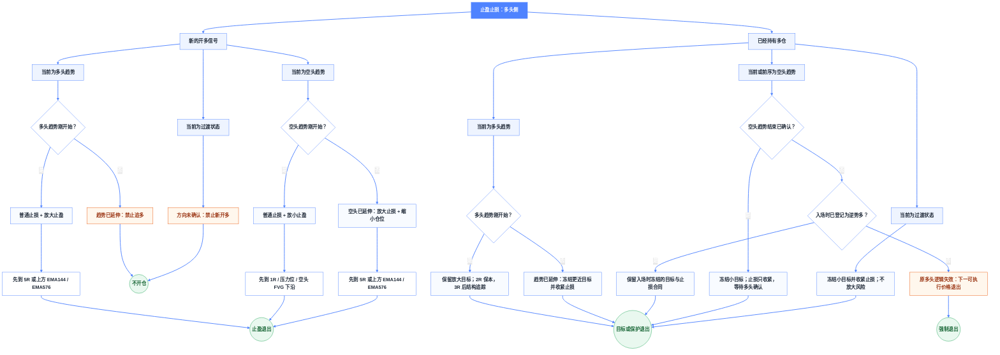

# 止盈止损决策图（多头侧 L0 完整规则草案）

> 本文在原始思维导图的基础上补齐缺失分支，并把主观描述改成可执行定义。
> 当前状态为 **L0 规则定义 / Research-only / 未回测 / 未晋级 / 未启用生产**。
> 补充规则是待验证假设，不代表原图作者已经确认这些参数。

## 1. 适用范围与关键结论

- 本文只覆盖“准备开多”和“已经持有多仓”，不自动外推为空头规则。
- 原图中的“当前开多”统一解释为“当前出现新的开多信号”；“当前仓位开多”统一解释为“已经持有多仓”。
- `R` 必须由最终初始止损冻结；持仓过程中移动止损不得回写 `R`。
- “止损放大”只允许发生在成交前，并通过缩小仓位保持账户风险金额不变；多仓成交后禁止把止损价向下放宽。
- 每笔开仓必须冻结 `entry_context`。只有入场时就被标记为逆势多的仓位，才允许在空头趋势仍持续时
  按原退出合同持有；原本的顺势多后来转为空头时必须退出。
- “EMA144 / EMA576、压力位、FVG 谁先到”统一解释为：只保留当前价格上方的有效候选，选择其中价格最低者。
- 原图使用 `EMA576`，本文继续沿用该口径。仓库中同时存在 `EMA596`、`EMA676` 规则，实现前必须确认原图到底指哪一条均线，禁止静默替换。
- 为使阶段判断可执行，下面给出一套 **15 分钟周期的 L0 默认参数**；换周期时必须重新冻结趋势年龄和位移阈值。

## 2. 统一量化定义

### 2.1 决策时点

所有趋势、EMA、ATR、压力位和 FVG 只使用决策时已经完成的 K 线：

- 新开仓：信号 K 线收盘后计算，最早下一根 K 线成交；
- 已持仓：当前 K 线收盘后更新，新的保护价和目标最早从下一根 K 线生效；
- 禁止使用后续 K 线反推趋势阶段、压力位、FVG 或是否应该开仓。

### 2.2 趋势方向

趋势只由同一交易对、同一 15 分钟周期的已完成收盘价计算。三条 EMA 均使用首个完整窗口的
收盘价 SMA 初始化，之后按标准 EMA 递推：

```text
alpha(n) = 2 / (n + 1)
EMA_n[n-1] = average(close[0..n-1])
EMA_n[t] = EMA_n[t-1] + alpha(n) * (close[t] - EMA_n[t-1])
```

- `EMA12` 表示短期方向；
- `EMA144` 表示中期方向；
- `EMA576` 表示慢速趋势背景；
- 少于 576 根有效预热 K 线时，趋势状态为 `unknown`，禁止开仓和阶段切换；
- 当前通用行情计算链已有 EMA12/144/696，并没有与本文完全一致的 EMA576 字段。因此本文仍是
  L0 目标规则，进入实现前必须确认 `576` 是否为原图真实周期，并补齐独立字段，不能拿 EMA696 代替。

在已完成 K 线 `t` 上，按以下顺序判定：

1. 检查当前与 `t-3` 的 EMA、收盘价均存在、有限且大于零；
2. 检查 EMA 排列、三条 EMA 的三棒斜率方向，以及收盘是否位于 EMA12 的趋势侧；
3. 多头条件全部成立则为 `bull`，空头条件全部成立则为 `bear`；
4. 两组条件都不完整时为 `transition`，不能把“接近满足”当成趋势；
5. 只有方向连续不间断时才累计 `trend_age`，任一条件失效立即清零并重新计数。

严格条件如下：

```text
多头趋势：
    EMA12[t] > EMA144[t] > EMA576[t]
    EMA12[t] > EMA12[t-3]
    EMA144[t] > EMA144[t-3]
    EMA576[t] > EMA576[t-3]
    close[t] > EMA12[t]

空头趋势：
    EMA12[t] < EMA144[t] < EMA576[t]
    EMA12[t] < EMA12[t-3]
    EMA144[t] < EMA144[t-3]
    EMA576[t] < EMA576[t-3]
    close[t] < EMA12[t]

过渡状态：以上两组条件均不完整。
```

`trend_age` 是当前严格趋势条件连续成立的已完成 K 线数量。`trend_start_close` 和
`trend_start_atr` 取本段连续趋势第一根 K 线的收盘价与 `ATR14`。

```text
多头位移 ATR = (close[t] - trend_start_close) / trend_start_atr
空头位移 ATR = (trend_start_close - close[t]) / trend_start_atr

趋势刚开始：trend_age <= 32，或方向位移 < 3 ATR
趋势已经延伸很多：trend_age > 32，且方向位移 >= 3 ATR
```

这样两个阶段互斥且覆盖全部已确认趋势，不再留下“既不算刚开始，也不算延伸很多”的空白状态。

阶段判定示例：

| `trend_age` | 方向位移 | 结果 | 原因 |
| ---: | ---: | --- | --- |
| 20 | 4 ATR | 刚开始 | 年龄仍不超过 32 根 |
| 80 | 2.4 ATR | 刚开始 | 位移仍不足 3 ATR |
| 80 | 4 ATR | 已延伸很多 | 年龄和位移同时达到延伸条件 |

趋势方向与趋势阶段是两个不同字段：`bull/bear/transition` 回答“往哪边”，
`start/extended` 回答“已经走了多远”，禁止只看 EMA 排列就直接判断“涨了很多/跌了很多”。

空头趋势结束只用于持仓管理，定义为：此前存在已确认空头趋势，随后连续两根已完成 K 线收盘高于
各自的 EMA12，且最新收盘突破它之前 8 根已完成 K 线的最高价。该状态仍属于“反转确认”，不能直接
等同于新的多头趋势。

### 2.3 ATR14 的计算

本文的止损距离、趋势位移和移动止损缓冲统一使用
`rust_quant_indicators::volatility::ATR` 的 **Wilder ATR14**。先逐根计算真实波幅 `TR`：

```text
第一根有效 K 线：
TR[0] = high[0] - low[0]

其余 K 线：
TR[t] = max(
    high[t] - low[t],
    abs(high[t] - close[t-1]),
    abs(low[t] - close[t-1])
)
```

首个 ATR14 用前 14 个 TR 的算术平均初始化，后续使用 Wilder RMA：

```text
ATR14[13] = average(TR[0..13])
ATR14[t] = (13 * ATR14[t-1] + TR[t]) / 14
```

例如前收盘为 `100`，当前最高 `110`、最低 `108`，虽然当前振幅只有 `2`，但
`TR = max(2, 10, 8) = 10`，因此跳空不会被漏掉。

使用边界：

- 前 13 根 K 线 ATR 不可用，不以 `0` 代替；ATR 缺失、非有限或不大于零时阻止开仓；
- 初始止损使用信号 K 线完成时的 `ATR14[t]` 并冻结；
- 趋势位移的分母使用趋势起始 K 线已经完成时的 `trend_start_atr` 并冻结；
- 移动止损缓冲使用当前决策 K 线的 ATR14，但新止损仍只能单向收紧；ATR 扩大不能让止损回退；
- 仓库的 `directional_reversal::atr_at`、`atr_at_computed` 和 SMC/FVG 局部 helper 目前还有
  “最近 14 个 TR 算术平均”的计算。它们各自服务既有策略或 FVG 有效性，不得替代本文初始止损、
  趋势位移或移动止损使用的 Wilder ATR14；
- Pine、Rust 回测和后续运行态必须保存 `atr_method = wilder_rma`、`atr_period = 14`，并做逐棒 parity。

### 2.4 初始止损、R 与仓位

设实际成交价为 `E`，信号 K 线索引为 `t`：

```text
S_base = min(low[t-7..t]) - 0.25 * ATR14[t]
D_base = E - S_base

普通止损：S0 = S_base
放大止损：S0 = E - 1.5 * D_base
初始风险：R0 = E - S0
仓位数量：quantity = account_risk_budget / (R0 * contract_value_per_price_unit)
```

- `S0` 必须低于 `E`，否则阻止开仓；
- `account_risk_budget` 沿用策略既有单笔风险金额，本文不新增风险比例；现货或以基础币数量计价的
  线性 U 本位合约可令 `contract_value_per_price_unit = 1`，其他合约必须使用交易所真实合约面值；
- 放大止损只放大价格容忍距离，不放大账户风险金额；交易所数量精度在仓位计算后向下取整；
- 多仓成交后，任何新止损必须满足 `new_stop >= current_stop`；若候选保护价已经不低于当前可执行
  价格，则直接退出，不能挂一个穿价止损。

开仓时同步冻结以下 `entry_context` 之一：

```text
bull_trend_start
countertrend_bear_start
countertrend_bear_extended
```

没有 `entry_context` 的历史仓位不得默认视为“已授权逆势持有”。

### 2.5 候选止盈位

所有候选价格都在首次决策时冻结，不随 EMA 或后来识别出的结构移动：

```text
T_1R = E + 1 * R0
T_5R = E + 5 * R0

T_EMA = 冻结 EMA144[t]、EMA576[t] 中严格高于参考价的最近一条
T_RES = 决策前 96 根内已经确认、严格高于参考价的最近压力位
T_FVG = 决策时已经确认且尚未完全填补、严格高于参考价的最近空头 FVG 下沿

放大止盈 T_expand = min(T_5R, T_EMA)
放小止盈 T_reduce = min(T_1R, T_RES, T_FVG)
```

- `min` 只比较存在且方向有效的候选；没有有效 EMA 时，`T_expand = T_5R`；
- 严格多头趋势下 EMA144/EMA576 通常位于入场价下方，因此该分支通常实际使用 `T_5R`；EMA 目标
  主要在“空头已延伸后的逆势多”中生效。这是原图价格几何决定的结果，不得强行选用下方 EMA 止盈；
- 压力位使用 `2-left / 2-right` 摆动高点：其最高价严格高于左右各两根 K 线的最高价，且右侧
  两根在决策时已经完成；不能用决策后的 K 线补确认；
- FVG 复用 Core 现有的因果 SMC/FVG 定义，禁止在本规则中另造一套事后 FVG；
- 新开仓使用 `T_expand` 时，必须满足 `T_expand - E >= 2R0`；否则阻止开仓；
- 新开仓使用 `T_reduce` 时，必须满足 `T_reduce - E >= 0.8R0`；否则阻止开仓；
- “优先到达”表示触及最近候选即全部退出，不表示事后选择最终收益更高的目标。

已持仓进入“止盈放小”状态时，以状态切换 K 线收盘价 `P` 为参考，只选择 `P` 上方的候选，
并冻结：

```text
T_position_reduce = min(current_target, P + 1R0, T_RES, T_FVG)
```

如果原目标已经不高于 `P`，则下一可执行价格全部退出，不把目标继续向上移动。

已持仓路由按以下优先级只进入一个分支：先判断“前序空头是否刚结束”，再判断当前多头、当前空头，
最后才是普通过渡状态，避免“空头结束”和“过渡状态”被同时命中。

### 2.6 移动止盈与移动止损配置

本规则草案的退出配置明确如下。它描述的是该决策树的目标合同，不表示当前 Rust/Pine 已经接入：

```yaml
implementation_status: documentation_only
fixed_take_profit_enabled: true
moving_take_profit_enabled: false
one_shot_target_reduction_enabled: true
partial_take_profit_enabled: false
runner_take_profit_enabled: false

break_even_stop_enabled: true
break_even_trigger_r: 2.0
moving_stop_loss_enabled: true
moving_stop_trigger_r: 3.0
moving_stop_method: confirmed_swing_low_minus_0.25_atr14
atr_tiered_trailing_enabled: false
allow_stop_loss_loosen: false
stop_update_effective_from: next_candle
```

当前仓库的通用回测框架已经具备固定目标、盈利保护和移动止损承载字段，但没有任何
`strategy_key`、preset、manifest 或执行入口引用本文的规则身份。因此状态必须区分为：

```text
文档目标配置：已明确
回测策略配置：未接入
Paper / ReadOnly / Live：未配置
生产运行：未启用
```

配置含义：

- **移动止盈关闭**：`T_expand`、`T_reduce` 在开仓时冻结；`T_position_reduce` 只在首次进入保护状态时
  重算一次并冻结，之后不能随 EMA、FVG 或价格逐棒上移。一次性缩短目标不是移动止盈；
- **固定止盈开启**：价格首次触达冻结目标时全部平仓，不启用分批止盈或 runner；
- **移动止损条件开启**：满足对应持仓状态和触发门槛后，止损可以随新确认的结构低点上移；
- **三级 ATR 移动止损关闭**：虽然通用框架支持 ATR 分级止盈后把止损移到开仓价或前级目标，
  本规则不同时启用该系统，避免和 `2R/3R` 保护合同叠加；
- **禁止放宽止损**：移动止损、状态保护和成本净保本只竞争更高的有效保护价。

移动止损使用入场后已完成 K 线的最大有利波动：

```text
MFE_price[t] = max(high[entry_bar..t])
MFE_R[t] = (MFE_price[t] - E) / R0

confirmed_structure_stop[t] =
    latest_confirmed_swing_low[t] - 0.25 * ATR14[t]

当 MFE_R >= 2：
    next_stop = max(current_stop, long_net_be)

当 MFE_R >= 3，且当前为多头趋势、空头结束已确认或普通过渡保护状态：
    next_stop = max(current_stop, long_net_be, confirmed_structure_stop)
```

摆动低点与压力位对称，使用 `2-left / 2-right` 规则，右侧两根必须在决策时已经完成。
`next_stop` 只能在下一根 K 线生效；若它不低于当前可执行价格，则直接退出而不是创建穿价保护单。

各持仓状态是否启用移动止损：

| 持仓状态 | 成本净保本 | 结构移动止损 | 止盈目标 |
| --- | --- | --- | --- |
| 多头刚开始 | `MFE_R >= 2` 后启用 | `MFE_R >= 3` 后启用 | 保持冻结 `T_expand` |
| 多头已延伸 | `MFE_R >= 2` 后启用 | `MFE_R >= 3` 后启用 | 一次性冻结 `T_position_reduce` |
| 空头持续、且为已授权逆势多 | 不由本树新增 | 关闭 | 保持入场时冻结目标 |
| 空头持续、且非逆势入场 | 不适用 | 不适用 | 下一可执行价格退出 |
| 空头结束已确认 | `MFE_R >= 2` 后启用 | 确认且 `MFE_R >= 3` 后启用 | 一次性冻结 `T_position_reduce` |
| 普通过渡状态 | `MFE_R >= 2` 后启用 | `MFE_R >= 3` 后启用 | 一次性冻结 `T_position_reduce` |

## 3. 完整决策图



## 4. 各分支的最终动作

| 场景 | 是否允许新开仓/继续持有 | 止盈 | 止损与仓位 |
| --- | --- | --- | --- |
| 新开多 + 多头刚开始 | 允许，冻结 `bull_trend_start` | `T_expand` | 普通止损；沿用账户风险预算 |
| 新开多 + 多头已延伸 | 不允许追多 | 无 | 无新仓位 |
| 新开多 + 空头刚开始 | 仅在 `T_reduce - E >= 0.8R0` 时允许，冻结 `countertrend_bear_start` | `T_reduce` | 普通止损；不得因逆势而加大账户风险 |
| 新开多 + 空头已延伸 | 仅在 `T_expand - E >= 2R0` 时允许，冻结 `countertrend_bear_extended` | `T_expand` | 成交前使用放大止损，仓位按新的 `R0` 缩小 |
| 新开多 + 过渡状态 | 不允许 | 无 | 无新仓位 |
| 持有多仓 + 多头刚开始 | 继续持有 | 保留入场时冻结的 `T_expand` | `MFE_R >= 2` 后下一根移到成本净保本；`MFE_R >= 3` 后按最近确认摆动低点减 `0.25 ATR14` 单向追踪 |
| 持有多仓 + 多头已延伸 | 继续持有但主动保护 | 首次进入该状态时冻结 `T_position_reduce` | `MFE_R >= 2` 后加入成本净保本，`MFE_R >= 3` 后加入最近确认摆动低点保护，取低于当前价的最高有效价格 |
| 持有多仓 + 空头仍持续 + 入场时已登记为逆势多 | 继续按入场合同持有 | 保留入场时冻结的 `T_reduce` 或 `T_expand`，不得随当前阶段切换目标 | 保留入场时冻结的初始止损；只能收紧，不能再次放大 |
| 持有多仓 + 空头仍持续 + 非逆势入场 | 不继续持有 | 下一可执行价格退出，不等待目标 | 退出成交前保留当前止损，禁止放宽 |
| 持有多仓 + 空头结束已确认 | 暂时继续持有，等待多头确认 | `T_position_reduce` | `MFE_R >= 2` 后加入成本净保本，确认且 `MFE_R >= 3` 后加入结构保护；只能收紧 |
| 持有多仓 + 过渡状态 | 继续保护，不新增风险 | `T_position_reduce` | `MFE_R >= 2/3` 时分别启用成本净保本/结构保护；只能收紧 |

成本净保本价使用入场时冻结的单边成本率 `c`：

```text
long_net_be = ceil_to_tick(E * (1 + c) / (1 - c))
```

若实际执行成本不是固定比例，研究回放与生产执行必须分别记录真实费用和滑点，不能把毛保本当作净保本。

## 5. 执行优先级与保守回放

每根 K 线按以下顺序处理：

1. 先执行上一根已完成 K 线已经生效的止损或强制退出；
2. 再检查冻结止盈；
3. 最后根据本根收盘更新趋势状态、下一根生效的目标和保护价；
4. 只有 OHLC、无法判断同一根 K 线内路径时，止损和止盈同时触及时按止损先成交；
5. 跳空越过止损时按下一可成交价记录，不能按原止损价美化结果；
6. 所有价格按交易所 tick size 对齐，所有仓位按 quantity step 向下取整；
7. 手续费、滑点、资金费必须计入净 R、净 Profit Factor 和组合权益。

## 6. L1 前必须冻结的验证项

本文已经补齐规则分支，但参数有效性仍未得到证据支持。进入 L1 时不得把整棵树一次性作为一个
“优化包”回测，必须拆成单变量假设，至少按以下顺序验证：

1. 多头刚开始时，`T_expand` 相对既有退出基线是否改善成本后结果；
2. 空头已延伸时，只验证“放大价格止损并同比缩小仓位”，其他目标保持不变；
3. 已持仓从多头转为空头时，只验证“强制退出”相对原退出；
4. 前一项通过后，再独立验证 `2R` 保本、`3R` 结构追踪或 `T_position_reduce`，不得组合扫参。

进入任何 L1 候选扫描前还必须完成两个实现门禁：

1. 确认慢线真实身份是 EMA576，而不是仓库现有的 EMA596/676/696 之一；
2. 为 EMA 和 Wilder ATR14 增加逐棒 Rust/Pine parity，禁止调用滚动 TR 算术平均 helper 冒充本策略 ATR。

每笔候选至少保存以下审计字段：

```text
decision_time
entry_context
trend_direction
trend_stage
trend_age
trend_displacement_atr
ema12
ema144
ema576
atr14
atr_method
entry_price
initial_stop_price
initial_risk_amount
position_quantity
ema_target
resistance_target
fvg_target
selected_target
current_stop
next_stop
mfe_r
moving_take_profit_enabled
moving_stop_loss_enabled
stop_update_reason
action
action_reason
```

以下任一条件成立时停止当前假设，不继续调整阈值救参：零命中、只影响 1～2 笔、目标样本不符合
因果定义、成本后边际不为正，或收益集中在单一币种/单一事件簇。
