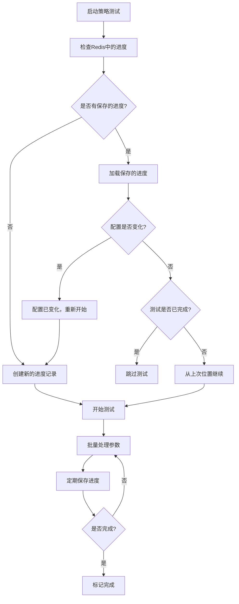

# 策略测试断点续传功能

## 🎯 **功能概述**

策略测试断点续传功能允许你在服务停止后，重新启动时从上一次的测试点继续测试，而不是重新跑所有测试因子。这大大提高了测试效率，特别是在大规模参数组合测试中。

## 🔧 **核心特性**

### 1. **智能进度跟踪**
- ✅ 自动保存测试进度到 Redis
- ✅ 记录已完成的参数组合数量
- ✅ 跟踪当前处理的索引位置
- ✅ 监控测试状态（running, completed, paused, error）

### 2. **配置变化检测**
- ✅ 通过哈希值检测配置是否变化
- ✅ 配置变化时自动重新开始测试
- ✅ 配置未变化时继续之前的进度

### 3. **灵活的进度管理**
- ✅ 支持手动清除进度重新开始
- ✅ 提供进度百分比计算
- ✅ 估算剩余完成时间
- ✅ 批量处理优化

## 📊 **数据结构**

### StrategyTestProgress
```rust
pub struct StrategyTestProgress {
    pub inst_id: String,               // 交易对
    pub time: String,                  // 时间周期
    pub config_hash: String,           // 配置哈希值
    pub total_combinations: usize,     // 总参数组合数
    pub completed_combinations: usize, // 已完成组合数
    pub current_index: usize,          // 当前索引
    pub last_update_time: i64,         // 最后更新时间
    pub status: String,                // 状态
}
```

### RandomStrategyConfig
```rust
pub struct RandomStrategyConfig {
    pub bb_periods: Vec<i32>,                      // 布林带周期
    pub bb_multipliers: Vec<f64>,                  // 布林带倍数
    pub shadow_ratios: Vec<f64>,                   // 影线比例
    pub volume_bar_nums: Vec<usize>,               // 成交量柱数
    pub volume_increase_ratios: Vec<f64>,          // 成交量增长比例
    pub volume_decrease_ratios: Vec<f64>,          // 成交量下降比例
    pub breakthrough_thresholds: Vec<f64>,         // 突破阈值
    pub rsi_periods: Vec<usize>,                   // RSI 周期
    pub rsi_over_buy: Vec<f64>,                    // RSI 超买线
    pub rsi_over_sold: Vec<f64>,                   // RSI 超卖线
    pub batch_size: usize,                         // 批处理大小
    // 风险管理参数
    pub max_loss_percent: Vec<f64>,                // 最大止损百分比
    pub is_take_profit: Vec<bool>,                 // 是否启用止盈
    pub is_move_stop_loss: Vec<bool>,              // 是否移动止损
    pub is_used_signal_k_line_stop_loss: Vec<bool>, // 是否使用信号K线止损
}
```

## 🚀 **使用方法**

### 1. **基本使用**

```rust
use rust_quant::trading::task::basic::{
    RandomStrategyConfig, test_random_strategy_with_config
};
use tokio::sync::Semaphore;
use std::sync::Arc;

#[tokio::main]
async fn main() -> Result<(), Box<dyn std::error::Error>> {
    // 初始化环境
    std::env::set_var("APP_ENV", "local");
    std::env::set_var("REDIS_URL", "redis://127.0.0.1:6379");
    
    // 初始化 Redis 和日志
    rust_quant::app_config::redis::init_redis_pool().await?;
    rust_quant::app_config::log::setup_logging().await?;
    
    // 配置策略参数
    let config = RandomStrategyConfig::default();
    let semaphore = Arc::new(Semaphore::new(10)); // 控制并发数
    
    // 执行测试（自动支持断点续传）
    test_random_strategy_with_config("BTC-USDT", "1H", semaphore, config).await?;
    
    Ok(())
}
```

### 2. **进度管理**

```rust
use rust_quant::trading::task::basic::StrategyProgressManager;

// 查看当前进度
if let Ok(Some(progress)) = StrategyProgressManager::load_progress("BTC-USDT", "1H").await {
    let percentage = StrategyProgressManager::get_progress_percentage(&progress);
    println!("当前进度: {:.2}%", percentage);
}

// 清除进度（重新开始）
StrategyProgressManager::clear_progress("BTC-USDT", "1H").await?;

// 手动标记完成
StrategyProgressManager::mark_completed("BTC-USDT", "1H").await?;
```

### 3. **配置变化检测**

```rust
let config = RandomStrategyConfig::default();
let progress = StrategyProgressManager::load_progress("BTC-USDT", "1H").await?;

if let Some(progress) = progress {
    if StrategyProgressManager::is_config_changed(&config, &progress) {
        println!("配置已变化，将重新开始测试");
    } else {
        println!("配置未变化，继续之前的测试");
    }
}
```

## 📈 **工作流程**

### 启动时的检查流程



### 进度保存机制

1. **初始化**: 创建进度记录并保存到 Redis
2. **批量处理**: 每处理完一个批次就更新进度
3. **定期保存**: 避免频繁的 Redis 写入
4. **异常恢复**: 服务重启时自动从上次位置继续

## ⚙️ **配置参数**

### Redis 配置
```bash
# 环境变量
REDIS_URL=redis://127.0.0.1:6379
APP_ENV=local
```

### 性能调优参数
```rust
let config = RandomStrategyConfig {
    batch_size: 100,        // 批处理大小，影响内存使用和进度保存频率
    // ... 其他参数
};

let semaphore = Arc::new(Semaphore::new(15)); // 并发数，根据系统性能调整
```

## 🔍 **监控和调试**

### 日志输出示例
```
[断点续传] 发现已保存的进度: inst_id=BTC-USDT, time=1H, 已完成 512/1024 个组合
[断点续传] 参数生成器创建完成 - 总参数组合: 1024, 起始索引: 512, 剩余: 512
[断点续传] 批次处理完成 - 已处理 612/1024 个参数组合, 进度: 59.77%
```

### 进度查询
```rust
// 获取详细进度信息
if let Ok(Some(progress)) = StrategyProgressManager::load_progress("BTC-USDT", "1H").await {
    println!("总组合数: {}", progress.total_combinations);
    println!("已完成: {}", progress.completed_combinations);
    println!("当前索引: {}", progress.current_index);
    println!("状态: {}", progress.status);
    println!("配置哈希: {}", progress.config_hash);
}
```

## 🚨 **注意事项**

1. **Redis 依赖**: 确保 Redis 服务正常运行
2. **配置一致性**: 配置变化会导致重新开始测试
3. **并发控制**: 合理设置并发数避免系统过载
4. **存储空间**: 大规模测试会产生大量数据
5. **网络稳定性**: 确保 Redis 连接稳定

## 🧪 **测试验证**

运行测试验证功能：
```bash
# 测试断点续传功能
cargo test --test test_strategy_resume test_strategy_resume_functionality -- --nocapture

# 测试参数生成器
cargo test --test test_strategy_resume test_param_generator_resume -- --nocapture

# 运行示例
cargo run --example strategy_resume_example
```

## 📚 **相关文件**

- `src/trading/task/basic.rs` - 核心实现
- `src/trading/task/job_param_generator.rs` - 参数生成器
- `tests/test_strategy_resume.rs` - 测试用例
- `examples/strategy_resume_example.rs` - 使用示例
